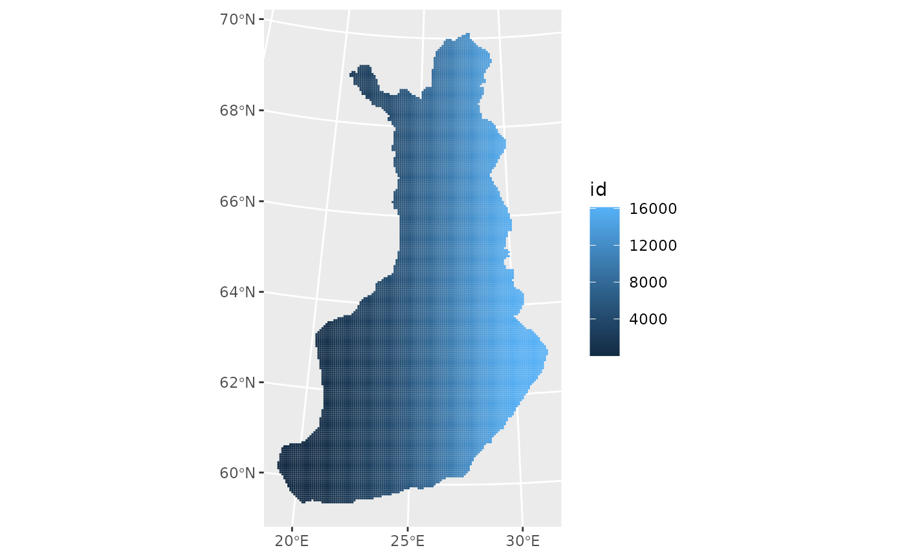

# lecture01-intro

Welcome to the course “Appelied Spatial Data Analysis and Research”
course details:
<https://opas.peppi.uef.fi/en/course/YH00EM30/135183?period=2025-2026>

1.  What is R?

1.1 Why should we learn R? R follows a type inference coding structure
and provides a wide variety of statistical and graphical techniques,
including;

- Linear and non-linear modelling
- Univariate & Multivariate Statistics
- Classical statistical tests
- Time-series analysis/ Econometrics
- Simulation and Modelling
- Datamining-classification, clustering etc.

For computationally intensive tasks, C, C++, and Fortran code can be
linked and called at run time.

R is easily extensible through functions and extensions, and the R
community is noted for its active contributions in terms of packages.

``` r
# Number of R Packages
length(available.packages(repos = "http://cran.us.r-project.org")[, 1])
#> [1] 23425
```

1.2 Installing R and RStudio on Windows

The latest version of R can be download from the R homepage.

R download page: <http://www.cran.r-project.org/bin/windows/base/> The
page also provides some instructions and FAQ’s on R installation.

RStudio IDE ( IDE: Integrated Development Environment) is a powerful and
productive user interface for R.

It’s free and open source, and works great on Windows, Mac, and Linux

1.3 RStudio GUI/IDE

RStudio GUI is composed of 4 panes which can be rearranged according to
the requirements.

There are a lot of short introductions to RStudio available online so we
will not go into more details.

Download Rstudio from here
<https://rstudio.com/products/rstudio/download/#download>

1.4 Installing Packages

The easiest way to install packages is to do it via R console. The
command install.packages(“package name”) installs R packages directly
from internet. Other options to install various dependencies to a
package can be easily specified when calling this function. A call to
this function asks the user to chose a CRAN mirror at the first
instance.

Run the following to install Quantreg package on R. Also use the help
function to get the details.

``` r
# Install a package using RStudio Console
install.packages("sf", dependencies = c("Depends", "Suggests"))
#> Installing package into '/home/runner/work/_temp/Library'
#> (as 'lib' is unspecified)
#> Warning: dependencies 'starsdata', 'rnaturalearthhires', 'Rgraphviz', 'marray',
#> 'affy', 'Biobase', 'limma', 'BiocVersion', 'BiocStyle', 'glmmADMB',
#> 'Biostrings', 'qs', 'taxidata', 'sylly.de', 'sylly.es', 'spDataLarge',
#> 'cmdstanr', 'globaltest', 'vdg', 'graph', 'M3C', 'panelr', 'Iyer517',
#> 'ComplexHeatmap', 'INLA', 'biomaRt', 'KEGGgraph', 'Rcampdf',
#> 'tm.lexicon.GeneralInquirer', 'pryr', 'ExactData', 'blavsam', 'iwmm', 'BRugs',
#> 'slp', 'gurobi', 'mlr3proba', 'rrelaxiv', 'RDCOMClient', 'genefilter', 'sva',
#> 'NetSwan', 'ALEPlot', 'polars', 'RTCGA.rnaseq' are not available
#> also installing the dependencies 'Rmosek', 'deconvolveR', 'vardpoor', 'REBayes', 'AlphaSimR', 'convey', 'laeken', 'DTRlearn2', 'naivebayes', 'sparsediscrim', 'OAIHarvester', 'mlr3misc', 'spocc', 'ecospat', 'usdm', 'ashr', 'binda', 'KrigInv', 'GPareto', 'policytree', 'evola', 'lme4breeding', 'geomapdata', 'outliertree', 'archive', 'srvyr', 'polle', 'SurvMetrics', 'discrim', 'RcppHungarian', 'topicmodels', 'mallet', 'lda', 'gistr', 'ulid', 'apcluster', 'LPCM', 'protoclust', 'stream', 'fastVoteR', 'genalg', 'lsa', 'registry', 'synchronicity', 'wrapr', 'rquery', 'rqdatatable', 'cccd', 'coRanking', 'diffusionMap', 'pcaL1', 'maxnet', 'cito', 'ENMeval', 'BayesXsrc', 'MBA', 'shapviz', 'asciicast', 'SGPdata', 'glmertree', 'ncvreg', 'future.batchtools', 'parallelMap', 'truncnorm', 'gdata', 'crossval', 'OpenImageR', 'FD', 'entropy', 'DiceOptim', 'mldr.datasets', 'dtw', 'fdrtool', 'Mcomp', 'fastmatch', 'rainbow', 'mvQuad', 'yulab.utils', 'DIDmultiplegt', 'grf', 'mbest', 'rintrojs', 'enhancer', 'vioplot', 'dr', 'ISLR2', 'GEOmap', 'isotree', 'geodata', 'PCAmixdata', 'tidycensus', 'targeted', 'aorsf', 'visdat', 'finetune', 'tidyclust', 'ccaPP', 'udpipe', 'LDAvis', 'mlflow', 'redux', 'rotor', 'xaringan', 'revealjs', 'ggparty', 'mlr3cluster', 'mlr3fselect', 'mlr3inferr', 'precrec', 'mlr3measures', 'quanteda', 'stopwords', 'bestNormalize', 'smotefamily', 'NMF', 'vtreat', 'dimRed', 'biomod2', 'Boruta', 'carSurv', 'wav', 'prettyunits', 'BatchJobs', 'geojsonio', 'flashClust', 'mvnfast', 'evtree', 'rchallenge', 'ROI', 'WrightMap', 'rbenchmark', 'R2BayesX', 'scalreg', 'adabag', 'AmesHousing', 'ICEbox', 'fastshap', 'NeuralNetTools', 'missForest', 'cocor', 'rhub', 'sfnetworks', 'rmapshaper', 'ramcmc', 'sde', 'sitmo', 'qcc', 'SGP', 'taxize', 'ggstance', 'NHANES', 'xrf', 'neuralnet', 'pre', 'bvls', 'logcondens', 'bartMachine', 'biglasso', 'KernelKnn', 'LogicReg', 'SIS', 'futile.logger', 'ada', 'batchtools', 'brnn', 'bst', 'care', 'ClusterR', 'clusterSim', 'cmaes', 'deepnet', 'elasticnet', 'fda.usc', 'FDboost', 'frbs', 'FSelector', 'FSelectorRcpp', 'GenSA', 'GPfit', 'irace', 'laGP', 'mldr', 'mRMRe', 'praznik', 'refund', 'rFerns', 'rotationForest', 'RRF', 'RSNNS', 'rucrdtw', 'sda', 'sparseLDA', 'stepPlr', 'survAUC', 'tgp', 'tsfeatures', 'wavelets', 'eaf', 'lhs', 'checkmate', 'BBmisc', 'fds', 'zipfR', 'lavaan.mi', 'restriktor', 'mcmcse', 'nimbleQuad', 'scholar', 'CausalQueries', 'DesignLibrary', 'rdrobust', 'rdss', 'influenceR', 'netrankr', 'rngtools', 'doMPI', 'doRedis', 'beepr', 'pbmcapply', 'ntfy', 'skpr', 'VarianceGamma', 'SkewHyperbolic', 'sommer', 'maptiles', 'weights', 'ggExtra', 'gglm', 'esc', 'mschart', 'rvg', 'sortable', 'LDRTools', 'tourr', 'amap', 'fxregime', 'hypergeo', 'tree', 'permute', 'bspec', 'RSEIS', 'signal', 'Gmisc', 'Greg', 'Metrics', 'ROI.plugin.ecos', 'ROI.plugin.alabama', 'ROI.plugin.neos', 'applicable', 'CAST', 'spatialsample', 'tigris', 'stringdist', 'lava', 'censored', 'clustMixType', 'QSARdata', 'tabnet', 'torch', 'workflowsets', 'scs', 'clarabel', 'giscoR', 'gower', 'plot3Drgl', 'yaImpute', 'text2vec', 'mlr3data', 'yardstick', 'distances', 'paradox', 'mlr3tuning', 'mlr3learners', 'lgr', 'pagedown', 'fairml', 'linprog', 'mlr3viz', 'mlr3pipelines', 'bbotk', 'blockCV', 'ggsci', 'ggtext', 'mlr3filters', 'sperrorest', 'twosamples', 'tfevents', 'torchvision', 'BatchExperiments', 'import', 'kimisc', 'knitcitations', 'metap', 'sampling', 'tikzDevice', 'FactoInvestigate', 'shape', 'bs4Dash', 'highcharter', 'rapidoc', 'redoc', 'visNetwork', 'writexl', 'fabricatr', 'randomizr', 'prediction', 'gtExtras', 'fImport', 'wdm', 'cobs', 'mvPot', 'ismev', 'TruncatedNormal', 'TSP', 'kdecopula', 'likert', 'psychomix', 'stablelearner', 'carrier', 'BIFIEsurvey', 'CDM', 'inline', 'MBESS', 'mdmb', 'synthpop', 'TAM', 'mitools', 'VGAMdata', 'RcppZiggurat', 'gamboostLSS', 'hdi', 'shapefiles', 'pdp', 'vip', 'NLP', 'antiword', 'filehash', 'Rpoppler', 'SnowballC', 'rpf', 'snowfall', 'ifaTools', 'tidyLPA', 'umx', 'formatR', 'ggraph', 'bain', 'inlinedocs', 'pbivnorm', 'pbv', 'shinythemes', 'rclipboard', 'snow', 'doSNOW', 'rlecuyer', 'pkgKitten', 'DescTools', 'invgamma', 'ipumsr', 'bssm', 'EnvStats', 'TRAMPR', 'measures', 'logmult', 'gtools', 'agricolae', 'mosaic', 'prefmod', 'rules', 'plotmo', 'som', 'smcfcs', 'casebase', 'grpreg', 'hal9001', 'nnls', 'pROC', 'SuperLearner', 'kmi', 'PASWR', 'VennDiagram', 'maditr', 'repr', 'mlr', 'ParamHelpers', 'smoof', 'akima', 'cmaesr', 'emoa', 'mco', 'fda', 'beeswarm', 'changepoint', 'KFAS', 'MSwM', 'lfda', 'languageR', 'runjags', 'modeest', 'semTools', 'nimble', 'fastverse', 'kit', 'pwr', 'bootES', 'easystats', 'report', 'DeclareDesign', 'ggside', 'tidygraph', 'doRNG', 'future.callr', 'doFuture', 'progressr', 'philentropy', 'transport', 'glba', 'binom', 'LaplacesDemon', 'skellam', 'triangle', 'future.tests', 'DoE.wrapper', 'FrF2.catlg128', 'BsMD', 'mc2d', 'GeneralizedHyperbolic', 'dismo', 'Rmixmod', 'xLLiM', 'mafR', 'elevatr', 'desplot', 'gge', 'lucid', 'nullabor', 'qicharts', 'qtl', 'SpATS', 'tidyterra', 'jtools', 'ez', 'ggResidpanel', 'Gmedian', 'mbend', 'ppcor', 'rmcorr', 'openxlsx2', 'CCP', 'learnr', 'ICSNP', 'moments', 'ICSClust', 'REPPlab', 'geomtextpath', 'shinyBS', 'datawizard', 'ggsignif', 'interactions', 'Rmisc', 'ca', 'circular', 'ff', 'sdPrior', 'glogis', 'scoringRules', 'ggdendro', 'WWGbook', 'bigmemory', 'glm2', 'FMStable', 'libstable4u', 'gfonts', 'networkD3', 'treemap', 'vegan', 'psd', 'pimeta', 'robvis', 'cccp', 'crossnma', 'gemtc', 'forestplot', 'compute.es', 'tfdatasets', 'janeaustenr', 'r2d3', 'keras3', 'Ckmeans.1d.dp', 'float', 'fauxpas', 'webmockr', 'profileModel', 'detectseparation', 'mbrglm', 'visreg', 'waywiser', 'sjmisc', 'sjPlot', 'censReg', 'feisr', 'fungible', 'httptest2', 'lavaSearch2', 'merTools', 'metaplus', 'tune', 'stddiff', 'tableone', 'butcher', 'tailor', 'twang', 'twangContinuous', 'Matching', 'ebal', 'CBPS', 'optweight', 'MatchThem', 'cem', 'sbw', 'eurostat', 'DALEX', 'auditor', 'h2o', 'iml', 'ingredients', 'lime', 'localModel', 'mlr3', 'stacks', 'gk', 'PairedData', 'gld', 'plotfunctions', 'quickmatch', 'RcppProgress', 'highs', 'miesmuschel', 'mlr3batchmark', 'mlr3benchmark', 'mlr3db', 'mlr3fairness', 'mlr3fda', 'mlr3oml', 'mlr3spatial', 'mlr3spatiotempcv', 'mlr3summary', 'mlr3torch', 'rush', 'matrixStats', 'corpcor', 'wrswoR', 'ggarrow', 'RItools', 'betacal', 'coneproj', 'backports', 'dominanceanalysis', 'relaimpo', 'CVST', 'missMDA', 'Factoshiny', 'NormPsy', 'NSM3', 'rootSolve', 'MNP', 'enrichwith', 'osqp', 'misaem', 'GPBayes', 'diagram', 'jsonvalidate', 'modules', 'packrat', 'shinyEffects', 'shinyjqui', 'MPsychoR', 'calibrate', 'cpp11', 'commonmark', 'doconv', 'equatags', 'officedown', 'plumber', 'gganimate', 'estimatr', 'modelsummary', 'pandoc', 'Rdatasets', 'uuid', 'rngWELL', 'animation', 'crop', 'HAC', 'lcopula', 'mev', 'mvnormtest', 'partitions', 'polynom', 'Runuran', 'VineCopula', 'Rmpi', 'libcoin', 'RWeka', 'psychotools', 'psychotree', 'gss', 'furrr', 'haven', 'literanger', 'miceadds', 'pan', 'VGAMextra', 'actuar', 'diptest', 'ellipse', 'SuppDists', 'stabs', 'BayesX', 'gbm', 'kangar00', 'mix', 'tm', 'OpenMx', 'tidySEM', 'faraway', 'directlabels', 'sirt', 'plink', 'mirtCAT', 'scdhlm', 'RcppArmadillo', 'adagio', 'DPQmpfr', 'Bessel', 'round', 'relimp', 'Ecfun', 'wooldridge', 'modeltools', 'ipred', 'varImp', 'gnm', 'gmodels', 'Fahrmeir', 'Sleuth2', 'BradleyTerry2', 'Cubist', 'earth', 'fastICA', 'klaR', 'mda', 'MLmetrics', 'pamr', 'pls', 'RANN', 'spls', 'superpc', 'themis', 'riskRegression', 'etm', 'ssanv', 'Exact', 'BlakerCI', 'cowplot', 'PoissonBinomial', 'revdbayes', 'expss', 'relsurv', 'CVXR', 'mlrMBO', 'tbm', 'DiceKriging', 'ggdist', 'ggfortify', 'loo', 'shinystan', 'BayesFactor', 'bayesQR', 'BH', 'blavaan', 'bridgesampling', 'collapse', 'effectsize', 'modelbased', 'ordbetareg', 'RcppEigen', 'see', 'RODBC', 'projpred', 'priorsense', 'RWiener', 'rtdists', 'extraDistr', 'mnormt', 'arm', 'future.mirai', 'combinat', 'energy', 'pgirmess', 'forward', 'conf.design', 'DoE.base', 'FrF2', 'fitdistrplus', 'maxlike', 'R2OpenBUGS', 'R2WinBUGS', 'jagsUI', 'qgam', 'rcdd', 'Infusion', 'IsoriX', 'blackbox', 'ROI.plugin.glpk', 'rsae', 'multilevel', 'agridat', 'fmesher', 'afex', 'bigutilsr', 'correlation', 'cplm', 'dagitty', 'discovr', 'ggdag', 'GPArotation', 'ICS', 'ICSOutlier', 'ISLR', 'ivreg', 'mclogit', 'multimode', 'nestedLogit', 'psychTools', 'qqplotr', 'rempsyc', 'mvinfluence', 'rrcov', 'archdata', 'qqtest', 'bamlss', 'lqmm', 'rlme', 'lemon', 'ggh4x', 'robustvarComp', 'confintROB', 'fastglm', 'Bergm', 'RSiena', 'ergm.count', 'networkLite', 'stabledist', 'bindrcpp', 'JM', 'joineR', 'oz', 'plot3D', 'stargazer', 'Rcsdp', 'orthopolynom', 'bayesm', 'StanHeaders', 'rjags', 'qpdf', 'devEMF', 'gdtools', 'data.tree', 'prettycode', 'pixmap', 'betapart', 'multitaper', 'meta', 'netmeta', 'bayesmeta', 'NlcOptim', 'robumeta', 'aod', 'C50', 'dials', 'keras', 'kknn', 'LiblineaR', 'sparklyr', 'tensorflow', 'xgboost', 'polycor', 'aws.ec2metadata', 'aws.signature', 'sodium', 'crul', 'R.matlab', 'vwline', 'tth', 'brglm', 'brglm2', 'logistf', 'sdmTMB', 'sjlabelled', 'sjstats', 'aplore3', 'GLMsData', 'insight', 'smd', 'workflows', 'apollo', 'fastDummies', 'gmnl', 'mixl', 'brmsmargins', 'causaldata', 'clarify', 'cjoint', 'cobalt', 'countrycode', 'crch', 'DALEXtra', 'DCchoice', 'dbarts', 'DirichletReg', 'distributional', 'equivalence', 'fmeffects', 'fwb', 'ggokabeito', 'glmx', 'itsadug', 'MatchIt', 'mhurdle', 'missRanger', 'mlr3verse', 'mvgam', 'optmatch', 'probably', 'Rchoice', 'REndo', 'rcmdcheck', 'scam', 'tictoc', 'titanic', 'tsModel', 'altdoc', 'BayesFM', 'cAIC4', 'cgam', 'ClassDiscovery', 'did', 'domir', 'DRR', 'EGAnet', 'factoextra', 'FactoMineR', 'lcmm', 'metaBMA', 'NbClust', 'nFactors', 'PCDimension', 'PMCMRplus', 'PROreg', 'serp', 'sparsepca', 'svylme', 'WeightIt', 'WRS2', 'cardx', 'ggsurvfit', 'janitor', 'purrrlyr', 'FME', 'attachment', 'dockerfiler', 'renv', 'rex', 'shiny.react', 'flexdashboard', 'globals', 'shinydashboardPlus', 'GA', 'Rtsne', 'smacof', 'umap', 'r2d2', 'tclust', 'pdfCluster', 'gridBase', 'bezier', 'ddalpha', 'RcppRoll', 'texPreview', 'r2rtf', 'seasonalview', 'miscTools', 'dlm', 'rdhs', 'sae', 'rpart.plot', 'TTR', 'RMySQL', 'downloader', 'slider', 'brew', 'git2r', 'pingr', 'pkgbuild', 'progress', 'flextable', 'ggiraph', 'heatmaply', 'rsconnect', 'thematic', 'tinytable', 'whoami', 'egg', 'gginnards', 'rbibutils', 'here', 'conflicted', 'spacefillr', 'randtoolbox', 'copula', 'simsalapar', 'partykit', 'inum', 'quantregForest', 'AppliedPredictiveModeling', 'mice', 'rmsb', 'VGAM', 'formula.tools', 'iterators', 'itertools', 'flexmix', 'gamair', 'mboost', 'mclust', 'rmeta', 'wordcloud', 'HSAUR2', 'nonnest2', 'lavaan', 'mirt', 'lmeInfo', 'setRNG', 'BB', 'ucminf', 'minqa', 'lbfgsb3c', 'lbfgs', 'subplex', 'marqLevAlg', 'piecewiseSEM', 'lokern', 'Rmpfr', 'gmp', 'qvcalc', 'glmmML', 'Ecdat', 'party', 'vcdExtra', 'penalized', 'caret', 'doMC', 'multiwayvcov', 'pcse', 'TSA', 'basefun', 'variables', 'prodlim', 'exact2x2', 'exactci', 'bpcp', 'bootstrap', 'gamlss.dist', 'distributions3', 'pec', 'fst', 'splines2', 'flexsurvcure', 'survminer', 'doBy', 'survC1', 'readstata13', 'mstate', 'survPen', 'mets', 'Hmsc', 'abess', 'tramnet', 'bayesplot', 'bayestestR', 'biglm', 'brms', 'compositions', 'mediation', 'multcompView', 'robmixglm', 'rsm', 'emdbook', 'AICcmodavg', 'MCMCpack', 'mgcViz', 'spaMM', 'GLMMadaptive', 'phylolm', 'performance', 'poLCA', 'heplots', 'betareg', 'robustlmm', 'AUC', 'binGroup', 'btergm', 'cmprsk', 'drc', 'epiR', 'ergm', 'glmnetUtils', 'gmm', 'irlba', 'joineRML', 'Kendall', 'ks', 'lm.beta', 'lmodel2', 'lsmeans', 'margins', 'mfx', 'modeldata', 'modeltests', 'muhaz', 'psych', 'rsample', 'speedglm', 'MCMCglmm', 'posterior', 'rstan', 'rstanarm', 'rstantools', 'R2jags', 'TMB', 'ftExtra', 'officer', 'styler', 'expint', 'ade4TkGUI', 'adegraphics', 'adephylo', 'adespatial', 'CircStats', 'splancs', 'waveslim', 'metadat', 'pracma', 'nloptr', 'optimParallel', 'CompQuadForm', 'BiasedUrn', 'clubSandwich', 'wildmeta', 'estmeansd', 'metaBLUE', 'glmulti', 'Amelia', 'calculus', 'clusterGeneration', 'hardhat', 'parallelly', 'parsnip', 'sasr', 'tidymodels', 'RcmdrMisc', 'aplpack', 'nortest', 'readxl', 'sem', 'htmlTable', 'formattable', 'sparkline', 'colourpicker', 'duckplyr', 'shinydashboard', 'gargle', 'jose', 'shinychat', 'vcr', 'irr', 'fortunes', 'miniUI', 'servr', 'R2HTML', 'feather', 'mockr', 'apex', 'ggseqlogo', 'seqinr', 'geometry', 'alphahull', 'gridBezier', 'gggrid', 'evd', 'denstrip', 'sn', 'exams', 'unix', 'slam', 'harrypotter', 'oompaBase', 'palr', 'pals', 'ggeffects', 'ggstats', 'glmtoolbox', 'gtsummary', 'logitr', 'marginaleffects', 'multgee', 'parameters', 'tidycmprsk', 'svyVGAM', 'qreport', 'acepack', 'pcaPP', 'polspline', 'getPass', 'safer', 'htm2txt', 'questionr', 'snakecase', 'rJava', 'statnet.common', 'alluvial', 'babynames', 'ggfittext', 'deSolve', 'diffobj', 'golem', 'rhino', 'shinytest', 'shinyvalidate', 'shinyWidgets', 'seriation', 'gplots', 'dynamicTreeCut', 'pvclust', 'corrplot', 'DendSer', 'fpc', 'circlize', 'recipes', 'ggplot2movies', 'rjson', 'katex', 'tippy', 'botor', 'RPushbullet', 'rsyslog', 'slackr', 'syslognet', 'telegram', 'formatters', 'demography', 'popEpi', 'forecTheta', 'rticles', 'seasonal', 'uroot', 'dfidx', 'crs', 'maxLik', 'hexView', 'pzfx', 'readODS', 'rmatio', 'nanoparquet', 'qs2', 'SUMMER', 'bench', 'bife', 'wkb', 'cmm', 'corrgram', 'ggpcp', 'candisc', 'quantmod', 'ggpubr', 'rgenoud', 'RPESE', 'RobStatTM', 'fBasics', 'adbcdrivermanager', 'clock', 'bitops', 'mathjaxr', 'remotes', 'websocket', 'BiocManager', 'foghorn', 'quarto', 'R.methodsS3', 'R.oo', 'gridExtra', 'ggpp', 'prettydoc', 'ggbeeswarm', 'marquee', 'litedown', 'vembedr', 'RJSONIO', 'colourvalues', 'geojsonsf', 'jsonify', 'sfheaders', 'qrng', 'numDeriv', 'trtf', 'rms', 'ATR', 'openxlsx', 'plyr', 'HSAUR3', 'MEMSS', 'dfoptim', 'gamm4', 'merDeriv', 'mlmRev', 'optimx', 'pbkrtest', 'rr2', 'semEff', 'robust', 'fit.models', 'MPV', 'sfsmisc', 'catdata', 'doParallel', 'foreach', 'skewt', 'sandwich', 'dynlm', 'bdsmatrix', 'kinship2', 'mlt', 'mlbench', 'reformulas', 'SparseGrid', 'alabama', 'latticeExtra', 'ordinalCont', 'mlt.docreg', 'ordinal', 'asht', 'gamlss', 'randomForestSRC', 'tramME', 'geepack', 'ranger', 'eha', 'flexsurv', 'frailtyEM', 'frailtypack', 'gamlss.cens', 'icenReg', 'mpr', 'rstpm2', 'timereg', 'Stat2Data', 'cotram', 'tramvs', 'KONPsurv', 'gamlss.data', 'english', 'pdftools', 'emmeans', 'estimability', 'bbmle', 'pscl', 'DHARMa', 'MuMIn', 'effects', 'dotwhisker', 'broom', 'broom.mixed', 'huxtable', 'blme', 'ade4', 'lmerTest', 'metafor', 'Rsolnp', 'mmrm', 'RBesT', 'Rcmdr', 'RcmdrPlugin.HH', 'microplot', 'kableExtra', 'DiagrammeR', 'DiagrammeRsvg', 'dm', 'ellmer', 'forcats', 'pixarfilms', 'reprex', 'bookdown', 'cyclocomp', 'patrick', 'tufte', 'RCurl', 'secretbase', 'sysfonts', 'showtextdb', 'R.devices', 'ascii', 'R.utils', 'tidyverse', 'gee', 'expm', 'phangorn', 'orientlib', 'misc3d', 'plotrix', 'alphashape3d', 'js', 'manipulateWidget', 'V8', 'xdvir', 'scatterplot3d', 'spam64', 'truncdist', 'showimage', 'brotli', 'tkrplot', 'rpanel', 'lars', 'Deriv', 'Ryacas', 'Rglpk', 'Rsymphony', 'paletteer', 'airports', 'broom.helpers', 'Hmisc', 'intergraph', 'labelled', 'network', 'scagnostics', 'sna', 'ggalluvial', 'shinytest2', 'listviewer', 'dendextend', 'IRdisplay', 'plotlyGeoAssets', 'palmerpenguins', 'rversions', 'ggridges', 'trajectories', 'sftrack', 'gridGraphics', 'gt', 'gclus', 'waldo', 'reactable', 'fontcm', 'sylly', 'sylly.en', 'logger', 'descr', 'tables', 'reshape', 'memisc', 'Epi', 'forecast', 'SparseM', 'logspline', 'nor1mix', 'Formula', 'conquer', 'fGarch', 'ineq', 'longmemo', 'mlogit', 'np', 'ROCR', 'rugarch', 'sampleSelection', 'systemfit', 'truncreg', 'vars', 'carData', 'alr4', 'leaps', 'MatrixModels', 'rio', 'survey', 'tweedie', 'msm', 'pglm', 'splm', 'cubature', 'alpaca', 'adehabitatMA', 'spData', 'spatialreg', 'dbscan', 'RSpectra', 'rgeoda', 'mipfp', 'Guerry', 'codingMatrices', 'fontquiver', 'PerformanceAnalytics', 'fTrading', 'tinysnapshot', 'shinyAce', 'shinydisconnect', 'tesseract', 'distro', 'duckdb', 'lubridate', 'pkgload', 'httpuv', 'testit', 'devtools', 'roxygen2', 'ggrepel', 'rnaturalearthdata', 'nanonext', 'promises', 'leaflet', 'yyjsonr', 'htmlwidgets', 'googleway', 'spatialwidget', 'mvtnorm', 'TH.data', 'lme4', 'robustbase', 'coin', 'xtable', 'lmtest', 'coxme', 'SimComp', 'ISwR', 'tram', 'fixest', 'glmmTMB', 'DoseFinding', 'HH', 'asd', 'gsDesign', 'bibtex', 'constructive', 'debugme', 'lintr', 'mockery', 'coro', 'dygraphs', 'markdown', 'mirai', 'reactlog', 'showtext', 'watcher', 'RhpcBLASctl', 'R.rsp', 'listenv', 'Lahman', 'nycflights13', 'RMariaDB', 'ape', 'igraphdata', 'rgl', 'vdiffr', 'dichromat', 'geoR', 'spam', 'chromote', 'repurrrsive', 'spelling', 'webfakes', 'polyclip', 'sm', 'nleqslv', 'glmnet', 'fftw', 'interp', 'gam', 'png', 'lpSolve', 'quadprog', 'relations', 'ozmaps', 'GGally', 'plotly', 'crosstalk', 'concaveman', 'sftime', 'patchwork', 'chemometrics', 'latex2exp', 'reshape2', 'extrafont', 'pander', 'quantreg', 'AER', 'car', 'statmod', 'urca', 'pder', 'texreg', 'lfe', 'adehabitatLT', 'cshapes', 'googleVis', 'ISOcodes', 'spdep', 'nanotime', 'timeDate', 'hexbin', 'svglite', 'timeSeries', 'tseries', 'chron', 'coda', 'mondate', 'stinepack', 'strucchange', 'tinyplot', 'tis', 'gapminder', 'kernlab', 'vcd', 'shinyjs', 'jpeg', 'rcartocolor', 'scico', 'wesanderson', 'magick', 'webp', 'arrow', 'reticulate', 'DT', 'box', 'geosphere', 'mapproj', 'mapdata', 'rnaturalearth', 'later', 'leaflet.extras2', 'leafsync', 'mapdeck', 'plainview', 'poorman', 'tinytest', 'webshot', 'webshot2', 'multcomp', 'RUnit', 'connectcreds', 'DBItest', 'paws.common', 'shiny', 'future', 'future.apply', 'dbplyr', 'ncdf4', 'igraph', 'rasterVis', 'gstat', 'fields', 'exactextractr', 'decor', 'rvest', 'deldir', 'spatstat.data', 'spatstat.univar', 'spatstat.explore', 'spatstat.model', 'fftwtools', 'gsl', 'goftest', 'locfit', 'abind', 'Cairo', 'CFtime', 'OpenStreetMap', 'RNetCDF', 'clue', 'cubble', 'cubelyr', 'FNN', 'ggforce', 'ggthemes', 'ncdfCF', 'ncdfgeom', 'ncmeta', 'plm', 'randomForest', 'spacetime', 'tsibble', 'viridis', 'xts', 'zoo', 'diffviewer', 'otel', 'otelsdk', 'av', 'transformr', 'colorspace', 'gifski', 'widgetframe', 'lobstr', 'rsvg', 'blob', 'nanoarrow', 'covr', 'lwgeom', 'maps', 'mapview', 'microbenchmark', 'odbc', 'pbapply', 'pool', 'raster', 'RPostgres', 'RPostgreSQL', 'RSQLite', 'sp', 'spatstat', 'spatstat.geom', 'spatstat.random', 'spatstat.linnet', 'spatstat.utils', 'stars', 'testthat', 'tmap'
#> Warning in download.file(urls, destfiles, "libcurl", mode = "wb", ...): cannot
#> open URL 'https://cran.rstudio.com/src/contrib/safer_0.2.2.tar.gz': HTTP status
#> was '502 Bad Gateway'
#> Warning in download.file(urls, destfiles, "libcurl", mode = "wb", ...): some
#> files were not downloaded
#> Warning in download.packages(pkgs, destdir = tmpd, available = available, :
#> download of package 'safer' failed
#> Warning in install.packages("sf", dependencies = c("Depends", "Suggests")):
#> installation of package 'Rmpi' had non-zero exit status
#> Warning in install.packages("sf", dependencies = c("Depends", "Suggests")):
#> installation of package 'tkrplot' had non-zero exit status
#> Warning in install.packages("sf", dependencies = c("Depends", "Suggests")):
#> installation of package 'metap' had non-zero exit status
#> Warning in install.packages("sf", dependencies = c("Depends", "Suggests")):
#> installation of package 'DCchoice' had non-zero exit status
#> Warning in install.packages("sf", dependencies = c("Depends", "Suggests")):
#> installation of package 'ClassDiscovery' had non-zero exit status
#> Warning in install.packages("sf", dependencies = c("Depends", "Suggests")):
#> installation of package 'doMPI' had non-zero exit status
#> Warning in install.packages("sf", dependencies = c("Depends", "Suggests")):
#> installation of package 'PCDimension' had non-zero exit status
#> Warning in install.packages("sf", dependencies = c("Depends", "Suggests")):
#> installation of package 'NMF' had non-zero exit status
#> Warning in install.packages("sf", dependencies = c("Depends", "Suggests")):
#> installation of package 'xLLiM' had non-zero exit status
#> Warning in install.packages("sf", dependencies = c("Depends", "Suggests")):
#> installation of package 'ENMeval' had non-zero exit status
#> Warning in install.packages("sf", dependencies = c("Depends", "Suggests")):
#> installation of package 'rmsb' had non-zero exit status
```

``` r
install.packages(c("reshape2", "foreign", "ggplot2", "stargazer"), dependencies = TRUE)
#> Installing packages into '/home/runner/work/_temp/Library'
#> (as 'lib' is unspecified)
#> also installing the dependencies 'munsell', 'profvis'
# to be updated
```

1.5 Getting Help

As R is constantly evolving and new functions/packages are introduced
every day it is good to know sources of help. The most basic help one
can get is via the help() function. This function shows the help file
for a function which has been created by package managers.

``` r
help("function name")
#> No documentation for 'function name' in specified packages and libraries:
#> you could try '??function name'
```

All the R packages (with few exceptions) have a user’s manual listing
the functions in a package. This can be downloaded in PDF format from
the R package download page2.

R also provides some search tools given at
[http://cran.r-project.org/search.html](http://cran.r-project.org/search.md)
The R Site search is helpful in searching for topics related to problem
in hand.

Other than these various good R related blogs are on the internet which
can be really helpful. A combined upto date view of 452 contributed
blogs can be found at R-bloggers3.

Over all there quite a big community of R Users and help can be found
for most of the topics.

``` r
############################################ AVOIMEN DATAN MALLINTAMINEN: PAAVO
#install.packages("purrr")
#install.packages("sf")
#install.packages("tmap")
#install.packages("httr")
#install.packages("data.table")
#install.packages("ows4R")

#options(pckgType="binary")
library(dplyr)
#> 
#> Attaching package: 'dplyr'
#> The following objects are masked from 'package:stats':
#> 
#>     filter, lag
#> The following objects are masked from 'package:base':
#> 
#>     intersect, setdiff, setequal, union
library(purrr)
library(sf)
#> Linking to GEOS 3.12.1, GDAL 3.8.4, PROJ 9.4.0; sf_use_s2() is TRUE
library(httr)
library(data.table)
#> 
#> Attaching package: 'data.table'
#> The following object is masked from 'package:purrr':
#> 
#>     transpose
#> The following objects are masked from 'package:dplyr':
#> 
#>     between, first, last
library(ows4R)
#> Loading ISO 19139 XML schemas...
#> Loading ISO 19115-3 XML schemas...
#> Loading ISO 19139 codelists...
library(ggplot2)
### download data
vayla<-"https://geo.stat.fi/geoserver/tilastointialueet/wfs"
url <-list(hostname ="geo.stat.fi/geoserver/tilastointialueet/wfs",
           scheme ="https",
           query =list(service ="WFS",
                       version ="2.0.0",
                       typename ="GetCapabilities"))%>%
  setattr("class","url")
request <-build_url(url)

vayla_client <- WFSClient$new(vayla, 
                              serviceVersion = "2.0.0")
vayla_client$getFeatureTypes(pretty = TRUE) # näyttää mahdollisesti haettavat tiedot
#>                                              name
#> 1                      tilastointialueet:avi1000k
#> 2                      tilastointialueet:avi4500k
#> 3                 tilastointialueet:avi1000k_2013
#> 4                 tilastointialueet:avi4500k_2013
#> 5                 tilastointialueet:avi1000k_2014
#> 6                 tilastointialueet:avi4500k_2014
#> 7                 tilastointialueet:avi1000k_2015
#> 8                 tilastointialueet:avi4500k_2015
#> 9                 tilastointialueet:avi1000k_2016
#> 10                tilastointialueet:avi4500k_2016
#> 11                tilastointialueet:avi1000k_2017
#> 12                tilastointialueet:avi4500k_2017
#> 13                tilastointialueet:avi1000k_2018
#> 14                tilastointialueet:avi4500k_2018
#> 15                tilastointialueet:avi1000k_2019
#> 16                tilastointialueet:avi4500k_2019
#> 17                tilastointialueet:avi1000k_2020
#> 18                tilastointialueet:avi4500k_2020
#> 19                tilastointialueet:avi1000k_2021
#> 20                tilastointialueet:avi4500k_2021
#> 21                tilastointialueet:avi1000k_2022
#> 22                tilastointialueet:avi4500k_2022
#> 23                tilastointialueet:avi1000k_2023
#> 24                tilastointialueet:avi4500k_2023
#> 25                tilastointialueet:avi1000k_2024
#> 26                tilastointialueet:avi4500k_2024
#> 27                tilastointialueet:avi1000k_2025
#> 28                tilastointialueet:avi4500k_2025
#> 29                     tilastointialueet:ely1000k
#> 30                     tilastointialueet:ely4500k
#> 31                tilastointialueet:ely1000k_2013
#> 32                tilastointialueet:ely4500k_2013
#> 33                tilastointialueet:ely1000k_2014
#> 34                tilastointialueet:ely4500k_2014
#> 35                tilastointialueet:ely1000k_2015
#> 36                tilastointialueet:ely4500k_2015
#> 37                tilastointialueet:ely1000k_2016
#> 38                tilastointialueet:ely4500k_2016
#> 39                tilastointialueet:ely1000k_2017
#> 40                tilastointialueet:ely4500k_2017
#> 41                tilastointialueet:ely1000k_2018
#> 42                tilastointialueet:ely4500k_2018
#> 43                tilastointialueet:ely1000k_2019
#> 44                tilastointialueet:ely4500k_2019
#> 45                tilastointialueet:ely1000k_2020
#> 46                tilastointialueet:ely4500k_2020
#> 47                tilastointialueet:ely1000k_2021
#> 48                tilastointialueet:ely4500k_2021
#> 49                tilastointialueet:ely1000k_2022
#> 50                tilastointialueet:ely4500k_2022
#> 51                tilastointialueet:ely1000k_2023
#> 52                tilastointialueet:ely4500k_2023
#> 53                tilastointialueet:ely1000k_2024
#> 54                tilastointialueet:ely4500k_2024
#> 55                tilastointialueet:ely1000k_2025
#> 56                tilastointialueet:ely4500k_2025
#> 57         tilastointialueet:elinvoimakeskus1000k
#> 58         tilastointialueet:elinvoimakeskus4500k
#> 59    tilastointialueet:elinvoimakeskus1000k_2026
#> 60    tilastointialueet:elinvoimakeskus4500k_2026
#> 61         tilastointialueet:hyvinvointialue1000k
#> 62         tilastointialueet:hyvinvointialue4500k
#> 63    tilastointialueet:hyvinvointialue1000k_2022
#> 64    tilastointialueet:hyvinvointialue4500k_2022
#> 65    tilastointialueet:hyvinvointialue1000k_2023
#> 66    tilastointialueet:hyvinvointialue4500k_2023
#> 67    tilastointialueet:hyvinvointialue1000k_2024
#> 68    tilastointialueet:hyvinvointialue4500k_2024
#> 69    tilastointialueet:hyvinvointialue1000k_2025
#> 70    tilastointialueet:hyvinvointialue4500k_2025
#> 71    tilastointialueet:hyvinvointialue1000k_2026
#> 72    tilastointialueet:hyvinvointialue4500k_2026
#> 73                   tilastointialueet:kunta1000k
#> 74                   tilastointialueet:kunta4500k
#> 75              tilastointialueet:kunta1000k_2013
#> 76              tilastointialueet:kunta4500k_2013
#> 77              tilastointialueet:kunta1000k_2014
#> 78              tilastointialueet:kunta4500k_2014
#> 79              tilastointialueet:kunta1000k_2015
#> 80              tilastointialueet:kunta4500k_2015
#> 81              tilastointialueet:kunta1000k_2016
#> 82              tilastointialueet:kunta4500k_2016
#> 83              tilastointialueet:kunta1000k_2017
#> 84              tilastointialueet:kunta4500k_2017
#> 85              tilastointialueet:kunta1000k_2018
#> 86              tilastointialueet:kunta4500k_2018
#> 87              tilastointialueet:kunta1000k_2019
#> 88              tilastointialueet:kunta4500k_2019
#> 89              tilastointialueet:kunta1000k_2020
#> 90              tilastointialueet:kunta4500k_2020
#> 91              tilastointialueet:kunta1000k_2021
#> 92              tilastointialueet:kunta4500k_2021
#> 93              tilastointialueet:kunta1000k_2022
#> 94              tilastointialueet:kunta4500k_2022
#> 95              tilastointialueet:kunta1000k_2023
#> 96              tilastointialueet:kunta4500k_2023
#> 97              tilastointialueet:kunta1000k_2024
#> 98              tilastointialueet:kunta4500k_2024
#> 99              tilastointialueet:kunta1000k_2025
#> 100             tilastointialueet:kunta4500k_2025
#> 101             tilastointialueet:kunta1000k_2026
#> 102             tilastointialueet:kunta4500k_2026
#> 103               tilastointialueet:maakunta1000k
#> 104               tilastointialueet:maakunta4500k
#> 105          tilastointialueet:maakunta1000k_2013
#> 106          tilastointialueet:maakunta4500k_2013
#> 107          tilastointialueet:maakunta1000k_2014
#> 108          tilastointialueet:maakunta4500k_2014
#> 109          tilastointialueet:maakunta1000k_2015
#> 110          tilastointialueet:maakunta4500k_2015
#> 111          tilastointialueet:maakunta1000k_2016
#> 112          tilastointialueet:maakunta4500k_2016
#> 113          tilastointialueet:maakunta1000k_2017
#> 114          tilastointialueet:maakunta4500k_2017
#> 115          tilastointialueet:maakunta1000k_2018
#> 116          tilastointialueet:maakunta4500k_2018
#> 117          tilastointialueet:maakunta1000k_2019
#> 118          tilastointialueet:maakunta4500k_2019
#> 119          tilastointialueet:maakunta1000k_2020
#> 120          tilastointialueet:maakunta4500k_2020
#> 121          tilastointialueet:maakunta1000k_2021
#> 122          tilastointialueet:maakunta4500k_2021
#> 123          tilastointialueet:maakunta1000k_2022
#> 124          tilastointialueet:maakunta4500k_2022
#> 125          tilastointialueet:maakunta1000k_2023
#> 126          tilastointialueet:maakunta4500k_2023
#> 127          tilastointialueet:maakunta1000k_2024
#> 128          tilastointialueet:maakunta4500k_2024
#> 129          tilastointialueet:maakunta1000k_2025
#> 130          tilastointialueet:maakunta4500k_2025
#> 131          tilastointialueet:maakunta1000k_2026
#> 132          tilastointialueet:maakunta4500k_2026
#> 133             tilastointialueet:seutukunta1000k
#> 134             tilastointialueet:seutukunta4500k
#> 135        tilastointialueet:seutukunta1000k_2013
#> 136        tilastointialueet:seutukunta4500k_2013
#> 137        tilastointialueet:seutukunta1000k_2014
#> 138        tilastointialueet:seutukunta4500k_2014
#> 139        tilastointialueet:seutukunta1000k_2015
#> 140        tilastointialueet:seutukunta4500k_2015
#> 141        tilastointialueet:seutukunta1000k_2016
#> 142        tilastointialueet:seutukunta4500k_2016
#> 143        tilastointialueet:seutukunta1000k_2017
#> 144        tilastointialueet:seutukunta4500k_2017
#> 145        tilastointialueet:seutukunta1000k_2018
#> 146        tilastointialueet:seutukunta4500k_2018
#> 147        tilastointialueet:seutukunta1000k_2019
#> 148        tilastointialueet:seutukunta4500k_2019
#> 149        tilastointialueet:seutukunta1000k_2020
#> 150        tilastointialueet:seutukunta4500k_2020
#> 151        tilastointialueet:seutukunta1000k_2021
#> 152        tilastointialueet:seutukunta4500k_2021
#> 153        tilastointialueet:seutukunta1000k_2022
#> 154        tilastointialueet:seutukunta4500k_2022
#> 155        tilastointialueet:seutukunta1000k_2023
#> 156        tilastointialueet:seutukunta4500k_2023
#> 157        tilastointialueet:seutukunta1000k_2024
#> 158        tilastointialueet:seutukunta4500k_2024
#> 159        tilastointialueet:seutukunta1000k_2025
#> 160        tilastointialueet:seutukunta4500k_2025
#> 161        tilastointialueet:seutukunta1000k_2026
#> 162        tilastointialueet:seutukunta4500k_2026
#> 163               tilastointialueet:suuralue1000k
#> 164               tilastointialueet:suuralue4500k
#> 165          tilastointialueet:suuralue1000k_2013
#> 166          tilastointialueet:suuralue4500k_2013
#> 167          tilastointialueet:suuralue1000k_2014
#> 168          tilastointialueet:suuralue4500k_2014
#> 169          tilastointialueet:suuralue1000k_2015
#> 170          tilastointialueet:suuralue4500k_2015
#> 171          tilastointialueet:suuralue1000k_2016
#> 172          tilastointialueet:suuralue4500k_2016
#> 173          tilastointialueet:suuralue1000k_2017
#> 174          tilastointialueet:suuralue4500k_2017
#> 175          tilastointialueet:suuralue1000k_2018
#> 176          tilastointialueet:suuralue4500k_2018
#> 177          tilastointialueet:suuralue1000k_2019
#> 178          tilastointialueet:suuralue4500k_2019
#> 179          tilastointialueet:suuralue1000k_2020
#> 180          tilastointialueet:suuralue4500k_2020
#> 181          tilastointialueet:suuralue1000k_2021
#> 182          tilastointialueet:suuralue4500k_2021
#> 183          tilastointialueet:suuralue1000k_2022
#> 184          tilastointialueet:suuralue4500k_2022
#> 185          tilastointialueet:suuralue1000k_2023
#> 186          tilastointialueet:suuralue4500k_2023
#> 187          tilastointialueet:suuralue1000k_2024
#> 188          tilastointialueet:suuralue4500k_2024
#> 189          tilastointialueet:suuralue1000k_2025
#> 190          tilastointialueet:suuralue4500k_2025
#> 191          tilastointialueet:suuralue1000k_2026
#> 192          tilastointialueet:suuralue4500k_2026
#> 193              tilastointialueet:hila1km_linkki
#> 194                     tilastointialueet:hila1km
#> 195             tilastointialueet:hila250m_linkki
#> 196              tilastointialueet:hila5km_linkki
#> 197                     tilastointialueet:hila5km
#> 198       tilastointialueet:tyossakayntialue1000k
#> 199       tilastointialueet:tyossakayntialue4500k
#> 200 tilastointialueet:tyossakayntialue_1000k_2019
#> 201 tilastointialueet:tyossakayntialue_4500k_2019
#> 202  tilastointialueet:tyossakayntialue1000k_2020
#> 203  tilastointialueet:tyossakayntialue4500k_2020
#> 204  tilastointialueet:tyossakayntialue1000k_2021
#> 205  tilastointialueet:tyossakayntialue4500k_2021
#> 206  tilastointialueet:tyossakayntialue1000k_2022
#> 207  tilastointialueet:tyossakayntialue4500k_2022
#> 208  tilastointialueet:tyossakayntialue1000k_2023
#> 209  tilastointialueet:tyossakayntialue4500k_2023
#> 210             tilastointialueet:vaalipiiri1000k
#> 211             tilastointialueet:vaalipiiri4500k
#> 212        tilastointialueet:vaalipiiri1000k_2019
#> 213        tilastointialueet:vaalipiiri4500k_2019
#> 214        tilastointialueet:vaalipiiri1000k_2020
#> 215        tilastointialueet:vaalipiiri4500k_2020
#> 216        tilastointialueet:vaalipiiri1000k_2021
#> 217        tilastointialueet:vaalipiiri4500k_2021
#> 218        tilastointialueet:vaalipiiri1000k_2022
#> 219        tilastointialueet:vaalipiiri4500k_2022
#> 220        tilastointialueet:vaalipiiri1000k_2023
#> 221        tilastointialueet:vaalipiiri4500k_2023
#> 222        tilastointialueet:vaalipiiri1000k_2024
#> 223        tilastointialueet:vaalipiiri4500k_2024
#> 224        tilastointialueet:vaalipiiri1000k_2025
#> 225        tilastointialueet:vaalipiiri4500k_2025
#> 226        tilastointialueet:vaalipiiri1000k_2026
#> 227        tilastointialueet:vaalipiiri4500k_2026
#>                                     title
#> 1                AVI-alueet (1:1 000 000)
#> 2                AVI-alueet (1:4 500 000)
#> 3           AVI-alueet 2013 (1:1 000 000)
#> 4           AVI-alueet 2013 (1:4 500 000)
#> 5           AVI-alueet 2014 (1:1 000 000)
#> 6           AVI-alueet 2014 (1:4 500 000)
#> 7           AVI-alueet 2015 (1:1 000 000)
#> 8           AVI-alueet 2015 (1:4 500 000)
#> 9           AVI-alueet 2016 (1:1 000 000)
#> 10          AVI-alueet 2016 (1:4 500 000)
#> 11          AVI-alueet 2017 (1:1 000 000)
#> 12          AVI-alueet 2017 (1:4 500 000)
#> 13          AVI-alueet 2018 (1:1 000 000)
#> 14          AVI-alueet 2018 (1:4 500 000)
#> 15          AVI-alueet 2019 (1:1 000 000)
#> 16          AVI-alueet 2019 (1:4 500 000)
#> 17          AVI-alueet 2020 (1:1 000 000)
#> 18          AVI-alueet 2020 (1:4 500 000)
#> 19          AVI-alueet 2021 (1:1 000 000)
#> 20          AVI-alueet 2021 (1:4 500 000)
#> 21          AVI-alueet 2022 (1:1 000 000)
#> 22          AVI-alueet 2022 (1:4 500 000)
#> 23          AVI-alueet 2023 (1:1 000 000)
#> 24          AVI-alueet 2023 (1:4 500 000)
#> 25          AVI-alueet 2024 (1:1 000 000)
#> 26          AVI-alueet 2024 (1:4 500 000)
#> 27          AVI-alueet 2025 (1:1 000 000)
#> 28          AVI-alueet 2025 (1:4 500 000)
#> 29               ELY-alueet (1:1 000 000)
#> 30               ELY-alueet (1:4 500 000)
#> 31          ELY-alueet 2013 (1:1 000 000)
#> 32          ELY-alueet 2013 (1:4 500 000)
#> 33          ELY-alueet 2014 (1:1 000 000)
#> 34          ELY-alueet 2014 (1:4 500 000)
#> 35          ELY-alueet 2015 (1:1 000 000)
#> 36          ELY-alueet 2015 (1:4 500 000)
#> 37          ELY-alueet 2016 (1:1 000 000)
#> 38          ELY-alueet 2016 (1:4 500 000)
#> 39          ELY-alueet 2017 (1:1 000 000)
#> 40          ELY-alueet 2017 (1:4 500 000)
#> 41          ELY-alueet 2018 (1:1 000 000)
#> 42          ELY-alueet 2018 (1:4 500 000)
#> 43          ELY-alueet 2019 (1:1 000 000)
#> 44          ELY-alueet 2019 (1:4 500 000)
#> 45          ELY-alueet 2020 (1:1 000 000)
#> 46          ELY-alueet 2020 (1:4 500 000)
#> 47          ELY-alueet 2021 (1:1 000 000)
#> 48          ELY-alueet 2021 (1:4 500 000)
#> 49          ELY-alueet 2022 (1:1 000 000)
#> 50          ELY-alueet 2022 (1:4 500 000)
#> 51          ELY-alueet 2023 (1:1 000 000)
#> 52          ELY-alueet 2023 (1:4 500 000)
#> 53          ELY-alueet 2024 (1:1 000 000)
#> 54          ELY-alueet 2024 (1:4 500 000)
#> 55          ELY-alueet 2025 (1:1 000 000)
#> 56          ELY-alueet 2025 (1:4 500 000)
#> 57       Elinvoimakeskukset (1:1 000 000)
#> 58       Elinvoimakeskukset (1:4 500 000)
#> 59  Elinvoimakeskukset 2026 (1:1 000 000)
#> 60  Elinvoimakeskukset 2026 (1:4 500 000)
#> 61        Hyvinvointialueet (1:1 000 000)
#> 62        Hyvinvointialueet (1:4 500 000)
#> 63   Hyvinvointialueet 2022 (1:1 000 000)
#> 64   Hyvinvointialueet 2022 (1:4 500 000)
#> 65   Hyvinvointialueet 2023 (1:1 000 000)
#> 66   Hyvinvointialueet 2023 (1:4 500 000)
#> 67   Hyvinvointialueet 2024 (1:1 000 000)
#> 68   Hyvinvointialueet 2024 (1:4 500 000)
#> 69   Hyvinvointialueet 2025 (1:1 000 000)
#> 70   Hyvinvointialueet 2025 (1:4 500 000)
#> 71   Hyvinvointialueet 2026 (1:1 000 000)
#> 72   Hyvinvointialueet 2026 (1:4 500 000)
#> 73                   Kunnat (1:1 000 000)
#> 74                   Kunnat (1:4 500 000)
#> 75              Kunnat 2013 (1:1 000 000)
#> 76              Kunnat 2013 (1:4 500 000)
#> 77              Kunnat 2014 (1:1 000 000)
#> 78              Kunnat 2014 (1:4 500 000)
#> 79              Kunnat 2015 (1:1 000 000)
#> 80              Kunnat 2015 (1:4 500 000)
#> 81              Kunnat 2016 (1:1 000 000)
#> 82              Kunnat 2016 (1:4 500 000)
#> 83              Kunnat 2017 (1:1 000 000)
#> 84              Kunnat 2017 (1:4 500 000)
#> 85              Kunnat 2018 (1:1 000 000)
#> 86              Kunnat 2018 (1:4 500 000)
#> 87              Kunnat 2019 (1:1 000 000)
#> 88              Kunnat 2019 (1:4 500 000)
#> 89              Kunnat 2020 (1:1 000 000)
#> 90              Kunnat 2020 (1:4 500 000)
#> 91              Kunnat 2021 (1:1 000 000)
#> 92              Kunnat 2021 (1:4 500 000)
#> 93              Kunnat 2022 (1:1 000 000)
#> 94              Kunnat 2022 (1:4 500 000)
#> 95              Kunnat 2023 (1:1 000 000)
#> 96              Kunnat 2023 (1:4 500 000)
#> 97              Kunnat 2024 (1:1 000 000)
#> 98              Kunnat 2024 (1:4 500 000)
#> 99              Kunnat 2025 (1:1 000 000)
#> 100             Kunnat 2025 (1:4 500 000)
#> 101             Kunnat 2026 (1:1 000 000)
#> 102             Kunnat 2026 (1:4 500 000)
#> 103               Maakunnat (1:1 000 000)
#> 104               Maakunnat (1:4 500 000)
#> 105          Maakunnat 2013 (1:1 000 000)
#> 106          Maakunnat 2013 (1:4 500 000)
#> 107          Maakunnat 2014 (1:1 000 000)
#> 108          Maakunnat 2014 (1:4 500 000)
#> 109          Maakunnat 2015 (1:1 000 000)
#> 110          Maakunnat 2015 (1:4 500 000)
#> 111          Maakunnat 2016 (1:1 000 000)
#> 112          Maakunnat 2016 (1:4 500 000)
#> 113          Maakunnat 2017 (1:1 000 000)
#> 114          Maakunnat 2017 (1:4 500 000)
#> 115          Maakunnat 2018 (1:1 000 000)
#> 116          Maakunnat 2018 (1:4 500 000)
#> 117          Maakunnat 2019 (1:1 000 000)
#> 118          Maakunnat 2019 (1:4 500 000)
#> 119          Maakunnat 2020 (1:1 000 000)
#> 120          Maakunnat 2020 (1:4 500 000)
#> 121          Maakunnat 2021 (1:1 000 000)
#> 122          Maakunnat 2021 (1:4 500 000)
#> 123          Maakunnat 2022 (1:1 000 000)
#> 124          Maakunnat 2022 (1:4 500 000)
#> 125          Maakunnat 2023 (1:1 000 000)
#> 126          Maakunnat 2023 (1:4 500 000)
#> 127          Maakunnat 2024 (1:1 000 000)
#> 128          Maakunnat 2024 (1:4 500 000)
#> 129          Maakunnat 2025 (1:1 000 000)
#> 130          Maakunnat 2025 (1:4 500 000)
#> 131          Maakunnat 2026 (1:1 000 000)
#> 132          Maakunnat 2026 (1:4 500 000)
#> 133             Seutukunnat (1:1 000 000)
#> 134             Seutukunnat (1:4 500 000)
#> 135        Seutukunnat 2013 (1:1 000 000)
#> 136        Seutukunnat 2013 (1:4 500 000)
#> 137        Seutukunnat 2014 (1:1 000 000)
#> 138        Seutukunnat 2014 (1:4 500 000)
#> 139        Seutukunnat 2015 (1:1 000 000)
#> 140        Seutukunnat 2015 (1:4 500 000)
#> 141        Seutukunnat 2016 (1:1 000 000)
#> 142        Seutukunnat 2016 (1:4 500 000)
#> 143        Seutukunnat 2017 (1:1 000 000)
#> 144        Seutukunnat 2017 (1:4 500 000)
#> 145        Seutukunnat 2018 (1:1 000 000)
#> 146        Seutukunnat 2018 (1:4 500 000)
#> 147        Seutukunnat 2019 (1:1 000 000)
#> 148        Seutukunnat 2019 (1:4 500 000)
#> 149        Seutukunnat 2020 (1:1 000 000)
#> 150        Seutukunnat 2020 (1:4 500 000)
#> 151        Seutukunnat 2021 (1:1 000 000)
#> 152        Seutukunnat 2021 (1:4 500 000)
#> 153        Seutukunnat 2022 (1:1 000 000)
#> 154        Seutukunnat 2022 (1:4 500 000)
#> 155        Seutukunnat 2023 (1:1 000 000)
#> 156        Seutukunnat 2023 (1:4 500 000)
#> 157        Seutukunnat 2024 (1:1 000 000)
#> 158        Seutukunnat 2024 (1:4 500 000)
#> 159        Seutukunnat 2025 (1:1 000 000)
#> 160        Seutukunnat 2025 (1:4 500 000)
#> 161        Seutukunnat 2026 (1:1 000 000)
#> 162        Seutukunnat 2026 (1:4 500 000)
#> 163              Suuralueet (1:1 000 000)
#> 164              Suuralueet (1:4 500 000)
#> 165         Suuralueet 2013 (1:1 000 000)
#> 166         Suuralueet 2013 (1:4 500 000)
#> 167         Suuralueet 2014 (1:1 000 000)
#> 168         Suuralueet 2014 (1:4 500 000)
#> 169         Suuralueet 2015 (1:1 000 000)
#> 170         Suuralueet 2015 (1:4 500 000)
#> 171         Suuralueet 2016 (1:1 000 000)
#> 172         Suuralueet 2016 (1:4 500 000)
#> 173         Suuralueet 2017 (1:1 000 000)
#> 174         Suuralueet 2017 (1:4 500 000)
#> 175         Suuralueet 2018 (1:1 000 000)
#> 176         Suuralueet 2018 (1:4 500 000)
#> 177         Suuralueet 2019 (1:1 000 000)
#> 178         Suuralueet 2019 (1:4 500 000)
#> 179         Suuralueet 2020 (1:1 000 000)
#> 180         Suuralueet 2020 (1:4 500 000)
#> 181         Suuralueet 2021 (1:1 000 000)
#> 182         Suuralueet 2021 (1:4 500 000)
#> 183         Suuralueet 2022 (1:1 000 000)
#> 184         Suuralueet 2022 (1:4 500 000)
#> 185         Suuralueet 2023 (1:1 000 000)
#> 186         Suuralueet 2023 (1:4 500 000)
#> 187         Suuralueet 2024 (1:1 000 000)
#> 188         Suuralueet 2024 (1:4 500 000)
#> 189         Suuralueet 2025 (1:1 000 000)
#> 190         Suuralueet 2025 (1:4 500 000)
#> 191         Suuralueet 2026 (1:1 000 000)
#> 192         Suuralueet 2026 (1:4 500 000)
#> 193    Tilastoruudukko 1 km - kunta-avain
#> 194           Tilastoruudukko 1 km x 1 km
#> 195   Tilastoruudukko 250 m - kunta-avain
#> 196    Tilastoruudukko 5 km - kunta-avain
#> 197           Tilastoruudukko 5 km x 5 km
#> 198      Työssäkäyntialueet (1:1 000 000)
#> 199      Työssäkäyntialueet (1:4 500 000)
#> 200 Työssäkäyntialueet 2019 (1:1 000 000)
#> 201 Työssäkäyntialueet 2019 (1:4 500 000)
#> 202 Työssäkäyntialueet 2020 (1:1 000 000)
#> 203 Työssäkäyntialueet 2020 (1:4 500 000)
#> 204 Työssäkäyntialueet 2021 (1:1 000 000)
#> 205 Työssäkäyntialueet 2021 (1:4 500 000)
#> 206 Työssäkäyntialueet 2022 (1:1 000 000)
#> 207 Työssäkäyntialueet 2022 (1:4 500 000)
#> 208 Työssäkäyntialueet 2023 (1:1 000 000)
#> 209 Työssäkäyntialueet 2023 (1:4 500 000)
#> 210             Vaalipiirit (1:1 000 000)
#> 211             Vaalipiirit (1:4 500 000)
#> 212        Vaalipiirit 2019 (1:1 000 000)
#> 213        Vaalipiirit 2019 (1:4 500 000)
#> 214        Vaalipiirit 2020 (1:1 000 000)
#> 215        Vaalipiirit 2020 (1:4 500 000)
#> 216        Vaalipiirit 2021 (1:1 000 000)
#> 217        Vaalipiirit 2021 (1:4 500 000)
#> 218        Vaalipiirit 2022 (1:1 000 000)
#> 219        Vaalipiirit 2022 (1:4 500 000)
#> 220        Vaalipiirit 2023 (1:1 000 000)
#> 221        Vaalipiirit 2023 (1:4 500 000)
#> 222        Vaalipiirit 2024 (1:1 000 000)
#> 223        Vaalipiirit 2024 (1:4 500 000)
#> 224        Vaalipiirit 2025 (1:1 000 000)
#> 225        Vaalipiirit 2025 (1:4 500 000)
#> 226        Vaalipiirit 2026 (1:1 000 000)
#> 227        Vaalipiirit 2026 (1:4 500 000)

url <-list(hostname ="geo.stat.fi/geoserver/tilastointialueet/wfs",
           scheme ="https",
           query =list(service ="WFS",
                       version ="2.0.0",
                       request ="GetFeature",
                       typename ="tilastointialueet:hila5km",
                       outputFormat ="json"))%>%
  setattr("class","url")
request <-build_url(url)
ruudukko <-st_read(request)
#> Reading layer `OGRGeoJSON' from data source 
#>   `https://geo.stat.fi/geoserver/tilastointialueet/wfs/?service=WFS&version=2.0.0&request=GetFeature&typename=tilastointialueet%3Ahila5km&outputFormat=json' 
#>   using driver `GeoJSON'
#> Simple feature collection with 16113 features and 4 fields
#> Geometry type: POLYGON
#> Dimension:     XY
#> Bounding box:  xmin: 60000 ymin: 6605000 xmax: 735000 ymax: 7780000
#> Projected CRS: ETRS89 / TM35FIN(E,N)

ggplot(ruudukko) + 
   geom_sf(aes(fill = id), color = NA) 
```



``` r
library(spatialcourseOL)
usethis::use_pkgdown()
#> ✔ Setting active project to
#>   "/home/runner/work/spatialcourseOL/spatialcourseOL".
#> ℹ Leaving _pkgdown.yml unchanged.
#> ☐ Edit _pkgdown.yml.
```
