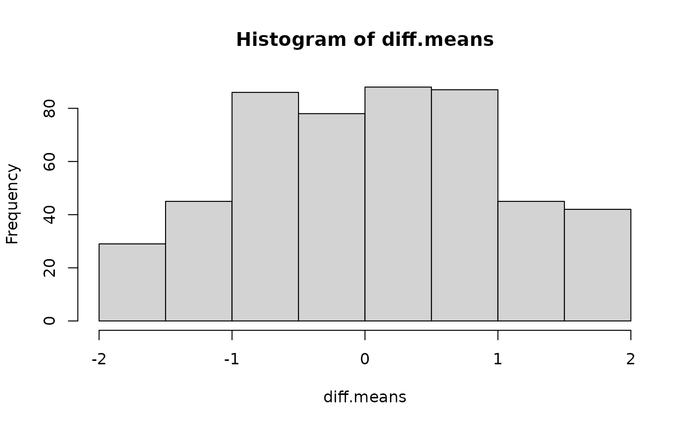

# lecture01-An Introduction to R

Welcome to the course “Appelied Spatial Data Analysis and Research”
course details:
<https://opas.peppi.uef.fi/en/course/YH00EM30/135183?period=2025-2026>

## What is R?

#### Why should we learn R?

R follows a type inference coding structure and provides a wide variety
of statistical and graphical techniques, including;

- Linear and non-linear modelling
- Univariate & Multivariate Statistics
- Classical statistical tests
- Time-series analysis/ Econometrics
- Simulation and Modelling
- Datamining-classification, clustering etc.

For computationally intensive tasks, C, C++, and Fortran code can be
linked and called at run time.

R is easily extensible through functions and extensions, and the R
community is noted for its active contributions in terms of packages.

``` r
# Number of R Packages
length(available.packages(repos = "http://cran.us.r-project.org")[, 1])
#> [1] 23438
```

#### Installing R and RStudio on Windows

The latest version of R can be download from the R homepage.

R download page: <http://www.cran.r-project.org/bin/windows/base/> The
page also provides some instructions and FAQ’s on R installation.

RStudio IDE ( IDE: Integrated Development Environment) is a powerful and
productive user interface for R.

It’s free and open source, and works great on Windows, Mac, and Linux

#### RStudio GUI/IDE

RStudio GUI is composed of 4 panes which can be rearranged according to
the requirements.

There are a lot of short introductions to RStudio available online so we
will not go into more details.

Download Rstudio from here
<https://rstudio.com/products/rstudio/download/#download>

#### Installing Packages

The easiest way to install packages is to do it via R console. The
command install.packages(“package name”) installs R packages directly
from internet. Other options to install various dependencies to a
package can be easily specified when calling this function. A call to
this function asks the user to chose a CRAN mirror at the first
instance.

Run the following to install Quantreg package on R. Also use the help
function to get the details.

``` r
# Install a package using RStudio Console
install.packages("sf", dependencies = c("Depends", "Suggests"))
#> Installing package into '/home/runner/work/_temp/Library'
#> (as 'lib' is unspecified)
#> Warning: dependencies 'starsdata', 'rnaturalearthhires', 'Rgraphviz', 'marray',
#> 'affy', 'Biobase', 'limma', 'BiocVersion', 'BiocStyle', 'glmmADMB', 'qs',
#> 'taxidata', 'sylly.de', 'sylly.es', 'spDataLarge', 'cmdstanr', 'globaltest',
#> 'vdg', 'graph', 'Biostrings', 'M3C', 'panelr', 'Iyer517', 'ComplexHeatmap',
#> 'INLA', 'biomaRt', 'KEGGgraph', 'Rcampdf', 'tm.lexicon.GeneralInquirer',
#> 'pryr', 'ExactData', 'blavsam', 'iwmm', 'BRugs', 'slp', 'gurobi', 'mlr3proba',
#> 'rrelaxiv', 'RDCOMClient', 'genefilter', 'sva', 'NetSwan', 'ALEPlot', 'polars',
#> 'RTCGA.rnaseq' are not available
#> also installing the dependencies 'Rmosek', 'deconvolveR', 'vardpoor', 'REBayes', 'AlphaSimR', 'convey', 'laeken', 'DTRlearn2', 'naivebayes', 'sparsediscrim', 'OAIHarvester', 'mlr3misc', 'spocc', 'ecospat', 'usdm', 'ashr', 'binda', 'KrigInv', 'GPareto', 'policytree', 'evola', 'lme4breeding', 'geomapdata', 'outliertree', 'archive', 'srvyr', 'polle', 'SurvMetrics', 'discrim', 'RcppHungarian', 'topicmodels', 'mallet', 'lda', 'gistr', 'ulid', 'apcluster', 'LPCM', 'protoclust', 'stream', 'fastVoteR', 'genalg', 'lsa', 'registry', 'synchronicity', 'wrapr', 'rquery', 'rqdatatable', 'cccd', 'coRanking', 'diffusionMap', 'pcaL1', 'maxnet', 'cito', 'ENMeval', 'BayesXsrc', 'MBA', 'shapviz', 'asciicast', 'SGPdata', 'glmertree', 'ncvreg', 'future.batchtools', 'parallelMap', 'truncnorm', 'gdata', 'crossval', 'OpenImageR', 'FD', 'entropy', 'DiceOptim', 'mldr.datasets', 'dtw', 'fdrtool', 'Mcomp', 'fastmatch', 'rainbow', 'mvQuad', 'yulab.utils', 'DIDmultiplegt', 'grf', 'mbest', 'rintrojs', 'enhancer', 'vioplot', 'dr', 'ISLR2', 'GEOmap', 'isotree', 'geodata', 'PCAmixdata', 'tidycensus', 'targeted', 'aorsf', 'visdat', 'finetune', 'tidyclust', 'ccaPP', 'udpipe', 'LDAvis', 'mlflow', 'redux', 'rotor', 'xaringan', 'revealjs', 'ggparty', 'mlr3cluster', 'mlr3fselect', 'mlr3inferr', 'precrec', 'mlr3measures', 'quanteda', 'stopwords', 'bestNormalize', 'smotefamily', 'NMF', 'vtreat', 'dimRed', 'biomod2', 'Boruta', 'carSurv', 'wav', 'prettyunits', 'BatchJobs', 'geojsonio', 'flashClust', 'mvnfast', 'evtree', 'rchallenge', 'ROI', 'WrightMap', 'rbenchmark', 'R2BayesX', 'scalreg', 'adabag', 'AmesHousing', 'ICEbox', 'fastshap', 'NeuralNetTools', 'missForest', 'cocor', 'rhub', 'sfnetworks', 'rmapshaper', 'ramcmc', 'sde', 'sitmo', 'qcc', 'SGP', 'taxize', 'ggstance', 'NHANES', 'xrf', 'neuralnet', 'pre', 'bvls', 'logcondens', 'bartMachine', 'biglasso', 'KernelKnn', 'LogicReg', 'SIS', 'futile.logger', 'ada', 'batchtools', 'brnn', 'bst', 'care', 'ClusterR', 'clusterSim', 'cmaes', 'deepnet', 'elasticnet', 'fda.usc', 'FDboost', 'frbs', 'FSelector', 'FSelectorRcpp', 'GenSA', 'GPfit', 'irace', 'laGP', 'mldr', 'mRMRe', 'praznik', 'refund', 'rFerns', 'rotationForest', 'RRF', 'RSNNS', 'rucrdtw', 'sda', 'sparseLDA', 'stepPlr', 'survAUC', 'tgp', 'tsfeatures', 'wavelets', 'eaf', 'lhs', 'checkmate', 'BBmisc', 'fds', 'zipfR', 'lavaan.mi', 'restriktor', 'mcmcse', 'nimbleQuad', 'scholar', 'CausalQueries', 'DesignLibrary', 'rdrobust', 'rdss', 'influenceR', 'netrankr', 'rngtools', 'doMPI', 'doRedis', 'beepr', 'pbmcapply', 'ntfy', 'skpr', 'VarianceGamma', 'SkewHyperbolic', 'sommer', 'maptiles', 'weights', 'ggExtra', 'gglm', 'esc', 'mschart', 'rvg', 'sortable', 'LDRTools', 'tourr', 'amap', 'fxregime', 'hypergeo', 'tree', 'permute', 'bspec', 'RSEIS', 'signal', 'Gmisc', 'Greg', 'Metrics', 'ROI.plugin.ecos', 'ROI.plugin.alabama', 'ROI.plugin.neos', 'applicable', 'CAST', 'spatialsample', 'tigris', 'stringdist', 'lava', 'censored', 'clustMixType', 'QSARdata', 'tabnet', 'torch', 'workflowsets', 'scs', 'clarabel', 'giscoR', 'gower', 'plot3Drgl', 'yaImpute', 'text2vec', 'mlr3data', 'yardstick', 'distances', 'paradox', 'mlr3tuning', 'mlr3learners', 'lgr', 'pagedown', 'fairml', 'linprog', 'mlr3viz', 'mlr3pipelines', 'bbotk', 'blockCV', 'ggsci', 'ggtext', 'mlr3filters', 'sperrorest', 'twosamples', 'tfevents', 'torchvision', 'BatchExperiments', 'import', 'kimisc', 'knitcitations', 'metap', 'sampling', 'tikzDevice', 'FactoInvestigate', 'shape', 'bs4Dash', 'highcharter', 'rapidoc', 'redoc', 'visNetwork', 'writexl', 'fabricatr', 'randomizr', 'prediction', 'gtExtras', 'fImport', 'wdm', 'cobs', 'mvPot', 'ismev', 'TruncatedNormal', 'TSP', 'kdecopula', 'likert', 'psychomix', 'stablelearner', 'carrier', 'BIFIEsurvey', 'CDM', 'inline', 'MBESS', 'mdmb', 'synthpop', 'TAM', 'mitools', 'VGAMdata', 'RcppZiggurat', 'gamboostLSS', 'hdi', 'shapefiles', 'pdp', 'vip', 'R.matlab', 'NLP', 'antiword', 'filehash', 'Rpoppler', 'SnowballC', 'rpf', 'snowfall', 'ifaTools', 'tidyLPA', 'umx', 'formatR', 'ggraph', 'bain', 'inlinedocs', 'pbivnorm', 'pbv', 'shinythemes', 'rclipboard', 'snow', 'doSNOW', 'rlecuyer', 'pkgKitten', 'DescTools', 'invgamma', 'ipumsr', 'bssm', 'EnvStats', 'TRAMPR', 'measures', 'logmult', 'gtools', 'agricolae', 'mosaic', 'prefmod', 'rules', 'plotmo', 'som', 'smcfcs', 'casebase', 'grpreg', 'hal9001', 'nnls', 'pROC', 'SuperLearner', 'kmi', 'PASWR', 'VennDiagram', 'maditr', 'repr', 'mlr', 'ParamHelpers', 'smoof', 'akima', 'cmaesr', 'emoa', 'mco', 'fda', 'beeswarm', 'changepoint', 'KFAS', 'MSwM', 'lfda', 'languageR', 'runjags', 'modeest', 'semTools', 'nimble', 'fastverse', 'kit', 'pwr', 'bootES', 'easystats', 'report', 'DeclareDesign', 'ggside', 'tidygraph', 'doRNG', 'future.callr', 'doFuture', 'progressr', 'philentropy', 'transport', 'glba', 'binom', 'LaplacesDemon', 'skellam', 'triangle', 'future.tests', 'DoE.wrapper', 'FrF2.catlg128', 'BsMD', 'mc2d', 'GeneralizedHyperbolic', 'dismo', 'Rmixmod', 'xLLiM', 'mafR', 'elevatr', 'desplot', 'gge', 'lucid', 'nullabor', 'qicharts', 'qtl', 'SpATS', 'tidyterra', 'jtools', 'ez', 'ggResidpanel', 'Gmedian', 'mbend', 'ppcor', 'rmcorr', 'openxlsx2', 'CCP', 'learnr', 'ICSNP', 'moments', 'ICSClust', 'REPPlab', 'geomtextpath', 'shinyBS', 'datawizard', 'ggsignif', 'interactions', 'Rmisc', 'ca', 'circular', 'ff', 'sdPrior', 'glogis', 'scoringRules', 'ggdendro', 'WWGbook', 'bigmemory', 'glm2', 'FMStable', 'libstable4u', 'gfonts', 'networkD3', 'treemap', 'vegan', 'psd', 'pimeta', 'robvis', 'cccp', 'crossnma', 'gemtc', 'forestplot', 'compute.es', 'tfdatasets', 'janeaustenr', 'r2d3', 'keras3', 'Ckmeans.1d.dp', 'float', 'fauxpas', 'webmockr', 'vwline', 'profileModel', 'detectseparation', 'mbrglm', 'visreg', 'waywiser', 'sjmisc', 'sjPlot', 'censReg', 'feisr', 'fungible', 'httptest2', 'lavaSearch2', 'merTools', 'metaplus', 'tune', 'stddiff', 'tableone', 'butcher', 'tailor', 'twang', 'twangContinuous', 'Matching', 'ebal', 'CBPS', 'optweight', 'MatchThem', 'cem', 'sbw', 'eurostat', 'DALEX', 'auditor', 'h2o', 'iml', 'ingredients', 'lime', 'localModel', 'mlr3', 'stacks', 'gk', 'PairedData', 'gld', 'plotfunctions', 'quickmatch', 'RcppProgress', 'highs', 'miesmuschel', 'mlr3batchmark', 'mlr3benchmark', 'mlr3db', 'mlr3fairness', 'mlr3fda', 'mlr3oml', 'mlr3spatial', 'mlr3spatiotempcv', 'mlr3summary', 'mlr3torch', 'rush', 'matrixStats', 'corpcor', 'wrswoR', 'ggarrow', 'RItools', 'betacal', 'coneproj', 'backports', 'dominanceanalysis', 'relaimpo', 'CVST', 'missMDA', 'Factoshiny', 'NormPsy', 'NSM3', 'rootSolve', 'MNP', 'enrichwith', 'osqp', 'misaem', 'GPBayes', 'diagram', 'jsonvalidate', 'modules', 'packrat', 'shinyEffects', 'shinyjqui', 'MPsychoR', 'calibrate', 'cpp11', 'commonmark', 'doconv', 'equatags', 'officedown', 'plumber', 'gganimate', 'estimatr', 'modelsummary', 'pandoc', 'Rdatasets', 'uuid', 'rngWELL', 'animation', 'crop', 'HAC', 'lcopula', 'mev', 'mvnormtest', 'partitions', 'polynom', 'Runuran', 'VineCopula', 'Rmpi', 'libcoin', 'RWeka', 'psychotools', 'psychotree', 'gss', 'furrr', 'haven', 'literanger', 'miceadds', 'pan', 'VGAMextra', 'actuar', 'diptest', 'ellipse', 'SuppDists', 'stabs', 'BayesX', 'gbm', 'kangar00', 'mix', 'geometry', 'tm', 'OpenMx', 'tidySEM', 'faraway', 'directlabels', 'sirt', 'plink', 'mirtCAT', 'scdhlm', 'RcppArmadillo', 'adagio', 'DPQmpfr', 'Bessel', 'round', 'relimp', 'Ecfun', 'wooldridge', 'modeltools', 'ipred', 'varImp', 'gnm', 'gmodels', 'Fahrmeir', 'Sleuth2', 'BradleyTerry2', 'Cubist', 'earth', 'fastICA', 'klaR', 'mda', 'MLmetrics', 'pamr', 'pls', 'RANN', 'spls', 'superpc', 'themis', 'riskRegression', 'etm', 'ssanv', 'Exact', 'BlakerCI', 'cowplot', 'PoissonBinomial', 'revdbayes', 'expss', 'relsurv', 'CVXR', 'mlrMBO', 'tbm', 'DiceKriging', 'ggdist', 'ggfortify', 'loo', 'shinystan', 'BayesFactor', 'bayesQR', 'BH', 'blavaan', 'bridgesampling', 'collapse', 'effectsize', 'modelbased', 'ordbetareg', 'RcppEigen', 'see', 'RODBC', 'projpred', 'priorsense', 'RWiener', 'rtdists', 'extraDistr', 'mnormt', 'arm', 'future.mirai', 'combinat', 'energy', 'pgirmess', 'forward', 'conf.design', 'DoE.base', 'FrF2', 'fitdistrplus', 'maxlike', 'R2OpenBUGS', 'R2WinBUGS', 'jagsUI', 'qgam', 'rcdd', 'Infusion', 'IsoriX', 'blackbox', 'ROI.plugin.glpk', 'rsae', 'multilevel', 'agridat', 'fmesher', 'afex', 'bigutilsr', 'correlation', 'cplm', 'dagitty', 'discovr', 'ggdag', 'GPArotation', 'ICS', 'ICSOutlier', 'ISLR', 'ivreg', 'mclogit', 'multimode', 'nestedLogit', 'psychTools', 'qqplotr', 'rempsyc', 'mvinfluence', 'rrcov', 'archdata', 'qqtest', 'bamlss', 'lqmm', 'rlme', 'lemon', 'ggh4x', 'robustvarComp', 'confintROB', 'fastglm', 'Bergm', 'RSiena', 'ergm.count', 'networkLite', 'stabledist', 'bindrcpp', 'JM', 'joineR', 'oz', 'plot3D', 'stargazer', 'Rcsdp', 'orthopolynom', 'bayesm', 'StanHeaders', 'rjags', 'qpdf', 'devEMF', 'gdtools', 'data.tree', 'prettycode', 'pixmap', 'betapart', 'multitaper', 'apex', 'ggseqlogo', 'seqinr', 'meta', 'netmeta', 'bayesmeta', 'NlcOptim', 'robumeta', 'aod', 'C50', 'dials', 'keras', 'kknn', 'LiblineaR', 'sparklyr', 'tensorflow', 'xgboost', 'polycor', 'aws.ec2metadata', 'aws.signature', 'sodium', 'crul', 'alphahull', 'gridBezier', 'gggrid', 'RJSONIO', 'tth', 'brglm', 'brglm2', 'logistf', 'sdmTMB', 'sjlabelled', 'sjstats', 'aplore3', 'GLMsData', 'insight', 'smd', 'workflows', 'apollo', 'fastDummies', 'gmnl', 'mixl', 'brmsmargins', 'causaldata', 'clarify', 'cjoint', 'cobalt', 'countrycode', 'crch', 'DALEXtra', 'DCchoice', 'dbarts', 'DirichletReg', 'distributional', 'equivalence', 'fmeffects', 'fwb', 'ggokabeito', 'glmx', 'itsadug', 'MatchIt', 'mhurdle', 'missRanger', 'mlr3verse', 'mvgam', 'optmatch', 'probably', 'Rchoice', 'REndo', 'rcmdcheck', 'scam', 'tictoc', 'titanic', 'tsModel', 'altdoc', 'BayesFM', 'cAIC4', 'cgam', 'ClassDiscovery', 'did', 'domir', 'DRR', 'EGAnet', 'factoextra', 'FactoMineR', 'lcmm', 'metaBMA', 'NbClust', 'nFactors', 'PCDimension', 'PMCMRplus', 'PROreg', 'serp', 'sparsepca', 'svylme', 'WeightIt', 'WRS2', 'cardx', 'ggsurvfit', 'FME', 'attachment', 'dockerfiler', 'renv', 'rex', 'shiny.react', 'flexdashboard', 'globals', 'shinydashboardPlus', 'GA', 'Rtsne', 'smacof', 'umap', 'r2d2', 'tclust', 'pdfCluster', 'gridBase', 'bezier', 'ddalpha', 'RcppRoll', 'texPreview', 'r2rtf', 'seasonalview', 'evd', 'miscTools', 'dlm', 'rdhs', 'sae', 'rpart.plot', 'TTR', 'RMySQL', 'downloader', 'slider', 'brew', 'git2r', 'pingr', 'pkgbuild', 'progress', 'flextable', 'ggiraph', 'heatmaply', 'rsconnect', 'thematic', 'tinytable', 'whoami', 'egg', 'gginnards', 'rbibutils', 'here', 'conflicted', 'spacefillr', 'randtoolbox', 'copula', 'simsalapar', 'partykit', 'inum', 'quantregForest', 'AppliedPredictiveModeling', 'mice', 'rmsb', 'VGAM', 'formula.tools', 'iterators', 'itertools', 'flexmix', 'gamair', 'gee', 'mboost', 'mclust', 'rmeta', 'wordcloud', 'HSAUR2', 'nonnest2', 'lavaan', 'mirt', 'lmeInfo', 'setRNG', 'BB', 'ucminf', 'minqa', 'lbfgsb3c', 'lbfgs', 'subplex', 'marqLevAlg', 'piecewiseSEM', 'lokern', 'Rmpfr', 'gmp', 'qvcalc', 'glmmML', 'Ecdat', 'party', 'vcdExtra', 'penalized', 'caret', 'doMC', 'multiwayvcov', 'pcse', 'TSA', 'basefun', 'variables', 'prodlim', 'exact2x2', 'exactci', 'bpcp', 'bootstrap', 'gamlss.dist', 'distributions3', 'pec', 'fst', 'splines2', 'flexsurvcure', 'survminer', 'doBy', 'survC1', 'readstata13', 'mstate', 'survPen', 'mets', 'Hmsc', 'abess', 'tramnet', 'bayesplot', 'bayestestR', 'biglm', 'brms', 'compositions', 'mediation', 'multcompView', 'robmixglm', 'rsm', 'emdbook', 'AICcmodavg', 'MCMCpack', 'mgcViz', 'spaMM', 'GLMMadaptive', 'phylolm', 'performance', 'poLCA', 'heplots', 'betareg', 'robustlmm', 'AUC', 'binGroup', 'btergm', 'cmprsk', 'drc', 'epiR', 'ergm', 'glmnetUtils', 'gmm', 'irlba', 'joineRML', 'Kendall', 'ks', 'lm.beta', 'lmodel2', 'lsmeans', 'margins', 'mfx', 'modeldata', 'modeltests', 'muhaz', 'psych', 'rsample', 'speedglm', 'MCMCglmm', 'posterior', 'rstan', 'rstanarm', 'rstantools', 'R2jags', 'TMB', 'ftExtra', 'officer', 'styler', 'expint', 'ade4TkGUI', 'adegraphics', 'adephylo', 'adespatial', 'CircStats', 'splancs', 'waveslim', 'expm', 'phangorn', 'metadat', 'pracma', 'nloptr', 'optimParallel', 'CompQuadForm', 'BiasedUrn', 'clubSandwich', 'wildmeta', 'estmeansd', 'metaBLUE', 'glmulti', 'Amelia', 'calculus', 'clusterGeneration', 'hardhat', 'parallelly', 'parsnip', 'sasr', 'tidymodels', 'RcmdrMisc', 'aplpack', 'nortest', 'sem', 'htmlTable', 'formattable', 'sparkline', 'colourpicker', 'duckplyr', 'shinydashboard', 'gargle', 'jose', 'shinychat', 'vcr', 'irr', 'fortunes', 'miniUI', 'servr', 'R2HTML', 'feather', 'mockr', 'orientlib', 'alphashape3d', 'js', 'manipulateWidget', 'V8', 'xdvir', 'denstrip', 'sn', 'exams', 'unix', 'slam', 'harrypotter', 'oompaBase', 'palr', 'pals', 'ggeffects', 'ggstats', 'glmtoolbox', 'gtsummary', 'logitr', 'marginaleffects', 'multgee', 'parameters', 'tidycmprsk', 'svyVGAM', 'qreport', 'acepack', 'pcaPP', 'polspline', 'getPass', 'safer', 'htm2txt', 'igraphdata', 'questionr', 'rJava', 'statnet.common', 'alluvial', 'babynames', 'ggfittext', 'deSolve', 'diffobj', 'golem', 'rhino', 'shinytest', 'shinyvalidate', 'shinyWidgets', 'seriation', 'gplots', 'dynamicTreeCut', 'pvclust', 'corrplot', 'DendSer', 'fpc', 'circlize', 'recipes', 'ggplot2movies', 'rjson', 'katex', 'tippy', 'botor', 'RPushbullet', 'rsyslog', 'slackr', 'syslognet', 'telegram', 'formatters', 'demography', 'popEpi', 'forecTheta', 'rticles', 'seasonal', 'uroot', 'spam64', 'truncdist', 'dfidx', 'crs', 'maxLik', 'hexView', 'pzfx', 'readODS', 'rmatio', 'nanoparquet', 'qs2', 'SUMMER', 'bench', 'bife', 'wkb', 'cmm', 'corrgram', 'ggpcp', 'candisc', 'quantmod', 'ggpubr', 'rgenoud', 'RPESE', 'RobStatTM', 'fBasics', 'adbcdrivermanager', 'clock', 'bitops', 'mathjaxr', 'remotes', 'websocket', 'BiocManager', 'foghorn', 'quarto', 'R.methodsS3', 'R.oo', 'gridExtra', 'ggpp', 'prettydoc', 'ggbeeswarm', 'marquee', 'litedown', 'vembedr', 'colourvalues', 'geojsonsf', 'jsonify', 'sfheaders', 'qrng', 'numDeriv', 'trtf', 'rms', 'ATR', 'openxlsx', 'plyr', 'HSAUR3', 'MEMSS', 'dfoptim', 'gamm4', 'merDeriv', 'mlmRev', 'optimx', 'pbkrtest', 'rr2', 'semEff', 'robust', 'fit.models', 'MPV', 'sfsmisc', 'catdata', 'doParallel', 'foreach', 'skewt', 'sandwich', 'dynlm', 'bdsmatrix', 'kinship2', 'mlt', 'mlbench', 'reformulas', 'SparseGrid', 'alabama', 'latticeExtra', 'ordinalCont', 'mlt.docreg', 'ordinal', 'asht', 'gamlss', 'randomForestSRC', 'tramME', 'geepack', 'ranger', 'eha', 'flexsurv', 'frailtyEM', 'frailtypack', 'gamlss.cens', 'icenReg', 'mpr', 'rstpm2', 'timereg', 'Stat2Data', 'cotram', 'tramvs', 'KONPsurv', 'gamlss.data', 'english', 'pdftools', 'emmeans', 'estimability', 'bbmle', 'pscl', 'DHARMa', 'MuMIn', 'effects', 'dotwhisker', 'broom', 'broom.mixed', 'huxtable', 'blme', 'ade4', 'ape', 'lmerTest', 'metafor', 'Rsolnp', 'mmrm', 'RBesT', 'Rcmdr', 'RcmdrPlugin.HH', 'microplot', 'kableExtra', 'DiagrammeR', 'DiagrammeRsvg', 'dm', 'ellmer', 'forcats', 'pixarfilms', 'reprex', 'bookdown', 'cyclocomp', 'patrick', 'tufte', 'RCurl', 'secretbase', 'sysfonts', 'showtextdb', 'R.devices', 'ascii', 'R.utils', 'tidyverse', 'showimage', 'brotli', 'rgl', 'misc3d', 'tkrplot', 'rpanel', 'lars', 'Deriv', 'Ryacas', 'scatterplot3d', 'Rglpk', 'Rsymphony', 'paletteer', 'airports', 'broom.helpers', 'Hmisc', 'igraph', 'intergraph', 'labelled', 'network', 'scagnostics', 'sna', 'ggalluvial', 'shinytest2', 'listviewer', 'dendextend', 'IRdisplay', 'plotlyGeoAssets', 'palmerpenguins', 'rversions', 'ggridges', 'trajectories', 'sftrack', 'gridGraphics', 'gt', 'gclus', 'polyclip', 'waldo', 'reactable', 'fontcm', 'sylly', 'sylly.en', 'logger', 'descr', 'tables', 'reshape', 'memisc', 'Epi', 'forecast', 'SparseM', 'logspline', 'nor1mix', 'Formula', 'conquer', 'spam', 'fGarch', 'ineq', 'longmemo', 'mlogit', 'np', 'ROCR', 'rugarch', 'sampleSelection', 'systemfit', 'truncreg', 'vars', 'carData', 'alr4', 'leaps', 'MatrixModels', 'plotrix', 'rio', 'survey', 'tweedie', 'msm', 'pglm', 'splm', 'cubature', 'alpaca', 'adehabitatMA', 'spData', 'spatialreg', 'dbscan', 'RSpectra', 'rgeoda', 'mipfp', 'Guerry', 'codingMatrices', 'fontquiver', 'PerformanceAnalytics', 'fTrading', 'tinysnapshot', 'shinyAce', 'shinydisconnect', 'tesseract', 'distro', 'duckdb', 'pkgload', 'httpuv', 'testit', 'devtools', 'roxygen2', 'ggrepel', 'rnaturalearthdata', 'nanonext', 'promises', 'yyjsonr', 'googleway', 'spatialwidget', 'mvtnorm', 'TH.data', 'lme4', 'robustbase', 'coin', 'xtable', 'lmtest', 'coxme', 'SimComp', 'ISwR', 'tram', 'fixest', 'glmmTMB', 'DoseFinding', 'HH', 'asd', 'gsDesign', 'bibtex', 'constructive', 'debugme', 'lintr', 'mockery', 'coro', 'dygraphs', 'markdown', 'mirai', 'reactlog', 'showtext', 'watcher', 'RhpcBLASctl', 'R.rsp', 'listenv', 'Lahman', 'nycflights13', 'RMariaDB', 'chromote', 'repurrrsive', 'spelling', 'webfakes', 'sm', 'nleqslv', 'glmnet', 'fftw', 'interp', 'gam', 'lpSolve', 'quadprog', 'relations', 'ozmaps', 'GGally', 'plotly', 'concaveman', 'vdiffr', 'sftime', 'patchwork', 'ncdf4', 'chemometrics', 'deldir', 'latex2exp', 'reshape2', 'extrafont', 'pander', 'quantreg', 'fields', 'geoR', 'AER', 'car', 'statmod', 'urca', 'pder', 'texreg', 'lfe', 'adehabitatLT', 'cshapes', 'googleVis', 'ISOcodes', 'spdep', 'nanotime', 'timeDate', 'hexbin', 'dichromat', 'svglite', 'timeSeries', 'tseries', 'chron', 'coda', 'mondate', 'stinepack', 'strucchange', 'tinyplot', 'tis', 'gapminder', 'kernlab', 'vcd', 'shinyjs', 'jpeg', 'rcartocolor', 'scico', 'wesanderson', 'magick', 'webp', 'arrow', 'reticulate', 'DT', 'box', 'geosphere', 'mapproj', 'mapdata', 'rnaturalearth', 'later', 'leaflet.extras2', 'leafsync', 'mapdeck', 'plainview', 'poorman', 'tinytest', 'webshot', 'webshot2', 'multcomp', 'RUnit', 'connectcreds', 'DBItest', 'paws.common', 'shiny', 'future', 'future.apply', 'dbplyr', 'decor', 'rvest', 'spatstat.data', 'spatstat.univar', 'spatstat.explore', 'spatstat.model', 'fftwtools', 'gsl', 'goftest', 'locfit', 'abind', 'Cairo', 'CFtime', 'OpenStreetMap', 'RNetCDF', 'clue', 'cubble', 'cubelyr', 'exactextractr', 'FNN', 'ggforce', 'ggthemes', 'gstat', 'ncdfCF', 'ncdfgeom', 'ncmeta', 'plm', 'randomForest', 'spacetime', 'tsibble', 'viridis', 'xts', 'zoo', 'diffviewer', 'otel', 'otelsdk', 'av', 'transformr', 'colorspace', 'gifski', 'widgetframe', 'lobstr', 'rsvg', 'blob', 'nanoarrow', 'covr', 'lwgeom', 'maps', 'mapview', 'microbenchmark', 'odbc', 'pbapply', 'pool', 'RPostgres', 'RPostgreSQL', 'RSQLite', 'spatstat', 'spatstat.geom', 'spatstat.random', 'spatstat.linnet', 'spatstat.utils', 'stars', 'testthat', 'tmap'
#> Warning in install.packages("sf", dependencies = c("Depends", "Suggests")):
#> installation of package 'Rmpi' had non-zero exit status
#> Warning in install.packages("sf", dependencies = c("Depends", "Suggests")):
#> installation of package 'tkrplot' had non-zero exit status
#> Warning in install.packages("sf", dependencies = c("Depends", "Suggests")):
#> installation of package 'metap' had non-zero exit status
#> Warning in install.packages("sf", dependencies = c("Depends", "Suggests")):
#> installation of package 'DCchoice' had non-zero exit status
#> Warning in install.packages("sf", dependencies = c("Depends", "Suggests")):
#> installation of package 'ClassDiscovery' had non-zero exit status
#> Warning in install.packages("sf", dependencies = c("Depends", "Suggests")):
#> installation of package 'doMPI' had non-zero exit status
#> Warning in install.packages("sf", dependencies = c("Depends", "Suggests")):
#> installation of package 'PCDimension' had non-zero exit status
#> Warning in install.packages("sf", dependencies = c("Depends", "Suggests")):
#> installation of package 'NMF' had non-zero exit status
#> Warning in install.packages("sf", dependencies = c("Depends", "Suggests")):
#> installation of package 'xLLiM' had non-zero exit status
#> Warning in install.packages("sf", dependencies = c("Depends", "Suggests")):
#> installation of package 'ENMeval' had non-zero exit status
#> Warning in install.packages("sf", dependencies = c("Depends", "Suggests")):
#> installation of package 'revdbayes' had non-zero exit status
#> Warning in install.packages("sf", dependencies = c("Depends", "Suggests")):
#> installation of package 'rmsb' had non-zero exit status
```

``` r
install.packages(c("reshape2", "foreign", "ggplot2", "stargazer"), dependencies = TRUE)
#> Installing packages into '/home/runner/work/_temp/Library'
#> (as 'lib' is unspecified)
#> also installing the dependencies 'munsell', 'profvis'
# to be updated
```

#### Getting Help

As R is constantly evolving and new functions/packages are introduced
every day it is good to know sources of help. The most basic help one
can get is via the help() function. This function shows the help file
for a function which has been created by package managers.

``` r
help("function name")
#> No documentation for 'function name' in specified packages and libraries:
#> you could try '??function name'
```

All the R packages (with few exceptions) have a user’s manual listing
the functions in a package. This can be downloaded in PDF format from
the R package download page2.

R also provides some search tools given at
[http://cran.r-project.org/search.html](http://cran.r-project.org/search.md)
The R Site search is helpful in searching for topics related to problem
in hand.

Other than these various good R related blogs are on the internet which
can be really helpful. A combined upto date view of 452 contributed
blogs can be found at R-bloggers3.

Over all there quite a big community of R Users and help can be found
for most of the topics.

#### R programming for ABSOLUTE beginners

## Functions in R

One of the great strengths of R is the user’s ability to add functions.
In fact, many of the functions in R are actually functions of functions.
The functions take input, perform operations on the input and return
output. The structure of a function is given below (see the webpage:
<https://www.learnbyexample.org/r-functions/>):

figures/myfigure.png

The agrument can defined with or without defaults and when the function
is called the arguments are passed to the statements.

Functions in R are “first class objects”, which means that they can be
treated much like any other R object. Importantly, 1) functions can be
passed as arguments to other functions and 2) functions can be nested,
so that you can define a function inside of another function.

Let’s create a simple function:

``` r
f<-function(x) {
 a=b*x^2
 return(a)
 }
a<-2
b<-1
f(5)
#> [1] 25
```

The function returns 25, because - The function found b in the workspace
that called it - In the console a is still 2 because the function
created its own local variable a.

Here is another simple example where we define a function
fahrenheit_to_celsius that converts temperatures from Fahrenheit to
Celsius:

``` r
fahrenheit_to_celsius <- function(temp_F) {
   temp_C <- (temp_F - 32) * 5 / 9
   return(temp_C)
 }
```

We define fahrenheit_to_celsius by assigning it to the output of
function. The list of argument names are contained within parentheses.
Next, the body of the function–the statements that are executed when it
runs–is contained within curly braces ({}). The statements in the body
are indented by two spaces, which makes the code easier to read but does
not affect how the code operates.

When we call the function, the values we pass to it are assigned to
those variables so that we can use them inside the function. Inside the
function, we use a return statement to send a result back to whoever
asked for it. You can test the function:

``` r
fahrenheit_to_celsius(10)
#> [1] -12.22222
```

#### Example 1: Creating new functions: Standard error

R allows the user to create new functions. This is a useful feature,
particularly when you want to automate certain tasks that you have to
repeat over and over. Let’s start with a simple example. Suppose you
want to calculate the standard error of a mean associated to a set of
values.

Before proceeding to create the function we should check whether there
is already a function with this name in R. Let’s type:

``` r
se
```

The error printed by R indicates that we are safe to use that name.
Following code is a possible way to create our function:

``` r
se<- function(x){
 v <- var(x)
 z <- length(x)
 return (sqrt(v/z))
}
```

After creating this function, you can use it as follows:

``` r
test<-c(2,4,3,6,4,9,11,3,7,6)
se(test)
#> [1] 0.9098229
```

The value returned by any function can be decided using the function
return() or, alternatively, R returns the result of the last expression
that was evaluated within the function.

#### Example 2: More advanced function of basic statistics

``` r
basic.stats <- function(x, more=F) {
  stats <- list()
  clean.x <- x[!is.na(x)]
  stats$n <- length(x)
  stats$nNAs <- stats$n-length(clean.x)
  stats$mean <- mean(clean.x)
  stats$std <- sd(clean.x)
  stats$med <- median(clean.x)
  if (more) {
    stats$skew <- sum(((clean.x - stats$mean)/stats$std)^3)/length(clean.x)
    stats$kurt <- sum(((clean.x - stats$mean)/stats$std)^4)/length(clean.x)-3
    }
  unlist(stats)
 }
```

This function has a parameter (more) that has a default value (F). This
means that you can call this function with or without setting this
parameter. Below are examples of these two alternatives:

``` r
basic.stats(test)
#>         n      nNAs      mean       std       med 
#> 10.000000  0.000000  5.500000  2.877113  5.000000

basic.stats(test,more=T)
#>          n       nNAs       mean        std        med       skew       kurt 
#> 10.0000000  0.0000000  5.5000000  2.8771128  5.0000000  0.5542469 -1.0902009
```

## R and Programming

## Permutation Test and Resampling

The bootstrap, permutation tests, and other resampling methods are part
of this revolution. Resampling methods allow us to quantify uncertainty
by calculating standard errors and confidence intervals and performing
significance tests. They require fewer assumptions than traditional
methods and generally give more accurate answers (sometimes very much
more accurate). Moreover, resampling lets us tackle new inference
settings easily.

Resampling also helps us understand the concepts of statistical
inference. The sampling distribution is an abstract idea. The bootstrap
analog (the “bootstrap distribution”) is a concrete set of numbers that
we analyze using familiar tools like histograms. The standard deviation
of that distribution is a concrete analog to the abstract concept of a
standard error. Resampling methods for significance tests have the same
advantage; permutation tests produce a concrete set of numbers whose
“permutation distribution” approximates the sampling distribution under
the null hypothesis. Comparing our statistic to these numbers helps us
understand p-values.

Here is a summary of the advantages of these new methods: - Fewer
assumptions: For example, resampling methods do not require that
distributions be Normal or that sample sizes be large. - Greater
accuracy: Permutation tests, and some bootstrap methods, are more
accurate in practice than classical methods. - Generality: Resampling
methods are remarkably similar for a wide range of statistics and do not
require new formulas for every statistic. You do not need to memorize or
look up special formulas for each procedure. - Promote understanding:
Bootstrap procedures build intuition by providing concrete analogies to
theoretical concepts

Here are two links for good examples of the permutation tests: •
<http://spark.rstudio.com/ahmed/permutation/> •
<http://faculty.washington.edu/kenrice/sisg/SISG-08-06.pdf>

Let’s create a vector where elements \[1:5\] belong to group A and
elements \[6:10\] belong to group B

``` r
y2=c(9.65, 5.09, 8.80, 7.42, 6.68, 8.79, 9.36, 9.64, 9.02, 8.86)
```

Now let’s create permutation test:

First calculate the observed difference in group averages

``` r
obs.diff.means=mean(y2[1:5])-mean(y2[6:10])
```

Do the test with 500 permutations

``` r
diff.means=numeric()
for (i in 1:500){
 perm=sample(y2,10,replace=F)
 diff.means[i]=mean(perm[1:5])-mean(perm[6:10])
 }
```

Draw a histogram from sampled differences

``` r
hist(diff.means)
```



#### Example: Permutation test

``` r
library(spatialcourseOL)
usethis::use_pkgdown()
#> ✔ Setting active project to
#>   "/home/runner/work/spatialcourseOL/spatialcourseOL".
#> ℹ Leaving _pkgdown.yml unchanged.
#> ☐ Edit _pkgdown.yml.
```
