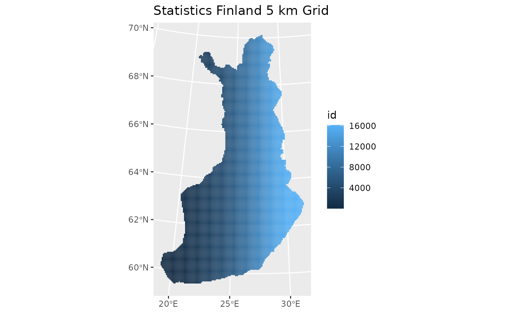
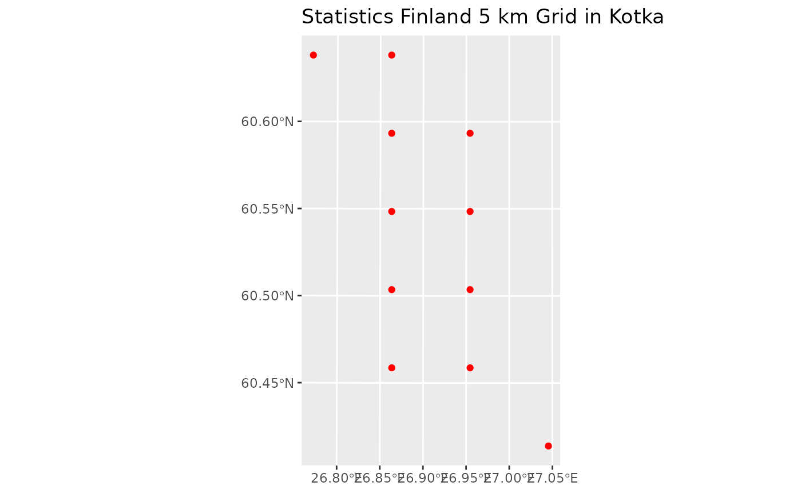
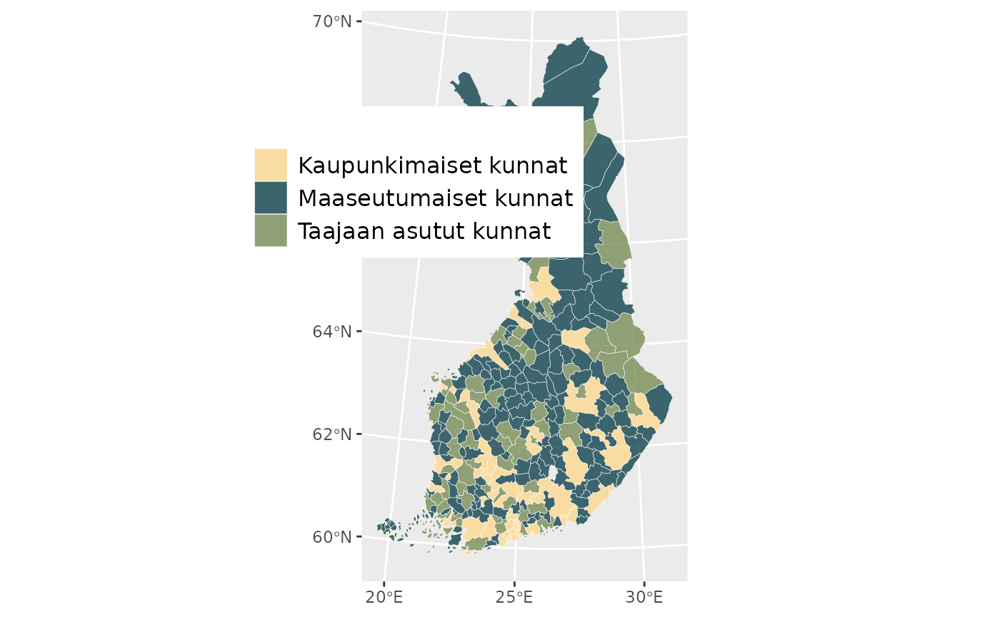

# lecture02-Reading data

## Reading data with R

R provides powerful tools for working with spatial data, making it a
flexible environment for GIS analysis and reproducible workflows. In
practice, most geographic datasets come in either vector (points, lines,
polygons) or raster (grids) format. The sf package standardizes how
vector data are stored and accessed, while terra offers efficient tools
for raster operations. Before performing spatial analysis, we need to
import these datasets into R. The code below shows how to read some of
the most common spatial file formats.

##### Read a Shapefile (.shp):

``` r
library(sf)
shp <- st_read("data/admin_areas.shp")
```

##### Read a GeoPackage (.gpkg):

``` r
library(sf)
```

List layers

``` r
st_layers("data/geodata.gpkg")
```

Read a specific layer

``` r
roads <- st_read("data/geodata.gpkg", layer = "roads")
```

##### Read GeoJSON

``` r
library(sf)

geojson <- st_read("data/borders.geojson")
```

##### Read a Raster (GeoTIFF .tif)

``` r
library(terra)

r <- rast("data/elevation.tif")
```

##### Reproject Vector Data

``` r
admin_utm <- st_transform(shp, 32635)
```

##### Reproject Raster Data

``` r
r_utm <- project(r, "EPSG:32635")
```

The sf package is the core R library for working with vector spatial
data. It provides functions to read, write, analyze, and visualize
geographic objects using modern standards. More information and
documentation can be found on the project website:

- <https://r-spatial.github.io/sf/>


### Let´s have an example next.

### 1. Introduction

This example demonstrates how to download, explore, and process open
spatial data from the Statistics Finland WFS service.  
We will:

1.  Inspect the WFS service  
2.  Download a 5 km grid dataset  
3.  Visualize the grid using **ggplot2**  
4.  Clip the grid to the municipality of Kotka  
5.  Save the clipped dataset as a shapefile

This workflow helps you understand how openly available geospatial data
can be accessed and integrated into spatial analysis.

### 2. Load Required Libraries

In this step, we load the R packages used throughout the analysis. These
include tools for spatial data handling (sf), data manipulation (dplyr,
purrr), downloading data from web services (httr, ows4R), and
visualization (ggplot2). The geofi package is also loaded to access
official Finnish municipal boundary data.

``` r
library(dplyr)
```

    ## 
    ## Attaching package: 'dplyr'

    ## The following objects are masked from 'package:stats':
    ## 
    ##     filter, lag

    ## The following objects are masked from 'package:base':
    ## 
    ##     intersect, setdiff, setequal, union

``` r
library(purrr)
library(sf)
```

    ## Linking to GEOS 3.12.1, GDAL 3.8.4, PROJ 9.4.0; sf_use_s2() is TRUE

``` r
library(httr)
library(data.table)
```

    ## 
    ## Attaching package: 'data.table'

    ## The following object is masked from 'package:purrr':
    ## 
    ##     transpose

    ## The following objects are masked from 'package:dplyr':
    ## 
    ##     between, first, last

``` r
library(ows4R)
```

    ## Loading ISO 19139 XML schemas...

    ## Loading ISO 19115-3 XML schemas...

    ## Loading ISO 19139 codelists...

``` r
library(ggplot2)
library(geofi)   # for Finnish municipal boundaries
```

    ## 
    ## geofi R package: tools for open GIS data for Finland.
    ## Part of rOpenGov <ropengov.org>.
    ## 
    ## **************
    ## Changes in version 1.1.0:
    ## - Object `municipality_central_localities` is depracated and replaced with function `municipality_central_localities()`. More at https://github.com/rOpenGov/geofi/blob/master/NEWS.md
    ## - New functions for interacting with both National Land Survey and Statistics Finland OCG API-services. See three new vignettes for examples.
    ## **************

### 3. Inspect the WFS Service

Statistics Finland provides geospatial datasets through a WFS service.

Before downloading any data, we connect to the Statistics Finland Web
Feature Service (WFS). Using the WFSClient from the ows4R package, we
query the service to list all available datasets. This ensures we know
which layers (e.g., grids, municipality borders, zip codes) can be
accessed and what their names are.

``` r
vayla <- "https://geo.stat.fi/geoserver/tilastointialueet/wfs"

vayla_client <- WFSClient$new(
  url = vayla,
  serviceVersion = "2.0.0"
)

vayla_client$getFeatureTypes(pretty = TRUE)
```

    ##                                              name
    ## 1                      tilastointialueet:avi1000k
    ## 2                      tilastointialueet:avi4500k
    ## 3                 tilastointialueet:avi1000k_2013
    ## 4                 tilastointialueet:avi4500k_2013
    ## 5                 tilastointialueet:avi1000k_2014
    ## 6                 tilastointialueet:avi4500k_2014
    ## 7                 tilastointialueet:avi1000k_2015
    ## 8                 tilastointialueet:avi4500k_2015
    ## 9                 tilastointialueet:avi1000k_2016
    ## 10                tilastointialueet:avi4500k_2016
    ## 11                tilastointialueet:avi1000k_2017
    ## 12                tilastointialueet:avi4500k_2017
    ## 13                tilastointialueet:avi1000k_2018
    ## 14                tilastointialueet:avi4500k_2018
    ## 15                tilastointialueet:avi1000k_2019
    ## 16                tilastointialueet:avi4500k_2019
    ## 17                tilastointialueet:avi1000k_2020
    ## 18                tilastointialueet:avi4500k_2020
    ## 19                tilastointialueet:avi1000k_2021
    ## 20                tilastointialueet:avi4500k_2021
    ## 21                tilastointialueet:avi1000k_2022
    ## 22                tilastointialueet:avi4500k_2022
    ## 23                tilastointialueet:avi1000k_2023
    ## 24                tilastointialueet:avi4500k_2023
    ## 25                tilastointialueet:avi1000k_2024
    ## 26                tilastointialueet:avi4500k_2024
    ## 27                tilastointialueet:avi1000k_2025
    ## 28                tilastointialueet:avi4500k_2025
    ## 29                     tilastointialueet:ely1000k
    ## 30                     tilastointialueet:ely4500k
    ## 31                tilastointialueet:ely1000k_2013
    ## 32                tilastointialueet:ely4500k_2013
    ## 33                tilastointialueet:ely1000k_2014
    ## 34                tilastointialueet:ely4500k_2014
    ## 35                tilastointialueet:ely1000k_2015
    ## 36                tilastointialueet:ely4500k_2015
    ## 37                tilastointialueet:ely1000k_2016
    ## 38                tilastointialueet:ely4500k_2016
    ## 39                tilastointialueet:ely1000k_2017
    ## 40                tilastointialueet:ely4500k_2017
    ## 41                tilastointialueet:ely1000k_2018
    ## 42                tilastointialueet:ely4500k_2018
    ## 43                tilastointialueet:ely1000k_2019
    ## 44                tilastointialueet:ely4500k_2019
    ## 45                tilastointialueet:ely1000k_2020
    ## 46                tilastointialueet:ely4500k_2020
    ## 47                tilastointialueet:ely1000k_2021
    ## 48                tilastointialueet:ely4500k_2021
    ## 49                tilastointialueet:ely1000k_2022
    ## 50                tilastointialueet:ely4500k_2022
    ## 51                tilastointialueet:ely1000k_2023
    ## 52                tilastointialueet:ely4500k_2023
    ## 53                tilastointialueet:ely1000k_2024
    ## 54                tilastointialueet:ely4500k_2024
    ## 55                tilastointialueet:ely1000k_2025
    ## 56                tilastointialueet:ely4500k_2025
    ## 57         tilastointialueet:elinvoimakeskus1000k
    ## 58         tilastointialueet:elinvoimakeskus4500k
    ## 59    tilastointialueet:elinvoimakeskus1000k_2026
    ## 60    tilastointialueet:elinvoimakeskus4500k_2026
    ## 61         tilastointialueet:hyvinvointialue1000k
    ## 62         tilastointialueet:hyvinvointialue4500k
    ## 63    tilastointialueet:hyvinvointialue1000k_2022
    ## 64    tilastointialueet:hyvinvointialue4500k_2022
    ## 65    tilastointialueet:hyvinvointialue1000k_2023
    ## 66    tilastointialueet:hyvinvointialue4500k_2023
    ## 67    tilastointialueet:hyvinvointialue1000k_2024
    ## 68    tilastointialueet:hyvinvointialue4500k_2024
    ## 69    tilastointialueet:hyvinvointialue1000k_2025
    ## 70    tilastointialueet:hyvinvointialue4500k_2025
    ## 71    tilastointialueet:hyvinvointialue1000k_2026
    ## 72    tilastointialueet:hyvinvointialue4500k_2026
    ## 73                   tilastointialueet:kunta1000k
    ## 74                   tilastointialueet:kunta4500k
    ## 75              tilastointialueet:kunta1000k_2013
    ## 76              tilastointialueet:kunta4500k_2013
    ## 77              tilastointialueet:kunta1000k_2014
    ## 78              tilastointialueet:kunta4500k_2014
    ## 79              tilastointialueet:kunta1000k_2015
    ## 80              tilastointialueet:kunta4500k_2015
    ## 81              tilastointialueet:kunta1000k_2016
    ## 82              tilastointialueet:kunta4500k_2016
    ## 83              tilastointialueet:kunta1000k_2017
    ## 84              tilastointialueet:kunta4500k_2017
    ## 85              tilastointialueet:kunta1000k_2018
    ## 86              tilastointialueet:kunta4500k_2018
    ## 87              tilastointialueet:kunta1000k_2019
    ## 88              tilastointialueet:kunta4500k_2019
    ## 89              tilastointialueet:kunta1000k_2020
    ## 90              tilastointialueet:kunta4500k_2020
    ## 91              tilastointialueet:kunta1000k_2021
    ## 92              tilastointialueet:kunta4500k_2021
    ## 93              tilastointialueet:kunta1000k_2022
    ## 94              tilastointialueet:kunta4500k_2022
    ## 95              tilastointialueet:kunta1000k_2023
    ## 96              tilastointialueet:kunta4500k_2023
    ## 97              tilastointialueet:kunta1000k_2024
    ## 98              tilastointialueet:kunta4500k_2024
    ## 99              tilastointialueet:kunta1000k_2025
    ## 100             tilastointialueet:kunta4500k_2025
    ## 101             tilastointialueet:kunta1000k_2026
    ## 102             tilastointialueet:kunta4500k_2026
    ## 103               tilastointialueet:maakunta1000k
    ## 104               tilastointialueet:maakunta4500k
    ## 105          tilastointialueet:maakunta1000k_2013
    ## 106          tilastointialueet:maakunta4500k_2013
    ## 107          tilastointialueet:maakunta1000k_2014
    ## 108          tilastointialueet:maakunta4500k_2014
    ## 109          tilastointialueet:maakunta1000k_2015
    ## 110          tilastointialueet:maakunta4500k_2015
    ## 111          tilastointialueet:maakunta1000k_2016
    ## 112          tilastointialueet:maakunta4500k_2016
    ## 113          tilastointialueet:maakunta1000k_2017
    ## 114          tilastointialueet:maakunta4500k_2017
    ## 115          tilastointialueet:maakunta1000k_2018
    ## 116          tilastointialueet:maakunta4500k_2018
    ## 117          tilastointialueet:maakunta1000k_2019
    ## 118          tilastointialueet:maakunta4500k_2019
    ## 119          tilastointialueet:maakunta1000k_2020
    ## 120          tilastointialueet:maakunta4500k_2020
    ## 121          tilastointialueet:maakunta1000k_2021
    ## 122          tilastointialueet:maakunta4500k_2021
    ## 123          tilastointialueet:maakunta1000k_2022
    ## 124          tilastointialueet:maakunta4500k_2022
    ## 125          tilastointialueet:maakunta1000k_2023
    ## 126          tilastointialueet:maakunta4500k_2023
    ## 127          tilastointialueet:maakunta1000k_2024
    ## 128          tilastointialueet:maakunta4500k_2024
    ## 129          tilastointialueet:maakunta1000k_2025
    ## 130          tilastointialueet:maakunta4500k_2025
    ## 131          tilastointialueet:maakunta1000k_2026
    ## 132          tilastointialueet:maakunta4500k_2026
    ## 133             tilastointialueet:seutukunta1000k
    ## 134             tilastointialueet:seutukunta4500k
    ## 135        tilastointialueet:seutukunta1000k_2013
    ## 136        tilastointialueet:seutukunta4500k_2013
    ## 137        tilastointialueet:seutukunta1000k_2014
    ## 138        tilastointialueet:seutukunta4500k_2014
    ## 139        tilastointialueet:seutukunta1000k_2015
    ## 140        tilastointialueet:seutukunta4500k_2015
    ## 141        tilastointialueet:seutukunta1000k_2016
    ## 142        tilastointialueet:seutukunta4500k_2016
    ## 143        tilastointialueet:seutukunta1000k_2017
    ## 144        tilastointialueet:seutukunta4500k_2017
    ## 145        tilastointialueet:seutukunta1000k_2018
    ## 146        tilastointialueet:seutukunta4500k_2018
    ## 147        tilastointialueet:seutukunta1000k_2019
    ## 148        tilastointialueet:seutukunta4500k_2019
    ## 149        tilastointialueet:seutukunta1000k_2020
    ## 150        tilastointialueet:seutukunta4500k_2020
    ## 151        tilastointialueet:seutukunta1000k_2021
    ## 152        tilastointialueet:seutukunta4500k_2021
    ## 153        tilastointialueet:seutukunta1000k_2022
    ## 154        tilastointialueet:seutukunta4500k_2022
    ## 155        tilastointialueet:seutukunta1000k_2023
    ## 156        tilastointialueet:seutukunta4500k_2023
    ## 157        tilastointialueet:seutukunta1000k_2024
    ## 158        tilastointialueet:seutukunta4500k_2024
    ## 159        tilastointialueet:seutukunta1000k_2025
    ## 160        tilastointialueet:seutukunta4500k_2025
    ## 161        tilastointialueet:seutukunta1000k_2026
    ## 162        tilastointialueet:seutukunta4500k_2026
    ## 163               tilastointialueet:suuralue1000k
    ## 164               tilastointialueet:suuralue4500k
    ## 165          tilastointialueet:suuralue1000k_2013
    ## 166          tilastointialueet:suuralue4500k_2013
    ## 167          tilastointialueet:suuralue1000k_2014
    ## 168          tilastointialueet:suuralue4500k_2014
    ## 169          tilastointialueet:suuralue1000k_2015
    ## 170          tilastointialueet:suuralue4500k_2015
    ## 171          tilastointialueet:suuralue1000k_2016
    ## 172          tilastointialueet:suuralue4500k_2016
    ## 173          tilastointialueet:suuralue1000k_2017
    ## 174          tilastointialueet:suuralue4500k_2017
    ## 175          tilastointialueet:suuralue1000k_2018
    ## 176          tilastointialueet:suuralue4500k_2018
    ## 177          tilastointialueet:suuralue1000k_2019
    ## 178          tilastointialueet:suuralue4500k_2019
    ## 179          tilastointialueet:suuralue1000k_2020
    ## 180          tilastointialueet:suuralue4500k_2020
    ## 181          tilastointialueet:suuralue1000k_2021
    ## 182          tilastointialueet:suuralue4500k_2021
    ## 183          tilastointialueet:suuralue1000k_2022
    ## 184          tilastointialueet:suuralue4500k_2022
    ## 185          tilastointialueet:suuralue1000k_2023
    ## 186          tilastointialueet:suuralue4500k_2023
    ## 187          tilastointialueet:suuralue1000k_2024
    ## 188          tilastointialueet:suuralue4500k_2024
    ## 189          tilastointialueet:suuralue1000k_2025
    ## 190          tilastointialueet:suuralue4500k_2025
    ## 191          tilastointialueet:suuralue1000k_2026
    ## 192          tilastointialueet:suuralue4500k_2026
    ## 193              tilastointialueet:hila1km_linkki
    ## 194                     tilastointialueet:hila1km
    ## 195             tilastointialueet:hila250m_linkki
    ## 196              tilastointialueet:hila5km_linkki
    ## 197                     tilastointialueet:hila5km
    ## 198       tilastointialueet:tyossakayntialue1000k
    ## 199       tilastointialueet:tyossakayntialue4500k
    ## 200 tilastointialueet:tyossakayntialue_1000k_2019
    ## 201 tilastointialueet:tyossakayntialue_4500k_2019
    ## 202  tilastointialueet:tyossakayntialue1000k_2020
    ## 203  tilastointialueet:tyossakayntialue4500k_2020
    ## 204  tilastointialueet:tyossakayntialue1000k_2021
    ## 205  tilastointialueet:tyossakayntialue4500k_2021
    ## 206  tilastointialueet:tyossakayntialue1000k_2022
    ## 207  tilastointialueet:tyossakayntialue4500k_2022
    ## 208  tilastointialueet:tyossakayntialue1000k_2023
    ## 209  tilastointialueet:tyossakayntialue4500k_2023
    ## 210             tilastointialueet:vaalipiiri1000k
    ## 211             tilastointialueet:vaalipiiri4500k
    ## 212        tilastointialueet:vaalipiiri1000k_2019
    ## 213        tilastointialueet:vaalipiiri4500k_2019
    ## 214        tilastointialueet:vaalipiiri1000k_2020
    ## 215        tilastointialueet:vaalipiiri4500k_2020
    ## 216        tilastointialueet:vaalipiiri1000k_2021
    ## 217        tilastointialueet:vaalipiiri4500k_2021
    ## 218        tilastointialueet:vaalipiiri1000k_2022
    ## 219        tilastointialueet:vaalipiiri4500k_2022
    ## 220        tilastointialueet:vaalipiiri1000k_2023
    ## 221        tilastointialueet:vaalipiiri4500k_2023
    ## 222        tilastointialueet:vaalipiiri1000k_2024
    ## 223        tilastointialueet:vaalipiiri4500k_2024
    ## 224        tilastointialueet:vaalipiiri1000k_2025
    ## 225        tilastointialueet:vaalipiiri4500k_2025
    ## 226        tilastointialueet:vaalipiiri1000k_2026
    ## 227        tilastointialueet:vaalipiiri4500k_2026
    ##                                     title
    ## 1                AVI-alueet (1:1 000 000)
    ## 2                AVI-alueet (1:4 500 000)
    ## 3           AVI-alueet 2013 (1:1 000 000)
    ## 4           AVI-alueet 2013 (1:4 500 000)
    ## 5           AVI-alueet 2014 (1:1 000 000)
    ## 6           AVI-alueet 2014 (1:4 500 000)
    ## 7           AVI-alueet 2015 (1:1 000 000)
    ## 8           AVI-alueet 2015 (1:4 500 000)
    ## 9           AVI-alueet 2016 (1:1 000 000)
    ## 10          AVI-alueet 2016 (1:4 500 000)
    ## 11          AVI-alueet 2017 (1:1 000 000)
    ## 12          AVI-alueet 2017 (1:4 500 000)
    ## 13          AVI-alueet 2018 (1:1 000 000)
    ## 14          AVI-alueet 2018 (1:4 500 000)
    ## 15          AVI-alueet 2019 (1:1 000 000)
    ## 16          AVI-alueet 2019 (1:4 500 000)
    ## 17          AVI-alueet 2020 (1:1 000 000)
    ## 18          AVI-alueet 2020 (1:4 500 000)
    ## 19          AVI-alueet 2021 (1:1 000 000)
    ## 20          AVI-alueet 2021 (1:4 500 000)
    ## 21          AVI-alueet 2022 (1:1 000 000)
    ## 22          AVI-alueet 2022 (1:4 500 000)
    ## 23          AVI-alueet 2023 (1:1 000 000)
    ## 24          AVI-alueet 2023 (1:4 500 000)
    ## 25          AVI-alueet 2024 (1:1 000 000)
    ## 26          AVI-alueet 2024 (1:4 500 000)
    ## 27          AVI-alueet 2025 (1:1 000 000)
    ## 28          AVI-alueet 2025 (1:4 500 000)
    ## 29               ELY-alueet (1:1 000 000)
    ## 30               ELY-alueet (1:4 500 000)
    ## 31          ELY-alueet 2013 (1:1 000 000)
    ## 32          ELY-alueet 2013 (1:4 500 000)
    ## 33          ELY-alueet 2014 (1:1 000 000)
    ## 34          ELY-alueet 2014 (1:4 500 000)
    ## 35          ELY-alueet 2015 (1:1 000 000)
    ## 36          ELY-alueet 2015 (1:4 500 000)
    ## 37          ELY-alueet 2016 (1:1 000 000)
    ## 38          ELY-alueet 2016 (1:4 500 000)
    ## 39          ELY-alueet 2017 (1:1 000 000)
    ## 40          ELY-alueet 2017 (1:4 500 000)
    ## 41          ELY-alueet 2018 (1:1 000 000)
    ## 42          ELY-alueet 2018 (1:4 500 000)
    ## 43          ELY-alueet 2019 (1:1 000 000)
    ## 44          ELY-alueet 2019 (1:4 500 000)
    ## 45          ELY-alueet 2020 (1:1 000 000)
    ## 46          ELY-alueet 2020 (1:4 500 000)
    ## 47          ELY-alueet 2021 (1:1 000 000)
    ## 48          ELY-alueet 2021 (1:4 500 000)
    ## 49          ELY-alueet 2022 (1:1 000 000)
    ## 50          ELY-alueet 2022 (1:4 500 000)
    ## 51          ELY-alueet 2023 (1:1 000 000)
    ## 52          ELY-alueet 2023 (1:4 500 000)
    ## 53          ELY-alueet 2024 (1:1 000 000)
    ## 54          ELY-alueet 2024 (1:4 500 000)
    ## 55          ELY-alueet 2025 (1:1 000 000)
    ## 56          ELY-alueet 2025 (1:4 500 000)
    ## 57       Elinvoimakeskukset (1:1 000 000)
    ## 58       Elinvoimakeskukset (1:4 500 000)
    ## 59  Elinvoimakeskukset 2026 (1:1 000 000)
    ## 60  Elinvoimakeskukset 2026 (1:4 500 000)
    ## 61        Hyvinvointialueet (1:1 000 000)
    ## 62        Hyvinvointialueet (1:4 500 000)
    ## 63   Hyvinvointialueet 2022 (1:1 000 000)
    ## 64   Hyvinvointialueet 2022 (1:4 500 000)
    ## 65   Hyvinvointialueet 2023 (1:1 000 000)
    ## 66   Hyvinvointialueet 2023 (1:4 500 000)
    ## 67   Hyvinvointialueet 2024 (1:1 000 000)
    ## 68   Hyvinvointialueet 2024 (1:4 500 000)
    ## 69   Hyvinvointialueet 2025 (1:1 000 000)
    ## 70   Hyvinvointialueet 2025 (1:4 500 000)
    ## 71   Hyvinvointialueet 2026 (1:1 000 000)
    ## 72   Hyvinvointialueet 2026 (1:4 500 000)
    ## 73                   Kunnat (1:1 000 000)
    ## 74                   Kunnat (1:4 500 000)
    ## 75              Kunnat 2013 (1:1 000 000)
    ## 76              Kunnat 2013 (1:4 500 000)
    ## 77              Kunnat 2014 (1:1 000 000)
    ## 78              Kunnat 2014 (1:4 500 000)
    ## 79              Kunnat 2015 (1:1 000 000)
    ## 80              Kunnat 2015 (1:4 500 000)
    ## 81              Kunnat 2016 (1:1 000 000)
    ## 82              Kunnat 2016 (1:4 500 000)
    ## 83              Kunnat 2017 (1:1 000 000)
    ## 84              Kunnat 2017 (1:4 500 000)
    ## 85              Kunnat 2018 (1:1 000 000)
    ## 86              Kunnat 2018 (1:4 500 000)
    ## 87              Kunnat 2019 (1:1 000 000)
    ## 88              Kunnat 2019 (1:4 500 000)
    ## 89              Kunnat 2020 (1:1 000 000)
    ## 90              Kunnat 2020 (1:4 500 000)
    ## 91              Kunnat 2021 (1:1 000 000)
    ## 92              Kunnat 2021 (1:4 500 000)
    ## 93              Kunnat 2022 (1:1 000 000)
    ## 94              Kunnat 2022 (1:4 500 000)
    ## 95              Kunnat 2023 (1:1 000 000)
    ## 96              Kunnat 2023 (1:4 500 000)
    ## 97              Kunnat 2024 (1:1 000 000)
    ## 98              Kunnat 2024 (1:4 500 000)
    ## 99              Kunnat 2025 (1:1 000 000)
    ## 100             Kunnat 2025 (1:4 500 000)
    ## 101             Kunnat 2026 (1:1 000 000)
    ## 102             Kunnat 2026 (1:4 500 000)
    ## 103               Maakunnat (1:1 000 000)
    ## 104               Maakunnat (1:4 500 000)
    ## 105          Maakunnat 2013 (1:1 000 000)
    ## 106          Maakunnat 2013 (1:4 500 000)
    ## 107          Maakunnat 2014 (1:1 000 000)
    ## 108          Maakunnat 2014 (1:4 500 000)
    ## 109          Maakunnat 2015 (1:1 000 000)
    ## 110          Maakunnat 2015 (1:4 500 000)
    ## 111          Maakunnat 2016 (1:1 000 000)
    ## 112          Maakunnat 2016 (1:4 500 000)
    ## 113          Maakunnat 2017 (1:1 000 000)
    ## 114          Maakunnat 2017 (1:4 500 000)
    ## 115          Maakunnat 2018 (1:1 000 000)
    ## 116          Maakunnat 2018 (1:4 500 000)
    ## 117          Maakunnat 2019 (1:1 000 000)
    ## 118          Maakunnat 2019 (1:4 500 000)
    ## 119          Maakunnat 2020 (1:1 000 000)
    ## 120          Maakunnat 2020 (1:4 500 000)
    ## 121          Maakunnat 2021 (1:1 000 000)
    ## 122          Maakunnat 2021 (1:4 500 000)
    ## 123          Maakunnat 2022 (1:1 000 000)
    ## 124          Maakunnat 2022 (1:4 500 000)
    ## 125          Maakunnat 2023 (1:1 000 000)
    ## 126          Maakunnat 2023 (1:4 500 000)
    ## 127          Maakunnat 2024 (1:1 000 000)
    ## 128          Maakunnat 2024 (1:4 500 000)
    ## 129          Maakunnat 2025 (1:1 000 000)
    ## 130          Maakunnat 2025 (1:4 500 000)
    ## 131          Maakunnat 2026 (1:1 000 000)
    ## 132          Maakunnat 2026 (1:4 500 000)
    ## 133             Seutukunnat (1:1 000 000)
    ## 134             Seutukunnat (1:4 500 000)
    ## 135        Seutukunnat 2013 (1:1 000 000)
    ## 136        Seutukunnat 2013 (1:4 500 000)
    ## 137        Seutukunnat 2014 (1:1 000 000)
    ## 138        Seutukunnat 2014 (1:4 500 000)
    ## 139        Seutukunnat 2015 (1:1 000 000)
    ## 140        Seutukunnat 2015 (1:4 500 000)
    ## 141        Seutukunnat 2016 (1:1 000 000)
    ## 142        Seutukunnat 2016 (1:4 500 000)
    ## 143        Seutukunnat 2017 (1:1 000 000)
    ## 144        Seutukunnat 2017 (1:4 500 000)
    ## 145        Seutukunnat 2018 (1:1 000 000)
    ## 146        Seutukunnat 2018 (1:4 500 000)
    ## 147        Seutukunnat 2019 (1:1 000 000)
    ## 148        Seutukunnat 2019 (1:4 500 000)
    ## 149        Seutukunnat 2020 (1:1 000 000)
    ## 150        Seutukunnat 2020 (1:4 500 000)
    ## 151        Seutukunnat 2021 (1:1 000 000)
    ## 152        Seutukunnat 2021 (1:4 500 000)
    ## 153        Seutukunnat 2022 (1:1 000 000)
    ## 154        Seutukunnat 2022 (1:4 500 000)
    ## 155        Seutukunnat 2023 (1:1 000 000)
    ## 156        Seutukunnat 2023 (1:4 500 000)
    ## 157        Seutukunnat 2024 (1:1 000 000)
    ## 158        Seutukunnat 2024 (1:4 500 000)
    ## 159        Seutukunnat 2025 (1:1 000 000)
    ## 160        Seutukunnat 2025 (1:4 500 000)
    ## 161        Seutukunnat 2026 (1:1 000 000)
    ## 162        Seutukunnat 2026 (1:4 500 000)
    ## 163              Suuralueet (1:1 000 000)
    ## 164              Suuralueet (1:4 500 000)
    ## 165         Suuralueet 2013 (1:1 000 000)
    ## 166         Suuralueet 2013 (1:4 500 000)
    ## 167         Suuralueet 2014 (1:1 000 000)
    ## 168         Suuralueet 2014 (1:4 500 000)
    ## 169         Suuralueet 2015 (1:1 000 000)
    ## 170         Suuralueet 2015 (1:4 500 000)
    ## 171         Suuralueet 2016 (1:1 000 000)
    ## 172         Suuralueet 2016 (1:4 500 000)
    ## 173         Suuralueet 2017 (1:1 000 000)
    ## 174         Suuralueet 2017 (1:4 500 000)
    ## 175         Suuralueet 2018 (1:1 000 000)
    ## 176         Suuralueet 2018 (1:4 500 000)
    ## 177         Suuralueet 2019 (1:1 000 000)
    ## 178         Suuralueet 2019 (1:4 500 000)
    ## 179         Suuralueet 2020 (1:1 000 000)
    ## 180         Suuralueet 2020 (1:4 500 000)
    ## 181         Suuralueet 2021 (1:1 000 000)
    ## 182         Suuralueet 2021 (1:4 500 000)
    ## 183         Suuralueet 2022 (1:1 000 000)
    ## 184         Suuralueet 2022 (1:4 500 000)
    ## 185         Suuralueet 2023 (1:1 000 000)
    ## 186         Suuralueet 2023 (1:4 500 000)
    ## 187         Suuralueet 2024 (1:1 000 000)
    ## 188         Suuralueet 2024 (1:4 500 000)
    ## 189         Suuralueet 2025 (1:1 000 000)
    ## 190         Suuralueet 2025 (1:4 500 000)
    ## 191         Suuralueet 2026 (1:1 000 000)
    ## 192         Suuralueet 2026 (1:4 500 000)
    ## 193    Tilastoruudukko 1 km - kunta-avain
    ## 194           Tilastoruudukko 1 km x 1 km
    ## 195   Tilastoruudukko 250 m - kunta-avain
    ## 196    Tilastoruudukko 5 km - kunta-avain
    ## 197           Tilastoruudukko 5 km x 5 km
    ## 198      Työssäkäyntialueet (1:1 000 000)
    ## 199      Työssäkäyntialueet (1:4 500 000)
    ## 200 Työssäkäyntialueet 2019 (1:1 000 000)
    ## 201 Työssäkäyntialueet 2019 (1:4 500 000)
    ## 202 Työssäkäyntialueet 2020 (1:1 000 000)
    ## 203 Työssäkäyntialueet 2020 (1:4 500 000)
    ## 204 Työssäkäyntialueet 2021 (1:1 000 000)
    ## 205 Työssäkäyntialueet 2021 (1:4 500 000)
    ## 206 Työssäkäyntialueet 2022 (1:1 000 000)
    ## 207 Työssäkäyntialueet 2022 (1:4 500 000)
    ## 208 Työssäkäyntialueet 2023 (1:1 000 000)
    ## 209 Työssäkäyntialueet 2023 (1:4 500 000)
    ## 210             Vaalipiirit (1:1 000 000)
    ## 211             Vaalipiirit (1:4 500 000)
    ## 212        Vaalipiirit 2019 (1:1 000 000)
    ## 213        Vaalipiirit 2019 (1:4 500 000)
    ## 214        Vaalipiirit 2020 (1:1 000 000)
    ## 215        Vaalipiirit 2020 (1:4 500 000)
    ## 216        Vaalipiirit 2021 (1:1 000 000)
    ## 217        Vaalipiirit 2021 (1:4 500 000)
    ## 218        Vaalipiirit 2022 (1:1 000 000)
    ## 219        Vaalipiirit 2022 (1:4 500 000)
    ## 220        Vaalipiirit 2023 (1:1 000 000)
    ## 221        Vaalipiirit 2023 (1:4 500 000)
    ## 222        Vaalipiirit 2024 (1:1 000 000)
    ## 223        Vaalipiirit 2024 (1:4 500 000)
    ## 224        Vaalipiirit 2025 (1:1 000 000)
    ## 225        Vaalipiirit 2025 (1:4 500 000)
    ## 226        Vaalipiirit 2026 (1:1 000 000)
    ## 227        Vaalipiirit 2026 (1:4 500 000)

### 4. Download the 5 km Grid Dataset

Once we know which dataset we want, we construct a WFS request URL that
retrieves the 5 km statistical grid (called hila5km) in GeoJSON format.
The st_read() function from sf is then used to download and immediately
load the spatial data into R as an sf object.

So, let´s construct a WFS request and load the data directly into an sf
object.

``` r
url_grid <- list(
  hostname = "geo.stat.fi/geoserver/tilastointialueet/wfs",
  scheme   = "https",
  query = list(
    service = "WFS",
    version = "2.0.0",
    request = "GetFeature",
    typename = "tilastointialueet:hila5km",
    outputFormat = "json"
  )
) %>% setattr("class", "url")

grid_url <- build_url(url_grid)

grid_5km <- st_read(grid_url)
```

    ## Reading layer `OGRGeoJSON' from data source 
    ##   `https://geo.stat.fi/geoserver/tilastointialueet/wfs/?service=WFS&version=2.0.0&request=GetFeature&typename=tilastointialueet%3Ahila5km&outputFormat=json' 
    ##   using driver `GeoJSON'
    ## Simple feature collection with 16113 features and 4 fields
    ## Geometry type: POLYGON
    ## Dimension:     XY
    ## Bounding box:  xmin: 60000 ymin: 6605000 xmax: 735000 ymax: 7780000
    ## Projected CRS: ETRS89 / TM35FIN(E,N)

### 5. Visualize the Grid

In this step, we create a simple map of the downloaded 5 km grid. The
ggplot2 and geom_sf() functions allow us to quickly inspect the geometry
and structure of the grid, ensuring the data loaded correctly and looks
as expected.

``` r
ggplot(grid_5km) +
  geom_sf(aes(fill = id), color = NA) +
  labs(title = "Statistics Finland 5 km Grid")
```



### 6. Clip the Grid to Kotka

To focus the analysis on a specific municipality, we first download
Finland’s municipal boundaries using geofi::get_municipalities(). We
then compute the centroid of each grid cell and perform a spatial join
to determine which grid cells fall inside the municipality of Kotka.
This isolates only the portion of the grid that overlaps Kotka’s area.

##### 6.1 Retrieve municipality boundaries with geofi-package

The geofi package provides streamlined access to Finnish administrative
and statistical geospatial data through the Statistics Finland WFS API,
making it easy for researchers and analysts to obtain harmonized spatial
datasets for diverse applications ranging from urban planning to
environmental research. In addition to spatial layers such as
municipalities, postal code areas, and population grids, geofi includes
annually updated municipality key tables that support regional
aggregation and multilingual data handling.

Study the geofi package website, <https://ropengov.github.io/geofi/>,
carefully, as there will be an exercise based on it this week.

Let´s now download data from the municipalities by using geofi-package

``` r
municipalities <- geofi::get_municipalities(year = 2022) %>%
  select(kunta, kunta_name)
```

    ## Requesting response from: http://geo.stat.fi/geoserver/wfs?service=WFS&version=1.0.0&request=getFeature&typename=tilastointialueet%3Akunta4500k_2022

    ## Warning: Coercing CRS to epsg:3067 (ETRS89 / TM35FIN)

    ## Data is licensed under: Attribution 4.0 International (CC BY 4.0)

##### 6.2 Generate centroids for each grid cell

``` r
grid_centroids <- st_centroid(grid_5km)
```

    ## Warning: st_centroid assumes attributes are constant over geometries

##### 6.3 Select grid cells located in Kotka

``` r
kotka <- subset(municipalities, kunta_name == "Kotka")

grid_in_kotka <- st_join(grid_centroids, kotka)

kotka_grid <- subset(grid_in_kotka, kunta_name == "Kotka")
```

Visualize the results

``` r
ggplot(kotka_grid) +
  geom_sf(color = "red") +
  labs(title = "Statistics Finland 5 km Grid in Kotka")
```



### 7. Export the Result as a Shapefile

Finally, we save the clipped grid as a shapefile using st_write().
Shapefiles can be opened in GIS software such as QGIS or ArcGIS, making
this step useful for further spatial analysis, map production, or
sharing results with others.

``` r
st_write(kotka_grid,
         "define your path here/r1km_kotka.shp")
```

## Mapping Municipality Categories

This example demonstrates how to:

1.  Download an Excel file directly from an online source
2.  Read it into R
3.  Clean and prepare the data
4.  Join it with official municipal boundaries
5.  Visualize the result on a map

### 1. Load Required Libraries

We begin by loading the packages needed for reading Excel files,
cleaning column names, and handling Finnish geospatial data.

``` r
library(readxl)
library(janitor)
```

    ## 
    ## Attaching package: 'janitor'

    ## The following objects are masked from 'package:stats':
    ## 
    ##     chisq.test, fisher.test

``` r
library(geofi)
library(dplyr)
library(ggplot2)
library(sf)
```

### 2. Download the Excel File from the Web

We point R to the online file URL, download it into a temporary file,
and prepare it for reading.

tempfile() creates a temporary file on your computer download.file()
saves the file there mode = “wb” ensures correct download of binary
files (Excel)

``` r
url <- "https://media.stat.fi/A7H6ohk0S8qafyCM4bfDaz/DICwBPn5Q8uifsM6dwow"

tmp <- tempfile(fileext = ".xlsx")
download.file(url, tmp, mode = "wb")
```

### 3. Read the Excel File

The file contains a header row that is not actual column names, so we
skip it using skip = 1. We then convert the tibble to a standard data
frame.

``` r
df <- as.data.frame(read_excel(tmp, skip = 1)) # skip first line
```

### 4. Clean Column Names

The dataset contains long Finnish variable names with spaces and special
characters. We use janitor::clean_names() to convert them into clean,
machine‑friendly names (snake_case).

``` r
df <- df |> clean_names()
names(df)
```

    ##  [1] "kunta"                              "kunnan_numero"                     
    ##  [3] "kunnan_nimi_ruotsiksi"              "kunnan_nimi_englanniksi"           
    ##  [5] "maakunnan_koodi"                    "maakunta"                          
    ##  [7] "maakunnan_nimi_ruotsiksi"           "maakunnan_nimi_englanniksi"        
    ##  [9] "hyvinvointialueen_koodi"            "hyvinvointialue"                   
    ## [11] "hyvinvointialueen_nimi_ruotsiksi"   "hyvinvointialueen_nimi_englanniksi"
    ## [13] "avi_koodi"                          "avi"                               
    ## [15] "avi_ruotsiksi"                      "avi_englanniksi"                   
    ## [17] "ely_koodi"                          "ely_keskus"                        
    ## [19] "ely_keskus_ruotsiksi"               "ely_keskus_englanniksi"            
    ## [21] "seutukuntakoodi"                    "seutukunta"                        
    ## [23] "seutukunta_ruotsiksi"               "seutukunta_englanniksi"            
    ## [25] "suuralue_koodi"                     "suuralue"                          
    ## [27] "suuralue_ruotsiksi"                 "suuralue_englanniksi"              
    ## [29] "kuntaryhma_koodi"                   "kuntaryhma"                        
    ## [31] "kuntaryhma_ruotsiksi"               "kuntaryhma_englanniksi"            
    ## [33] "kielisuhde_koodi"                   "kielisuhde"                        
    ## [35] "kielisuhde_ruotsiksi"               "kielisuhde_englanniksi"

### 5. Convert Columns to Appropriate Types

The municipal code (kunnan_numero) should be numeric. We convert it to
ensure it can be joined correctly with geofi data.

``` r
df$kunnan_numero<-as.numeric(df$kunnan_numero)
```

### 6. Load Official Finnish Municipal Boundaries

Using geofi::get_municipalities(), we retrieve the 2025 municipal
borders as an sf object. We then keep only the municipality ID and name.

``` r
municipalities <- geofi::get_municipalities(year = 2024)
```

    ## Requesting response from: http://geo.stat.fi/geoserver/wfs?service=WFS&version=1.0.0&request=getFeature&typename=tilastointialueet%3Akunta4500k_2024

    ## Warning: Coercing CRS to epsg:3067 (ETRS89 / TM35FIN)

    ## Data is licensed under: Attribution 4.0 International (CC BY 4.0)

``` r
municipalities <- municipalities %>% 
  select(kunta, kunta_name)
```

### 7. Join the Excel Data with the Geospatial Layer

We use right_join() because:

- df contains new attribute data
- we want to keep all rows in df
- we want the resulting object to remain an sf object (right_join
  preserves class)

``` r
municipalities2 <- dplyr::right_join(x = municipalities, y = df, by=c("kunta" = "kunnan_numero"))
```

### 8. Define Custom Colors for the Map and Create the Map

These colors will represent different municipal groups.

``` r
ccities<-"#FED789" #cities
crural<-"#023743" #rural
cdense<-"#72874E" #densely populated
```

We visualize the municipal groups using ggplot2 and geom_sf().

aes(fill = kuntaryhma) fills polygons by municipal group
scale_fill_manual() applies our custom color palette theme() adjusts
legend position and appearance

``` r
ggplot(municipalities2) +
  geom_sf(aes(fill=kuntaryhma),
          alpha=0.75,colour="white",lwd=0.1) +
  scale_fill_manual(values = c(ccities, crural, cdense), name = "", guide = guide_legend(direction = "horizontal", label.position = "top", keywidth = 3, keyheight = 0.5)) +
  theme(legend.position = c(0.16,0.7)) +
  theme(legend.title=element_text(size=12),legend.text=element_text(size=12)) +
  guides(fill=guide_legend(title="", nrow=3)) 
```



### 9. Create an Interactive Leaflet Map

Before creating an interactive leaflet map, we must ensure that our
spatial data uses the correct coordinate reference system (CRS). Leaflet
requires data in WGS84 geographic coordinates (EPSG:4326), which use
longitude and latitude in degrees. However, our municipalities2 dataset
is currently in a projected CRS:

    Geometry type: MULTIPOLYGON  
    Bounding box: xmin: 83747.59 ymin: 6637032 xmax: 732907.7 ymax: 7776431  
    Projected CRS: ETRS89 / TM35FIN(E,N)

The TM35FIN system represents coordinates in meters (UTM Zone 35), which
is excellent for Finnish spatial analysis, but not compatible with
leaflet, which can only display long‑lat coordinates.

To fix this, we use the st_transform() function. st_transform() is an sf
function that reprojects spatial data into a new coordinate system. In
our case, it converts the municipal polygons from TM35FIN into WGS84
(EPSG:4326), making them usable in leaflet.

``` r
municipalities3 <- sf::st_transform(municipalities2, 4326)
```

Once transformed, we load the leaflet library and create an interactive
map. The color palette for different municipality groups is reused from
the ggplot example.

``` r
library(leaflet)

# Define a color palette function based on kuntaryhma values
pal <- colorFactor(
  palette = c(ccities, crural, cdense),
  domain  = municipalities2$kuntaryhma
)

leaflet_map <- leaflet(municipalities3) %>%
  addProviderTiles("CartoDB.Positron") %>% 
  addPolygons(
    fillColor   = ~pal(kuntaryhma),
    fillOpacity = 0.8,
    color       = "white",
    weight      = 1,
    popup       = ~paste0(
      "<strong>", kunta_name, "</strong><br>",
      "Group: ", kuntaryhma
    ),
    highlight = highlightOptions(
      weight = 2,
      color = "#444444",
      fillOpacity = 0.9,
      bringToFront = TRUE
    )
  ) %>% 
  addLegend(
    pal = pal,
    values = ~kuntaryhma,
    title = "Municipality Group",
    opacity = 1
  )
```

``` r
leaflet_map
```

``` r
library(spatialcourseOL)
```
