# Lecture 3: ggplot2

## ggplot2

ggplot2 is a widely used data visualization package in R that lets you
create clear, powerful, and customizable plots using a consistent and
logical system called the Grammar of Graphics.

More details: <https://ggplot2.tidyverse.org/>

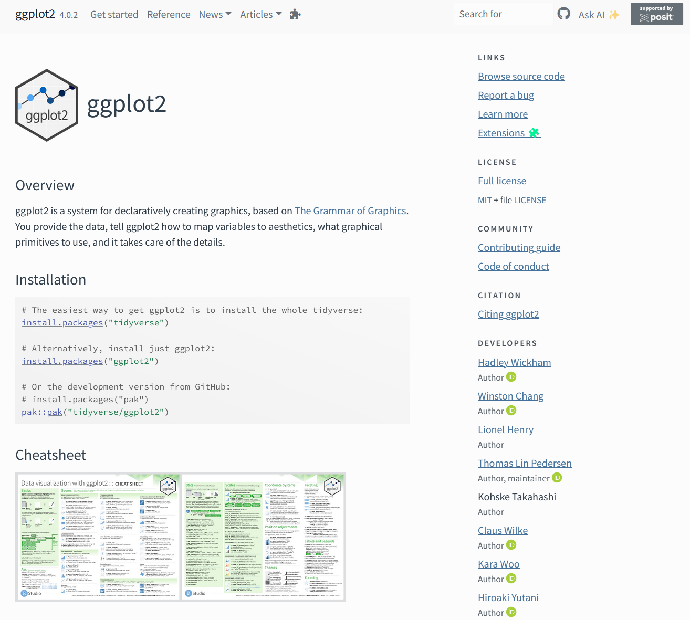

ggplot2 logo

Why ggplot2 is so popular:

- Declarative and readable
- Easy to extend and modify
- Produces publication-quality figures
- Works perfectly with tidy data
- Excellent support for statistical graphics

ggplot2 has also an official extension mechanism which means that others
can now easily create their own stats, geoms and positions, and provide
them in other packages. You can find more information from here:

<https://exts.ggplot2.tidyverse.org/ggiraph.html>

Please, take a look also to this webpage:

<https://github.com/erikgahner/awesome-ggplot2>

### Core idea: “Grammar of Graphics”

Instead of choosing a plot type (like “bar plot” or “scatter plot”)
directly, ggplot2 builds plots by combining components (“layers”):

- Data – what you want to plot
- Aesthetics (aes) – how variables map to visuals (x, y, color, size, …)
- Geoms – what geometric objects to draw (points, lines, bars, …)
- Scales – how values map to colors, sizes, axes
- Facets – splitting plots into panels
- Themes – visual appearance (fonts, background, gridlines)

You add these components together using +.

### A simple example

Every ggplot2 plot has three key components:

- data,
- A set of aesthetic mappings between variables in the data and visual
  properties, and
- At least one layer which describes how to render each observation.
  Layers are usually created with a geom function.

``` r
library(ggplot2)
ggplot(mtcars, aes(x = wt, y = mpg)) +
  geom_point()
```

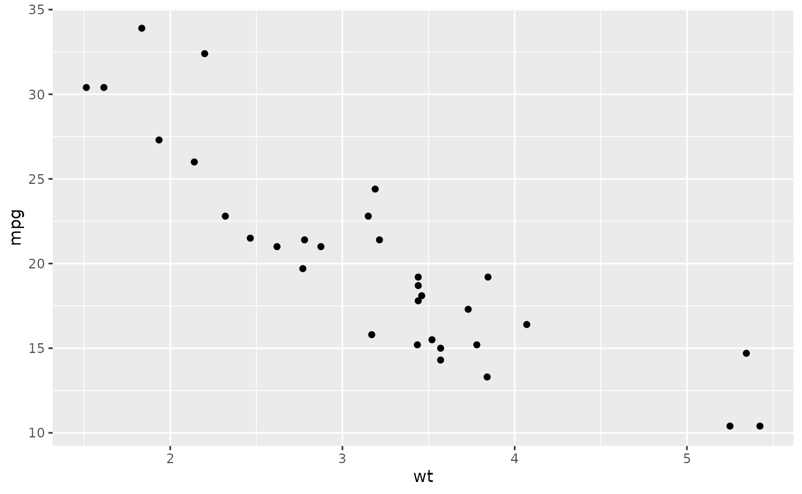

This produces a scatterplot defined by:

- Data - mtcars
- Aesthetic mapping: engine size mapped to x position (wt), fuel economy
  to y position (mpg).
- Layer - Geom: points (scatter plot)

Pay attention to the structure of this function call: data and aesthetic
mappings are supplied in ggplot(), then layers are added on with +. This
is an important pattern, and as you learn more about ggplot2 you’ll
construct increasingly sophisticated plots by adding on more types of
components.

Almost every plot maps a variable to x and y, so naming these aesthetics
is tedious, so the first two unnamed arguments to aes() will be mapped
to x and y. This means that the following code is identical to the
example above:

    ggplot(mpg, aes(displ, hwy)) +
      geom_point()

### Adding more layers

``` r
ggplot(mtcars, aes(wt, mpg)) +
  geom_point() +
  geom_smooth(method = "lm") +
  labs(
    title = "Fuel efficiency vs car weight",
    x = "Weight",
    y = "Miles per gallon")
#> `geom_smooth()` using formula = 'y ~ x'
```

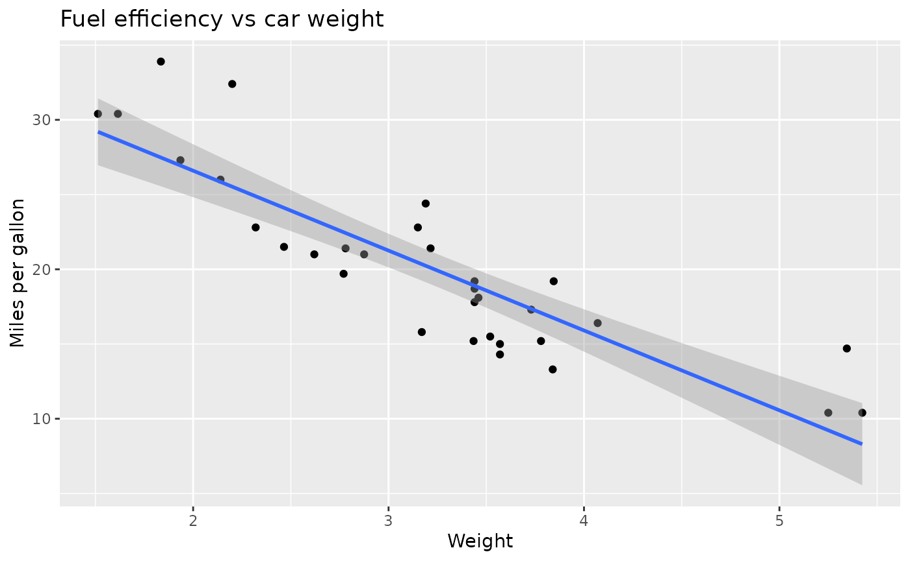

Here you extend the same plot by:

- adding a regression line
- adding labels

Plot geoms

- geom_smooth() fits a smoother to the data and displays the smooth and
  its standard error.
- geom_boxplot() produces a box-and-whisker plot to summarise the
  distribution of a set of points.
- geom_histogram() and geom_freqpoly() show the distribution of
  continuous variables.
- geom_bar() shows the distribution of categorical variables.
- geom_path() and geom_line() draw lines between the data points. A line
  plot is constrained to produce lines that travel from left to right,
  while paths can go in any direction. Lines are typically used to
  explore how things change over time.

Note that different geoms can use the same data and aesthetics! Multiple
geoms can be layered like in this example:

``` r
ggplot(mpg, aes(displ, hwy)) + 
  geom_point() + 
  geom_smooth()
#> `geom_smooth()` using method = 'loess' and formula = 'y ~ x'
```

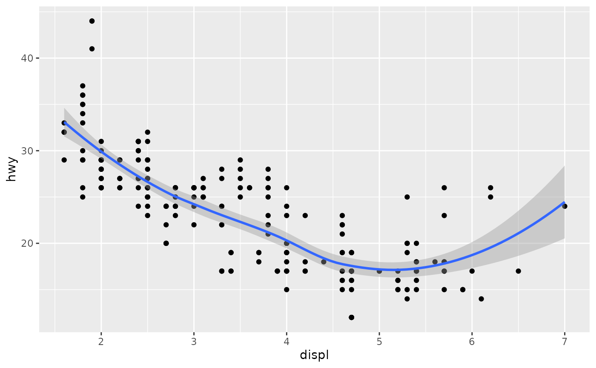

``` r
#> `geom_smooth()` using method = 'loess' and formula = 'y ~ x'
```

This overlays the scatterplot with a smooth curve, including an
assessment of uncertainty in the form of point-wise confidence intervals
shown in grey. If you’re not interested in the confidence interval, turn
it off with geom_smooth(se = FALSE).

An important argument to geom_smooth() is the method, which allows you
to choose which type of model is used to fit the smooth curve:

- method = “loess”, the default for small n, uses a smooth local
  regression (as described in ?loess). The wiggliness of the line is
  controlled by the span parameter, which ranges from 0 (exceedingly
  wiggly) to 1 (not so wiggly).

``` r
ggplot(mpg, aes(displ, hwy)) + 
  geom_point() + 
  geom_smooth(span = 0.2)
#> `geom_smooth()` using method = 'loess' and formula = 'y ~ x'
```

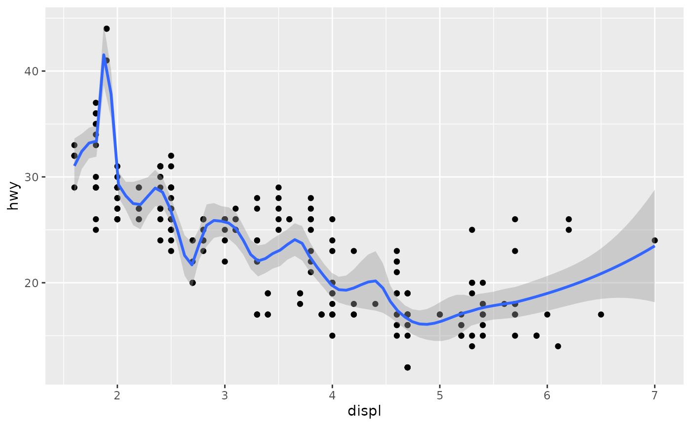

``` r
#> `geom_smooth()` using method = 'loess' and formula = 'y ~ x'
```

``` r
ggplot(mpg, aes(displ, hwy)) + 
  geom_point() + 
  geom_smooth(span = 1)
#> `geom_smooth()` using method = 'loess' and formula = 'y ~ x'
```

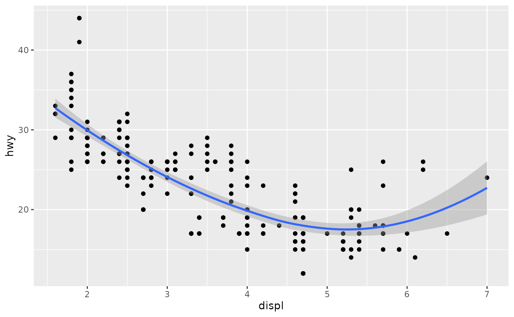

``` r
#> `geom_smooth()` using method = 'loess' and formula = 'y ~ x'
```

- method = “gam” fits a generalised additive model provided by the mgcv
  package. You need to first load mgcv, then use a formula like formula
  = y ~ s(x) or y ~ s(x, bs = “cs”) (for large data). This is what
  ggplot2 uses when there are more than 1,000 points.

``` r
library(mgcv)
#> Loading required package: nlme
#> 
#> Attaching package: 'nlme'
#> The following object is masked from 'package:dplyr':
#> 
#>     collapse
#> This is mgcv 1.9-4. For overview type '?mgcv'.
ggplot(mpg, aes(displ, hwy)) + 
  geom_point() + 
  geom_smooth(method = "gam", formula = y ~ s(x))
```

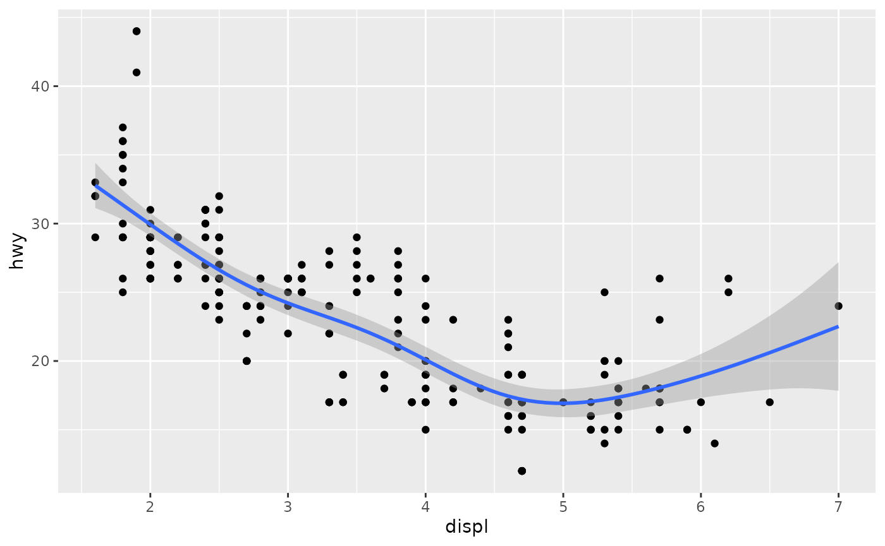

### Boxplots and jittered points

When a set of data includes a categorical variable and one or more
continuous variables, you will probably be interested to know how the
values of the continuous variables vary with the levels of the
categorical variable.

There are three useful techniques that help to visualise a categorical
variable and one continuous variable:

- Jittering, geom_jitter(), adds a little random noise to the data which
  can help avoid overplotting.
- Boxplots, geom_boxplot(), summarise the shape of the distribution with
  a handful of summary statistics.
- Violin plots, geom_violin(), show a compact representation of the
  “density” of the distribution, highlighting the areas where more
  points are found.

These are illustrated below:

``` r
ggplot(mpg, aes(drv, hwy)) + geom_jitter()
```

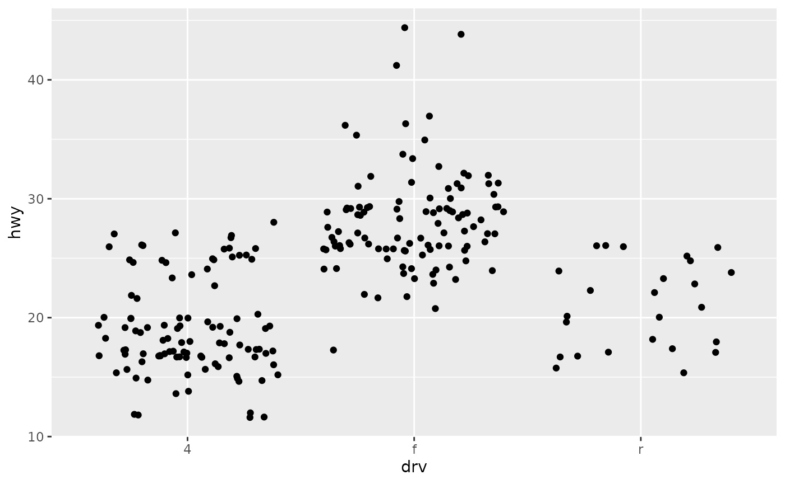

``` r
ggplot(mpg, aes(drv, hwy)) + geom_boxplot()
```

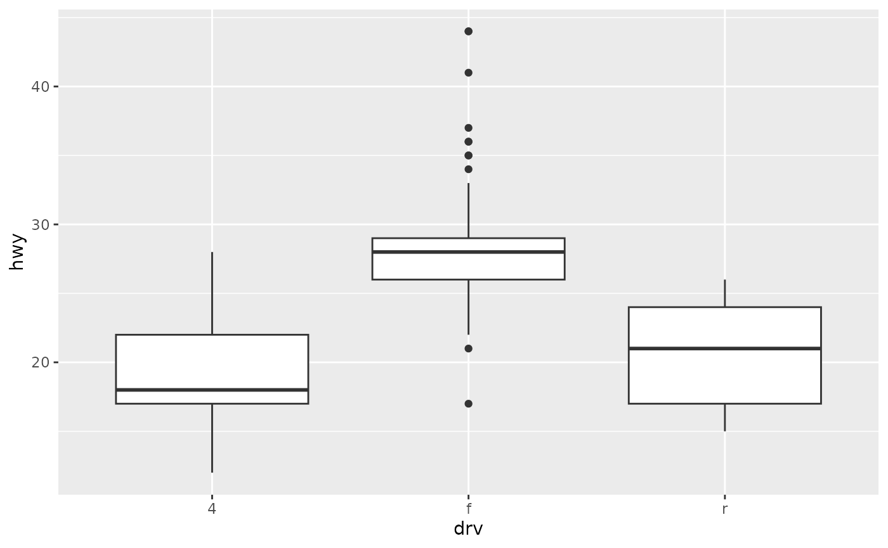

``` r
ggplot(mpg, aes(drv, hwy)) + geom_violin()
```

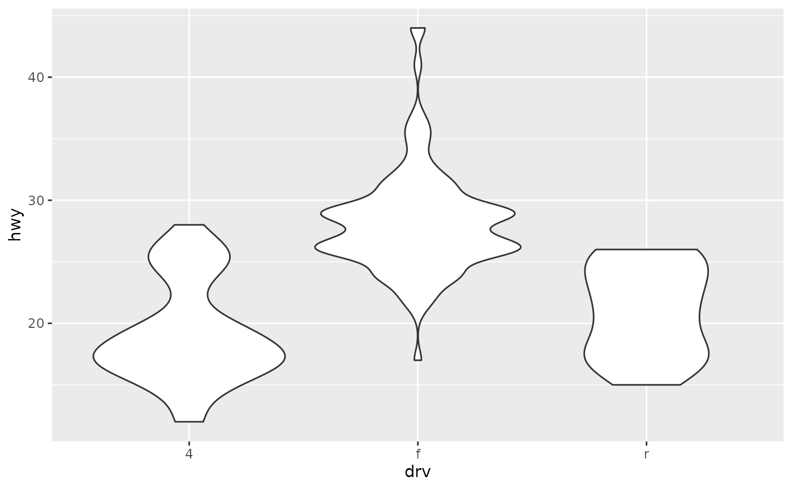

### Histograms and frequency polygons

Histograms and frequency polygons show the distribution of a single
numeric variable. They provide more information about the distribution
of a single group than boxplots do, at the expense of needing more
space.

``` r
ggplot(mpg, aes(hwy)) + geom_histogram()
#> `stat_bin()` using `bins = 30`. Pick better value `binwidth`.
```

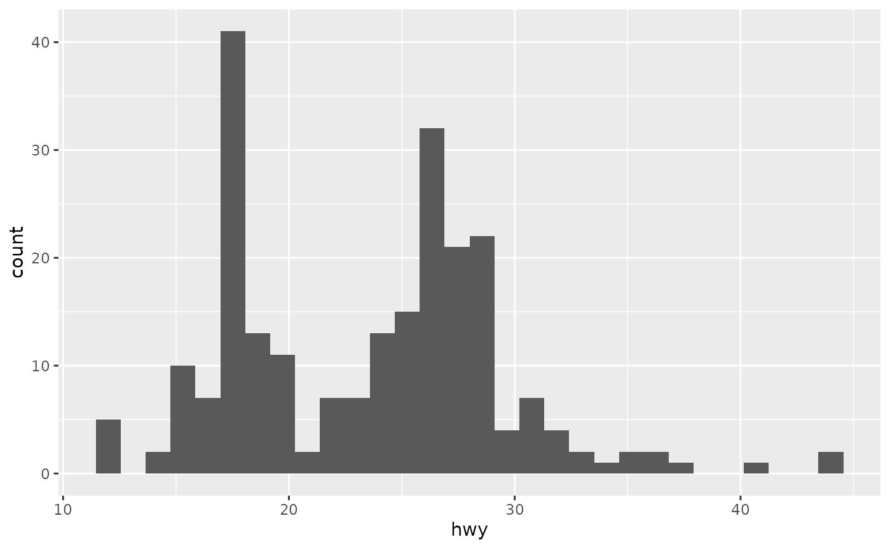

``` r
#> `stat_bin()` using `bins = 30`. Pick better value `binwidth`.
```

``` r
ggplot(mpg, aes(hwy)) + geom_freqpoly()
#> `stat_bin()` using `bins = 30`. Pick better value `binwidth`.
```

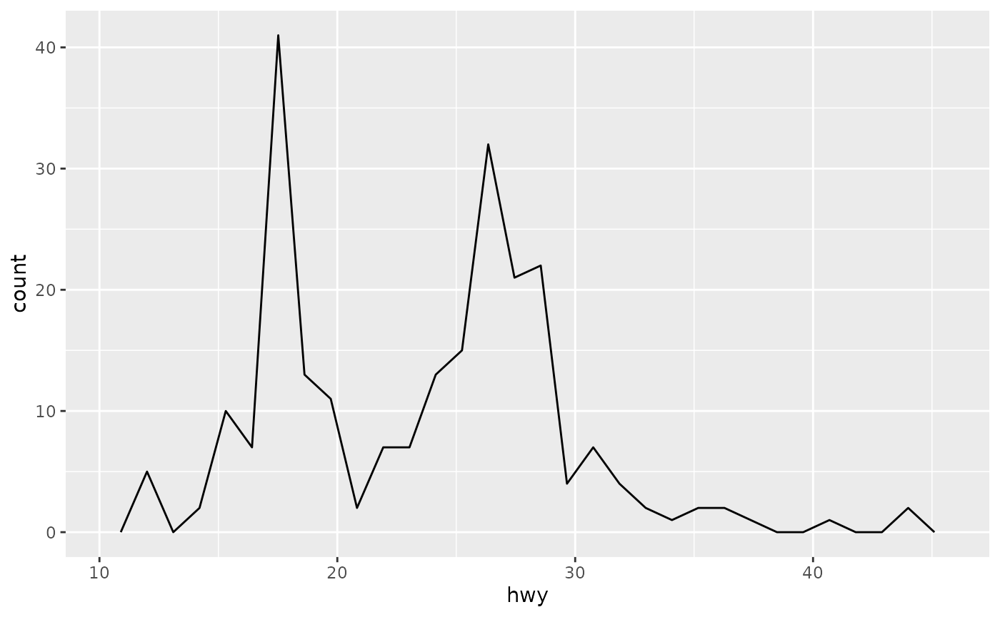

``` r
#> `stat_bin()` using `bins = 30`. Pick better value `binwidth`.
```

Both histograms and frequency polygons work in the same way: they bin
the data, then count the number of observations in each bin. The only
difference is the display: histograms use bars and frequency polygons
use lines.

### Bar charts

The discrete analogue of the histogram is the bar chart, geom_bar().
It’s easy to use:

``` r
ggplot(mpg, aes(manufacturer)) + 
  geom_bar()
```

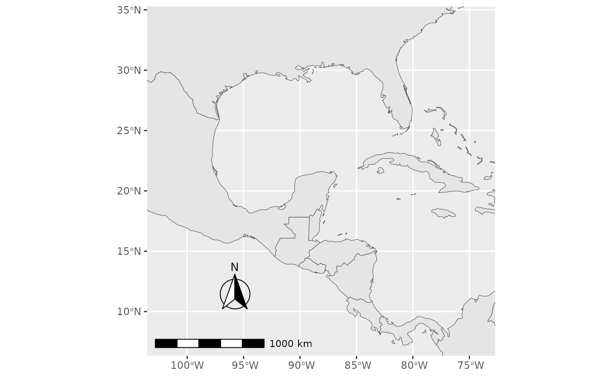

### Time series with line

Line and path plots are typically used for time series data. Line plots
join the points from left to right, while path plots join them in the
order that they appear in the dataset (in other words, a line plot is a
path plot of the data sorted by x value). Line plots usually have time
on the x-axis, showing how a single variable has changed over time. Path
plots show how two variables have simultaneously changed over time, with
time encoded in the way that observations are connected.

Because the year variable in the mpg dataset only has two values, we’ll
show some time series plots using the economics dataset, which contains
economic data on the US measured over the last 40 years.

The figures below shows two plots of unemployment over time, both
produced using geom_line(). The first shows the unemployment rate while
the second shows the median number of weeks unemployed. We can already
see some differences in these two variables, particularly in the last
peak, where the unemployment percentage is lower than it was in the
preceding peaks, but the length of unemployment is high.

``` r
ggplot(economics, aes(date, unemploy / pop)) +
  geom_line()
```

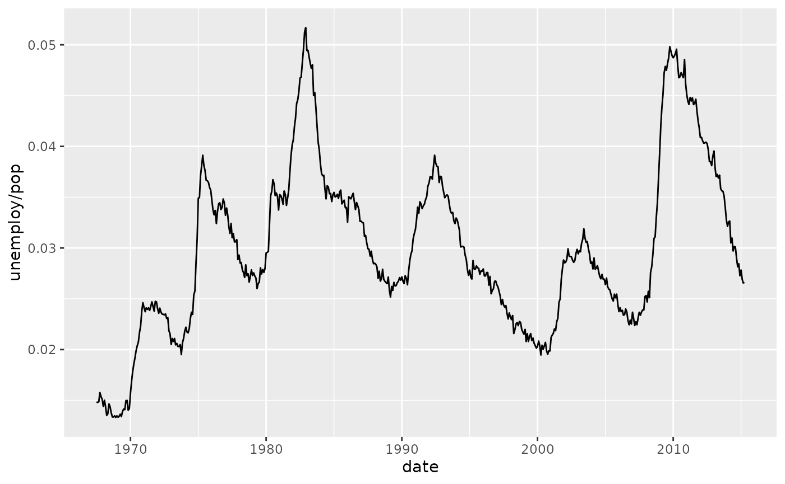

``` r
ggplot(economics, aes(date, uempmed)) +
  geom_line()
```

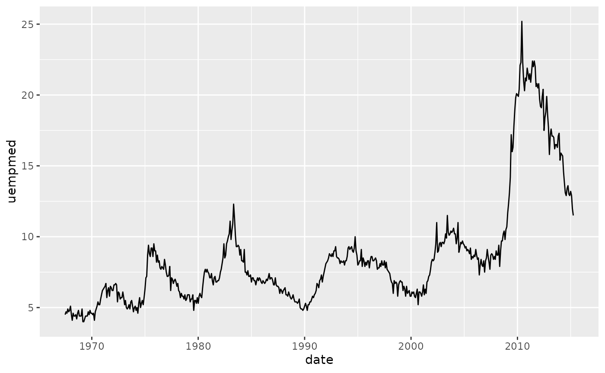

### How it differs from base R plots

Base R plotting

- Procedural
- “Draw now, modify later”
- Plot type chosen first (plot, hist, boxplot)

ggplot2

- Declarative
- “Describe what to plot”
- Visualization built from components

Base R:

``` r
plot(mtcars$wt, mtcars$mpg)
```


ggplot2:

``` r
ggplot(mtcars, aes(wt, mpg)) + geom_point()
```


ggplot2 is:

- more structured
- more consistent
- easier to build complex plots incrementally

See more information about ggplot2 from this fantastic book: “ggplot2:
elegant graphics for data analysis”

<https://ggplot2-book.org/>

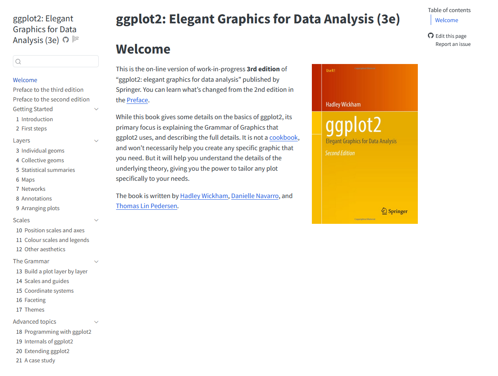

ggplot2 logo

### An introduction to data visualization using R programming

## Creating maps with ggplot2

Recently, the package ggplot2 has allowed the use of simple features
from the package sf as layers in a graph. The combination of ggplot2 and
sf therefore enables to programmatically create maps, using the grammar
of graphics, just as informative or visually appealing as traditional
GIS software.

Let´s start by loading the basic packages necessary for all maps,
i.e. ggplot2 and sf.

``` r
library("ggplot2")
library("sf")
#> Linking to GEOS 3.12.1, GDAL 3.8.4, PROJ 9.4.0; sf_use_s2() is TRUE
```

The package rnaturalearth provides a map of countries of the entire
world. Use ne_countries to pull country data and choose the scale
(rnaturalearthhires is necessary for scale = “large”). The function can
return sp classes (default) or directly sf classes, as defined in the
argument return class:

``` r
library("rnaturalearth")
library("rnaturalearthdata")
#> 
#> Attaching package: 'rnaturalearthdata'
#> The following object is masked from 'package:rnaturalearth':
#> 
#>     countries110

world <- ne_countries(scale = "medium", returnclass = "sf")
class(world)
#> [1] "sf"         "data.frame"
```

#### Basic plot

First, let us start with creating a base map of the world using ggplot2.
This base map will then be extended with different map elements, as well
as zoomed in to an area of interest. We can check that the world map was
properly retrieved and converted into an sf object, and plot it with
ggplot2:

``` r
ggplot(data = world) +
    geom_sf()
```

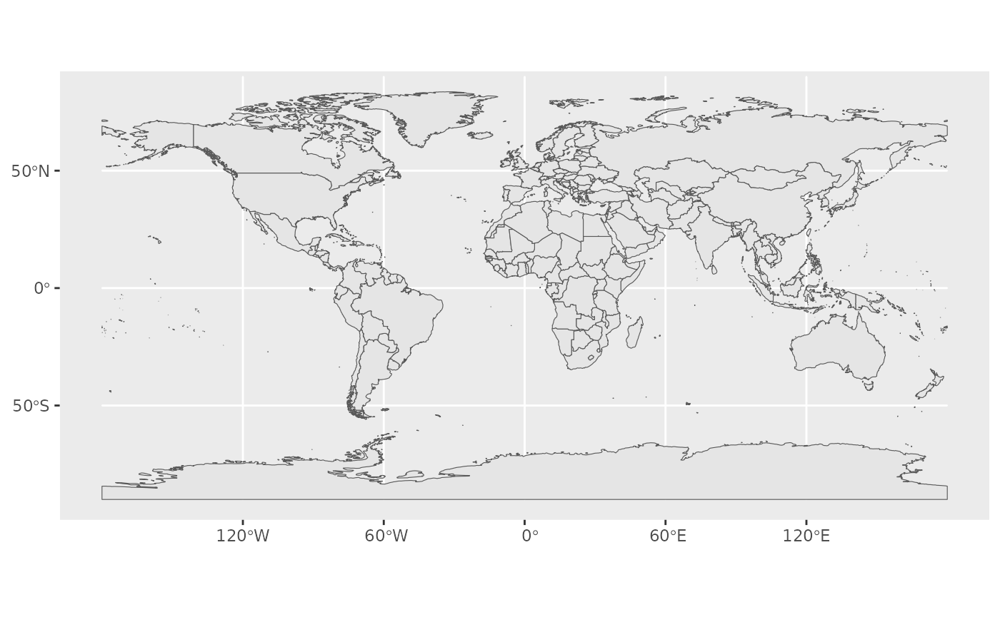

This call nicely introduces the structure of a ggplot call: The first
part ggplot(data = world) initiates the ggplot graph, and indicates that
the main data is stored in the world object. The line ends up with a +
sign, which indicates that the call is not complete yet, and each
subsequent line correspond to another layer or scale.

In this case, we use the geom_sf function, which simply adds a geometry
stored in a sf object.

### Title, subtitle, and axis labels

A title and a subtitle can be added to the map using the function
ggtitle, passing any valid character string (e.g. with quotation marks)
as arguments. Axis names are absent by default on a map, but can be
changed to something more suitable (e.g. “Longitude” and “Latitude”),
depending on the map:

``` r
ggplot(data = world) +
    geom_sf() +
    xlab("Longitude") + ylab("Latitude") +
    ggtitle("World map", subtitle = paste0("(", length(unique(world$NAME)), " countries)"))
```


### Map color

In many ways, sf geometries are no different than regular geometries,
and can be displayed with the same level of control on their attributes.
Here is an example with the polygons of the countries filled with a
green color (argument fill), using black for the outline of the
countries (argument color):

``` r
ggplot(data = world) + 
    geom_sf(color = "black", fill = "lightgreen")
```

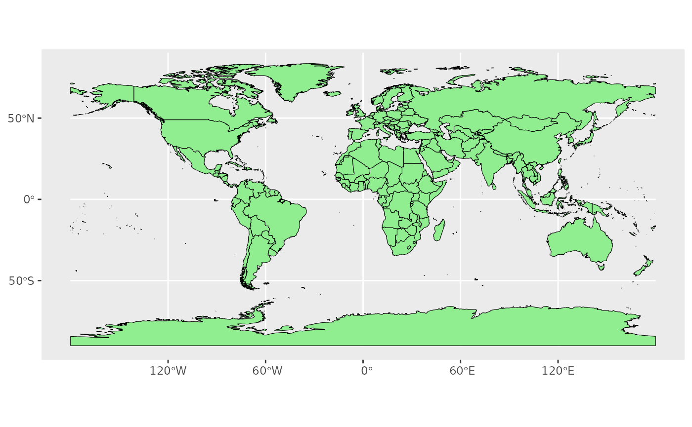

The package ggplot2 allows the use of more complex color schemes, such
as a gradient on one variable of the data. Here is another example that
shows the population of each country. In this example, we use the
“viridis” colorblind-friendly palette for the color gradient (with
option = “plasma” for the plasma variant), using the square root of the
population (which is stored in the variable POP_EST of the world
object):

``` r
ggplot(data = world) +
    geom_sf(aes(fill = pop_est)) +
    scale_fill_viridis_c(option = "plasma", trans = "sqrt")
```

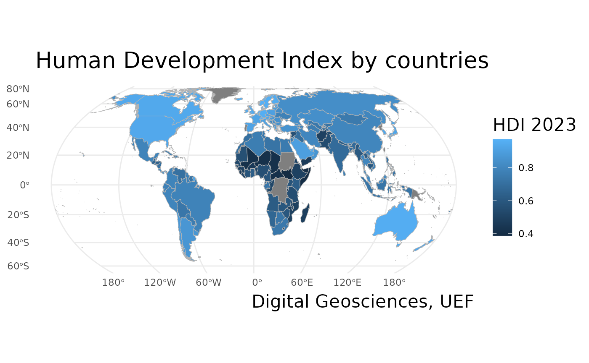

### Projection and extent

The function coord_sf allows to deal with the coordinate system, which
includes both projection and extent of the map. By default, the map will
use the coordinate system of the first layer that defines one
(i.e. scanned in the order provided), or if none, fall back on WGS84
(latitude/longitude, the reference system used in GPS). Using the
argument crs, it is possible to override this setting, and project on
the fly to any projection. This can be achieved using any valid PROJ4
string (here, the European-centric ETRS89 Lambert Azimuthal Equal-Area
projection):

``` r
ggplot(data = world) +
    geom_sf() +
    coord_sf(crs = "+proj=laea +lat_0=52 +lon_0=10 +x_0=4321000 +y_0=3210000 +ellps=GRS80 +units=m +no_defs ")
```

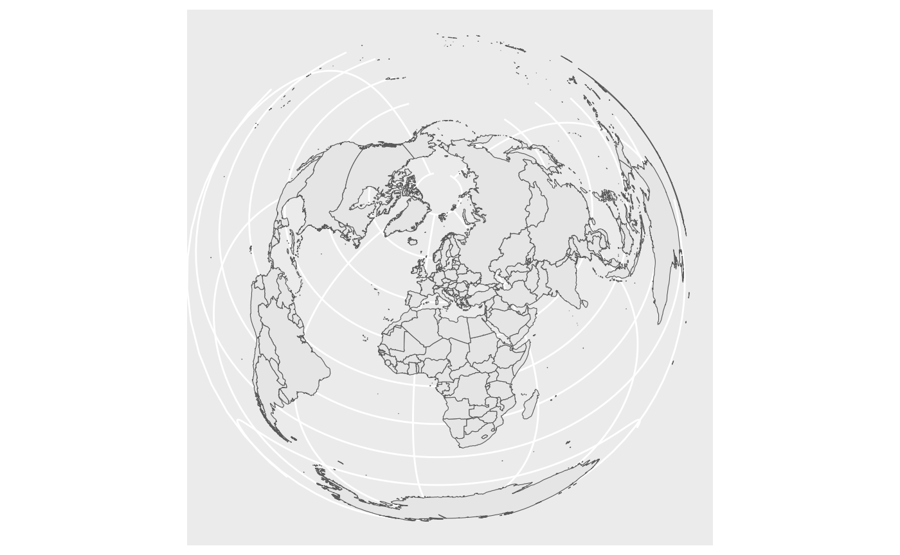

### Scale bar and North arrow

Scale bar and north arrow can be added on map with the package
ggspatial, which provides easy-to-use functions for this purpose.

``` r
library("ggspatial")
ggplot(data = world) +
    geom_sf() +
    annotation_scale(location = "bl", width_hint = 0.5) +
    annotation_north_arrow(location = "bl", which_north = "true", 
        pad_x = unit(0.75, "in"), pad_y = unit(0.5, "in"),
        style = north_arrow_fancy_orienteering) +
    coord_sf(xlim = c(-102.15, -74.12), ylim = c(7.65, 33.97))
#> Scale on map varies by more than 10%, scale bar may be inaccurate
```

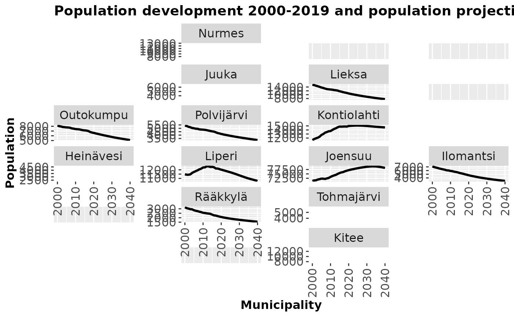

These lines add a scale bar:

    annotation_scale(location = "bl", width_hint = 0.5) +

Arguments explained:

- location = “bl”

- bottom-left corner of the map

- options include “bl”, “br”, “tl”, “tr”

- width_hint = 0.5

- scale bar will take about half the width of the plot

- it is only a hint, not an exact measurement

These lines add a north arrow:

    annotation_north_arrow(
      location = "bl",
      which_north = "true",
      pad_x = unit(0.75, "in"),
      pad_y = unit(0.5, "in"),
      style = north_arrow_fancy_orienteering
    ) 

Key parameters:

Position:

- location = “bl” - bottom-left

- pad_x, pad_y - spacing from plot edges

- measured in inches

- prevents overlap with the scale bar

Direction:

- which_north = “true”
- arrow points to true north

Style:

- style = north_arrow_fancy_orienteering

- a decorative, compass-style arrow

- ggspatial provides several built-in styles

This part of the code:

    coord_sf(
      xlim = c(-102.15, -74.12),
      ylim = c(7.65, 33.97)
    )

- Limits the visible map area
- Uses longitude (xlim) and latitude (ylim)
- Does not change the data itself, only what you see

### Saving the map

Saving of the map is very easy by using ggsave. This function allows a
graphic (typically the last plot displayed) to be saved in a variety of
formats, including the most common PNG (raster bitmap) and PDF (vector
graphics), with control over the size and resolution of the outcome.

For instance here, we save a PDF version of the map, which keeps the
best quality, and a PNG version of it for web purposes:

``` r
ggsave("map_web.png", width = 6, height = 6, dpi = "screen")
```

### Add another data

Let´s load required packages:

``` r
library(dplyr)
library(countrycode)
```

``` r
library(spatialcourseOL)
data(HDI_data)

head(HDI_data)
```

The ISO3C code is appended to the HDI_data2 dataset based on the country
name. (note that we create here a new dataset HDI_data2)

``` r
HDI_data2 <- HDI_data %>%
  mutate(iso3 = countrycode(Country, "country.name", "iso3c"))
#> Warning: There was 1 warning in `mutate()`.
#> ℹ In argument: `iso3 = countrycode(Country, "country.name", "iso3c")`.
#> Caused by warning:
#> ! Some values were not matched unambiguously: Micronesia
#> To fix unmatched values, please use the `custom_match` argument. If you think the default matching rules should be improved, please file an issue at https://github.com/vincentarelbundock/countrycode/issues
```

Next, the world and hdi_country2 datasets are merged by using
left_join() function:

``` r
joined <- world %>%
  left_join(
    HDI_data2,
    by = c("adm0_iso" = "iso3"))
#> Warning in sf_column %in% names(g): Detected an unexpected many-to-many relationship between `x` and `y`.
#> ℹ Row 193 of `x` matches multiple rows in `y`.
#> ℹ Row 192 of `y` matches multiple rows in `x`.
#> ℹ If a many-to-many relationship is expected, set `relationship =
#>   "many-to-many"` to silence this warning.
```

Let´s then make a new map:

``` r
ggplot() +
  geom_sf(
    data = joined,
    aes(fill = HDI_2023),
    color = "grey70",
    linewidth = 0.2) +
  scale_fill_viridis_c(
    option = "plasma",
    na.value = "grey85",
    name = "HDI (2023)") +
  coord_sf(expand = FALSE) +
  labs(title = "Human Development Index by countries") +
  theme_minimal()
```

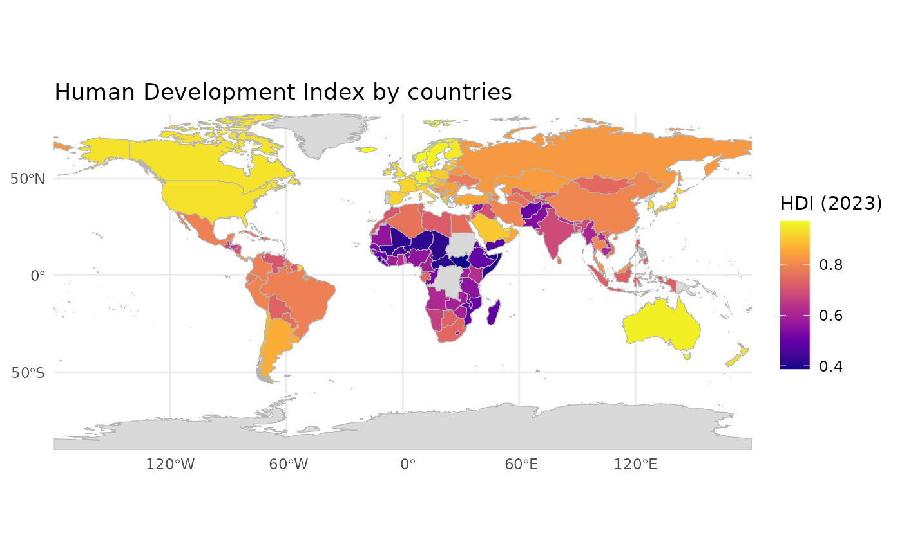

Remove Antarctica and make a new map:

``` r
joined2<-joined |> dplyr::filter(continent != "Antarctica")
```

``` r
ggplot() +
  geom_sf(
    data = joined2,
    aes(fill = HDI_2023),
    color = "grey70",
    linewidth = 0.2) +
  scale_fill_viridis_c(
    option = "plasma",
    na.value = "grey85",
    name = "HDI (2023)") +
  coord_sf(expand = FALSE) +
  labs(title = "Human Development Index by countries") +
  theme_minimal() 
```

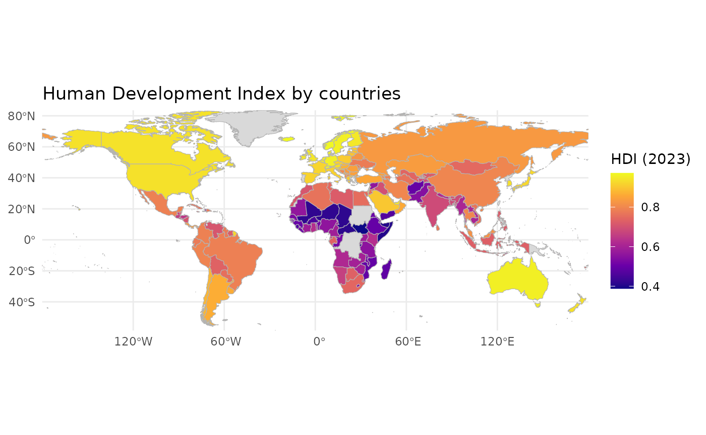

The coordinate reference system is improved by adding coord_sf(crs =
“+proj=robin”).

``` r
ggplot() +
  geom_sf(
    data = joined,
    aes(fill = HDI_2023),
    color = "grey70",
    linewidth = 0.2
  ) +
  coord_sf(crs = "+proj=eqearth") +
  theme_minimal()
```

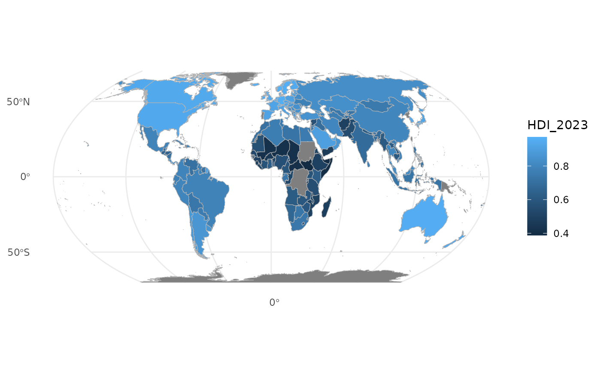

You can also add title and caption:

``` r
ggplot() +
  geom_sf(
    data = joined2,
    aes(fill = HDI_2023),
    color = "grey70",
    linewidth = 0.2
  ) +
  coord_sf(crs = "+proj=eqearth") +
  theme_minimal() + labs(title = "Human Development Index by countries") +
  labs(fill = "HDI 2023") +
  labs(caption="Digital Geosciences, UEF") +
  theme(legend.title = element_text(size=16)) + theme(plot.title = element_text(size = 20))+
  theme(plot.caption = element_text(size=16) )
```


## Working with ggplot2: Population development of the municipality categories

``` r
data(pop_category)
```

``` r
group.labs <- c("Sparsely populate", "Urban", "Rural close to urban", "Core rural")
names(group.labs) <- c("Harvaan asuttu maaseutu","Kaupungit","Kaupunkien läh. maaseutu", "Ydinmaaseutu")
```

``` r
plot1<-ggplot(pop_category, aes(Year, weight=value, fill=Variable))+ 
  geom_bar(binwidth=1, color="gray", size=0.25) + 
  facet_wrap(~Category, scales = "free_y", ncol = 2, labeller = labeller(Group.2=group.labs)) +
  theme_minimal() +
  scale_fill_tableau("Tableau 20", labels=c("Natural population change","Net immigration","Net migration")) +
  theme(legend.position = "bottom") + guides(col=guide_legend(ncol=2))+
  theme(axis.text.x = element_text(color = "grey20", size = 10, angle = 90, hjust = .5, vjust = .5, face = "plain"),
        axis.text.y = element_text(color = "grey20", size = 12, angle = 0, hjust = 1, vjust = 0, face = "plain"),  
        axis.title.x = element_text(color = "grey20", size = 12, angle = 0, hjust = .5, vjust = 0, face = "plain"),
        axis.title.y = element_text(color = "grey20", size = 12, angle = 90, hjust = .5, vjust = .5, face = "plain"),
        strip.text = element_text(size = 14)) +
  theme(legend.text=element_text(size=14)) +
  labs(fill="Population development")+
  labs(title="Population development in municipality categories", 
       x="Year", y="Change, person",
       caption="Data: Statistics Finland 2023") +
  scale_x_continuous(breaks = seq(1993,2022,1))+
  theme(legend.title = element_text(size=14)) + theme(plot.title = element_text(size = 16))
#> Warning in geom_bar(binwidth = 1, color = "gray", size = 0.25): Ignoring
#> unknown parameters: `binwidth` and `size`
```

Let’s call plot1 object:

``` r
plot1
```

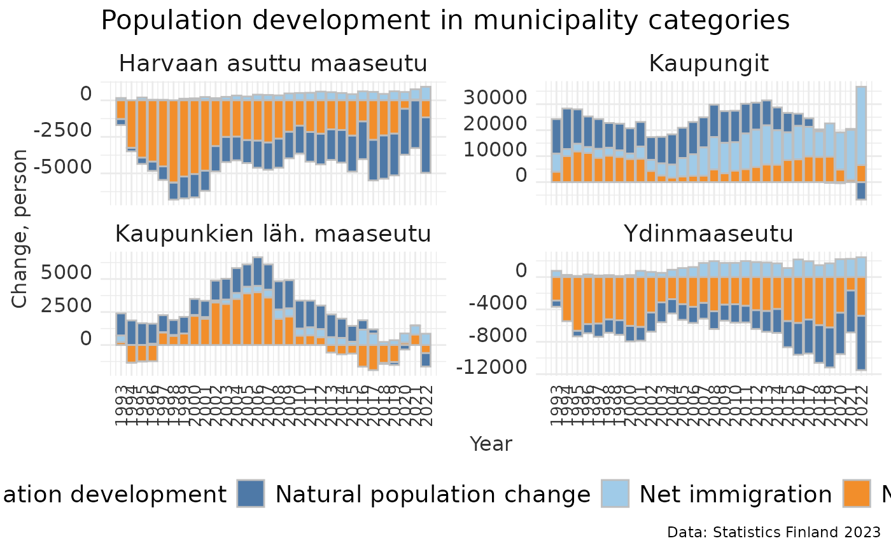

### Adding a simple map to the plot

Load packages used in this example:

``` r
library(ggplot2)
library(geofi)
library(dplyr)
```

Let’s load data from different regional divisions.

``` r
data(aluejaot2)
names(aluejaot2)
```

Let’s download a municipality data set with geofi package:

``` r
municipalities <- geofi::get_municipalities(year = 2021)
#> Requesting response from: https://geo.stat.fi/geoserver/wfs?service=WFS&version=1.0.0&request=getFeature&typename=tilastointialueet%3Akunta4500k_2021
#> Warning: Coercing CRS to epsg:3067 (ETRS89 / TM35FIN)
#> 
#> geofi R package: tools for open GIS data for Finland.
#> Part of rOpenGov <ropengov.org>.
#> Version 1.2.1
#> Data is licensed under: Attribution 4.0 International (CC BY 4.0)
municipalities <- municipalities %>% 
  select(kunta, kunta_name)
```

Next we will join data sets with function right_join because it
maintains the class of municipality as sf.

``` r
muni <- dplyr::right_join(x = municipalities, y = aluejaot2, by=c("kunta" = "tunnus"))
```

Let’s define colors for plots:

``` r
red<-"#F8766D"
green <- "#00BA38"
blue <- "#619CFF"
purple <- "#C77CFF"
blue_gray <- "#464a62"
mid_gray <- "#ccd0dd"
light_gray <- "#f9f9fd"
```

and set some global theme defaults

``` r
theme_set(theme_minimal())
theme_update(text = element_text(family = "sans", color = "#464a62"))
theme_update(plot.title = element_text(hjust = 0.5, face = "bold"))
theme_update(plot.subtitle = element_text(hjust = 0.5))
```

Finally we are to draw a map by using ggplot:

``` r
map<-ggplot(muni) +
  geom_sf(aes(fill = Alueluokka_eng), color = light_gray, lwd = 0.08) +
  scale_fill_manual(values = c(red, green, blue, purple), name = "", guide = guide_legend(direction = "horizontal", label.position = "top", keywidth = 3, keyheight = 0.5)) +
  labs(title = "", color="black") +
  theme(panel.grid.major = element_blank(),
        panel.grid.minor = element_blank(),
        axis.text = element_blank(),
        axis.title = element_blank(),
        legend.position = c(0.25,0.60))+
  guides(fill=guide_legend(nrow=4, byrow=T)) +
  theme(legend.text=element_text(size=11)) +
  theme(plot.margin=margin(0,0,0,0,"cm")) 
```

### Combining a map and a graph

``` r
library(patchwork)
map + plot1
```

## Working with ggplot2: Population development of the municipalities

### 1. Installing and loading R packages

What is an R package? An R package is a collection of functions,
datasets, and documentation that extends what R can do. Base R is fairly
minimal; most real data analysis uses packages.

Loading commonly used packages

``` r
library(forecast)
#> 
#> Attaching package: 'forecast'
#> The following object is masked from 'package:nlme':
#> 
#>     getResponse
library(foreign)
library(reshape2)
library(ggplot2)
library(zoo)
#> 
#> Attaching package: 'zoo'
#> The following objects are masked from 'package:base':
#> 
#>     as.Date, as.Date.numeric
library(scales)
library(dplyr)
library(ggthemes)
```

Installing and loading additional packages

``` r
install.packages("geofacet")
```

``` r
library(geofacet)
```

geofacet is used for geographical faceting (e.g. small multiples laid
out like a map).

Explanation:

- install.packages() downloads the package from CRAN
- You only need to install a package once
- library() must be run every session

Installing a package from GitHub

``` r
remotes::install_github("ropengov/geofi")
```

``` r
library(geofi)
```

Explanation:

- Some packages are not on CRAN
- install_github() installs directly from GitHub
- geofi provides Finnish municipality and regional data

Note! This requires the remotes package to be installed.

### 2. Reading data into R

``` r
library(spatialcourseOL)
```

Reading datasets:

``` r
data(aluejaot2)
head(aluejaot2)
```

Explanation:

- read.csv() loads a CSV file into R as a data frame
- sep = “,” specifies comma‑separated values
- encoding = “UTF-8” ensures correct character encoding (important for
  Finnish characters)
- stringsAsFactors = FALSE keeps text variables as character strings
- names(dat) shows column names of the dat object

Reading a second dataset

``` r
data(data_vakie3)
head(data_vakie3)
```

### 3. Merging datasets

``` r
x2 <- merge(data_vakie3, aluejaot2, by.x="tunnus", by.y="tunnus",all.x=T)
```

Explanation:

- merge() combines two datasets
- by.x and by.y specify the id variable which is found from both of
  datasets (here id is tunnus)
- all.x = TRUE keeps all rows from data (left join)

### 4. Reshaping the data (wide → long)

``` r
data2 <- melt(data = x2, id.vars = c("tunnus", "nimi","Maakunta"), measure.vars = c(3:43))
```

Many datasets are initially in wide format:


melt():

- Keeps identifier variables (id.vars)
- Converts columns 3–43 into: a variable column and a value column

As a results, data2 is suitable for ggplot2 and time‑series analysis.

### 5. Creating a time variable

``` r
aika <- seq(2000,2040,1)
aika
#>  [1] 2000 2001 2002 2003 2004 2005 2006 2007 2008 2009 2010 2011 2012 2013 2014
#> [16] 2015 2016 2017 2018 2019 2020 2021 2022 2023 2024 2025 2026 2027 2028 2029
#> [31] 2030 2031 2032 2033 2034 2035 2036 2037 2038 2039 2040
```

Explanation:

- seq() creates a sequence of numbers
- Here: years from 2000 to 2040
- Step size = 1 year

This vector can be used as:

- A time axis
- A reference for plotting
- Indexing years

### 6. Creating a repeated time variable

``` r
b <- rep(aika,310)
```

Explanation:

- aika is a vector of years (2000–2040)
- rep() repeats this vector 310 times
- The result is a long vector where the time sequence is repeated for
  each spatial unit (e.g. municipality or region)

Why this is needed?

After reshaping the data into long format, we need a time variable that
matches the number of rows in the dataset.

Conceptually:

- Each region has values for every year
- b assigns the correct year to each observation

### 7. Sorting the data by region name

``` r
data3 <- data2[order(data2$nimi),]
```

Explanation:

- order(data2\$nimi) sorts rows alphabetically by region name (nimi)
- The brackets \[ , \] reorder the rows accordingly

Why this matters?

- Ensures that time series are properly aligned
- Matches the structure of the repeated time vector (b)
- Prevents mismatch between years and regions

This step is crucial for correct time–region alignment.

### 8. Adding the time variable to the data

``` r
data4 <- cbind(data3,b)
names(data4)
#> [1] "tunnus"   "nimi"     "Maakunta" "variable" "value"    "b"
```

Explanation:

- cbind() binds a new column to the dataset
- The new column b represents time (years)
- names(data4) checks that the column was added correctly

### 9. Converting values to numeric

``` r
data4$value <- as.numeric(data4$value)
```

Explanation:

- After melt(), values are often stored as characters
- as.numeric() converts them into numeric values

Why this is important?

- Mathematical operations (sum, mean, plots) require numeric data
- Without this step, aggregation would fail or give errors

### 10. Aggregating data by year, region, and province

``` r
data5 <- aggregate(data4$value, by=list(data4$b,data4$nimi, data4$Maakunta),FUN=sum)
```

Explanation: This step summarizes the data.

- aggregate() groups observations

- Grouping variables:

- data4\$b → year

- data4\$nimi → region

- data4\$Maakunta → province

- FUN = sum → sums values within each group

Conceptually: This produces one value per year per region, suitable for:

- time‑series analysis
- plotting trends
- regional comparisons

The output columns will be named:

- Group.1 → year
- Group.2 → region name
- Group.3 → province
- x → aggregated value

### 11. Checking dataset dimensions

``` r
dim(data5)
#> [1] 12669     4
```

Explanation:

dim() reports:

- number of rows
- number of columns

Why this matters?

- Confirms that aggregation worked as expected
- Useful for sanity checking before analysis or plotting

### 12. Subsetting one province

``` r
vs <- subset(data5, Group.3=="Pohjois-Karjala")
```

Explanation:

- subset() filters the data
- Keeps only rows where the province is Pohjois‑Karjala

Result: vs contains only regional time series for North Karelia

Ready for:

- regional plots
- comparisons
- focused analysis

### 13. Visualising regional population development with ggplot2

#### Facetting

Faceting means splitting one plot into multiple small plots, each
showing a subset of the data, but:

- using the same variables
- the same geoms
- the same aesthetics

Think of it as: “Draw the same plot many times, once for each group.”

This is extremely useful when you want to:

- compare groups
- see patterns that would be hidden if everything were overlaid
- teach students how trends differ across categories

In ggplot2, the two main faceting functions are:

- facet_wrap() - One grouping variable
- facet_grid() - Two grouping variables (rows × columns)

### 14. What is faceting in ggplot2?

Faceting means splitting one plot into multiple small plots, each
showing a subset of the data, but:

- using the same variables
- the same geoms
- the same aesthetics

``` r
ggplot(vs, aes(x=Group.1, y=x))+
  geom_line(linewidth=1) +
  theme(axis.text.x=element_text(angle=90, vjust=0.5,hjust=1)) +
  facet_wrap(facets = ~Group.2, scales = "free_y") 
```

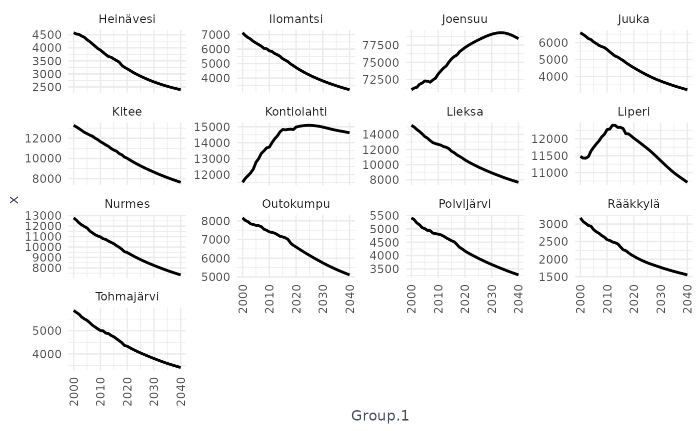

Above code, explained line by line:

    ggplot(vs, aes(x = Group.1, y = x)) +

This initializes the plot

- vs is your data frame
- Group.1 - x-axis (likely year)
- x - y-axis (population or similar variable)

&nbsp;

    geom_line(linewidth = 1) +

Draws a line in each panel

- geom_line() connects points in order of x
- linewidth = 1 makes the line thicker and more readable

&nbsp;

    theme(axis.text.x = element_text(angle = 90, vjust = 0.5, hjust = 1)) +

Rotates x-axis labels

- angle = 90 → vertical labels
- vjust, hjust → alignment adjustments

This is common when x-axis labels are long or many (e.g. years).

    facet_wrap(facets = ~Group.2, scales = "free_y")

This is the key faceting line and it tells ggplot:

“Create one panel for each unique value of Group.2.”

If Group.2 contains municipalities, you get:

- one panel per municipality

If it contains regions or categories:

- one panel per region/category

Internally, ggplot:

- Splits the data by Group.2
- Draws the same plot for each subset
- Arranges the panels automatically in rows and columns

scales = “free_y” — very important:

- Each facet gets its own y-axis scale
- Makes small and large groups equally visible
- Improves readability and comparison of shape (trends)

Basically, the code draws a separate line plot for each value of
Group.2, arranged automatically on the page, with each plot showing how
x changes over Group.1 and using its own y-axis scale.

### 15. facet_geo()

Standard faceting (facet_wrap(), facet_grid()) arranges panels

- alphabetically
- or in rows/columns you choose

This means that “geography” is lost. For example, municipalities in
Finland would appear in an arbitrary order, not reflecting where they
are located.

Function facet_geo() keeps geography visible while still showing one
plot per region.

##### What is facet_geo()?

In simple terms:

- Each facet = one region, positioned to roughly match its real-world
  map location

So instead of this:

    Helsinki | Espoo | Tampere
    Turku    | Oulu  | Kuopio

you get something like:

            Oulu
    Kuopio  Jyväskylä
    Turku   Helsinki

##### How geo_facet works conceptually

You provide two things:

Your data

- Includes a region variable (e.g. municipality)

A geographic grid: A lookup table with:

- region name
- row
- column

Example of a grid (simplified):

``` r
grid_finland <- data.frame(
  municipality = c("Helsinki", "Turku", "Oulu"),
  row = c(3, 4, 1),
  col = c(3, 2, 3)
)
```

This grid tells facet_geo() where each panel should go.

Predefined grids for Finland are available in the geofi package:

<https://ropengov.github.io/geofi/articles/geofi_datasets.html>

``` r
d <- data(package = "geofi")
as_tibble(d$results) |> 
  select(Item,Title) |> 
    filter(grepl("grid", Item)) |> 
  print(n = 100)
#> # A tibble: 22 × 2
#>    Item                   Title                                                 
#>    <chr>                  <chr>                                                 
#>  1 grid_ahvenanmaa        custom geofacet grid for Ahvenanmaa region            
#>  2 grid_etela_karjala     custom geofacet grid for Etelä-Karjala region as in 2…
#>  3 grid_etela_pohjanmaa   custom geofacet grid for Etelä-Pohjanmaa              
#>  4 grid_etela_savo        custom geofacet grid for Etelä-Savo                   
#>  5 grid_hyvinvointialue   custom geofacet grid for Wellbeing services counties  
#>  6 grid_kainuu            custom geofacet grid for Kainuu region                
#>  7 grid_kanta_hame        custom geofacet grid for Kanta-Häme region            
#>  8 grid_keski_pohjanmaa   custom geofacet grid for Keski-Pohjanmaa region       
#>  9 grid_keski_suomi       custom geofacet grid for Keski-Suomi region as in 2020
#> 10 grid_kymenlaakso       custom geofacet grid for Kymenlaakso region           
#> 11 grid_lappi             custom geofacet grid for Lappi region as in 2020      
#> 12 grid_maakunta          custom geofacet grid for regions                      
#> 13 grid_paijat_hame       custom geofacet grid for Päijät-Häme region           
#> 14 grid_pirkanmaa         custom geofacet grid for Pirkanmaa region             
#> 15 grid_pohjanmaa         custom geofacet grid for Pohjanmaa region             
#> 16 grid_pohjois_karjala   custom geofacet grid for Pohjois-Karjala region       
#> 17 grid_pohjois_pohjanmaa custom geofacet grid for Pohjois-Pohjanmaa region     
#> 18 grid_pohjois_savo      custom geofacet grid for Pohjois-Savo region          
#> 19 grid_sairaanhoitop     custom geofacet grid for health care districts        
#> 20 grid_satakunta         custom geofacet grid for Satakunta region             
#> 21 grid_uusimaa           custom geofacet grid for Uusimaa region               
#> 22 grid_varsinais_suomi   custom geofacet grid for Varsinais-Suomi region
```

##### Why it’s good for research

Advantages

- Preserves regional context
- Easier comparison than maps
- Works with any ggplot geometry
- Great for time series per region

Limitations

- Approximate geography
- Many regions - small panels

##### What geo_facet is not

It is not:

- a real map
- spatially precise
- using coordinates or projections

It is:

- a visual metaphor for geography
- designed for comparative time series or distributions

Perfect for:

- population trends
- unemployment rates
- health indicators
- education statistics

Note! Recent updates to ggplot2 (v3.5.0+) have caused layout issues with
older versions of geofacet, leading to misaligned grids or empty plots.
If you do not see your figure correctly, install older version of the
ggplot2 by following code:

``` r
devtools::install_version(package = "ggplot2", version = "3.5.2", repos = "http://cran.us.r-project.org")
```

The complete plotting code

``` r
ggplot(vs, aes(x=Group.1, y=x, group=Group.2))+
  geom_line(size=1) +
  theme(axis.text.x=element_text(angle=90, vjust=0.5,hjust=1)) +
  facet_geo(facets = ~Group.2, grid=geofi::grid_pohjois_karjala, scales = "free_y") +
  labs(title="Population development 2000-2019 and \npopulation projection 2020-2040", y="Population", x="Municipality")+
  theme(axis.text = element_text(size=12),
        axis.title = element_text(size=12, face="bold"),
        plot.title = element_text(size=14, face="bold"),
        strip.text = element_text(size=12))+
  coord_cartesian(xlim = c(2000, 2040)) + 
  scale_x_continuous(breaks = scales::pretty_breaks(4)) 
#> Warning: Using `size` aesthetic for lines was deprecated in ggplot2 3.4.0.
#> ℹ Please use `linewidth` instead.
#> This warning is displayed once per session.
#> Call `lifecycle::last_lifecycle_warnings()` to see where this warning was
#> generated.
#> Note: You provided a user-specified grid. If this is a generally-useful
#>   grid, please consider submitting it to become a part of the geofacet
#>   package. You can do this easily by calling:
#>   grid_submit(__grid_df_name__)
```

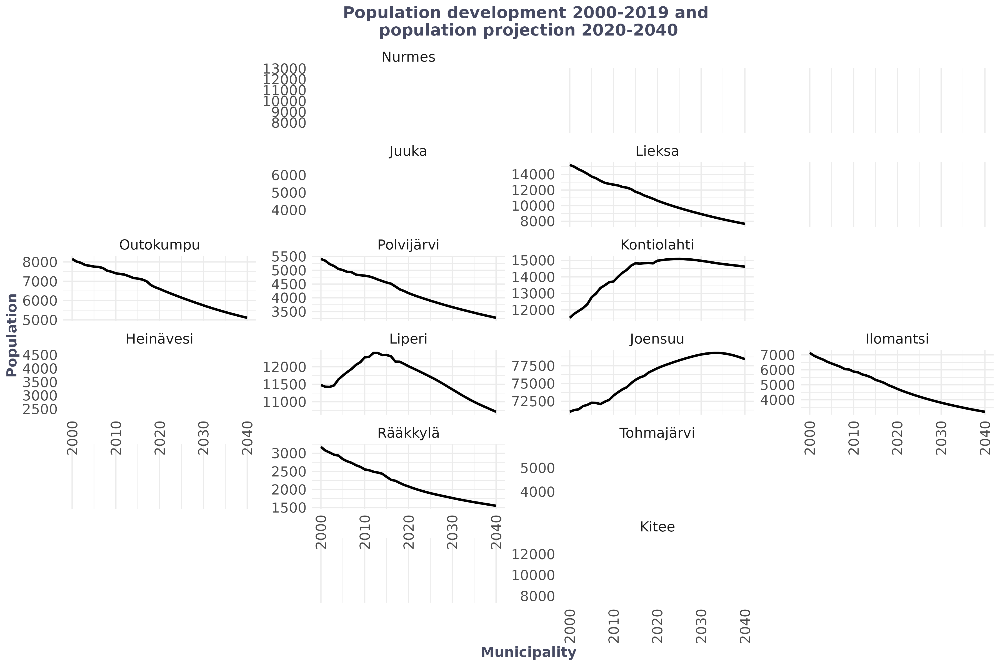

You can see, that facet_geo() is a geographic faceting method that
arranges small ggplot panels to resemble a map, making regional
comparisons easier while showing detailed plots for each area.

The figure does not render correctly, so below is an image showing the
figure as it should look.


geofacetti logo

Step‑by‑step explanation

##### 1. Defining the plot structure

    ggplot(vs, aes(x = Group.1, y = x, group = Group.2))

Explanation:

- vs is the dataset (Pohjois‑Karjala only)
- Group.1 → year
- x → aggregated population
- group = Group.2 → separate line for each municipality

##### 2. Drawing population trends as lines

    geom_line(size = 1.1)

Explanation:

- Draws a continuous line for each municipality
- size = 1.1 increases line thickness for readability

##### 3. Rotating x‑axis labels

    theme(axis.text.x = element_text(angle = 90, vjust = 0.5, hjust = 1))

Explanation:

- Rotates year labels by 90 degrees
- Prevents overlapping text
- Improves readability when many years are shown

##### 4. Spatial faceting using geofacet

    facet_geo(
      facets = ~ Group.2,
      grid = geofi::grid_pohjois_karjala,
      scales = "free_y"
    )

Explanation (this is the key idea):

- Creates one panel per municipality
- Panels are arranged geographically, not alphabetically
- geofi::grid_pohjois_karjala defines the spatial layout
- scales = “free_y” gives each municipality its own y‑axis range

##### 5. Adding labels and title

    labs(
      title = "Population development 2000–2019 and population projection 2020–2040",
      y = "Population",
      x = "Municipality")

Explanation:

- Adds an informative title
- Labels axes clearly
- Essential for standalone interpretation

##### 6. Improving visual appearance

    theme(
      axis.text = element_text(size = 12),
      axis.title = element_text(size = 12, face = "bold"),
      plot.title = element_text(size = 14, face = "bold"),
      strip.text = element_text(size = 12)
    )

Explanation:

- Increases font sizes
- Makes titles and axes clearer
- Improves readability for lectures and reports

##### 7. Controlling x‑axis year breaks

    scale_x_continuous(breaks = seq(2000, 2040, 5))

Explanation:

- Shows year labels every 5 years
- Avoids clutter
- Makes long time series easier to read
