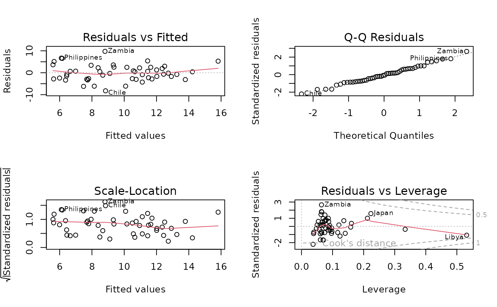

# Lecture 4: Regression analysis

## Regression analysis

Let’s assume that we want to model the response Y in terms of three
predictors; X1, X2 and X3. One general form for the model would be:

The multiple linear regression model can be written as

$$Y = \beta_{0} + \beta_{1}X_{1} + \beta_{2}X_{2} + \beta_{3}X_{3} + \varepsilon$$

where  
- $Y$ is the dependent variable  
- $\beta_{0}$ is the intercept  
- $\beta_{1},\beta_{2},\beta_{3}$ are regression coefficients  
- $X_{1},X_{2},X_{3}$ are explanatory variables  
- $\varepsilon$ is the error term

##### Estimation of the model

The regression coefficients $\beta_{0},\beta_{1},\beta_{2},\beta_{3}$
are usually estimated using ordinary least squares (OLS).

The idea of OLS is to choose coefficient values that minimize the sum of
squared residuals:

$$\sum\limits_{i = 1}^{n}\left( Y_{i} - {\widehat{Y}}_{i} \right)^{2}$$

where ${\widehat{Y}}_{i}$ is the predicted value of $Y$ for observation
$i$.

Under standard assumptions, the OLS estimators are unbiased and
efficient.

##### Interpretation of coefficients

Each regression coefficient has a clear interpretation:

- **$\beta_{0}$ (intercept):**  
  The expected value of $Y$ when all predictors equal zero.

- **$\beta_{1}$:** The expected change in $Y$ for a one‑unit increase in
  $X_{1}$, holding $X_{2}$ and $X_{3}$ constant.

- **$\beta_{2},\beta_{3}$:** Interpreted analogously for $X_{2}$ and
  $X_{3}$.

This *“all else equal”* interpretation is central to multiple regression
analysis.

##### Model assumptions

For the linear regression model to be valid, the following assumptions
are commonly made:

1.  **Linearity**  
    The relationship between the predictors and the response is linear.

2.  **Independence**  
    Observations are independent of each other.

3.  **Homoscedasticity**  
    The variance of the error term $\varepsilon$ is constant across
    observations.

4.  **Normality of errors**  
    The error term $\varepsilon$ is normally distributed (mainly
    important for inference).

5.  **No perfect multicollinearity**  
    Predictors are not perfectly correlated with each other.

Violations of these assumptions can lead to biased estimates or invalid
inference.

##### Goodness of fit

Two commonly used measures are:

- **$R^{2}$**  
  The proportion of variance in $Y$ explained by the model.

- **Adjusted $R^{2}$**  
  Adjusts $R^{2}$ for the number of predictors and is preferred when
  comparing models.

The coefficient of determination is defined as

$$R^{2} = 1 - \frac{\text{Residual Sum of Squares}}{\text{Total Sum of Squares}}$$

##### Extensions

Possible extensions of the basic linear regression framework include:

- interaction effects (e.g. $X_{1} \times X_{2}$)
- nonlinear terms (e.g. polynomials)
- generalized linear models
- spatial regression models

#### Examples of regression models

##### Faithfull data

Apply the simple linear regression model for the data set faithful, and
estimate the next eruption duration if the waiting time since the last
eruption has been 80 minutes.

Let’s check the dataset:

``` r
?faithful
```

Then let’s estimate the regression model:

``` r
eruption.lm = lm(eruptions ~ waiting, data=faithful) 
```

Then we extract the parameters of the estimated regression equation with
the coefficients function.

``` r
coeffs = coefficients(eruption.lm); coeffs 
```

    ## (Intercept)     waiting 
    ## -1.87401599  0.07562795

We now fit the eruption duration using the estimated regression
equation.

``` r
waiting = 80           # the waiting time 
duration = coeffs[1] + coeffs[2]*waiting 
duration 
```

    ## (Intercept) 
    ##     4.17622

Based on the simple linear regression model, if the waiting time since
the last eruption has been 80 minutes, we expect the next one to last
4.1762 minutes.

##### Gala data

Let’s look an example concerning the number of species of tortoise on
the various Galapagos Islands. There are 30 cases (Islands) and seven
variables in the dataset. We start by reading the data in to R and
examining it.

``` r
library(faraway)

data(gala)
gala
```

    ##              Species Endemics    Area Elevation Nearest Scruz Adjacent
    ## Baltra            58       23   25.09       346     0.6   0.6     1.84
    ## Bartolome         31       21    1.24       109     0.6  26.3   572.33
    ## Caldwell           3        3    0.21       114     2.8  58.7     0.78
    ## Champion          25        9    0.10        46     1.9  47.4     0.18
    ## Coamano            2        1    0.05        77     1.9   1.9   903.82
    ## Daphne.Major      18       11    0.34       119     8.0   8.0     1.84
    ## Daphne.Minor      24        0    0.08        93     6.0  12.0     0.34
    ## Darwin            10        7    2.33       168    34.1 290.2     2.85
    ## Eden               8        4    0.03        71     0.4   0.4    17.95
    ## Enderby            2        2    0.18       112     2.6  50.2     0.10
    ## Espanola          97       26   58.27       198     1.1  88.3     0.57
    ## Fernandina        93       35  634.49      1494     4.3  95.3  4669.32
    ## Gardner1          58       17    0.57        49     1.1  93.1    58.27
    ## Gardner2           5        4    0.78       227     4.6  62.2     0.21
    ## Genovesa          40       19   17.35        76    47.4  92.2   129.49
    ## Isabela          347       89 4669.32      1707     0.7  28.1   634.49
    ## Marchena          51       23  129.49       343    29.1  85.9    59.56
    ## Onslow             2        2    0.01        25     3.3  45.9     0.10
    ## Pinta            104       37   59.56       777    29.1 119.6   129.49
    ## Pinzon           108       33   17.95       458    10.7  10.7     0.03
    ## Las.Plazas        12        9    0.23        94     0.5   0.6    25.09
    ## Rabida            70       30    4.89       367     4.4  24.4   572.33
    ## SanCristobal     280       65  551.62       716    45.2  66.6     0.57
    ## SanSalvador      237       81  572.33       906     0.2  19.8     4.89
    ## SantaCruz        444       95  903.82       864     0.6   0.0     0.52
    ## SantaFe           62       28   24.08       259    16.5  16.5     0.52
    ## SantaMaria       285       73  170.92       640     2.6  49.2     0.10
    ## Seymour           44       16    1.84       147     0.6   9.6    25.09
    ## Tortuga           16        8    1.24       186     6.8  50.9    17.95
    ## Wolf              21       12    2.85       253    34.1 254.7     2.33

Let’s see background of the data:

``` r
?gala
```

Fitting a linear model in R is done using the lm( ) command. Notice the
syntax for specifying the predictors in the model. By typing,

``` r
mdl <- lm(Species~Area + Elevation + Nearest + Scruz+ Adjacent, data=gala)
summary(mdl)
```

    ## 
    ## Call:
    ## lm(formula = Species ~ Area + Elevation + Nearest + Scruz + Adjacent, 
    ##     data = gala)
    ## 
    ## Residuals:
    ##      Min       1Q   Median       3Q      Max 
    ## -111.679  -34.898   -7.862   33.460  182.584 
    ## 
    ## Coefficients:
    ##              Estimate Std. Error t value Pr(>|t|)    
    ## (Intercept)  7.068221  19.154198   0.369 0.715351    
    ## Area        -0.023938   0.022422  -1.068 0.296318    
    ## Elevation    0.319465   0.053663   5.953 3.82e-06 ***
    ## Nearest      0.009144   1.054136   0.009 0.993151    
    ## Scruz       -0.240524   0.215402  -1.117 0.275208    
    ## Adjacent    -0.074805   0.017700  -4.226 0.000297 ***
    ## ---
    ## Signif. codes:  0 '***' 0.001 '**' 0.01 '*' 0.05 '.' 0.1 ' ' 1
    ## 
    ## Residual standard error: 60.98 on 24 degrees of freedom
    ## Multiple R-squared:  0.7658, Adjusted R-squared:  0.7171 
    ## F-statistic:  15.7 on 5 and 24 DF,  p-value: 6.838e-07

We can identify several useful quantities in this output. Other
statistical packages tend to produce output quite similar to this. One
useful feature of R is that it is possible to directly calculate
quantities of interest.

First we make the X-matrix:

``` r
x <- model.matrix(~Area + Elevation + Nearest + Scruz + Adjacent, gala)
```

and here is the response y:

``` r
y <- gala$Species
```

Now let’s construct (XTX)-1. t ( ) does transpose and %\*% does matrix
multiplication. solve (A) computes A-1 while solve(A,b) solves Ax=b:

``` r
xtxi <- solve(t(x)%*%x)
```

We can get B directly, using (XTX)-1XTy:

``` r
xtxi%*%t(x)%*%y
```

    ##                     [,1]
    ## (Intercept)  7.068220709
    ## Area        -0.023938338
    ## Elevation    0.319464761
    ## Nearest      0.009143961
    ## Scruz       -0.240524230
    ## Adjacent    -0.074804832

This is a very bad way to compute B because it is inefficient and can be
very inaccurate when the predictors are strongly correlated. A better
way is:

``` r
solve(crossprod(x,x),crossprod(x,y))
```

    ##                     [,1]
    ## (Intercept)  7.068220709
    ## Area        -0.023938338
    ## Elevation    0.319464761
    ## Nearest      0.009143961
    ## Scruz       -0.240524230
    ## Adjacent    -0.074804832

where crosspod(x,y) computes xTy.

We can extract the regression quantities we need from the model object.
Commonly used are residuals (), fitted (), deviance () which gives the
RSS, df.residual () which gives the degrees of freedom and coef () which
gives the . You can also extract other needed quantities by examining
the model object and its summary:

``` r
names(mdl)
```

    ##  [1] "coefficients"  "residuals"     "effects"       "rank"         
    ##  [5] "fitted.values" "assign"        "qr"            "df.residual"  
    ##  [9] "xlevels"       "call"          "terms"         "model"

``` r
mdls <- summary(mdl)
names(mdls)
```

    ##  [1] "call"          "terms"         "residuals"     "coefficients" 
    ##  [5] "aliased"       "sigma"         "df"            "r.squared"    
    ##  [9] "adj.r.squared" "fstatistic"    "cov.unscaled"

We can estimate using the formula , where n-p is the degrees of freedom.
We can also extract it from the summary:

``` r
sqrt(deviance(mdl)/df.residual(mdl))
```

    ## [1] 60.97519

``` r
mdls$sigma
```

    ## [1] 60.97519

We can also extract (XTX)-1 and use it to compute the standard errors
for the coefficients:

``` r
xtxi <- mdls$cov.unscaled
sqrt(diag(xtxi))*60.975
```

    ## (Intercept)        Area   Elevation     Nearest       Scruz    Adjacent 
    ## 19.15413865  0.02242228  0.05366264  1.05413269  0.21540158  0.01770013

or get them from the summary object:

``` r
mdls$coef[,2]
```

    ## (Intercept)        Area   Elevation     Nearest       Scruz    Adjacent 
    ## 19.15419782  0.02242235  0.05366280  1.05413595  0.21540225  0.01770019

Finally, we may compute or extract R2:

``` r
1-deviance(mdl)/sum((y-mean(y))^2)
```

    ## [1] 0.7658469

``` r
mdls$r.squared
```

    ## [1] 0.7658469

#### Hypothesis Testing for Comparing Regression Models

In regression analysis, we often want to **test whether a subset of
predictors is statistically relevant**. This can be formulated as a
hypothesis test comparing:

- a **full model** (with all predictors), and  
- a **restricted (nested) model** where some coefficients are set to
  zero.

We use **F-tests** to compare these models.

##### The data and model

We use the built-in `savings` dataset, which contains information on
savings rates and several demographic and economic predictors.

``` r
data(savings)
```

The response variable is:

- sr: aggregate personal saving rate

The predictors are:

- pop15: percentage of population under 15
- pop75: percentage of population over 75
- dpi: real per-capita disposable income
- ddpi: growth rate of disposable income

The Full Regression Model:

We begin by fitting the full model, which includes all predictors.

``` r
g <- lm(sr ~ pop15 + pop75 + dpi + ddpi, savings)
summary(g)
```

    ## 
    ## Call:
    ## lm(formula = sr ~ pop15 + pop75 + dpi + ddpi, data = savings)
    ## 
    ## Residuals:
    ##     Min      1Q  Median      3Q     Max 
    ## -8.2422 -2.6857 -0.2488  2.4280  9.7509 
    ## 
    ## Coefficients:
    ##               Estimate Std. Error t value Pr(>|t|)    
    ## (Intercept) 28.5660865  7.3545161   3.884 0.000334 ***
    ## pop15       -0.4611931  0.1446422  -3.189 0.002603 ** 
    ## pop75       -1.6914977  1.0835989  -1.561 0.125530    
    ## dpi         -0.0003369  0.0009311  -0.362 0.719173    
    ## ddpi         0.4096949  0.1961971   2.088 0.042471 *  
    ## ---
    ## Signif. codes:  0 '***' 0.001 '**' 0.01 '*' 0.05 '.' 0.1 ' ' 1
    ## 
    ## Residual standard error: 3.803 on 45 degrees of freedom
    ## Multiple R-squared:  0.3385, Adjusted R-squared:  0.2797 
    ## F-statistic: 5.756 on 4 and 45 DF,  p-value: 0.0007904

This model estimates the relationship between the savings rate and all
four explanatory variables.

##### Testing Overall Model Significance Using an F-Test

Total Sum of Squares (TSS)

The total variation in the response variable is given by:

``` r
tss <- sum((savings$sr - mean(savings$sr))^2)
tss
```

    ## [1] 983.6283

Residual Sum of Squares (RSS)

The unexplained variation under the full model is:

``` r
rss <- deviance(g)
rss
```

    ## [1] 650.713

Residual Degrees of Freedom

``` r
df.residual(g)
```

    ## [1] 45

Manual F-Statistic Calculation

The F-statistic is computed as:

``` r
fstat <- ((tss - rss) / 4) / (rss / df.residual(g))
fstat
```

    ## [1] 5.755681

P-value for the F-Test

``` r
1 - pf(fstat, 4, df.residual(g))
```

    ## [1] 0.0007903779

A small p-value indicates that at least one predictor is statistically
significant.

##### General F-Test: Comparing Nested Models

Instead of testing against a model with no predictors, we can compare
two nested regression models.

Restricted (Null) Model We remove pop15 from the full model:

``` r
g2 <- lm(sr ~ pop75 + dpi + ddpi, savings)
```

Residual Sum of Squares for the Restricted Model

``` r
rss2 <- deviance(g2)
rss2
```

    ## [1] 797.7249

F-Statistic for Nested Models

``` r
fstat <- (deviance(g2) - deviance(g)) / (deviance(g) / df.residual(g))
fstat
```

    ## [1] 10.16659

Corresponding P-value

``` r
1 - pf(fstat, 1, df.residual(g))
```

    ## [1] 0.002603019

##### Using anova() for Model Comparison

A more convenient and standard approach is to use the anova() function.

``` r
anova(g2, g)
```

    ## Analysis of Variance Table
    ## 
    ## Model 1: sr ~ pop75 + dpi + ddpi
    ## Model 2: sr ~ pop15 + pop75 + dpi + ddpi
    ##   Res.Df    RSS Df Sum of Sq      F   Pr(>F)   
    ## 1     46 797.72                                
    ## 2     45 650.71  1    147.01 10.167 0.002603 **
    ## ---
    ## Signif. codes:  0 '***' 0.001 '**' 0.01 '*' 0.05 '.' 0.1 ' ' 1

This automatically computes the F-statistic and p-value for comparing
nested models.

##### Testing Multiple Coefficient Restrictions

We now test whether both pop75 and ddpi can be excluded from the model.

Restricted Model

``` r
g3 <- lm(sr ~ pop15 + dpi, savings)
```

Model Comparison

``` r
anova(g3, g)
```

    ## Analysis of Variance Table
    ## 
    ## Model 1: sr ~ pop15 + dpi
    ## Model 2: sr ~ pop15 + pop75 + dpi + ddpi
    ##   Res.Df    RSS Df Sum of Sq      F  Pr(>F)  
    ## 1     47 744.12                              
    ## 2     45 650.71  2    93.411 3.2299 0.04889 *
    ## ---
    ## Signif. codes:  0 '***' 0.001 '**' 0.01 '*' 0.05 '.' 0.1 ' ' 1

**Summary**

- F-tests allow us to compare nested regression models
- The test evaluates whether excluded variables significantly improve
  model fit
- For a single restriction, the F-test is equivalent to a t-test
- The anova() function provides a clean and reliable implementation

These tools are essential for principled model selection in regression
analysis.

#### Variable selection in regression models

In multiple regression analysis, we often face the question of **which
predictors should be included in the model**. Including too many
variables may lead to over fitting, while excluding relevant predictors
can bias results.

A common approach for variable selection is to use **information
criteria**, such as the Akaike Information Criterion (AIC), which
balances model fit and model complexity.

##### Variable selection using AIC

We illustrate variable selection methods using the built‑in **state**
dataset.

First, we construct a data frame containing the variables of interest
and fit a full regression model including all predictors.

``` r
data(state)

statedata <- data.frame(
  state.x77,
  row.names = state.abb,
  check.names = TRUE
)

g <- lm(Life.Exp ~ ., data = statedata)
```

Stepwise variable selection using AIC

The step() function performs stepwise model selection by sequentially
adding or removing predictors based on the AIC value.

``` r
step(g)
```

    ## Start:  AIC=-22.18
    ## Life.Exp ~ Population + Income + Illiteracy + Murder + HS.Grad + 
    ##     Frost + Area
    ## 
    ##              Df Sum of Sq    RSS     AIC
    ## - Area        1    0.0011 23.298 -24.182
    ## - Income      1    0.0044 23.302 -24.175
    ## - Illiteracy  1    0.0047 23.302 -24.174
    ## <none>                    23.297 -22.185
    ## - Population  1    1.7472 25.044 -20.569
    ## - Frost       1    1.8466 25.144 -20.371
    ## - HS.Grad     1    2.4413 25.738 -19.202
    ## - Murder      1   23.1411 46.438  10.305
    ## 
    ## Step:  AIC=-24.18
    ## Life.Exp ~ Population + Income + Illiteracy + Murder + HS.Grad + 
    ##     Frost
    ## 
    ##              Df Sum of Sq    RSS     AIC
    ## - Illiteracy  1    0.0038 23.302 -26.174
    ## - Income      1    0.0059 23.304 -26.170
    ## <none>                    23.298 -24.182
    ## - Population  1    1.7599 25.058 -22.541
    ## - Frost       1    2.0488 25.347 -21.968
    ## - HS.Grad     1    2.9804 26.279 -20.163
    ## - Murder      1   26.2721 49.570  11.569
    ## 
    ## Step:  AIC=-26.17
    ## Life.Exp ~ Population + Income + Murder + HS.Grad + Frost
    ## 
    ##              Df Sum of Sq    RSS     AIC
    ## - Income      1     0.006 23.308 -28.161
    ## <none>                    23.302 -26.174
    ## - Population  1     1.887 25.189 -24.280
    ## - Frost       1     3.037 26.339 -22.048
    ## - HS.Grad     1     3.495 26.797 -21.187
    ## - Murder      1    34.739 58.041  17.456
    ## 
    ## Step:  AIC=-28.16
    ## Life.Exp ~ Population + Murder + HS.Grad + Frost
    ## 
    ##              Df Sum of Sq    RSS     AIC
    ## <none>                    23.308 -28.161
    ## - Population  1     2.064 25.372 -25.920
    ## - Frost       1     3.122 26.430 -23.877
    ## - HS.Grad     1     5.112 28.420 -20.246
    ## - Murder      1    34.816 58.124  15.528

    ## 
    ## Call:
    ## lm(formula = Life.Exp ~ Population + Murder + HS.Grad + Frost, 
    ##     data = statedata)
    ## 
    ## Coefficients:
    ## (Intercept)   Population       Murder      HS.Grad        Frost  
    ##   7.103e+01    5.014e-05   -3.001e-01    4.658e-02   -5.943e-03

Interpretation:

- The algorithm searches for a model with lower AIC than the full model.
- At each step, predictors are added or removed if doing so improves the
  AIC.
- The final model represents a balance between goodness of fit and model
  simplicity.

##### Alternative approach: stepAIC() from the MASS package

The MASS package provides the stepAIC() function, which allows explicit
control over the direction of the search.

``` r
library(MASS)
```

    ## 
    ## Attaching package: 'MASS'

    ## The following object is masked from 'package:dplyr':
    ## 
    ##     select

``` r
stepAIC(
  lm(Life.Exp ~ ., data = statedata),
  direction = "both")
```

    ## Start:  AIC=-22.18
    ## Life.Exp ~ Population + Income + Illiteracy + Murder + HS.Grad + 
    ##     Frost + Area
    ## 
    ##              Df Sum of Sq    RSS     AIC
    ## - Area        1    0.0011 23.298 -24.182
    ## - Income      1    0.0044 23.302 -24.175
    ## - Illiteracy  1    0.0047 23.302 -24.174
    ## <none>                    23.297 -22.185
    ## - Population  1    1.7472 25.044 -20.569
    ## - Frost       1    1.8466 25.144 -20.371
    ## - HS.Grad     1    2.4413 25.738 -19.202
    ## - Murder      1   23.1411 46.438  10.305
    ## 
    ## Step:  AIC=-24.18
    ## Life.Exp ~ Population + Income + Illiteracy + Murder + HS.Grad + 
    ##     Frost
    ## 
    ##              Df Sum of Sq    RSS     AIC
    ## - Illiteracy  1    0.0038 23.302 -26.174
    ## - Income      1    0.0059 23.304 -26.170
    ## <none>                    23.298 -24.182
    ## - Population  1    1.7599 25.058 -22.541
    ## + Area        1    0.0011 23.297 -22.185
    ## - Frost       1    2.0488 25.347 -21.968
    ## - HS.Grad     1    2.9804 26.279 -20.163
    ## - Murder      1   26.2721 49.570  11.569
    ## 
    ## Step:  AIC=-26.17
    ## Life.Exp ~ Population + Income + Murder + HS.Grad + Frost
    ## 
    ##              Df Sum of Sq    RSS     AIC
    ## - Income      1     0.006 23.308 -28.161
    ## <none>                    23.302 -26.174
    ## - Population  1     1.887 25.189 -24.280
    ## + Illiteracy  1     0.004 23.298 -24.182
    ## + Area        1     0.000 23.302 -24.174
    ## - Frost       1     3.037 26.339 -22.048
    ## - HS.Grad     1     3.495 26.797 -21.187
    ## - Murder      1    34.739 58.041  17.456
    ## 
    ## Step:  AIC=-28.16
    ## Life.Exp ~ Population + Murder + HS.Grad + Frost
    ## 
    ##              Df Sum of Sq    RSS     AIC
    ## <none>                    23.308 -28.161
    ## + Income      1     0.006 23.302 -26.174
    ## + Illiteracy  1     0.004 23.304 -26.170
    ## + Area        1     0.001 23.307 -26.163
    ## - Population  1     2.064 25.372 -25.920
    ## - Frost       1     3.122 26.430 -23.877
    ## - HS.Grad     1     5.112 28.420 -20.246
    ## - Murder      1    34.816 58.124  15.528

    ## 
    ## Call:
    ## lm(formula = Life.Exp ~ Population + Murder + HS.Grad + Frost, 
    ##     data = statedata)
    ## 
    ## Coefficients:
    ## (Intercept)   Population       Murder      HS.Grad        Frost  
    ##   7.103e+01    5.014e-05   -3.001e-01    4.658e-02   -5.943e-03

Interpretation:

- “both” allows both forward selection and backward elimination.
- Results are often comparable to step() but offer more flexibility.
- Smaller AIC values indicate preferred models.

##### Best subset selection using the leaps package

Another approach to variable selection is best subset selection, which
evaluates combinations of predictors rather than following a stepwise
path.

``` r
library(leaps)

x <- model.matrix(g)[, -1]
y <- statedata$Life.Exp

g_leaps <- leaps(x, y)
```

This method examines models with different numbers of predictors to
identify those with optimal performance according to specific criteria.

**Model comparison using Mallows’ Cp**

Mallows’ $C_{p}$ statistic is commonly used to assess model adequacy and
complexity.

``` r
library(faraway)
Cpplot(g_leaps)
```


Interpretation:

- Models with low $C_{p}$ values are preferred.
- A good model typically has $C_{p}$ close to the number of predictors
  plus the intercept.
- This plot helps identify parsimonious models with strong explanatory
  power.

##### Summary

Different variable selection techniques may lead to different models. In
practice:

- Stepwise methods are computationally efficient but may miss optimal
  models.
- Best subset selection provides a broader comparison but can be
  computationally expensive.
- Information criteria such as AIC help balance model fit and
  complexity.

Variable selection should always be guided by statistical reasoning,
theoretical understanding, and substantive knowledge, not automatic
procedures alone.

#### Regression diagnostic

Regression diagnostics are used to evaluate whether the assumptions of
the linear regression model are reasonably satisfied and to identify
potentially influential observations.

In this section, we illustrate regression diagnostics using an example
dataset.

##### Diagnostics for a multiple linear regression model

We use the **savings** dataset from the *faraway* package. First, we fit
a multiple linear regression model and then inspect standard diagnostic
plots.

``` r
library(faraway)

data(savings)
?savings

g <- lm(sr ~ pop15 + pop75 + dpi + ddpi, data = savings)
```

R automatically produces four standard diagnostic plots for a linear
regression model using the plot() function. These plots help assess
model assumptions and identify problematic observations.

``` r
par(mfrow = c(2, 2))
plot(g)
```



**Residuals vs. Fitted values** This plot examines whether the
relationship between predictors and the response is approximately
linear. Interpretation:

- It is desirable to see residuals evenly scattered around a horizontal
  line at zero.
- Systematic patterns (curvature or funnel shapes) may indicate
  nonlinearity or heteroscedasticity.

**Normal Q–Q plot** This plot assesses whether the residuals are
approximately normally distributed. Interpretation:

- If residuals follow the dashed reference line closely, the normality
  assumption is reasonable.
- Strong deviations from the line suggest departures from normality.

**Scale–Location plot** Also called the Spread–Location plot, this
diagnostic evaluates the assumption of constant variance
(homoscedasticity). Interpretation:

- A roughly horizontal line with evenly spread points is desirable.
- Increasing or decreasing spread suggests heteroscedasticity.

**Residuals vs. Leverage** This plot identifies observations that may
have a disproportionate influence on the fitted model. Interpretation:

- Observations with high leverage and large residuals are potentially
  influential.
- Points lying outside the Cook’s distance contours may substantially
  affect model estimates.

**Summary** Diagnostic plots provide essential insight into:

- linearity
- normality of residuals
- constant variance
- influence of individual observations

If serious violations are detected, remedial measures such as
transforming variables, adding nonlinear terms, or using alternative
models should be considered.

## Regression analysis and open postcode area data

The Paavo service contains data by postal code area on the population
structure, education, income, housing, workplaces, households’ life
stage and main activities of the inhabitants.

The database contains data by postal code area on the population
structure, education, income, housing, workplaces, households’ life
stage and main activities of the inhabitants.

You can use the data in decision-making and planning or learn more about
your area of residence. Paavo offers information on the allocation of
marketplaces, marketing planning, research and regional studies and
plans.

You can find more information about PAAVO from here:
<https://stat.fi/en/services/statistical-data-services/statistical-databases/paavo>

**Objective of the Exercise** In this lecture, we demonstrate how to:

- Download spatial postcode-level data from Statistics Finland’s WFS
  service
- Combine data from two different years
- Compute changes in employment at the postcode area level
- Classify areas by employment growth intensity
- Summarize employment concentrations in growth areas

The workflow combines spatial data handling, data merging, and basic
regional analysis.

``` r
install.packages("purrr")
install.packages("sf")
install.packages("tmap")
install.packages("httr")
install.packages("data.table")
install.packages("ows4R")

#options(pckgType="binary")
library(dplyr)
library(purrr)
library(sf)
library(httr)
library(data.table)
library(ows4R)
```

##### Downloading Postcode Area Data (Year 2022)

We begin by downloading postcode area data using a Web Feature Service
(WFS) query.

``` r
url <-list(hostname ="geo.stat.fi/geoserver/postialue/wfs",
           scheme ="https",
           query =list(service ="WFS",
                       version ="2.0.0",
                       request ="GetFeature",
                       typename ="postialue:pno_tilasto_2025",
                       outputFormat ="json"))%>%
  setattr("class","url")
request <-build_url(url)
p25 <-st_read(request)
```

    ## Reading layer `OGRGeoJSON' from data source 
    ##   `https://geo.stat.fi/geoserver/postialue/wfs/?service=WFS&version=2.0.0&request=GetFeature&typename=postialue%3Apno_tilasto_2025&outputFormat=json' 
    ##   using driver `GeoJSON'
    ## Simple feature collection with 3026 features and 113 fields
    ## Geometry type: MULTIPOLYGON
    ## Dimension:     XY
    ## Bounding box:  xmin: 83748.43 ymin: 6629044 xmax: 732907.7 ymax: 7776450
    ## Projected CRS: ETRS89 / TM35FIN(E,N)

This produces an sf object containing postcode area geometries and
associated attributes, including the number of jobs.

##### Downloading Corresponding Data for Year 2016

We repeat the same procedure for the year 2016.

``` r
url <-list(hostname ="geo.stat.fi/geoserver/postialue/wfs",
           scheme ="https",
           query =list(service ="WFS",
                       version ="2.0.0",
                       request ="GetFeature",
                       typename ="postialue:pno_tilasto_2016",
                       outputFormat ="json"))%>%
  setattr("class","url")
request <-build_url(url)
p16 <-st_read(request)
```

    ## Reading layer `OGRGeoJSON' from data source 
    ##   `https://geo.stat.fi/geoserver/postialue/wfs/?service=WFS&version=2.0.0&request=GetFeature&typename=postialue%3Apno_tilasto_2016&outputFormat=json' 
    ##   using driver `GeoJSON'
    ## Simple feature collection with 3036 features and 113 fields
    ## Geometry type: MULTIPOLYGON
    ## Dimension:     XY
    ## Bounding box:  xmin: 83748.43 ymin: 6629044 xmax: 732907.7 ymax: 7776450
    ## Projected CRS: ETRS89 / TM35FIN(E,N)

##### Inspecting the Data Structure

To understand the available variables, we list the column names.

``` r
names(p16)
```

    ##   [1] "id"         "gid"        "posti_alue" "nimi"       "namn"      
    ##   [6] "euref_x"    "euref_y"    "pinta_ala"  "vuosi"      "kunta"     
    ##  [11] "he_vakiy"   "he_naiset"  "he_miehet"  "he_kika"    "he_0_2"    
    ##  [16] "he_3_6"     "he_7_12"    "he_13_15"   "he_16_17"   "he_18_19"  
    ##  [21] "he_20_24"   "he_25_29"   "he_30_34"   "he_35_39"   "he_40_44"  
    ##  [26] "he_45_49"   "he_50_54"   "he_55_59"   "he_60_64"   "he_65_69"  
    ##  [31] "he_70_74"   "he_75_79"   "he_80_84"   "he_85_"     "ko_ika18y" 
    ##  [36] "ko_perus"   "ko_koul"    "ko_yliop"   "ko_ammat"   "ko_al_kork"
    ##  [41] "ko_yl_kork" "hr_tuy"     "hr_ktu"     "hr_mtu"     "hr_pi_tul" 
    ##  [46] "hr_ke_tul"  "hr_hy_tul"  "hr_ovy"     "te_taly"    "te_takk"   
    ##  [51] "te_as_valj" "te_nuor"    "te_eil_np"  "te_laps"    "te_plap"   
    ##  [56] "te_aklap"   "te_klap"    "te_teini"   "te_aik"     "te_elak"   
    ##  [61] "te_omis_as" "te_vuok_as" "te_muu_as"  "tr_kuty"    "tr_ktu"    
    ##  [66] "tr_mtu"     "tr_pi_tul"  "tr_ke_tul"  "tr_hy_tul"  "tr_ovy"    
    ##  [71] "ra_ke"      "ra_raky"    "ra_muut"    "ra_asrak"   "ra_asunn"  
    ##  [76] "ra_as_kpa"  "ra_pt_as"   "ra_kt_as"   "tp_tyopy"   "tp_alku_a" 
    ##  [81] "tp_jalo_bf" "tp_palv_gu" "tp_a_maat"  "tp_b_kaiv"  "tp_c_teol" 
    ##  [86] "tp_d_ener"  "tp_e_vesi"  "tp_f_rake"  "tp_g_kaup"  "tp_h_kulj" 
    ##  [91] "tp_i_majo"  "tp_j_info"  "tp_k_raho"  "tp_l_kiin"  "tp_m_erik" 
    ##  [96] "tp_n_hall"  "tp_o_julk"  "tp_p_koul"  "tp_q_terv"  "tp_r_taid" 
    ## [101] "tp_s_muup"  "tp_t_koti"  "tp_u_kans"  "tp_x_tunt"  "pt_vakiy"  
    ## [106] "pt_tyovy"   "pt_tyoll"   "pt_tyott"   "pt_tyovu"   "pt_0_14"   
    ## [111] "pt_opisk"   "pt_elakel"  "pt_muut"    "geometry"

##### Extracting Relevant Variables (2016 Data)

We extract:

- the postcode area identifier
- the total number of jobs in 2016

``` r
p16data<-p16[,c(2,79)]
p16data<-as.data.frame(p16data[,1:2])
colnames(p16data)<-c("posti_alue","tyopy16") #postcode & total number of jobs
```

- posti_alue: postcode area
- tyopy16: total number of jobs in 2016

##### Merging 2016 Data with 2022 Spatial Data

We merge the 2016 employment data with the 2022 spatial dataset using a
right join. Before doing so, we convert the ID variables
(postinumeroalue and posti_alue) to the same data type, because joins
require matching variable types.

``` r
p25$postinumeroalue <- as.numeric(p25$postinumeroalue)
p16data$posti_alue <- as.numeric(p16data$posti_alue)
```

``` r
p25_data <- dplyr::right_join(x = p16data, y = p25, by=c("posti_alue" = "postinumeroalue"))
```

Why right_join()?

- Preserves the geometry and structure of the 2022 spatial dataset
- Ensures that all 2022 postcode areas remain in the data

##### Handling Missing Values

If a postcode area has no recorded jobs in 2016, we treat this as zero
employment.

``` r
p25_data$tyopy16[is.na(p25_data$tyopy16)] <- 0
```

##### Calculating Employment Change (2016–2022)

Absolute Change & Percentage Change

``` r
p25_data$tp_m25_16<-(p25_data$tp_tyopy-p25_data$tyopy16)
p25_data$tp_m25_16p<-((p25_data$tp_tyopy-p25_data$tyopy16)/p25_data$tyopy16)*100
```

- tp_tyopy: total number of jobs in 2025
- tp_m25_16: absolute employment change in from 2016 to 2025
- tp_m25_16p: percentage change in from 2016 to 2025

##### Classifying Employment Growth Areas

We classify postcode areas into growth categories based on absolute job
growth.

Any Positive Growth

``` r
p25_data$kasvu<-ifelse(p25_data$tp_m25_16>0,1,0)
table(p25_data$kasvu)
```

    ## 
    ##    0    1 
    ##   87 2939

Weak Growth (More Than 10 Jobs)

``` r
p25_data$kasvu_heikko<-ifelse(p25_data$tp_m25_16>10,1,0)
table(p25_data$kasvu_heikko)
```

    ## 
    ##    0    1 
    ##  465 2561

Moderate Growth (More Than 100 Jobs)

``` r
p25_data$kasvu_kohtal<-ifelse(p25_data$tp_m25_16>100,1,0)
table(p25_data$kasvu_kohtal)
```

    ## 
    ##    0    1 
    ## 1661 1365

Strong Growth (More Than 500 Jobs)

``` r
p25_data$kasvu_voima<-ifelse(p25_data$tp_m25_16>500,1,0)
table(p25_data$kasvu_voima)
```

    ## 
    ##    0    1 
    ## 2271  755

These classifications allow us to define different employment growth
scenarios at the postcode level.

Total Number of Jobs (2022)

``` r
sum(p25_data$tp_tyopy) 
```

    ## [1] 2271080

##### Share of Jobs Located in Growth Areas

We now compute the share of total employment located in areas with
different growth intensities. The denominator 2,150,025 represents the
total number of jobs nationally.

``` r
t1<-subset(p25_data, kasvu_voima>0); sum(t1$tp_tyopy)/sum(p25_data$tp_tyopy) 
```

    ## [1] 0.8932697

``` r
t2<-subset(p25_data, kasvu_kohtal>0); sum(t2$tp_tyopy)/sum(p25_data$tp_tyopy) 
```

    ## [1] 0.9629485

``` r
t3<-subset(p25_data, kasvu_heikko>0); sum(t3$tp_tyopy)/sum(p25_data$tp_tyopy) 
```

    ## [1] 0.9856363

``` r
t4<-subset(p25_data, kasvu>0); sum(t4$tp_tyopy)/sum(p25_data$tp_tyopy) 
```

    ## [1] 0.9871004

These indicators help quantify how concentrated employment growth is
geographically.

##### Modelling the Development of the Number of Jobs

In this section, we construct explanatory variables and estimate a
binary response model for job growth using a binomial (logistic)
regression.

We begin by constructing several percentage-based and density variables
that will be used as regressors in the model.

``` r
# Unemployment rate (%)
p25_data$tyottom <- (p25_data$pt_tyott / p25_data$pt_tyoll) * 100

# Share of highly educated (%)
p25_data$korkk <- (p25_data$ko_yl_kork / p25_data$ko_koul) * 100

# Share of new jobs (%)
p25_data$alkut <- (p25_data$tp_alku_a / p25_data$tp_tyopy) * 100

# Share of retirees (%)
p25_data$elak <- (p25_data$te_elak / p25_data$te_taly) * 100

# Population density (inhabitants per km^2)
p25_data$as_tih <- p25_data$he_vakiy / (p25_data$pinta_ala / 1000)
```

**Model Specification**

We estimate a generalized linear model (GLM) with a binomial
distribution and a logit link function. The dependent variable kasvu
indicates whether job growth occurred.

``` r
model1<-glm(kasvu~tyottom+korkk+alkut+elak+as_tih+he_kika+ra_as_kpa, data=p25_data, family="binomial",na.action = na.exclude)
```

**Model Output**

The table below reports coefficient estimates, standard errors, and
significance levels.

``` r
summary(model1)
```

    ## 
    ## Call:
    ## glm(formula = kasvu ~ tyottom + korkk + alkut + elak + as_tih + 
    ##     he_kika + ra_as_kpa, family = "binomial", data = p25_data, 
    ##     na.action = na.exclude)
    ## 
    ## Coefficients:
    ##              Estimate Std. Error z value Pr(>|z|)    
    ## (Intercept)  0.056489   1.732366   0.033 0.973987    
    ## tyottom      0.094105   0.020760   4.533 5.81e-06 ***
    ## korkk       -0.037865   0.011464  -3.303 0.000957 ***
    ## alkut        0.018137   0.009200   1.971 0.048667 *  
    ## elak        -0.004182   0.019561  -0.214 0.830719    
    ## as_tih      -0.140686   0.071850  -1.958 0.050222 .  
    ## he_kika      0.104873   0.033860   3.097 0.001953 ** 
    ## ra_as_kpa   -0.006897   0.009889  -0.697 0.485508    
    ## ---
    ## Signif. codes:  0 '***' 0.001 '**' 0.01 '*' 0.05 '.' 0.1 ' ' 1
    ## 
    ## (Dispersion parameter for binomial family taken to be 1)
    ## 
    ##     Null deviance: 389.09  on 2961  degrees of freedom
    ## Residual deviance: 322.43  on 2954  degrees of freedom
    ##   (64 observations deleted due to missingness)
    ## AIC: 338.43
    ## 
    ## Number of Fisher Scoring iterations: 8

Note: At this stage, you should carefully analyse the model diagnostics
(e.g. goodness-of-fit, influential observations, and multicollinearity).

**Predicted Probabilities**

Using the estimated model, we calculate predicted probabilities of job
growth for each observation.

``` r
p25_data$model1_res<-predict(model1, type="response")
```

**Distribution of Predicted Probabilities**

Finally, we visualise the distribution of the predicted probabilities.

``` r
hist(p25_data$model1_res)
```


**What if we change model?**

The model is modified by replacing the dependent variable with strong
concentration, in order to examine how the regression coefficients
change.

``` r
model2<-glm(kasvu_voima~tyottom+korkk+alkut+elak+as_tih+he_kika+ra_as_kpa, data=p25_data, family="binomial",na.action = na.exclude)
```

``` r
summary(model2)
```

    ## 
    ## Call:
    ## glm(formula = kasvu_voima ~ tyottom + korkk + alkut + elak + 
    ##     as_tih + he_kika + ra_as_kpa, family = "binomial", data = p25_data, 
    ##     na.action = na.exclude)
    ## 
    ## Coefficients:
    ##              Estimate Std. Error z value Pr(>|z|)    
    ## (Intercept) 18.483913   1.012472  18.256  < 2e-16 ***
    ## tyottom     -0.133090   0.009484 -14.033  < 2e-16 ***
    ## korkk       -0.034420   0.008369  -4.113 3.91e-05 ***
    ## alkut       -0.023206   0.002763  -8.398  < 2e-16 ***
    ## elak         0.025238   0.006332   3.986 6.73e-05 ***
    ## as_tih      -0.001754   0.071426  -0.025     0.98    
    ## he_kika     -0.167041   0.015137 -11.035  < 2e-16 ***
    ## ra_as_kpa   -0.114281   0.005840 -19.568  < 2e-16 ***
    ## ---
    ## Signif. codes:  0 '***' 0.001 '**' 0.01 '*' 0.05 '.' 0.1 ' ' 1
    ## 
    ## (Dispersion parameter for binomial family taken to be 1)
    ## 
    ##     Null deviance: 3343.3  on 2961  degrees of freedom
    ## Residual deviance: 2038.1  on 2954  degrees of freedom
    ##   (64 observations deleted due to missingness)
    ## AIC: 2054.1
    ## 
    ## Number of Fisher Scoring iterations: 6

How do the regression coefficients differ relative to Model 1? What
conclusions can be drawn from the results?

##### Model diagnostics

Why diagnostics matter in logistic regression?

Model diagnostics help you answer four key questions:

- Does the model fit the data reasonably well?
- Are the predictors behaving as expected?
- Are there influential or problematic observations?
- Are the model assumptions seriously violated?

Logistic regression does not assume normal errors or constant variance,
but it does rely on other important assumptions.

**1. Overall model fit**

1.  Residual deviance vs. null deviance From summary(model1):

``` r
summary(model1)
```

    ## 
    ## Call:
    ## glm(formula = kasvu ~ tyottom + korkk + alkut + elak + as_tih + 
    ##     he_kika + ra_as_kpa, family = "binomial", data = p25_data, 
    ##     na.action = na.exclude)
    ## 
    ## Coefficients:
    ##              Estimate Std. Error z value Pr(>|z|)    
    ## (Intercept)  0.056489   1.732366   0.033 0.973987    
    ## tyottom      0.094105   0.020760   4.533 5.81e-06 ***
    ## korkk       -0.037865   0.011464  -3.303 0.000957 ***
    ## alkut        0.018137   0.009200   1.971 0.048667 *  
    ## elak        -0.004182   0.019561  -0.214 0.830719    
    ## as_tih      -0.140686   0.071850  -1.958 0.050222 .  
    ## he_kika      0.104873   0.033860   3.097 0.001953 ** 
    ## ra_as_kpa   -0.006897   0.009889  -0.697 0.485508    
    ## ---
    ## Signif. codes:  0 '***' 0.001 '**' 0.01 '*' 0.05 '.' 0.1 ' ' 1
    ## 
    ## (Dispersion parameter for binomial family taken to be 1)
    ## 
    ##     Null deviance: 389.09  on 2961  degrees of freedom
    ## Residual deviance: 322.43  on 2954  degrees of freedom
    ##   (64 observations deleted due to missingness)
    ## AIC: 338.43
    ## 
    ## Number of Fisher Scoring iterations: 8

Key quantities:

- Null deviance: model with no predictors
- Residual deviance: model with predictors

Rule of thumb

- Residual deviance should be clearly smaller than the null deviance.

If they are very similar, the predictors add little explanatory power.

2.  Likelihood ratio test You can formally test whether the full model
    is better than the null model:

``` r
anova(model1, test = "Chisq")
```

    ## Analysis of Deviance Table
    ## 
    ## Model: binomial, link: logit
    ## 
    ## Response: kasvu
    ## 
    ## Terms added sequentially (first to last)
    ## 
    ## 
    ##           Df Deviance Resid. Df Resid. Dev  Pr(>Chi)    
    ## NULL                       2961     389.09              
    ## tyottom    1    7.909      2960     381.18 0.0049183 ** 
    ## korkk      1   34.726      2959     346.45 3.795e-09 ***
    ## alkut      1    4.209      2958     342.24 0.0402124 *  
    ## elak       1    1.972      2957     340.27 0.1601979    
    ## as_tih     1    5.128      2956     335.14 0.0235446 *  
    ## he_kika    1   12.228      2955     322.92 0.0004708 ***
    ## ra_as_kpa  1    0.487      2954     322.43 0.4854138    
    ## ---
    ## Signif. codes:  0 '***' 0.001 '**' 0.01 '*' 0.05 '.' 0.1 ' ' 1

A small p‑value indicates that the model improves fit relative to an
intercept‑only model.

**2. Goodness of fit**

1.  Pseudo‑R² Logistic regression does not have an ordinary R², but
    pseudo‑R² measures are useful:

``` r
library(pscl)
pR2(model1)
```

Common interpretation:

- 0.02–0.05: weak fit
- 0.10–0.20: moderate fit

0.20: strong fit (for social sciences)

These are not directly comparable to linear regression R².

2.  Classification performance (optional) If your outcome kasvu is
    binary (0/1):

``` r
pred_class <- ifelse(p25_data$model1_res > 0.5, 1, 0)
table(pred_class, p25_data$kasvu)
```

    ##           
    ## pred_class    0    1
    ##          0    0    1
    ##          1   36 2925

This helps evaluate prediction accuracy, but should not replace
statistical diagnostics.

**3. Residual diagnostics**

1.  Deviance residuals Plot residuals against fitted values:

``` r
res <- residuals(model1, type = "deviance")
fit <- fitted(model1)

plot(fit, res,
     xlab = "Fitted values",
     ylab = "Deviance residuals")
```


What to look for:

- Residuals roughly centered around zero
- No strong patterns or funnels

Problems:

- Curvature - missing nonlinear terms
- Extreme vertical spreads - outliers or poor fit

2.  Residuals vs. predictors

Example:

``` r
plot(p25_data$tyottom, residuals(model1, type = "deviance"),
     xlab = "Unemployment rate",
     ylab = "Deviance residuals")
abline(h = 0, lty = 2)
```


Residuals should not show systematic trends.

**4. Influential observations**

Some data points may have disproportionate influence on the results. (a)
Cook’s distance

``` r
plot(cooks.distance(model1),
     ylab = "Cook's distance")
abline(h = 4 / nrow(p25_data), lty = 2)
```


Observations above the line deserve inspection.

2.  Leverage and influence

``` r
plot(hatvalues(model1),
     ylab = "Leverage")
```


High leverage points are not automatically wrong, but they should be
understood substantively.

**5. Multicollinearity diagnostics**

Highly correlated predictors can inflate standard errors.

``` r
library(car)
vif(testia3)
```

Rule of thumb:

- VIF \< 5 - usually acceptable
- VIF \> 10 - serious multicollinearity

**6. Functional form (linearity in the logit)**

Logistic regression assumes that continuous predictors are linearly
related to the log‑odds, not to the outcome itself.

Visual check (example)

``` r
library(ggplot2)

ggplot(p25_data, aes(tyottom, model1_res)) +
  geom_point() +
  geom_smooth()
```

Curvature suggests you may need:

- transformations,
- polynomial terms,
- or splines.
