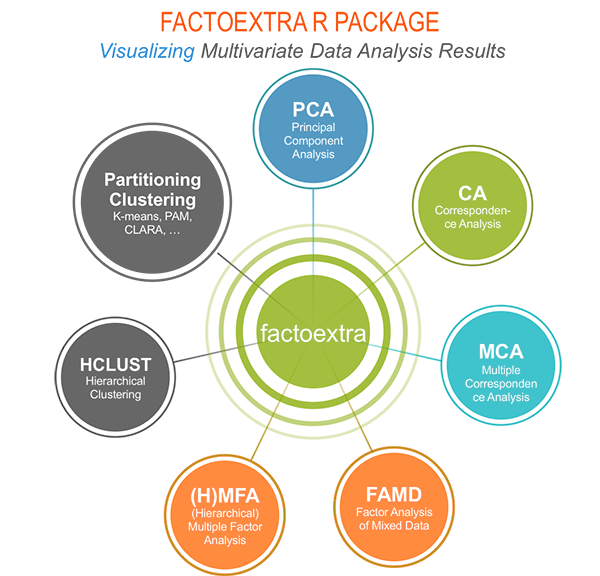
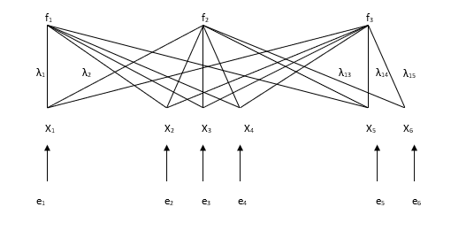
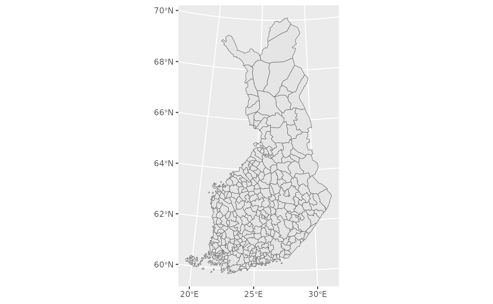
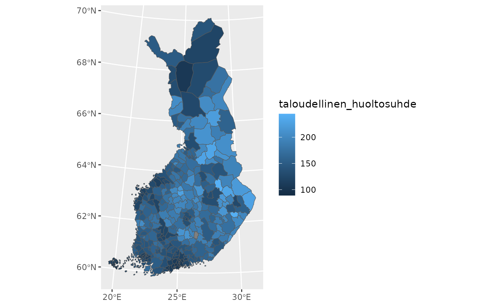
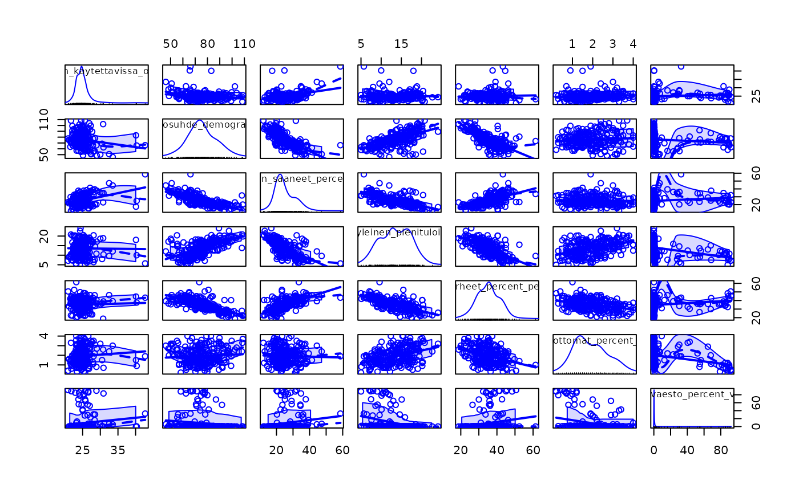
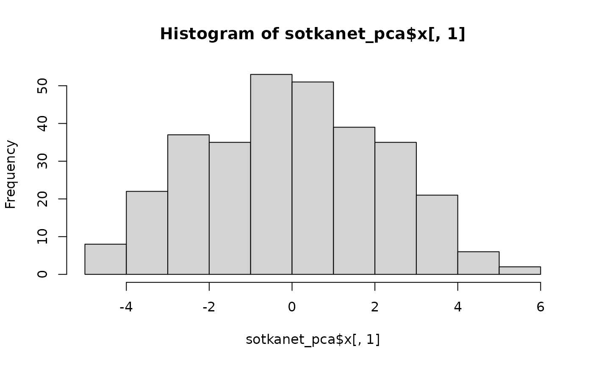
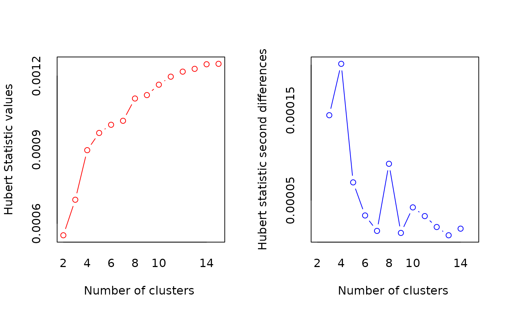
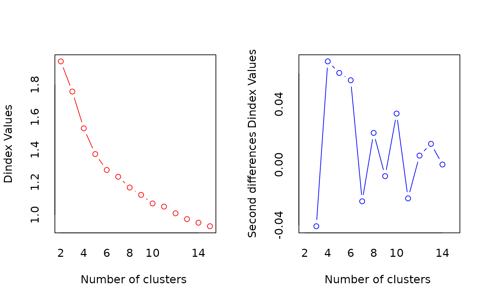
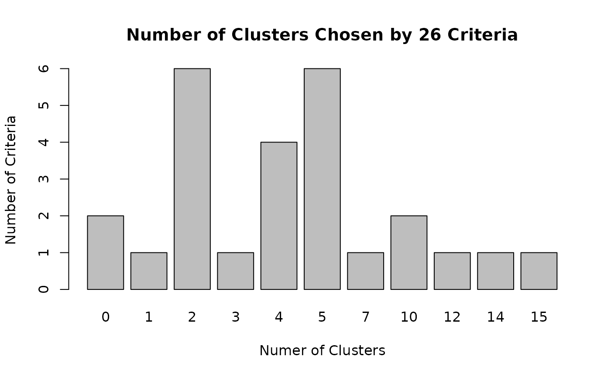
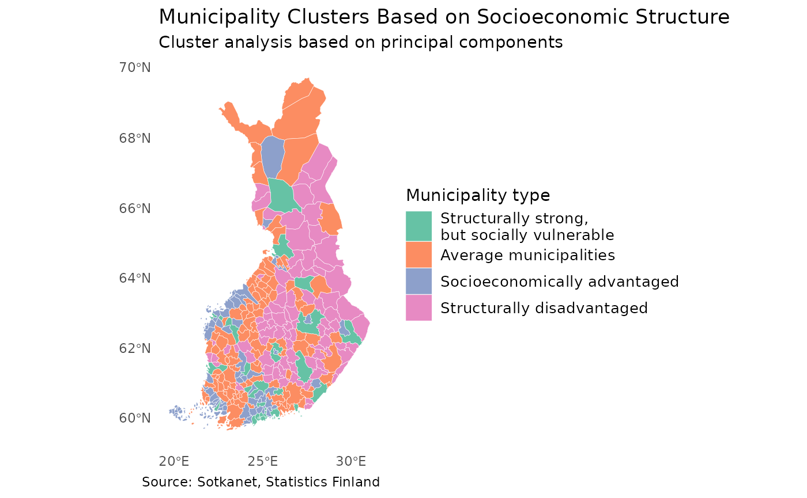

# Lecture 6: Multivariate analysis

## Multivariate analysis

R provides a versatile and powerful environment for multivariate data
analysis. Due to its open-source nature and active user community, R
offers a wide selection of packages that implement both classical and
modern multivariate methods. These methods enable the simultaneous
analysis of multiple variables, making it possible to uncover complex
structures, relationships, and patterns in high-dimensional data.

Commonly used multivariate methods in R include principal component
analysis (PCA), factor analysis, cluster analysis, discriminant
analysis, and multidimensional scaling. These techniques are often
applied for data reduction, classification, grouping, and visualization,
especially when dealing with large and correlated datasets. Packages
such as stats, psych, FactoMineR, and cluster provide well-established
tools for these purposes and are widely used in teaching and research.


In addition to classical techniques, R also supports more advanced
multivariate approaches, such as canonical correlation analysis,
correspondence analysis, structural equation modeling, and multivariate
regression. Furthermore, modern machine learning–oriented multivariate
methods, including random forests, support vector machines, and neural
networks, are available through packages such as caret, tidymodels, and
mlr3. These methods are particularly useful when the primary aim is
prediction rather than explanation.

One of R’s key strengths in multivariate analysis lies in its
visualization capabilities. Packages like ggplot2, factoextra, and
GGally allow researchers to explore multivariate relationships
graphically, which greatly aids interpretation and communication of
results. Visual tools such as biplots, scatterplot matrices, and cluster
dendrograms are especially valuable in understanding the structure of
complex datasets.

For instance, factoextra is an R package making easy to extract and
visualize the output of exploratory multivariate data analyses,
including:

- Principal Component Analysis (PCA), which is used to summarize the
  information contained in a continuous (i.e, quantitative) multivariate
  data by reducing the dimensionality of the data without loosing
  important information.

- Correspondence Analysis (CA), which is an extension of the principal
  component analysis suited to analyse a large contingency table formed
  by two qualitative variables (or categorical data).

- Multiple Correspondence Analysis (MCA), which is an adaptation of CA
  to a data table containing more than two categorical variables.

- Multiple Factor Analysis (MFA) dedicated to datasets where variables
  are organized into groups (qualitative and/or quantitative variables).

- Hierarchical Multiple Factor Analysis (HMFA): An extension of MFA in a
  situation where the data are organized into a hierarchical structure.

- Factor Analysis of Mixed Data (FAMD), a particular case of the MFA,
  dedicated to analyze a data set containing both quantitative and
  qualitative variables.



You can find more information about factoextra here:

<https://rpkgs.datanovia.com/factoextra/index.html>

In this lecture, we will go through principal component analysis and
cluster analysis.

## Principal component analysis

The idea of principal component analysis (PCA) is to identify linear
combinations of the original variables that describe the variability of
the variables included in the linear combination. In principal component
analysis, new variables are constructed in such a way that each
component explains as much of the variation in the variables as
possible. The first principal component explains as much of the total
variation in the variables as possible, the second principal component
explains as much as possible of the remaining variation, and so on. The
resulting principal components are uncorrelated with one another.

In principal component analysis, the extracted components generally take
the form

$$PC^{(m)} = w_{1}^{(m)}X_{1} + w_{2}^{(m)}X_{2} + \ldots + w_{p}^{(m)}X_{p}$$

and they have the largest variance among those linear combinations that
are uncorrelated with the previously extracted principal components. In
general, the coefficients (w) are chosen so as to maximize the ratio of
the variance of the principal component to the total variance.

Idea of PCA: 

In principal component analysis, it is possible to extract as many
components as there are variables. However, when analyzing empirical
data, one is usually not interested in all principal components but
rather in a “sufficient number” that adequately describes the original
variables used in the analysis. Generally, the number of components is
selected using the same criteria as in factor analysis, namely based on
eigenvalues and explained variance. In principal component analysis, the
eigenvalue criterion has a sensible justification. Since eigenvalues
correspond to the variances of the principal components, it is
reasonable to interpret only those components whose eigenvalue is
greater than one, because the variances of individual standardized
variables are equal to one. Thus, it is not sensible to include in the
analysis components whose variance is smaller than that of a single
variable.

Principal component analysis is conducted in the same way as factor
analysis. Rotation can be applied to principal components just as it is
to factors. Rotation facilitates the interpretation of components, as in
factor analysis. In interpretation, the aim is to name the components in
a way that indicates the source of the correlations between variables.
In interpreting correlations among variables, the objective is not to
infer causal relationships.

### Example: Principal component analysis with R

#### 1. Introduction

In this example, we demonstrate how to download municipal-level data
from **Sotkanet**, reshape and clean the data, join it with spatial
municipality data, visualize it on a map, and finally explore
relationships between variables using multivariate methods.

#### 2. Downloading Data from Sotkanet

We begin by downloading indicator data from the Sotkanet database.  
Sotkanet provides a wide range of socioeconomic and health-related
indicators for Finland.

``` r
# Load the sotkanet package
library(sotkanet)

# Download selected indicators for year 2019 at municipality level
data <- GetDataSotkanet(
  indicators = c(181, 3562, 5, 1275, 3099, 182, 761, 3195,
    3076, 453, 179, 304, 313, 2320, 2343, 3126),
  years = 2019,  region.category = "KUNTA")
```

#### 3. Selecting and Reshaping the Data

Next, we select only the relevant columns and reshape the data from long
format to wide format so that each indicator becomes its own variable.

``` r
data2<-data[,c(5,7,9)] #select only some columns from data
table(data2$indicator.title.fi)
```

    ## 
    ##                   Avioeroja 25 - 64-vuotiailla / 1 000 vastaavan ikäistä naimisissa olevaa 
    ##                                                                                        308 
    ##                                                   Gini-kerroin, käytettävissä olevat tulot 
    ##                                                                                        308 
    ##                                                                  Huoltosuhde, demografinen 
    ##                                                                                        308 
    ##                                Korkea-asteen koulutuksen saaneet, % 20 vuotta täyttäneistä 
    ##                                                                                        308 
    ##                                                          Kunnan yleinen pienituloisuusaste 
    ##                                                                                        305 
    ##                                                                  Lapsiperheet, % perheistä 
    ##                                                                                        308 
    ##                                                        Pitkäaikaistyöttömät, % työvoimasta 
    ##                                                                                        296 
    ##                                                 Ruotsinkielinen väestö, % väestöstä 31.12. 
    ##                                                                                        250 
    ##                                                                  Taloudellinen huoltosuhde 
    ##                                                                                        308 
    ##        Täyttä kansaneläkettä saaneet 65 vuotta täyttäneet, % vastaavan ikäisestä väestöstä 
    ##                                                                                        296 
    ## Toimeentulotukea pitkäaikaisesti saaneet 18 - 24-vuotiaat, % vastaavan ikäisestä väestöstä 
    ##                                                                                        143 
    ##                 Toimeentulotukea saaneet 25 - 64-vuotiaat, % vastaavan ikäisestä väestöstä 
    ##                                                                                        302 
    ##                                                            Toimeentulotuki, euroa / asukas 
    ##                                                                                        305 
    ##                                                                   Työttömät, % työvoimasta 
    ##                                                                                        303 
    ##                                     Yleistä asumistukea saaneet yhteensä, % asuntokunnista 
    ##                                                                                        302

We use the reshape2 package to perform the transformation.

``` r
?reshape2::dcast
dat <- reshape2::dcast(data2,  region.code ~ indicator.title.fi, value.var = "primary.value")
dat$region.code<-as.numeric(dat$region.code) #change code to numeric

class(dat)
```

    ## [1] "data.frame"

``` r
names(dat)
```

    ##  [1] "region.code"                                                                               
    ##  [2] "Avioeroja 25 - 64-vuotiailla / 1 000 vastaavan ikäistä naimisissa olevaa"                  
    ##  [3] "Gini-kerroin, käytettävissä olevat tulot"                                                  
    ##  [4] "Huoltosuhde, demografinen"                                                                 
    ##  [5] "Korkea-asteen koulutuksen saaneet, % 20 vuotta täyttäneistä"                               
    ##  [6] "Kunnan yleinen pienituloisuusaste"                                                         
    ##  [7] "Lapsiperheet, % perheistä"                                                                 
    ##  [8] "Pitkäaikaistyöttömät, % työvoimasta"                                                       
    ##  [9] "Ruotsinkielinen väestö, % väestöstä 31.12."                                                
    ## [10] "Taloudellinen huoltosuhde"                                                                 
    ## [11] "Täyttä kansaneläkettä saaneet 65 vuotta täyttäneet, % vastaavan ikäisestä väestöstä"       
    ## [12] "Toimeentulotukea pitkäaikaisesti saaneet 18 - 24-vuotiaat, % vastaavan ikäisestä väestöstä"
    ## [13] "Toimeentulotukea saaneet 25 - 64-vuotiaat, % vastaavan ikäisestä väestöstä"                
    ## [14] "Toimeentulotuki, euroa / asukas"                                                           
    ## [15] "Työttömät, % työvoimasta"                                                                  
    ## [16] "Yleistä asumistukea saaneet yhteensä, % asuntokunnista"

#### 4. Cleaning Variable Names and Data Types

To make variable names easier to work with, we clean them and ensure
that all variables are numeric.

``` r
dat<-clean_names(dat) # clean column names of our dataframe
names(dat)
```

    ##  [1] "region_code"                                                                                  
    ##  [2] "avioeroja_25_64_vuotiailla_1_000_vastaavan_ikaista_naimisissa_olevaa"                         
    ##  [3] "gini_kerroin_kaytettavissa_olevat_tulot"                                                      
    ##  [4] "huoltosuhde_demografinen"                                                                     
    ##  [5] "korkea_asteen_koulutuksen_saaneet_percent_20_vuotta_tayttaneista"                             
    ##  [6] "kunnan_yleinen_pienituloisuusaste"                                                            
    ##  [7] "lapsiperheet_percent_perheista"                                                               
    ##  [8] "pitkaaikaistyottomat_percent_tyovoimasta"                                                     
    ##  [9] "ruotsinkielinen_vaesto_percent_vaestosta_31_12"                                               
    ## [10] "taloudellinen_huoltosuhde"                                                                    
    ## [11] "taytta_kansanelaketta_saaneet_65_vuotta_tayttaneet_percent_vastaavan_ikaisesta_vaestosta"     
    ## [12] "toimeentulotukea_pitkaaikaisesti_saaneet_18_24_vuotiaat_percent_vastaavan_ikaisesta_vaestosta"
    ## [13] "toimeentulotukea_saaneet_25_64_vuotiaat_percent_vastaavan_ikaisesta_vaestosta"                
    ## [14] "toimeentulotuki_euroa_asukas"                                                                 
    ## [15] "tyottomat_percent_tyovoimasta"                                                                
    ## [16] "yleista_asumistukea_saaneet_yhteensa_percent_asuntokunnista"

``` r
dat2<-data.frame(lapply(dat,as.numeric))
```

#### 5. Loading Spatial Municipality Data

To visualize the indicators spatially, we download municipality
boundaries.

``` r
municipalities23 <- geofi::get_municipalities(year = 2023)
```

    ## Requesting response from: https://geo.stat.fi/geoserver/wfs?service=WFS&version=1.0.0&request=getFeature&typename=tilastointialueet%3Akunta4500k_2023

    ## Warning: Coercing CRS to epsg:3067 (ETRS89 / TM35FIN)

    ## Data is licensed under: Attribution 4.0 International (CC BY 4.0)

#### 6. Joining Attribute Data with Spatial Data

We join the Sotkanet indicators to the municipality geometry using a
left join. This keeps all spatial units even if some attribute values
are missing.

``` r
map <- left_join(municipalities23,dat2, by = c("kunta" = "region_code")) # why we use left_join?
```

#### 7. Visualizing the Data

We can now visualize the spatial data using ggplot2 and simple maps.

``` r
ggplot(map)+geom_sf()
```



``` r
ggplot(map, aes(fill = taloudellinen_huoltosuhde)) + geom_sf()
```



#### 8. Preparing Data for Multivariate Analysis

Before performing multivariate analysis, we select a subset of variables
and inspect their distributions.

``` r
map2<-data.frame(map[,c(2,73:87)])
summary(map2)
```

    ##        id      gini_kerroin_kaytettavissa_olevat_tulot huoltosuhde_demografinen
    ##  Min.   :  1   Min.   :20.9                            Min.   : 46.10          
    ##  1st Qu.: 78   1st Qu.:23.5                            1st Qu.: 70.00          
    ##  Median :155   Median :24.6                            Median : 77.55          
    ##  Mean   :155   Mean   :24.9                            Mean   : 78.11          
    ##  3rd Qu.:232   3rd Qu.:25.6                            3rd Qu.: 86.50          
    ##  Max.   :309   Max.   :42.7                            Max.   :110.10          
    ##                NA's   :1                               NA's   :1               
    ##  korkea_asteen_koulutuksen_saaneet_percent_20_vuotta_tayttaneista
    ##  Min.   :12.10                                                   
    ##  1st Qu.:19.38                                                   
    ##  Median :22.65                                                   
    ##  Mean   :23.91                                                   
    ##  3rd Qu.:27.15                                                   
    ##  Max.   :58.60                                                   
    ##  NA's   :1                                                       
    ##  kunnan_yleinen_pienituloisuusaste lapsiperheet_percent_perheista
    ##  Min.   : 5.00                     Min.   : 9.50                 
    ##  1st Qu.:11.30                     1st Qu.:29.07                 
    ##  Median :14.60                     Median :33.70                 
    ##  Mean   :14.25                     Mean   :33.83                 
    ##  3rd Qu.:17.20                     3rd Qu.:38.33                 
    ##  Max.   :24.10                     Max.   :61.40                 
    ##  NA's   :4                         NA's   :1                     
    ##  pitkaaikaistyottomat_percent_tyovoimasta
    ##  Min.   :0.000                           
    ##  1st Qu.:1.300                           
    ##  Median :1.900                           
    ##  Mean   :1.975                           
    ##  3rd Qu.:2.600                           
    ##  Max.   :4.300                           
    ##  NA's   :13                              
    ##  ruotsinkielinen_vaesto_percent_vaestosta_31_12 taloudellinen_huoltosuhde
    ##  Min.   : 0.000                                 Min.   : 89.0            
    ##  1st Qu.: 0.200                                 1st Qu.:132.5            
    ##  Median : 0.300                                 Median :156.8            
    ##  Mean   :11.724                                 Mean   :158.7            
    ##  3rd Qu.: 1.375                                 3rd Qu.:182.7            
    ##  Max.   :95.500                                 Max.   :244.5            
    ##  NA's   :59                                     NA's   :1                
    ##  taytta_kansanelaketta_saaneet_65_vuotta_tayttaneet_percent_vastaavan_ikaisesta_vaestosta
    ##  Min.   :0.600                                                                           
    ##  1st Qu.:1.300                                                                           
    ##  Median :1.700                                                                           
    ##  Mean   :1.796                                                                           
    ##  3rd Qu.:2.200                                                                           
    ##  Max.   :4.800                                                                           
    ##  NA's   :13                                                                              
    ##  toimeentulotukea_pitkaaikaisesti_saaneet_18_24_vuotiaat_percent_vastaavan_ikaisesta_vaestosta
    ##  Min.   :0.700                                                                                
    ##  1st Qu.:1.900                                                                                
    ##  Median :2.600                                                                                
    ##  Mean   :2.669                                                                                
    ##  3rd Qu.:3.350                                                                                
    ##  Max.   :5.700                                                                                
    ##  NA's   :166                                                                                  
    ##  toimeentulotukea_saaneet_25_64_vuotiaat_percent_vastaavan_ikaisesta_vaestosta
    ##  Min.   : 0.800                                                               
    ##  1st Qu.: 5.300                                                               
    ##  Median : 6.600                                                               
    ##  Mean   : 6.821                                                               
    ##  3rd Qu.: 8.275                                                               
    ##  Max.   :13.900                                                               
    ##  NA's   :7                                                                    
    ##  toimeentulotuki_euroa_asukas tyottomat_percent_tyovoimasta
    ##  Min.   :  0.60               Min.   : 1.900               
    ##  1st Qu.: 52.50               1st Qu.: 6.600               
    ##  Median : 73.50               Median : 8.200               
    ##  Mean   : 78.93               Mean   : 8.525               
    ##  3rd Qu.: 93.20               3rd Qu.:10.300               
    ##  Max.   :239.40               Max.   :17.400               
    ##  NA's   :4                    NA's   :6                    
    ##  yleista_asumistukea_saaneet_yhteensa_percent_asuntokunnista
    ##  Min.   : 1.400                                             
    ##  1st Qu.: 4.225                                             
    ##  Median : 5.600                                             
    ##  Mean   : 6.607                                             
    ##  3rd Qu.: 7.475                                             
    ##  Max.   :25.800                                             
    ##  NA's   :7                                                  
    ##             geom    
    ##  MULTIPOLYGON :309  
    ##  epsg:3067    :  0  
    ##  +proj=utm ...:  0  
    ##                     
    ##                     
    ##                     
    ## 

#### 9. Exploring Relationships Between Variables

Scatterplot matrices help us explore correlations and relationships
between variables, which is a key step before applying methods such as
principal component analysis or cluster analysis.

``` r
map3<-map2[,c(1:10,14,15,16)]
scatterplotMatrix(map3[,2:8])
```



#### 10. Principal Component Analysis (PCA)

Next, we apply **principal component analysis (PCA)** to reduce the
dimensionality of the data and to identify the main latent dimensions
underlying the socioeconomic variables.

PCA transforms a set of correlated variables into a smaller number of
uncorrelated components that explain as much of the total variance as
possible.

##### 10.1 Preparing Data for PCA

We select the variables to be included in the PCA. The first column is
an identifier, so it is excluded from the analysis.

``` r
# Select variables for PCA
data_pca <- map3[, 2:13]
```

Before performing PCA, missing values must be handled. Here, we replace
missing values with the mean of each variable, which is a common and
simple imputation approach for exploratory analysis.

``` r
data_pca2<-data_pca%>%mutate_all(~ifelse(is.na(.x),mean(.x,na.rm=T),.x))
data_pca2 <- data_pca2 %>% select(-geom)
```

##### 10.2 Running the PCA

We use the prcomp() function to perform PCA. The variables are
standardized (scale = TRUE) so that they contribute equally to the
analysis.

``` r
sotkanet_pca <- prcomp(data_pca2, scale=T) 
summary(sotkanet_pca)
```

    ## Importance of components:
    ##                           PC1    PC2     PC3    PC4     PC5     PC6     PC7
    ## Standard deviation     2.2108 1.4748 1.04589 0.8655 0.83808 0.64151 0.61040
    ## Proportion of Variance 0.4443 0.1977 0.09944 0.0681 0.06385 0.03741 0.03387
    ## Cumulative Proportion  0.4443 0.6421 0.74151 0.8096 0.87346 0.91087 0.94475
    ##                            PC8     PC9    PC10    PC11
    ## Standard deviation     0.54626 0.42515 0.28980 0.21130
    ## Proportion of Variance 0.02713 0.01643 0.00764 0.00406
    ## Cumulative Proportion  0.97187 0.98831 0.99594 1.00000

``` r
names(sotkanet_pca)
```

    ## [1] "sdev"     "rotation" "center"   "scale"    "x"

##### 10.3 Choosing the Number of Components

A scree plot helps determine how many components should be retained by
visualizing the eigenvalues.

``` r
screeplot(sotkanet_pca, type="lines")
```


Typically, components with eigenvalues greater than one or those before
the “elbow” in the scree plot are selected for interpretation.

##### 10.4 Interpreting Component Loadings

Component loadings show how strongly each variable contributes to a
principal component.

``` r
sotkanet_pca$rotation[,1] # Socioeconomic wellbeing
```

    ##                                                  gini_kerroin_kaytettavissa_olevat_tulot 
    ##                                                                               0.09551678 
    ##                                                                 huoltosuhde_demografinen 
    ##                                                                              -0.36489578 
    ##                         korkea_asteen_koulutuksen_saaneet_percent_20_vuotta_tayttaneista 
    ##                                                                               0.35119868 
    ##                                                        kunnan_yleinen_pienituloisuusaste 
    ##                                                                              -0.39976752 
    ##                                                           lapsiperheet_percent_perheista 
    ##                                                                               0.35249230 
    ##                                                 pitkaaikaistyottomat_percent_tyovoimasta 
    ##                                                                              -0.21704459 
    ##                                           ruotsinkielinen_vaesto_percent_vaestosta_31_12 
    ##                                                                               0.14637741 
    ##                                                                taloudellinen_huoltosuhde 
    ##                                                                              -0.42391491 
    ## taytta_kansanelaketta_saaneet_65_vuotta_tayttaneet_percent_vastaavan_ikaisesta_vaestosta 
    ##                                                                              -0.30519614 
    ##                                                            tyottomat_percent_tyovoimasta 
    ##                                                                              -0.32215778 
    ##                              yleista_asumistukea_saaneet_yhteensa_percent_asuntokunnista 
    ##                                                                               0.07178681

``` r
sotkanet_pca$rotation[,2] # Labour market disadvantage
```

    ##                                                  gini_kerroin_kaytettavissa_olevat_tulot 
    ##                                                                              0.203621044 
    ##                                                                 huoltosuhde_demografinen 
    ##                                                                             -0.288142127 
    ##                         korkea_asteen_koulutuksen_saaneet_percent_20_vuotta_tayttaneista 
    ##                                                                              0.269501425 
    ##                                                        kunnan_yleinen_pienituloisuusaste 
    ##                                                                              0.115563937 
    ##                                                           lapsiperheet_percent_perheista 
    ##                                                                              0.078378808 
    ##                                                 pitkaaikaistyottomat_percent_tyovoimasta 
    ##                                                                              0.433718217 
    ##                                           ruotsinkielinen_vaesto_percent_vaestosta_31_12 
    ##                                                                             -0.306052157 
    ##                                                                taloudellinen_huoltosuhde 
    ##                                                                              0.005877142 
    ## taytta_kansanelaketta_saaneet_65_vuotta_tayttaneet_percent_vastaavan_ikaisesta_vaestosta 
    ##                                                                             -0.079502654 
    ##                                                            tyottomat_percent_tyovoimasta 
    ##                                                                              0.389774011 
    ##                              yleista_asumistukea_saaneet_yhteensa_percent_asuntokunnista 
    ##                                                                              0.585939330

``` r
sotkanet_pca$rotation[,3] # Inequality–language structure
```

    ##                                                  gini_kerroin_kaytettavissa_olevat_tulot 
    ##                                                                               0.77777582 
    ##                                                                 huoltosuhde_demografinen 
    ##                                                                               0.12423430 
    ##                         korkea_asteen_koulutuksen_saaneet_percent_20_vuotta_tayttaneista 
    ##                                                                               0.14319815 
    ##                                                        kunnan_yleinen_pienituloisuusaste 
    ##                                                                               0.10359157 
    ##                                                           lapsiperheet_percent_perheista 
    ##                                                                              -0.30341102 
    ##                                                 pitkaaikaistyottomat_percent_tyovoimasta 
    ##                                                                               0.05165542 
    ##                                           ruotsinkielinen_vaesto_percent_vaestosta_31_12 
    ##                                                                               0.48232097 
    ##                                                                taloudellinen_huoltosuhde 
    ##                                                                              -0.02186488 
    ## taytta_kansanelaketta_saaneet_65_vuotta_tayttaneet_percent_vastaavan_ikaisesta_vaestosta 
    ##                                                                               0.10409846 
    ##                                                            tyottomat_percent_tyovoimasta 
    ##                                                                              -0.09233098 
    ##                              yleista_asumistukea_saaneet_yhteensa_percent_asuntokunnista 
    ##                                                                               0.03455537

Based on the loadings, the components can be interpreted, for example
as:

- PC1: “Socioeconomic wellbeing” component
- PC2: “Labour market disadvantage” component
- PC3: “Inequality–language structure” component

Note that:

- the naming of components is not unambiguous
- the interpretation of components is data-dependent
- different researchers may arrive at slightly different names, as long
  as the interpretations are well justified

It is important to emphasize that the naming of principal components is
not unique or objective. Component interpretation is always dependent on
the dataset, the variables included, and the research context. As a
result, different researchers may assign slightly different names to the
same components. This is not a problem, provided that the naming is
clearly justified by the loadings and supported by substantive reasoning
rather than imposed arbitrarily.

##### 10.5 Component Scores

Component scores describe how each municipality is positioned along the
principal components.

``` r
sotkanet_pca$x[,1]; hist(sotkanet_pca$x[,1])
```

    ##   [1] -0.855602370  0.157472034 -0.387307872 -0.338238849  1.819452451
    ##   [6]  2.402040141  1.103471725  2.266306999  2.408364113 -2.888037377
    ##  [11] -0.941026532  4.505935112  0.706171644  1.777555249 -0.232375950
    ##  [16]  3.393451504 -0.545769495 -1.513981958  1.066740810  1.725761100
    ##  [21] -0.654860439 -0.807410994 -1.125964464 -1.084561819 -0.362426531
    ##  [26]  2.882739952 -1.962227704  0.323948511 -0.624320544 -2.540640538
    ##  [31]  2.535903598  2.773388685 -3.631169367  3.548055347  3.288599148
    ##  [36] -1.989247856 -4.091513051  1.668070809  0.588156034 -0.266602835
    ##  [41] -3.653208813  2.311176519  1.355167414  1.139661101 -1.519952253
    ##  [46] -0.510831201 -0.514238441 -0.555641262 -0.141571868  2.060053800
    ##  [51] -4.727736716  0.538120074  1.162002639  2.943128315 -1.035825036
    ##  [56]  0.798757507 -1.057012229  1.661768598  0.103085783  1.083171333
    ##  [61]  5.518658475  0.300108112 -2.883828222 -4.915573534 -0.204085863
    ##  [66] -1.631406681  1.522798372 -0.034314979 -1.357995713  3.189628901
    ##  [71]  3.767128144  0.931245557  2.976762569 -1.997974188 -0.733133105
    ##  [76] -2.739828390  0.584846604 -1.667300189  0.493075613 -2.310789900
    ##  [81] -1.596464351 -1.102673525  0.017946673  0.508226632  5.358952398
    ##  [86]  1.395873942 -2.269169036 -1.438577543  1.650021914  3.511294139
    ##  [91]  2.686936528 -0.986369362 -3.543760162  4.088482034 -2.918866659
    ##  [96]  2.014223764 -2.116460973 -4.674615578 -0.950045790  1.652604171
    ## [101]  0.265379849 -2.038408498  2.444449522  2.196284391 -0.473482751
    ## [106] -0.634805446 -2.411280663 -0.304251540 -2.387847418 -0.260888681
    ## [111]  0.178935227  2.566723220 -3.065918904 -3.936849493  0.849576054
    ## [116]  1.409074719  0.054420213 -0.040106750 -1.191586909 -0.325455674
    ## [121] -3.235520289  2.717494713 -0.748441666 -2.448384599  0.098956749
    ## [126]  0.163419708  2.058146976  1.584594723 -1.148274994 -1.120383424
    ## [131]  1.093430762  0.126758770  1.537347414  1.088465157  0.738894388
    ## [136]  4.553038833  3.552926111  0.647567557 -0.447356582 -1.182949270
    ## [141] -3.801490110  3.713114609  3.028920372  0.675667152 -0.089192285
    ## [146]  1.507837174  0.553916427 -2.125653297  0.084060835  1.504660149
    ## [151]  3.654881171 -1.154061326  1.756073189  2.508237597  1.872056047
    ## [156]  4.027588241 -0.007355454  3.624823897 -2.684246586 -3.350700147
    ## [161] -2.685012554  0.690609943 -2.365502372  0.245825841  3.836292035
    ## [166]  3.612427382  1.464274003 -1.222294286  2.829610072 -2.258703096
    ## [171] -1.000027774  2.962945058  0.212339263 -0.363116539  2.300123901
    ## [176] -2.998780972  3.657185933  2.184864896  0.529340530  0.627766405
    ## [181]  0.125992276 -0.979782170  1.840013562 -3.009079461  3.035907833
    ## [186] -2.698642598 -2.896072111 -1.260182810 -2.046198733 -1.727270349
    ## [191]  0.000000000 -0.532741042 -3.193865045 -0.639863937 -3.126754826
    ## [196]  1.818789966  3.769863120 -2.374341345  4.158212578 -3.786985234
    ## [201] -1.888658437  0.335919202  3.462371204 -4.298818778 -3.416128669
    ## [206]  0.632998329 -0.824328044 -4.155404843 -2.275029560 -0.519258495
    ## [211]  0.929018136 -0.577903662 -2.611298239 -0.651051394  1.315409332
    ## [216]  0.218085862  0.893758737  2.552047802 -0.362101783  2.530797654
    ## [221] -1.506824361 -2.858269690  1.416631026 -2.216554318 -4.720224393
    ## [226]  2.048353805 -2.395411682  1.947078772 -0.841532074 -1.526595730
    ## [231]  3.714069547 -4.945970707  1.309605363 -2.732727066 -3.091785889
    ## [236]  0.412789019  3.009715245  1.804978954 -2.011821436 -0.979777478
    ## [241] -3.135812471  2.737990909 -0.127509543 -3.608700068 -0.625961817
    ## [246]  2.397703136 -0.501010159  4.103023788  3.543736596  0.989566987
    ## [251] -1.521793133 -0.166943265 -2.218249118  0.717877747  0.998373003
    ## [256] -2.998124538  2.385600370 -3.082687765 -0.801610234 -2.943373734
    ## [261]  0.682364183 -3.089867091  0.101994869 -1.892227381  2.160748907
    ## [266] -2.448002443 -0.196483108  1.343627886  1.948122465 -3.253977224
    ## [271] -1.504379922 -0.841162570 -2.880442996 -0.698236472  0.103630958
    ## [276]  0.799723702  1.390880659 -2.677582451 -3.293325129  3.841632424
    ## [281]  0.754521880  1.148031476 -1.637729215 -2.192283644  0.738078465
    ## [286]  0.417210400  2.612533072  1.058836987  2.487630306  0.758286351
    ## [291] -1.254342411  0.422373405 -3.855967353  2.435908846 -0.126887431
    ## [296]  0.110862534  2.793339842 -2.185255580  0.670435454 -1.733043687
    ## [301] -1.403098210  1.787810439  2.664568087 -3.108331478  1.277486855
    ## [306]  2.888405389 -0.017120626 -0.994747353 -1.576751006



##### 10.6 Saving PCA Results to Spatial Data

Finally, we attach the first three principal component scores to the
spatial dataset. This allows the components to be visualized on maps or
used in further spatial analysis.

``` r
map3$pca1<-sotkanet_pca$x[,1]
map3$pca2<-sotkanet_pca$x[,2]
map3$pca3<-sotkanet_pca$x[,3]
```

##### 10.7 Summary

In this section, we:

- Prepared multivariate data for PCA
- Handled missing values
- Performed principal component analysis
- Selected and interpreted principal components
- Stored component scores for further analysis and mapping

PCA is a powerful exploratory tool for simplifying complex datasets and
revealing hidden structures in multivariate data.

## Cluster analysis

#### 11. Cluster Analysis

After reducing the dimensionality of the data using principal component
analysis, we proceed with **cluster analysis**.  
Clustering allows us to group municipalities into internally similar but
mutually distinct groups based on their socioeconomic profiles.

In this example, we use **k-means clustering** applied to the first
three principal components.

##### 11.1 Preparing Data for Clustering

We select the PCA scores that were previously added to the spatial data
object.

``` r
# Select PCA scores for clustering
df <- map3[, 14:16]
```

##### 11.2 Choosing the Number of Clusters

Before running k-means clustering, we explore an appropriate number of
clusters using the NbClust package. This package evaluates multiple
statistical criteria to suggest an optimal number of clusters.

``` r
#install.packages("NbClust") #factoextra
library(NbClust)
#set.seed(1234)
```

We examine how often different cluster numbers are recommended.

``` r
nc <- NbClust(df, min.nc=2, max.nc=15, method="kmeans")
```



    ## *** : The Hubert index is a graphical method of determining the number of clusters.
    ##                 In the plot of Hubert index, we seek a significant knee that corresponds to a 
    ##                 significant increase of the value of the measure i.e the significant peak in Hubert
    ##                 index second differences plot. 
    ## 



    ## *** : The D index is a graphical method of determining the number of clusters. 
    ##                 In the plot of D index, we seek a significant knee (the significant peak in Dindex
    ##                 second differences plot) that corresponds to a significant increase of the value of
    ##                 the measure. 
    ##  
    ## ******************************************************************* 
    ## * Among all indices:                                                
    ## * 6 proposed 2 as the best number of clusters 
    ## * 1 proposed 3 as the best number of clusters 
    ## * 4 proposed 4 as the best number of clusters 
    ## * 6 proposed 5 as the best number of clusters 
    ## * 1 proposed 7 as the best number of clusters 
    ## * 2 proposed 10 as the best number of clusters 
    ## * 1 proposed 12 as the best number of clusters 
    ## * 1 proposed 14 as the best number of clusters 
    ## * 1 proposed 15 as the best number of clusters 
    ## 
    ##                    ***** Conclusion *****                            
    ##  
    ## * According to the majority rule, the best number of clusters is  2 
    ##  
    ##  
    ## *******************************************************************

``` r
table(nc$Best.n[1,])
```

    ## 
    ##  0  1  2  3  4  5  7 10 12 14 15 
    ##  2  1  6  1  4  6  1  2  1  1  1

The following bar plot summarizes the results across all criteria.

``` r
barplot(table(nc$Best.n[1,]), xlab="Numer of Clusters", 
        ylab="Number of Criteria", main="Number of Clusters Chosen by 26 Criteria")
```



Based on this evaluation, we proceed with four clusters.

##### 11.3 Performing k-Means Clustering

We apply k-means clustering with four clusters. Multiple random starts
are used to improve solution stability.

``` r
fit.km <- kmeans(df, 4, nstart=25)    
names(fit.km)
```

    ## [1] "cluster"      "centers"      "totss"        "withinss"     "tot.withinss"
    ## [6] "betweenss"    "size"         "iter"         "ifault"

Cluster sizes and cluster centers provide insight into the structure of
the solution.

``` r
fit.km$size
```

    ## [1]  25 124  73  87

``` r
fit.km$centers   
```

    ##          pca1        pca2        pca3
    ## 1  2.03466909  3.32239145  0.53500740
    ## 2 -0.06249417 -0.25828424 -0.25037615
    ## 3  2.64403006 -0.78610682  0.01308459
    ## 4 -2.71415683  0.07302595  0.19214118

We can also compute the mean values of the input variables by cluster.

``` r
aggregate(df, by=list(cluster=fit.km$cluster), mean)
```

    ##   cluster        pca1        pca2        pca3
    ## 1       1  2.03466909  3.32239145  0.53500740
    ## 2       2 -0.06249417 -0.25828424 -0.25037615
    ## 3       3  2.64403006 -0.78610682  0.01308459
    ## 4       4 -2.71415683  0.07302595  0.19214118

##### 11.4 Interpreting the Clusters

Reminder: What the PCA components represent Based on your earlier
interpretation:

PC1 - Socioeconomic well‑being

- High values: high education, low unemployment, low dependency ratios
- Low values: socioeconomically disadvantaged municipalities

PC2 - Labour‑market disadvantage / welfare dependency

- High values: unemployment, long‑term unemployment, housing benefits
- Low values: stronger labour-market position

PC3 - Income inequality & linguistic structure

- High values: high Gini coefficient, higher share of Swedish speakers
- Low values: more equal income distribution, more family‑oriented
  structure

Interpreting and naming the clusters

\*\*Cluster 1\* (High PC1, very high PC2, moderately high PC3)

Profile

- Strong overall socioeconomic structure
- At the same time, high unemployment / welfare dependency
- Some inequality / linguistic‑structural features

Interpretation

- These are structurally strong municipalities that nevertheless face
  labour‑market or social policy challenges — often larger urban
  municipalities.

Suggested names

- “Structurally strong but socially vulnerable municipalities”
- “Urban welfare‑dependent municipalities”

**Cluster 2** (Near zero on all components)

Profile

- Close to the national average on all dimensions
- No dominant structural feature

Interpretation

- These municipalities represent a baseline or reference group.

Suggested names

- “Average municipalities”
- “Middle‑of‑the‑spectrum municipalities”

**Cluster 3** (Very high PC1, low PC2, neutral PC3)

Profile

- Very strong socioeconomic position
- Low unemployment and low welfare dependency
- No strong inequality or linguistic signal

Interpretation - These are the most advantaged municipalities, with
strong labour‑market integration.

Suggested names

- “Socioeconomically advantaged municipalities”
- “High‑performing municipalities”
- “Affluent and well‑integrated municipalities”

**Cluster 4** (Very low PC1, near‑zero PC2, slightly positive PC3)

Profile

- Clear socioeconomic disadvantage
- Not primarily driven by labour‑market stress
- Some inequality / demographic vulnerability

Interpretation

- These are structurally weak municipalities, often rural or peripheral,
  with long‑term socioeconomic challenges rather than acute
  unemployment.

Suggested names

- “Structurally disadvantaged municipalities”
- “Low socioeconomic status municipalities”

These interpretations are illustrative and depend on the specific
variables included in the analysis. Remember that cluster names are
interpretative summaries, not objective truths. The aim is to describe
the dominant position of each group along the principal components, not
to label individual municipalities rigidly.

##### 11.5 Saving Cluster Membership

Next, we store the cluster membership for each municipality in the
spatial dataset.

``` r
cluster=as.vector(fit.km$clus)
map$cluster<- cluster
```

This enables further statistical analysis and spatial visualization.

##### 11.6 Mapping the Clusters

Finally, we visualize the spatial distribution of the clusters on a map.

Clusters are categorical, so convert them to a factor.

``` r
map$cluster <- factor(map$cluster)
```

``` r
cluster_labels <- c(
  "1" = "Structurally strong,\nbut socially vulnerable",
  "2" = "Average municipalities",
  "3" = "Socioeconomically advantaged",
  "4" = "Structurally disadvantaged"
)
```

(Using line breaks makes long names readable in the legend.)

Now use scale_fill_brewer() (or viridis, both are good for maps).

``` r
ggplot(map) +
  geom_sf(aes(fill = cluster), colour = "white", linewidth = 0.1) +
  scale_fill_brewer(
    palette = "Set2",
    name = "Municipality type",
    labels = cluster_labels
  ) +
  theme_minimal() +
  theme(legend.position = "right",
    legend.title = element_text(size = 11),
    legend.text = element_text(size = 10),
    panel.grid = element_blank())+
  labs(title = "Municipality Clusters Based on Socioeconomic Structure",
  subtitle = "Cluster analysis based on principal components",
  caption = "Source: Sotkanet, Statistics Finland")
```



This map reveals clear spatial patterns in the socioeconomic structure
of municipalities.

##### 11.7 Summary

In this section, we:

- Selected PCA scores for clustering
- Determined an appropriate number of clusters
- Performed k-means clustering
- Interpreted and saved cluster memberships
- Tested differences between clusters
- Visualized the results spatially

Cluster analysis, especially when combined with PCA, is a powerful tool
for identifying meaningful regional typologies in multivariate data.
