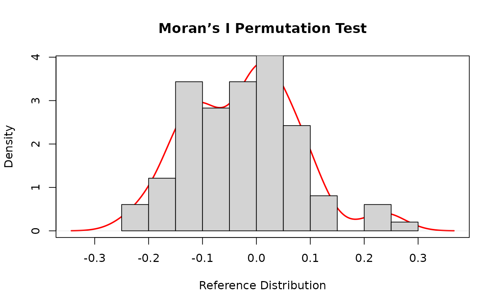
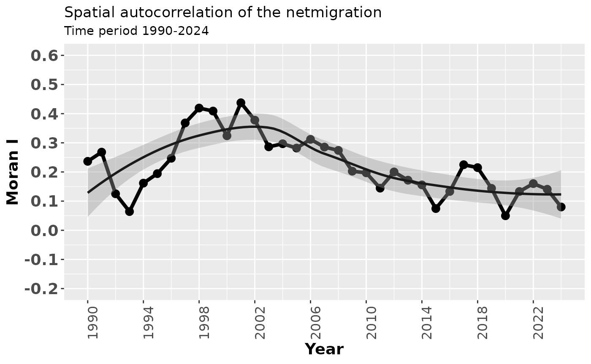
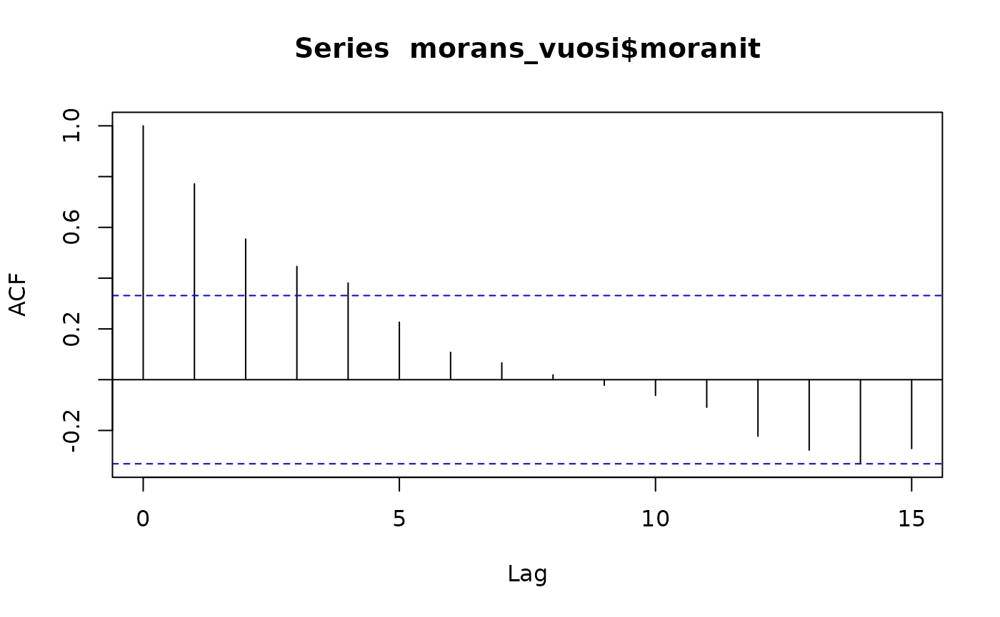
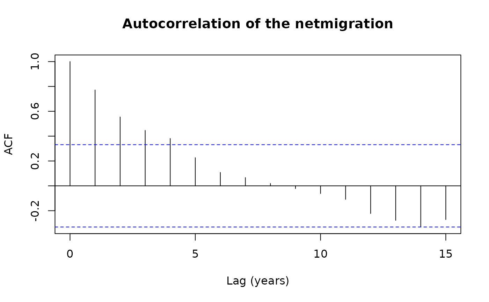
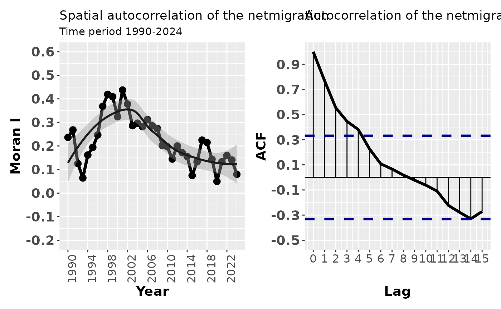
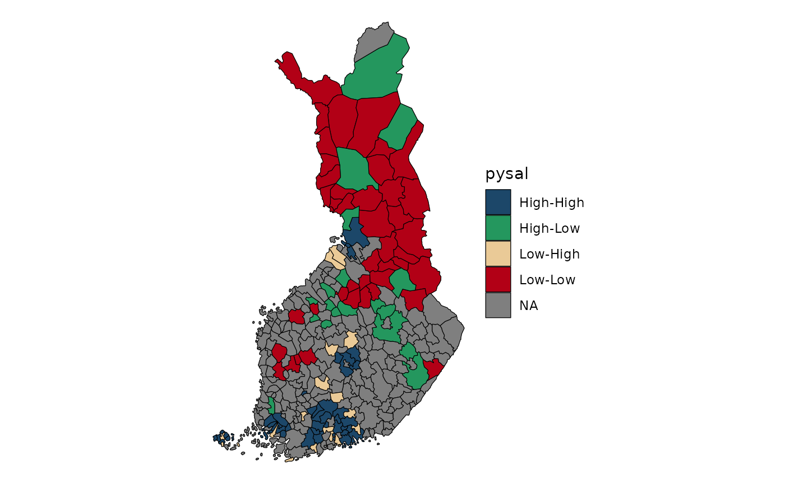

# Lecture 7: Spatial autocorrelation

## Geospatial analysis and spatial autocorrelation

Geospatial analysis comprises statistical and computational methods
developed for data with an explicit spatial dimension. Its aim is to
understand, explain, and model spatial patterns and processes by
incorporating spatial structure directly into the analysis.

A key motivation for geospatial analysis is the presence of spatial
autocorrelation, which violates the assumption of independent and
identically distributed (iid) observations used in classical statistics.
Spatial autocorrelation arises because nearby locations tend to exhibit
similar characteristics—a principle formalized in Tobler’s First Law of
Geography, which states that everything is related to everything else,
but near things are more related than distant things. As a result,
geographic data often display spatial clustering rather than randomness.

Spatial autocorrelation is particularly common in social and regional
data, where demographic and socio‑economic variables (such as income,
unemployment, or migration) tend to be positively spatially
autocorrelated. Geospatial analysis provides tools to detect, model, and
interpret these dependencies using spatial autocorrelation measures and
spatially explicit modelling approaches.

Understanding spatial dependence is essential, as observed spatial
autocorrelation may reflect underlying spatial processes—or
alternatively, model misspecification. Consequently, geospatial
modelling requires careful consideration of spatial structure, scale,
and the definition of spatial relationships.

## Global Spatial Autocorrelation

Geospatial data analysis is challenged by the presence of spatial
dependence among nearby observations. This spatial dependence can be
revealed with spatial autocorrelation. For instance, global spatial
autocorrelation can be measured with Moran’s I, which is an indicator of
spatial proximity used in geography. Moran’s I is a single global
indicator of a large area which does not reveal the detailed clusters
involved in the spatial autocorrelation. Moran I is used in the articles
I and V.

Spatial autocorrelation is when the value at any one point in space is
dependent on values at the surrounding points. That is, the arrangement
of values is not just random. Positive spatial correlation means that
similar values tend to be near each other. Negative spatial correlation
means that different values tend to be near each other.

Moran’s I is calculated as:

$$I = \frac{n\sum\limits_{i = 1}^{n}\sum\limits_{j = 1}^{n}w_{ij}\left( y_{i} - \bar{y} \right)\left( y_{j} - \bar{y} \right)}{\sum\limits_{i = 1}^{n}\left( y_{i} - \bar{y} \right)^{2}\;\;\sum\limits_{i = 1}^{n}\sum\limits_{j = 1}^{n}w_{ij}}$$

where  
- $y_{i}$ is the value of the variable in area *i*,  
- $\bar{y}$ is the mean of the variable, and  
- $w_{ij}$ is an element of the spatial weight matrix defining the
spatial relationship between areas *i* and *j*.

Global spatial autocorrelation can be measured using **Moran’s I**, a
commonly used indicator of spatial dependence in geography. The
statistic typically ranges from −1 to 1, where values close to 0
indicate a random spatial pattern. Values close to −1 indicate strong
negative spatial autocorrelation, while values close to 1 indicate
strong positive spatial autocorrelation.

The expected value of Moran’s I under spatial randomness is:

$$E(I) = \frac{- 1}{m - 1}$$

where $m$ is the number of spatial units (e.g. municipalities). Values
larger than the expected value indicate positive spatial
autocorrelation, while values smaller than the expected value indicate
negative spatial autocorrelation.

### Example: Global Spatial Autocorrelation with Moran’s I

In this example, we demonstrate how to calculate and visualize global
spatial autocorrelation using **Moran’s I** with the `spdep` package in
R. We use the *Columbus* dataset, which is included in the package.

#### 1. Load required package and data

``` r
# Install spdep if needed
# install.packages("spdep")
library(spdep)

# Load example dataset
data(columbus)

# Inspect the data
columbus[1:5,]
```

    ##          AREA PERIMETER COLUMBUS. COLUMBUS.I POLYID NEIG  HOVAL    INC    CRIME
    ## 1005 0.309441  2.440629         2          5      1    5 80.467 19.531 15.72598
    ## 1001 0.259329  2.236939         3          1      2    1 44.567 21.232 18.80175
    ## 1006 0.192468  2.187547         4          6      3    6 26.350 15.956 30.62678
    ## 1002 0.083841  1.427635         5          2      4    2 33.200  4.477 32.38776
    ## 1007 0.488888  2.997133         6          7      5    7 23.225 11.252 50.73151
    ##          OPEN    PLUMB DISCBD     X     Y   AREA NSA NSB EW CP THOUS NEIGNO
    ## 1005 2.850747 0.217155   5.03 38.80 44.07 10.391   1   1  1  0  1000   1005
    ## 1001 5.296720 0.320581   4.27 35.62 42.38  8.621   1   1  0  0  1000   1001
    ## 1006 4.534649 0.374404   3.89 39.82 41.18  6.981   1   1  1  0  1000   1006
    ## 1002 0.394427 1.186944   3.70 36.50 40.52  2.908   1   1  0  0  1000   1002
    ## 1007 0.405664 0.624596   2.83 40.01 38.00 16.827   1   1  1  0  1000   1007
    ##         PERIM
    ## 1005 2.440629
    ## 1001 2.236939
    ## 1006 2.187547
    ## 1002 1.427635
    ## 1007 2.997133

More information about the dataset can be found by typing:

``` r
?columbus
```

    ## Help on topic 'columbus' was found in the following packages:
    ## 
    ##   Package               Library
    ##   spdep                 /home/runner/work/_temp/Library
    ##   spData                /home/runner/work/_temp/Library
    ## 
    ## 
    ## Using the first match ...

#### 2. Create a spatial weights matrix

To compute Moran’s I, we need a spatial weights matrix describing
neighbourhood relationships.

The Columbus dataset already includes a contiguity-based neighbours
object (col.gal.nb).

``` r
?nb2listw
colqueen <- nb2listw(col.gal.nb)
class(colqueen)
```

    ## [1] "listw" "nb"

The weights are row-standardized, meaning that each row sums to one.

``` r
colqueen$weights[1:3]
```

    ## [[1]]
    ## [1] 0.5 0.5
    ## 
    ## [[2]]
    ## [1] 0.3333333 0.3333333 0.3333333
    ## 
    ## [[3]]
    ## [1] 0.25 0.25 0.25 0.25

#### 3. Moran’s I using normality approximation

We first compute Moran’s I using a normal approximation for the p-value.

``` r
?moran.test
```

``` r
moran.test(columbus$CRIME,colqueen,randomisation=FALSE, alternative="two.sided")
```

    ## 
    ##  Moran I test under normality
    ## 
    ## data:  columbus$CRIME  
    ## weights: colqueen    
    ## 
    ## Moran I statistic standard deviate = 5.3818, p-value = 7.374e-08
    ## alternative hypothesis: two.sided
    ## sample estimates:
    ## Moran I statistic       Expectation          Variance 
    ##       0.485770914      -0.020833333       0.008860962

We can also calculate Moran´s I for income:

``` r
moranINC <- moran.test(columbus$INC,colqueen,randomisation=FALSE,
alternative="two.sided")

print(moranINC)
```

    ## 
    ##  Moran I test under normality
    ## 
    ## data:  columbus$INC  
    ## weights: colqueen    
    ## 
    ## Moran I statistic standard deviate = 4.6495, p-value = 3.327e-06
    ## alternative hypothesis: two.sided
    ## sample estimates:
    ## Moran I statistic       Expectation          Variance 
    ##       0.416837942      -0.020833333       0.008860962

#### 4. Moran’s I using permutation tests

Permutation tests avoid distributional assumptions and are often
preferred.

``` r
morpermCRIME <- moran.mc(columbus$CRIME, colqueen, nsim = 99) # Moran's I with 99 permutations

morpermCRIME
```

    ## 
    ##  Monte-Carlo simulation of Moran I
    ## 
    ## data:  columbus$CRIME 
    ## weights: colqueen  
    ## number of simulations + 1: 100 
    ## 
    ## statistic = 0.48577, observed rank = 100, p-value = 0.01
    ## alternative hypothesis: greater

The permutation distribution can be extracted from the results:

``` r
morp <- morpermCRIME$res[-length(morpermCRIME$res)]
```

#### 5. Visualizing the permutation distribution

We visualize the permutation distribution using a density curve,
histogram, and reference line for the observed Moran’s I.

``` r
# Kernel density estimate
zz <- density(morp)

# Plot density curve
plot(zz,
     main = "Moran’s I Permutation Test",
     xlab = "Reference Distribution",
     lwd = 2,
     col = "red")

# Add histogram
hist(morp, freq = FALSE, add = TRUE)

# Add observed Moran's I as a vertical line
abline(v = morpermCRIME$statistic,
       lwd = 2,
       col = "blue")
```



Interpretation (for teaching)

- **Positive Moran’s I** - spatial clustering of similar values
- **Negative Moran’s I** - spatial dispersion
- **Permutation test** assesses significance without distributional
  assumptions
- If the observed value lies in the tail of the permutation
  distribution, spatial autocorrelation is significant

### Example: Moran I and function

In this exercise, you will calculate global spatial autocorrelation for
municipal net migration using a simple function. The aim is to analyse
how spatial autocorrelation has changed between 1990 and 2024. The
dataset used in the exercise is sourced from the Sotkanet database.

#### 1. Reading the attribute data from the package

We first read a CSV file stored inside the R package.

The file is located in the inst/extdata/ directory, which is the
recommended place for external data files bundled with a package.

The function system.file() ensures that the correct file path is found
regardless of where the package is installed.

``` r
csv_path <- system.file("extdata",
  "netmigration.csv",
  package = "spatialcourseOL")

df <- read.csv(csv_path)
df$tunnus<- as.numeric(df$tunnus)
```

The municipality identifier (tunnus) is converted to numeric so that it
matches the corresponding identifier used in the spatial data.

#### 2. Downloading municipality boundaries

Next, we download up‑to‑date municipality boundaries for Finland using
the geofi package.

This returns a spatial object (sf) that contains both geometry and
attribute information for municipalities.

``` r
municipalities25 <- geofi::get_municipalities(year = 2025)
```

    ## Requesting response from: https://geo.stat.fi/geoserver/wfs?service=WFS&version=1.0.0&request=getFeature&typename=tilastointialueet%3Akunta4500k_2025

    ## Warning: Coercing CRS to epsg:3067 (ETRS89 / TM35FIN)

    ## Data is licensed under: Attribution 4.0 International (CC BY 4.0)

#### 3. Merging attribute data with spatial data

We then join the migration data to the municipality boundaries.

A left join is used so that all municipalities are retained, even if
some municipalities are missing migration values for certain years.

This is important for spatial analysis, as removing spatial units would
alter neighbourhood relationships.

``` r
migra <- left_join(municipalities25,df, by = c("kunta" = "tunnus")) # why we use left_join?
```

#### 4. Preparing spatial coordinates

To construct spatial weight matrices, we first extract the spatial
coordinates of municipalities.

These coordinates represent the centroids of each spatial unit.

``` r
# create weights object
#install.packages("sfdep")
library(sfdep)
#coords<-coordinates(municipalities2_monip)
coords<-st_coordinates(migra)
```

#### 5. Creating spatial weight matrices

We define spatial neighbourhood relationships using k‑nearest
neighbours, where each municipality is connected to its six nearest
neighbours.

This approach ensures that all municipalities have the same number of
neighbours, avoiding isolated units.

The neighbour structure is converted into a spatial weights object
required for spatial autocorrelation analysis.

``` r
# create spatial weigth matrices, 6 nearest neighbors 
migra_kn6<-st_knn(sf::st_geometry(migra), k = 6)
```

    ## ! Polygon provided. Using point on surface.

``` r
migra_kn6_w<- nb2listw(migra_kn6)
```

#### 6. Calculating Moran’s I for multiple years

We calculate global Moran’s I for net migration for each year in the
period 1990–2024.

The migration values for different years are stored in columns 73–107 of
the dataset.

A loop is used to compute Moran’s I separately for each year, and only
the Moran’s I coefficient is stored.

``` r
pros=migra[,73:107]
pros<-as.data.frame(pros)
moranit=numeric()
for (i in 1:35){
  m=moran.test(pros[[i]], listw=migra_kn6_w , alternative="two.sided")
  kerroin=m$est[1]
  moranit[[as.character(i)]]=kerroin
}
moranit
```

    ##          1          2          3          4          5          6          7 
    ## 0.23650350 0.26804452 0.12524840 0.06419888 0.16173170 0.19430971 0.24699405 
    ##          8          9         10         11         12         13         14 
    ## 0.36820975 0.41920222 0.40897351 0.32414279 0.43740533 0.37781769 0.28625821 
    ##         15         16         17         18         19         20         21 
    ## 0.29681771 0.28202448 0.31187575 0.28542425 0.27409294 0.20266999 0.19709253 
    ##         22         23         24         25         26         27         28 
    ## 0.14453258 0.20005530 0.17178094 0.15570028 0.07451206 0.13310935 0.22488704 
    ##         29         30         31         32         33         34         35 
    ## 0.21496010 0.14385549 0.04978913 0.13299150 0.16007641 0.14067518 0.07985109

#### 7. Creating a results dataframe

The Moran’s I values are converted into a dataframe and combined with a
corresponding year variable.

This structure is suitable for time‑series visualization.

``` r
# let's create a dataframe from results
morans_vuosi=as.data.frame(moranit)
aika<- seq(1990, 2024, 1) # a new variable from years
morans_vuosi$Vuosi<-aika # add year variable to dataframe
```

#### 8. Visualising the results

Finally, we visualise the development of spatial autocorrelation over
time using ggplot2.

The plot shows how Moran’s I for net migration evolves across years,
including a smoothed trend line to highlight overall change.

``` r
library(ggplot2)
fig1<-ggplot(data=morans_vuosi, aes(x=Vuosi, y=moranit)) + geom_line(linewidth=1.5) + geom_point(size=3)+
  labs(title="Spatial autocorrelation of the netmigration", 
       x="Year", y="Moran I",
       subtitle="Time period 1990-2024") +
  theme(axis.text.x = element_text(angle = 90, hjust = 1))+
  theme(legend.position="none") +
  geom_smooth(colour="gray10") + scale_x_continuous(breaks=seq(1990, 2024, 4)) +
  scale_y_continuous(breaks=seq(-0.2, 0.6, 0.1), limits=c(-0.20,0.6)) +
  theme(axis.text.y = element_text(size=14, face = "bold"),
        axis.text.x = element_text(size=12),
        axis.title=element_text(size=14, face="bold"))
```

See the figure:

``` r
fig1
```

    ## `geom_smooth()` using method = 'loess' and formula = 'y ~ x'



### Analysing temporal autocorrelation of Moran’s I

After computing Moran’s I values for each year, we next investigate
whether these values themselves exhibit temporal autocorrelation. This
helps us understand whether spatial autocorrelation in net migration is
persistent from year to year.

#### Computing the autocorrelation function (ACF)

We first compute the autocorrelation function (ACF) for the time series
of Moran’s I values using the acf() function.

The result is stored as an object that contains the autocorrelation
coefficients at different time lags.

``` r
c<-acf(morans_vuosi$moranit)
```



To facilitate plotting with ggplot2, we extract the lag values and
autocorrelation coefficients into a data frame.

``` r
cdf <- with(c, data.frame(lag, acf))
```

#### Defining confidence limits

We calculate approximate confidence limits for the autocorrelation
values under the assumption of white noise.

If an autocorrelation coefficient exceeds these limits, it can be
considered statistically significant.

``` r
ci=0.95

ciline<-qnorm((1 + ci)/2)/sqrt(c$n.used)
```

#### Visualising the ACF with ggplot2

Next, we visualise the autocorrelation structure using ggplot2.

The plot shows the ACF values as vertical segments, together with
horizontal reference lines at zero and the confidence limits.

``` r
kuva1_acf<- ggplot(data = cdf, mapping = aes(x = lag, y = acf)) +
  geom_line(lwd=1.4, color="black") +
  geom_hline(aes(yintercept = 0)) +
  geom_segment(mapping = aes(xend = lag, yend = 0)) +
  labs(title = "Autocorrelation of the netmigration",
       x="Lag", y="ACF") +
  geom_hline(aes(yintercept = ciline), linetype = 2, color = 'darkblue', lwd=1.2) + 
  geom_hline(aes(yintercept = -ciline), linetype = 2, color = 'darkblue',lwd=1.2) +
  scale_x_continuous(breaks=seq(0, 15, 1)) +
  scale_y_continuous(breaks=seq(-0.5, 1, 0.2), limits=c(-0.5,1)) +
  theme(axis.text.y = element_text(size=14, face = "bold"),
        axis.text.x = element_text(size=12),
        axis.title=element_text(size=14, face="bold"))
```

#### Traditional base‑R ACF plot

For comparison, we also produce the standard base‑R autocorrelation
plot. This plot provides the same information but is generated
automatically without manual control over graphical elements.

``` r
k1<-plot(c, main="Autocorrelation of the netmigration",
         xlab="Lag (years)", ylab="ACF")
```



#### Combining plots

Finally, we combine the previously created ggplot‑based figure with the
base‑R plot layout using the patchwork package.

This allows us to display multiple visualisations side by side for
comparison.

``` r
library(patchwork)
fig1 + kuva1_acf
```

    ## `geom_smooth()` using method = 'loess' and formula = 'y ~ x'



Interpretation

- Significant ACF values at low lags indicate temporal persistence in
  spatial autocorrelation.
- If Moran’s I values are autocorrelated over time, spatial clustering
  patterns tend to evolve gradually rather than abruptly.
- This analysis complements spatial autocorrelation analysis by
  revealing temporal structure in spatial dependence.

## Local Spatial Autocorrelation

Moran’s I is a single global indicator and therefore does not reveal the
detailed spatial clusters underlying spatial autocorrelation. To
investigate spatial autocorrelation at the level of individual spatial
units, **local spatial autocorrelation indices**, such as **LISA**
(Local Indicators of Spatial Association), can be used. These indices
indicate statistically significant spatial clustering of similar values,
dissimilar values, or random patterns around each observation, allowing
us to identify *where* spatial autocorrelation exists in the dataset
(Anselin, 1995).

Under the randomization hypothesis, the expected value of the local
Moran’s I for location *i* is

$$E\left( I_{i} \right) = - \frac{w_{i}}{m - 1},$$

where $w_{i}$ is the sum of the elements $\sum_{j}w_{ij}$ in row *i* of
the spatial weight matrix $\mathbf{W}$, and $m$ is the number of spatial
units.

A **positive** value of $I_{i}$ indicates spatial clustering of similar
values between a region and its neighbours, whereas a **negative** value
indicates spatial clustering of dissimilar values. An area is considered
to exhibit spatial autocorrelation if the local indicators reveal
statistically significant positive autocorrelation. For further details
on LISA statistics, see Anselin (1995).

### Sa

#### 1Loading required packages

We first load the packages needed for spatial data handling, spatial
statistics, data manipulation, and visualisation.

``` r
library(sf)
library(rgeoda)
library(ggplot2)
library(reshape)
library(dplyr)
library(janitor)
```

**Steps 2-4 are identical for previous example.**

#### 2. Reading the attribute data from the package

We first read a CSV file stored inside the R package.

The file is located in the inst/extdata/ directory, which is the
recommended place for external data files bundled with a package.

The function system.file() ensures that the correct file path is found
regardless of where the package is installed.

``` r
csv_path <- system.file("extdata",
  "netmigration.csv",
  package = "spatialcourseOL")

df <- read.csv(csv_path)
df$tunnus<- as.numeric(df$tunnus)
```

The municipality identifier (tunnus) is converted to numeric so that it
matches the corresponding identifier used in the spatial data.

#### 3. Downloading municipality boundaries

Next, we download up‑to‑date municipality boundaries for Finland using
the geofi package.

This returns a spatial object (sf) that contains both geometry and
attribute information for municipalities.

``` r
municipalities25 <- geofi::get_municipalities(year = 2025)
```

    ## Requesting response from: https://geo.stat.fi/geoserver/wfs?service=WFS&version=1.0.0&request=getFeature&typename=tilastointialueet%3Akunta4500k_2025

    ## Warning: Coercing CRS to epsg:3067 (ETRS89 / TM35FIN)

    ## Data is licensed under: Attribution 4.0 International (CC BY 4.0)

#### 4. Merging attribute data with spatial data

We then join the migration data to the municipality boundaries.

A left join is used so that all municipalities are retained, even if
some municipalities are missing migration values for certain years.

This is important for spatial analysis, as removing spatial units would
alter neighbourhood relationships.

``` r
migra <- left_join(municipalities25,df, by = c("kunta" = "tunnus")) # why we use left_join?
```

#### 5. Defining spatial neighbourhoods

To capture spatial relationships, we define neighbourhood structures
based on spatial contiguity and k‑nearest neighbours.

Next, we define a k‑nearest‑neighbour structure with six neighbours per
unit. This approach ensures that all spatial units receive an equal
number of neighbours.

``` r
# Create k-nearest neighbours (k = 6)
migra_kn6 <- st_knn(st_geometry(migra), k = 6)
```

    ## ! Polygon provided. Using point on surface.

``` r
# Create spatial weights
wt <- st_weights(migra_kn6)
```

#### 6. Calculating Local Moran’s I (LISA)

We calculate Local Moran’s I for net migration in the year 1990
(nm1990).

The calculation is applied directly within a mutate() call, which stores
the results as a list column.

``` r
lisa <- migra %>%
  mutate(moran = local_moran(nm1990, migra_kn6, wt))
```

#### 7. Visualising LISA clusters

To visualise the spatial clustering, we extract (unnest) the LISA
results and display only statistically meaningful clusters.

Areas are classified based on the cluster type (high‑high, low‑low,
high‑low, low‑high), and only results with meaningful significance
levels are shown.

``` r
lisa %>%
  tidyr::unnest(moran) %>%
  mutate(pysal = ifelse(p_folded_sim <= 0.1,
                        as.character(pysal),
                        NA)) |>
  ggplot(aes(fill = pysal)) +
  geom_sf() +
  geom_sf(lwd = 0.2, color = "black") +
  theme_void() +
  scale_fill_manual(values = c(
    "#1C4769",  # High–High
    "#24975E",  # Low–Low
    "#EACA97",  # Low–High
    "#B20016"   # High–Low
  ))
```



**Interpretation**

- High–High (HH) clusters indicate areas with high net migration
  surrounded by similarly high values.
- Low–Low (LL) clusters indicate areas of low net migration surrounded
  by low values.
- High–Low (HL) and Low–High (LH) clusters signal spatial outliers.
- Statistically significant LISA results reveal localised spatial
  processes that are not visible in global Moran’s I.

**Summary**

This workflow demonstrates how to:

- build spatial neighbourhoods,
- compute Local Moran’s I,
- and visualise spatial clusters of net migration.

LISA analysis provides crucial insight into where spatial dependence
occurs, complementing global spatial autocorrelation measures.
