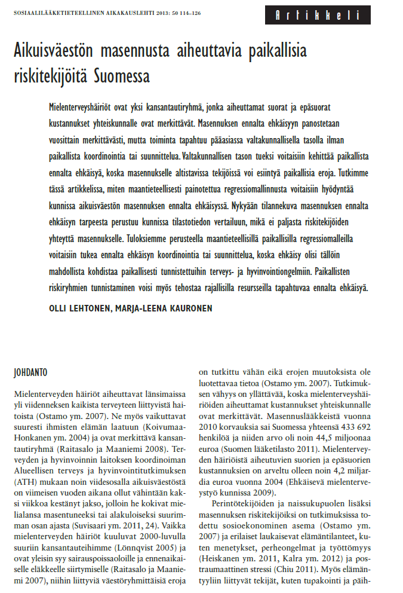
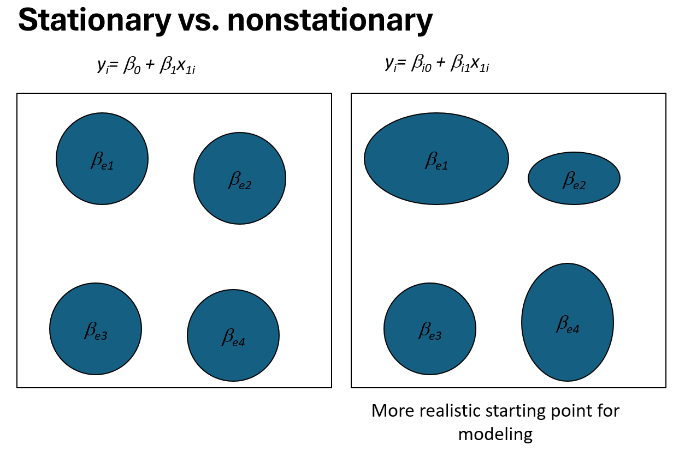
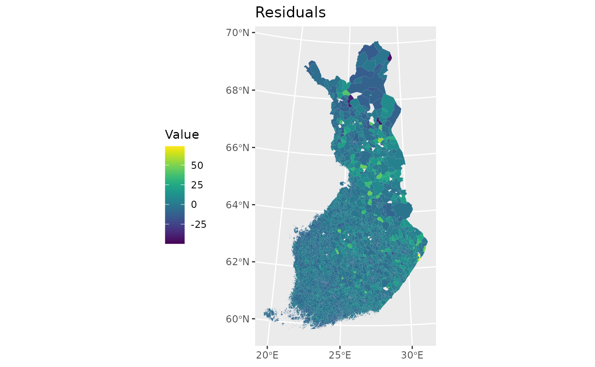
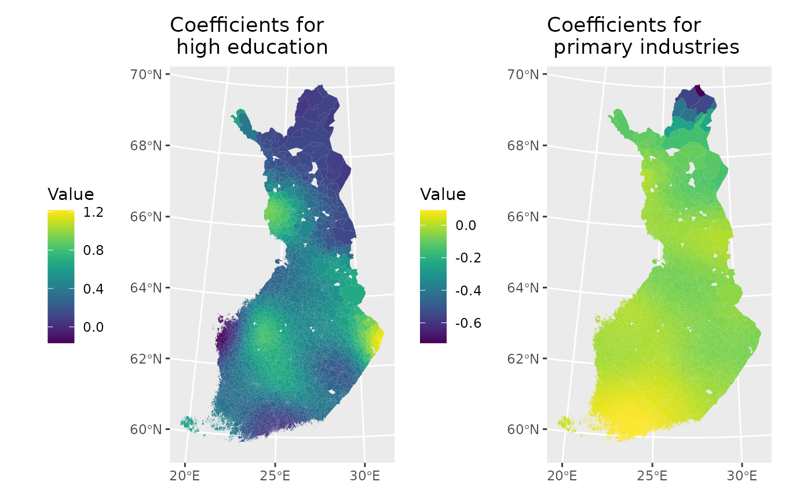

# Lecture 9: Geographically weighted regression

## Geographically weighted regression

Geographically weighted regression (GWR) is an exploratory technique
mainly intended to indicate where non-stationary is taking place on the
map that is where locally weighted regression coefficients move away
from their global values. Its basis is the concern that the fitted
coefficient values of a global model, fitted to all the data, may not
represent detailed local variations in the data adequately. It differs,
however, in not looking for local variation in data space but by moving
a weighted window over the data, estimating one set of coefficients
values at every chosen fit point. The fit points are very often the
points at which observations were made, but do not have to be. If the
local coefficients vary in space, it can be taken as an indication of
non-stationary.

The technique is fully described by Fotheringham et al. (2002) and
involves first selecting a bandwidth for an isotropic spatial weights
kerner, typically a Gaussian kernel with a fixed bandwidth chosen by
leave-one-out cross-validation. Choise of the bandwidth can be very
demanding, as n regressions must be fitted at each step. Alternative
techniques are available, for example for adaptive bandwidths, but they
may often be even more compute-intensive.

In Finnish, you can read the following paper:
<http://ojs.tsv.fi/index.php/SA/article/viewFile/8714/6405>



### Geographically Weighted Regression Method

The core idea of the Geographically Weighted Regression (GWR) method is
that geographically proximate areas are given greater weight than areas
located farther away. Consequently, only nearby areas effectively
contribute to the estimation of local regression coefficients. This
weighting principle is based on **Tobler’s First Law of Geography**,
which states that *things that are near each other are more similar than
things that are farther apart* (Tobler, 1970). Therefore, spatially
close areas contain the most relevant information for estimating local
regression coefficients.

The GWR model can be defined as follows (e.g., Brunsdon et al., 1998):

$$y_{i} = \beta_{0}\left( u_{i},v_{i} \right) + \sum\limits_{k = 1}^{p}\beta_{k}\left( u_{i},v_{i} \right)x_{i,k} + \varepsilon_{i}$$

where

- $y_{i}$ is the observed value of the dependent variable at location
  $i$,  
- $x_{i,k}$ is the value of explanatory variable $k$ at location $i$,  
- $\varepsilon_{i}$ is the random error term,  
- $\left( u_{i},v_{i} \right)$ are the spatial coordinates of
  observation $i$, and  
- $\beta_{0}\left( u_{i},v_{i} \right)$ and
  $\beta_{k}\left( u_{i},v_{i} \right)$ are the local regression
  coefficients for the intercept and explanatory variable $k$ at
  location $i$.

The GWR model is based on the assumption that observations closer to the
target location exert a greater influence on the estimation of
parameters $\beta$ than more distant observations.

#### Estimation of Local Regression Coefficients

The estimation of the local regression coefficients is given by:

$$\widehat{\mathbf{β}}\left( u_{i},v_{i} \right) = \left\lbrack X^{T}W\left( u_{i},v_{i} \right)X \right\rbrack^{- 1}X^{T}W\left( u_{i},v_{i} \right)Y$$

where $W\left( u_{i},v_{i} \right)$ is an $n \times n$ spatial weighting
matrix whose diagonal elements represent the geographical weights for
observation $i$, and whose off-diagonal elements are zero. A separate
weight matrix is computed for each observation $i$ at which local
regression coefficients are estimated.

The observation weight matrix is constructed using a **kernel function**
based on the distances between observation points. Kernel functions are
generally classified as either **fixed** or **adaptive**.

- In a **fixed kernel**, the bandwidth (distance radius) is constant,
  meaning that the number of neighboring observations can vary.  
- In an **adaptive kernel**, the bandwidth varies while the number of
  neighboring observations remains constant.

The elements of the weight matrix are defined as:

$$w_{ik} = \begin{cases}
{1,} & {{\text{if}\mspace{6mu}}d_{ik} < r} \\
{0,} & \text{otherwise}
\end{cases}$$

#### Gaussian Kernel Function

A commonly used weighting scheme is the **Gaussian kernel**, which is
defined as:

$$w_{ij} = \exp\left( - \frac{d_{ij}^{2}}{2h^{2}} \right)$$

where $d_{ij}$ is the distance between observation point $i$ and
regression point $j$, and $h$ is the bandwidth parameter that defines
the spatial extent within which points influence the estimation of
regression coefficients.

When using point coordinates $(x,y)$, the distance between two points is
computed as the **Euclidean distance**:

$$d_{ij} = \sqrt{\left( x_{i} - x_{j} \right)^{2} + \left( y_{i} - y_{j} \right)^{2}}$$

#### Bandwidth Selection via Cross-Validation

The bandwidth parameter $h$ is estimated using **cross-validation** as
follows:

$$\Delta(h) = \sum\limits_{i = 1}^{n}\left( y_{i} - {\widehat{y}}_{(i)}(h) \right)^{2}$$

where ${\widehat{y}}_{(i)}(h)$ is the fitted value at location
$\left( u_{i},v_{i} \right)$ obtained by excluding observation $i$ from
the estimation. The goal of cross-validation is to predict each
observation using the remaining data and select the bandwidth $h$ such
that:

$$\Delta(h) = \min\Delta(h)$$

#### Statistical Significance of Local Regression Coefficients

Examining local regression coefficients does not provide meaningful
insight into the relationship between explanatory and dependent
variables if the standard errors of the locally estimated coefficients
are large. In such cases, the effect of the explanatory variable on the
dependent variable is locally random.

The statistical significance of local regression coefficients can be
assessed using either a **Monte Carlo test** or an adapted **t-test**.
Since the Monte Carlo method is computationally intensive, this study
adopts the latter approach. Testing the significance of coefficients
allows identification of explanatory variables that exhibit local
spatial variation.

The t-statistic for a regression coefficient is calculated as:

$$t_{i} = \frac{{\widehat{\beta}}_{k} - 0}{SE\left( {\widehat{\beta}}_{k} \right)}$$

which follows a t-distribution with $n - 1$ degrees of freedom. This
test evaluates whether the estimated regression coefficients differ
significantly from zero.

To determine the significance level of the t-test, Byrne et al. (2009,
p. 4) propose the following adjustment:

$$F_{0} = \frac{\alpha}{1 + p_{e} - \frac{p_{e}}{np}}$$

where

- $p_{e}$ is the number of effective parameters,  
- $p$ is the number of estimated parameters,  
- $n$ is the number of observations, and  
- $\alpha$ is the chosen significance level.

You can choose the significance level based on your data. Normally, it
is set to $\alpha = 0.05$ or $\alpha = 0.10$.

### Idea of Geographically Weighted Regression (GWR)

The main motivation for Geographically Weighted Regression (GWR) lies in
the recognition that relationships between variables often vary across
space. Traditional regression models assume **spatial stationarity**,
meaning that the relationship between the dependent and explanatory
variables is constant throughout the entire study area. This assumption
is illustrated by the stationary model

$$y_{i} = \beta_{0} + \beta_{1}x_{1i},$$

where a single set of regression coefficients is applied uniformly to
all locations.

In many spatial applications, however, this assumption is unrealistic.
Social, economic, and environmental processes frequently exhibit
**spatial nonstationarity**, meaning that the strength and form of
relationships change from one location to another. This situation is
illustrated in the nonstationary case, where regression parameters are
allowed to vary across space:

$$y_{i} = \beta_{0}\left( u_{i},v_{i} \right) + \beta_{1}\left( u_{i},v_{i} \right)x_{1i}.$$

Here, $\left( u_{i},v_{i} \right)$ denote the spatial coordinates of
observation $i$, and the regression coefficients are location-specific.

GWR addresses spatial nonstationarity by estimating a **local regression
model at each observation point** rather than fitting a single global
model. For each location, observations that are geographically closer
are assigned greater weight than those farther away. As a result,
locally estimated regression coefficients reflect spatial variation in
the underlying relationships.

This approach allows the model to capture spatial heterogeneity that
would be masked by a global regression framework. As illustrated by the
figure, the stationary model assumes uniform effects across space,
whereas the GWR framework provides a more realistic starting point for
spatial modeling by allowing regression coefficients to vary in
magnitude and spatial extent.



#### Geographically Weighted Regression

## Using GWR with PAAVO (postal code area) data

### 1. Required packages

``` r
library(dplyr)
library(purrr)
library(sf)
library(httr)
library(data.table)
library(ows4R)
```

### 2. Downloading spatial data from Statistics Finland (WFS)

``` r
url <-list(hostname ="geo.stat.fi/geoserver/postialue/wfs",
           scheme ="https",
           query =list(service ="WFS",
                       version ="2.0.0",
                       request ="GetFeature",
                       typename ="postialue:pno_tilasto_2025",
                       outputFormat ="json"))%>%
  setattr("class","url")
request <-build_url(url)
p25 <-st_read(request)
```

    ## Reading layer `OGRGeoJSON' from data source 
    ##   `https://geo.stat.fi/geoserver/postialue/wfs/?service=WFS&version=2.0.0&request=GetFeature&typename=postialue%3Apno_tilasto_2025&outputFormat=json' 
    ##   using driver `GeoJSON'
    ## Simple feature collection with 3026 features and 113 fields
    ## Geometry type: MULTIPOLYGON
    ## Dimension:     XY
    ## Bounding box:  xmin: 83748.43 ymin: 6629044 xmax: 732907.7 ymax: 7776450
    ## Projected CRS: ETRS89 / TM35FIN(E,N)

``` r
url <-list(hostname ="geo.stat.fi/geoserver/postialue/wfs",
           scheme ="https",
           query =list(service ="WFS",
                       version ="2.0.0",
                       request ="GetFeature",
                       typename ="postialue:pno_tilasto_2016",
                       outputFormat ="json"))%>%
  setattr("class","url")
request <-build_url(url)
p16 <-st_read(request)
```

    ## Reading layer `OGRGeoJSON' from data source 
    ##   `https://geo.stat.fi/geoserver/postialue/wfs/?service=WFS&version=2.0.0&request=GetFeature&typename=postialue%3Apno_tilasto_2016&outputFormat=json' 
    ##   using driver `GeoJSON'
    ## Simple feature collection with 3036 features and 113 fields
    ## Geometry type: MULTIPOLYGON
    ## Dimension:     XY
    ## Bounding box:  xmin: 83748.43 ymin: 6629044 xmax: 732907.7 ymax: 7776450
    ## Projected CRS: ETRS89 / TM35FIN(E,N)

### 3. Data preparation and merging

``` r
names(p16)
```

    ##   [1] "id"         "gid"        "posti_alue" "nimi"       "namn"      
    ##   [6] "euref_x"    "euref_y"    "pinta_ala"  "vuosi"      "kunta"     
    ##  [11] "he_vakiy"   "he_naiset"  "he_miehet"  "he_kika"    "he_0_2"    
    ##  [16] "he_3_6"     "he_7_12"    "he_13_15"   "he_16_17"   "he_18_19"  
    ##  [21] "he_20_24"   "he_25_29"   "he_30_34"   "he_35_39"   "he_40_44"  
    ##  [26] "he_45_49"   "he_50_54"   "he_55_59"   "he_60_64"   "he_65_69"  
    ##  [31] "he_70_74"   "he_75_79"   "he_80_84"   "he_85_"     "ko_ika18y" 
    ##  [36] "ko_perus"   "ko_koul"    "ko_yliop"   "ko_ammat"   "ko_al_kork"
    ##  [41] "ko_yl_kork" "hr_tuy"     "hr_ktu"     "hr_mtu"     "hr_pi_tul" 
    ##  [46] "hr_ke_tul"  "hr_hy_tul"  "hr_ovy"     "te_taly"    "te_takk"   
    ##  [51] "te_as_valj" "te_nuor"    "te_eil_np"  "te_laps"    "te_plap"   
    ##  [56] "te_aklap"   "te_klap"    "te_teini"   "te_aik"     "te_elak"   
    ##  [61] "te_omis_as" "te_vuok_as" "te_muu_as"  "tr_kuty"    "tr_ktu"    
    ##  [66] "tr_mtu"     "tr_pi_tul"  "tr_ke_tul"  "tr_hy_tul"  "tr_ovy"    
    ##  [71] "ra_ke"      "ra_raky"    "ra_muut"    "ra_asrak"   "ra_asunn"  
    ##  [76] "ra_as_kpa"  "ra_pt_as"   "ra_kt_as"   "tp_tyopy"   "tp_alku_a" 
    ##  [81] "tp_jalo_bf" "tp_palv_gu" "tp_a_maat"  "tp_b_kaiv"  "tp_c_teol" 
    ##  [86] "tp_d_ener"  "tp_e_vesi"  "tp_f_rake"  "tp_g_kaup"  "tp_h_kulj" 
    ##  [91] "tp_i_majo"  "tp_j_info"  "tp_k_raho"  "tp_l_kiin"  "tp_m_erik" 
    ##  [96] "tp_n_hall"  "tp_o_julk"  "tp_p_koul"  "tp_q_terv"  "tp_r_taid" 
    ## [101] "tp_s_muup"  "tp_t_koti"  "tp_u_kans"  "tp_x_tunt"  "pt_vakiy"  
    ## [106] "pt_tyovy"   "pt_tyoll"   "pt_tyott"   "pt_tyovu"   "pt_0_14"   
    ## [111] "pt_opisk"   "pt_elakel"  "pt_muut"    "geometry"

``` r
p16data<-p16[,c(3,79)]
p16data<-as.data.frame(p16data[,1:2])
colnames(p16data)<-c("posti_alue","tyopy16")
p16data<-as.data.frame(p16data[,1:2])
```

``` r
p25_data <- dplyr::right_join(x = p16data, y = p25, by=c("posti_alue" = "postinumeroalue"))
p25_data$tyopy16[is.na(p25_data$tyopy16)] <- 0
```

### 4. Creating change variables and indicators

``` r
p25_data$tp_m22_16<-(p25_data$tp_tyopy-p25_data$tyopy16)
p25_data$tp_m22_16p<-((p25_data$tp_tyopy-p25_data$tyopy16)/p25_data$tyopy16)*100

p25_data$tyottom<-(p25_data$pt_tyott/p25_data$pt_tyoll)*100
p25_data$korkk<-(p25_data$ko_yl_kork/p25_data$ko_koul)*100
p25_data$alkut<-(p25_data$tp_alku_a/p25_data$tp_tyopy)*100
p25_data$elak<-(p25_data$te_elak/p25_data$te_taly)*100
p25_data$as_tih<-(p25_data$he_vakiy/(p25_data$pinta_ala/1000))
```

### 5. Data cleaning

``` r
p25_data2<-p25_data[,c(1,14,67,78,118:122)]

# remove na and inf
p25_data3<-p25_data2 %>%
  filter_all(all_vars(!is.infinite(.)))
p25_data4<-p25_data3 %>%
  filter_all(all_vars(!is.na(.)))
```

### 6. Join attribute data back to spatial data

``` r
data<-dplyr::left_join(x = p25, y = p25_data4, by=c("postinumeroalue" = "posti_alue"))
data2 <- data[!is.na(data$he_kika.y),] # if we don't remove NAs, we cannot join results
```

### 7. Spatial weights matrix (k‑nearest neighbours)

``` r
library(spdep)
data.coords<-st_centroid(st_geometry(data2), of_largest_polygon=TRUE) # Extracts the coordinates of each postcode area
p25_kn6<-knn2nb(knearneigh(data.coords,k=6,longlat = F)) # Returns a matrix with the indices of points belonging to the set of the k nearest neighbours of each other
```

    ## Warning in knearneigh(data.coords, k = 6, longlat = F): dnearneigh: longlat
    ## argument overrides object

``` r
p25_kn6_w<-nb2listw(p25_kn6)
```

### 8. Preparing GWR

This section demonstrates the main steps of a GWR analysis using R.

#### 8.1 Required Libraries

We begin by loading the necessary R packages for spatial data handling,
regression modeling, and visualization.

``` r
library(sf)
library(spgwr)
library(tidyverse)
library(patchwork)
library(janitor)
library(ggrepel)
library(ggplot2)
library(viridis)
```

#### 8.2 Preparing Spatial Data

GWR requires spatial coordinates. We compute centroids for the spatial
units and transform them to WGS84 (EPSG:4326). Variable names are
standardized for consistency.

``` r
cntrd = st_centroid(data2)%>%
  st_transform(3067) %>%
  clean_names()
```

    ## Warning: st_centroid assumes attributes are constant over geometries

### 9. Global Linear Regression Model

As a baseline, we first fit a global ordinary least squares (OLS) model.
This model assumes that relationships between variables are the same
everywhere in the study area.

``` r
model_lm=lm(tyottom~ korkk+alkut+elak+as_tih+he_kika_x+ra_as_kpa_y, data=cntrd)
summary(model_lm) # look the results of the model
```

    ## 
    ## Call:
    ## lm(formula = tyottom ~ korkk + alkut + elak + as_tih + he_kika_x + 
    ##     ra_as_kpa_y, data = cntrd)
    ## 
    ## Residuals:
    ##     Min      1Q  Median      3Q     Max 
    ## -49.855  -5.061  -1.280   3.452  73.922 
    ## 
    ## Coefficients:
    ##              Estimate Std. Error t value Pr(>|t|)    
    ## (Intercept) 39.674072   1.935040  20.503  < 2e-16 ***
    ## korkk        0.412926   0.018719  22.059  < 2e-16 ***
    ## alkut       -0.032116   0.006403  -5.016 5.59e-07 ***
    ## elak         0.110485   0.014850   7.440 1.31e-13 ***
    ## as_tih      -3.353124   0.172852 -19.399  < 2e-16 ***
    ## he_kika_x   -0.170552   0.032218  -5.294 1.29e-07 ***
    ## ra_as_kpa_y -0.268296   0.011576 -23.177  < 2e-16 ***
    ## ---
    ## Signif. codes:  0 '***' 0.001 '**' 0.01 '*' 0.05 '.' 0.1 ' ' 1
    ## 
    ## Residual standard error: 9.472 on 2955 degrees of freedom
    ## Multiple R-squared:  0.3939, Adjusted R-squared:  0.3926 
    ## F-statistic:   320 on 6 and 2955 DF,  p-value: < 2.2e-16

The results provide a single estimate for each regression coefficient,
representing average effects over space.

#### 9.1 Short Interpretation of the Global Linear Regression Results

The global linear regression model explains approximately 39% of the
variation in unemployment (R2=0.394R^2 = 0.394R2=0.394), indicating a
moderate overall model fit. The model is highly significant overall
(F-test, p\<0.001p \< 0.001p\<0.001).

All explanatory variables are statistically significant, suggesting that
they contribute meaningfully to explaining spatial variation in
unemployment. A higher share of highly educated residents (korkk) and
pensioners (elak) is associated with higher unemployment, whereas a
higher share of employment in primary industries (alkut), higher housing
density (as_tih), higher average age of population (he_kika_x), and
larger average dwelling size (ra_as_kpa_y) is associated with lower
unemployment.

The negative effects of housing density and average dwelling size are
particularly strong, suggesting that more urbanized and higher-quality
housing areas tend to experience lower unemployment levels. However, as
this is a global model, the estimated coefficients represent average
effects over the entire study area and do not capture potential spatial
variation in relationships. Spatial patterns in residuals may therefore
indicate remaining local heterogeneity, providing justification for
applying a Geographically Weighted Regression (GWR) model.

#### 9.2 Mapping Residuals of the Global Model

To examine whether spatial patterns remain unexplained, we extract model
residuals and visualize them on a map.

``` r
# save residuals for plotting
data2$resid<-model_lm$residuals # create a new variable resid
```

``` r
# create a map from the residuals
ggplot(data2) +
  geom_sf(aes(fill=resid), color=NA) +
  scale_fill_viridis()+
  labs(title = "Residuals",
       fill="Value") +
  theme(legend.position = "left")
```



Spatial clustering in residuals may indicate spatial nonstationarity,
motivating the use of GWR.

### 10. Converting Data for GWR

The spgwr package requires input data in the SpatialPointsDataFrame
format. We therefore convert the centroid data accordingly.

``` r
cntrd.sp <- as(cntrd, "Spatial")
```

### 11. Selecting the Bandwidth

A crucial step in GWR is selecting an appropriate bandwidth, which
determines how far spatial influence extends. The bandwidth is chosen
using cross-validation.

``` r
# Let's analyse bandwidht
?gwr.sel
cntrd.bw=gwr.sel(tyottom~ korkk+alkut+elak+as_tih+he_kika_x+ra_as_kpa_y, data=cntrd.sp)
```

    ## Bandwidth: 490085.9 CV score: 263696.7 
    ## Bandwidth: 792183.9 CV score: 267669.2 
    ## Bandwidth: 303379 CV score: 255436.8 
    ## Bandwidth: 187987.8 CV score: 243369.9 
    ## Bandwidth: 116672.2 CV score: 230851.8 
    ## Bandwidth: 72596.66 CV score: 219292.2 
    ## Bandwidth: 45356.5 CV score: 222166.7 
    ## Bandwidth: 69207.22 CV score: 218475.7 
    ## Bandwidth: 62609.31 CV score: 217171 
    ## Bandwidth: 56019.32 CV score: 217151 
    ## Bandwidth: 59211.42 CV score: 216872.5 
    ## Bandwidth: 59257.14 CV score: 216873 
    ## Bandwidth: 59038.79 CV score: 216871.5 
    ## Bandwidth: 59023.84 CV score: 216871.5 
    ## Bandwidth: 59024.96 CV score: 216871.5 
    ## Bandwidth: 59025.02 CV score: 216871.5 
    ## Bandwidth: 59025.02 CV score: 216871.5 
    ## Bandwidth: 59025.01 CV score: 216871.5 
    ## Bandwidth: 59025.02 CV score: 216871.5 
    ## Bandwidth: 59025.02 CV score: 216871.5

``` r
cntrd.bw
```

    ## [1] 59025.02

The selected bandwidth defines the spatial scale at which local
regressions are estimated.

**What gwr.sel() is doing**

gwr.sel() chooses the optimal spatial bandwidth by minimizing the
cross‑validation (CV) score. During the search, R tries different
bandwidth values and reports:

    Bandwidth: X   CV score: Y

The algorithm keeps shrinking and adjusting the bandwidth until it finds
the value that produces the lowest CV score, which measures prediction
error. From your output:

    Bandwidth: 59025.02 CV score: 216871.5

This is the optimal bandwidth selected for your GWR model.

The optimal GWR bandwidth selected by cross‑validation is approximately
59 km, indicating that local unemployment relationships are best
estimated using information from nearby areas within this spatial range.
Observations closer than 59 km exert a stronger influence on parameter
estimates, while more distant observations contribute less.

### 12. Running the GWR Model

Using the selected bandwidth, we estimate the GWR model. Each
observation receives its own set of locally weighted regression
coefficients.

``` r
cntrd.gwr=gwr(tyottom~ korkk+alkut+elak+as_tih+he_kika_x+ra_as_kpa_y, data=cntrd.sp, bandwidth=cntrd.bw, hatmatrix=TRUE)
cntrd.gwr
```

    ## Call:
    ## gwr(formula = tyottom ~ korkk + alkut + elak + as_tih + he_kika_x + 
    ##     ra_as_kpa_y, data = cntrd.sp, bandwidth = cntrd.bw, hatmatrix = TRUE)
    ## Kernel function: gwr.Gauss 
    ## Fixed bandwidth: 59025.02 
    ## Summary of GWR coefficient estimates at data points:
    ##                     Min.     1st Qu.      Median     3rd Qu.        Max.
    ## X.Intercept. -1.3543e+01  3.0569e+01  3.7490e+01  4.4025e+01  1.0006e+02
    ## korkk        -1.6766e-01  2.4223e-01  3.7448e-01  5.0917e-01  1.2148e+00
    ## alkut        -7.2398e-01 -4.5968e-02 -9.0369e-03  4.8750e-02  9.1784e-02
    ## elak         -1.3149e-01 -4.3312e-03  4.0782e-02  1.0503e-01  6.5159e-01
    ## as_tih       -2.0046e+04 -5.4778e+00 -3.4037e+00 -2.4317e+00 -5.4232e-01
    ## he_kika_x    -1.4333e+00 -2.5666e-01 -1.1982e-01 -1.1343e-02  1.0090e+00
    ## ra_as_kpa_y  -5.5779e-01 -2.6685e-01 -2.4223e-01 -2.0048e-01  3.4253e-01
    ##               Global
    ## X.Intercept. 39.6741
    ## korkk         0.4129
    ## alkut        -0.0321
    ## elak          0.1105
    ## as_tih       -3.3531
    ## he_kika_x    -0.1706
    ## ra_as_kpa_y  -0.2683
    ## Number of data points: 2962 
    ## Effective number of parameters (residual: 2traceS - traceS'S): 154.0256 
    ## Effective degrees of freedom (residual: 2traceS - traceS'S): 2807.974 
    ## Sigma (residual: 2traceS - traceS'S): 7.605362 
    ## Effective number of parameters (model: traceS): 111.1774 
    ## Effective degrees of freedom (model: traceS): 2850.823 
    ## Sigma (model: traceS): 7.547991 
    ## Sigma (ML): 7.404981 
    ## AICc (GWR p. 61, eq 2.33; p. 96, eq. 4.21): 20499.81 
    ## AIC (GWR p. 96, eq. 4.22): 20377.72 
    ## Residual sum of squares: 162417.6 
    ## Quasi-global R2: 0.6286654

GWR substantially improves model fit compared to global OLS model,
explaining ~63% of the variance.

This strongly indicates that the relationship between unemployment and
the explanatory variables varies across space.

#### 12.1 Interpretation of local coefficients (key insight)

The table of GWR coefficient summaries shows wide spatial variation:
Example interpretations:

**Educational level (korkk)**

While the global effect is positive, some areas show negative or
near-zero effects → Education affects unemployment differently in
different regions

**Primary-sector employment (alkut)**

Mostly negative, but the effect weakens or reverses locally → Importance
of primary industries is spatially uneven

**Housing density (as_tih)**

Strongly negative everywhere, but magnitude varies greatly → Urban
structure matters, but not uniformly

**Average age (he_kika_x)**

Ranges from strongly negative to positive locally → Income reduces
unemployment in some areas but not universally

These ranges in coefficients **confirm spatial nonstationarity**: the
same variable can have different effects in different regions.

**Conclusion**: The GWR results demonstrate strong spatial
nonstationarity in the determinants of unemployment. While the global
model captures average national-level relationships, the GWR model
reveals that the magnitude and, in some cases, the direction of these
relationships vary considerably across space. The substantial
improvement in model fit and the wide variation in local coefficients
indicate that regional context plays a crucial role in shaping
unemployment dynamics.

#### 12.2 Exploring GWR Output

We inspect the structure of the GWR result object and identify where
local coefficients are stored.

``` r
# Let's see the names of the model object
names(cntrd.gwr)
```

    ##  [1] "SDF"       "lhat"      "lm"        "results"   "bandwidth" "adapt"    
    ##  [7] "hatmatrix" "gweight"   "gTSS"      "this.call" "fp.given"  "timings"

``` r
# Here you can find the coefficients etc.
names(cntrd.gwr$SDF)
```

    ##  [1] "sum.w"              "(Intercept)"        "korkk"             
    ##  [4] "alkut"              "elak"               "as_tih"            
    ##  [7] "he_kika_x"          "ra_as_kpa_y"        "(Intercept)_se"    
    ## [10] "korkk_se"           "alkut_se"           "elak_se"           
    ## [13] "as_tih_se"          "he_kika_x_se"       "ra_as_kpa_y_se"    
    ## [16] "gwr.e"              "pred"               "pred.se"           
    ## [19] "localR2"            "(Intercept)_se_EDF" "korkk_se_EDF"      
    ## [22] "alkut_se_EDF"       "elak_se_EDF"        "as_tih_se_EDF"     
    ## [25] "he_kika_x_se_EDF"   "ra_as_kpa_y_se_EDF" "pred.se"

#### 12.3 Extracting Local Regression Coefficients

We save selected local coefficients back into the original spatial
dataset for mapping.

``` r
# save results to new variables
data2$coef_korkk<-cntrd.gwr$SDF$korkk
data2$coef_alkut<-cntrd.gwr$SDF$alkut
```

#### 12.4 Mapping Local Coefficients

The spatial variation of regression coefficients is visualized using
thematic maps. These maps reveal how the strength of relationships
changes across space.

``` r
map1<-ggplot(data2) +
  geom_sf(aes(fill=coef_korkk), color=NA) +
  scale_fill_viridis() +
  labs(title = "Coefficients for \n high education",
       fill="Value") +
  theme(legend.position = "left")
```

``` r
map2<-ggplot(data2) +
  geom_sf(aes(fill=coef_alkut), color=NA) +
  scale_fill_viridis()+
  labs(title = "Coefficients for \n primary industries ",
       fill="Value") +
  theme(legend.position = "left")
```

``` r
map1 + map2
```



The maps show clear spatial variation in the effects of high education
and primary industries on unemployment, confirming strong spatial
nonstationarity. The effect of high education is positive in most parts
of Finland but varies considerably in magnitude, with the strongest
effects in southern and eastern regions and weaker or near-zero effects
in the north. In contrast, employment in primary industries generally
has a negative association with unemployment, but this effect also
varies spatially, being strongest in southern and western areas and
weaker or even negligible in northern regions.

Overall, these results indicate that the impact of educational structure
and economic base on unemployment is region-specific, and a single
national-level coefficient would mask important local differences. This
supports the use of GWR over a global regression approach for analysing
unemployment patterns.

### 13. Testing Model Improvement

Finally, we test whether allowing coefficients to vary spatially
significantly improves model fit compared to the global model using the
LMZ F-test. **This can take some time.**

``` r
# test model fit
?LMZ.F3GWR.test
LMZ.F3GWR.test(cntrd.gwr)
```

A significant result suggests that spatial nonstationarity is present
and that GWR provides a better representation of the underlying
processes than the global linear model.

**Summary**

This workflow demonstrates the key steps in conducting a GWR analysis in
R:

- Fit a global regression model
- Diagnose spatial nonstationarity
- Select an optimal bandwidth
- Estimate local regressions
- Visualize spatially varying coefficients
- Statistically evaluate model improvement

GWR provides valuable insights into local spatial relationships that
would be obscured in traditional global models.
