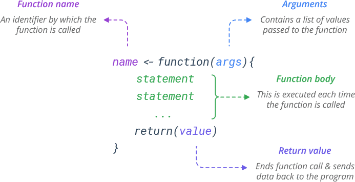

```{r, include = FALSE}
knitr::opts_chunk$set(
  collapse = TRUE,
  comment = "#>"
)
```

Welcome to the course "Appelied Spatial Data Analysis and Research"
course details: https://opas.peppi.uef.fi/en/course/YH00EM30/135183?period=2025-2026

# What is R?

### Why should we learn R?
R follows a type inference coding structure and provides a wide variety of statistical and graphical techniques, including;

- Linear and non-linear modelling
- Univariate & Multivariate Statistics
- Classical statistical tests
- Time-series analysis/ Econometrics
- Simulation and Modelling
- Datamining-classification, clustering etc.

For computationally intensive tasks, C, C++, and Fortran code can be linked and called at run time.

R is easily extensible through functions and extensions, and the R community is noted for its active contributions in terms of packages.

```{r}
# Number of R Packages
length(available.packages(repos = "http://cran.us.r-project.org")[, 1])
```

### Installing R and RStudio on Windows

The latest version of R can be download from the R homepage.

R download page: http://www.cran.r-project.org/bin/windows/base/ The page also provides some instructions and FAQ’s on R installation.

RStudio IDE ( IDE: Integrated Development Environment) is a powerful and productive user interface for R.

It’s free and open source, and works great on Windows, Mac, and Linux

### RStudio GUI/IDE

RStudio GUI is composed of 4 panes which can be rearranged according to the requirements.

There are a lot of short introductions to RStudio available online so we will not go into more details.

Download Rstudio from here https://rstudio.com/products/rstudio/download/#download

### Installing Packages

The easiest way to install packages is to do it via R console. The command install.packages(“package name”) installs R packages directly from internet. Other options to install various dependencies to a package can be easily specified when calling this function. A call to this function asks the user to chose a CRAN mirror at the first instance.

Run the following to install Quantreg package on R. Also use the help function to get the details.

```{r}
# Install a package using RStudio Console
install.packages("sf", dependencies = c("Depends", "Suggests"))
```

```{r}
install.packages(c("reshape2", "foreign", "ggplot2", "stargazer"), dependencies = TRUE)
# to be updated
```

### Getting Help

As R is constantly evolving and new functions/packages are introduced every day it is good to know sources of help. The most basic help one can get is via the help() function. This function shows the help file for a function which has been created by package managers.

```{r}
help("function name")
```
    
All the R packages (with few exceptions) have a user’s manual listing the functions in a package. This can be downloaded in PDF format from the R package download page2.

R also provides some search tools given at http://cran.r-project.org/search.html The R Site search is helpful in searching for topics related to problem in hand.

Other than these various good R related blogs are on the internet which can be really helpful. A combined upto date view of 452 contributed blogs can be found at R-bloggers3.

Over all there quite a big community of R Users and help can be found for most of the topics.

### R programming for ABSOLUTE beginners

<iframe width="560" height="315"
        src="https://www.youtube.com/embed/FY8BISK5DpM"
        frameborder="0"
        allow="accelerometer; autoplay; encrypted-media; gyroscope; picture-in-picture"
        allowfullscreen>
</iframe>


# Functions in R

One of the great strengths of R is the user's ability to add functions. In fact, many of the functions in R are actually functions of functions. The functions take input, perform operations on the input and return output. The structure of a function is given below (see the webpage: https://www.learnbyexample.org/r-functions/):

```{r, echo=FALSE, out.width="70%"}

```

The agrument can defined with or without defaults and when the function is called the arguments are passed to the statements.

Functions in R are “first class objects”, which means that they can be treated much like any other R object. Importantly, 1) functions can be passed as arguments to other functions and 2) functions can be nested, so that you can define a function inside of another function. 

Let’s create a simple function:

```{r}
f<-function(x) {
 a=b*x^2
 return(a)
 }
a<-2
b<-1
f(5)
```

The function returns 25, because 
-	The function found b in the workspace that called it
-	In the console a is still 2 because the function created its own local variable a.

Here is another simple example where we define a function fahrenheit_to_celsius that converts temperatures from Fahrenheit to Celsius:

```{r}
fahrenheit_to_celsius <- function(temp_F) {
   temp_C <- (temp_F - 32) * 5 / 9
   return(temp_C)
 }
```

We define fahrenheit_to_celsius by assigning it to the output of function. The list of argument names are contained within parentheses. Next, the body of the function–the statements that are executed when it runs–is contained within curly braces ({}). The statements in the body are indented by two spaces, which makes the code easier to read but does not affect how the code operates.

When we call the function, the values we pass to it are assigned to those variables so that we can use them inside the function. Inside the function, we use a return statement to send a result back to whoever asked for it. You can test the function:

```{r}
fahrenheit_to_celsius(10)
```

### Example 1: Creating new functions: Standard error

R allows the user to create new functions. This is a useful feature, particularly when you want to automate certain tasks that you have to repeat over and over. Let’s start with a simple example. Suppose you want to calculate the standard error of a mean associated to a set of values. 

Before proceeding to create the function we should check whether there is already a function with this name in R. Let’s type:
```{r, eval=FALSE}
se
```

The error printed by R indicates that we are safe to use that name. Following code is a possible way to create our function:
```{r}
se<- function(x){
 v <- var(x)
 z <- length(x)
 return (sqrt(v/z))
}
```

After creating this function, you can use it as follows:
```{r}
test<-c(2,4,3,6,4,9,11,3,7,6)
se(test)
```
The value returned by any function can be decided using the function return() or, alternatively, R returns the result of the last expression that was evaluated within the function. 

### Example 2: More advanced function of basic statistics
```{r}
basic.stats <- function(x, more=F) {
  stats <- list()
  clean.x <- x[!is.na(x)]
  stats$n <- length(x)
  stats$nNAs <- stats$n-length(clean.x)
  stats$mean <- mean(clean.x)
  stats$std <- sd(clean.x)
  stats$med <- median(clean.x)
  if (more) {
    stats$skew <- sum(((clean.x - stats$mean)/stats$std)^3)/length(clean.x)
    stats$kurt <- sum(((clean.x - stats$mean)/stats$std)^4)/length(clean.x)-3
    }
  unlist(stats)
 }
```

This function has a parameter (more) that has a default value (F). This means that you can call this function with or without setting this parameter. Below are examples of these two alternatives:
```{r}
basic.stats(test)
basic.stats(test,more=T)
```

# R and Programming
Programming involves writing relatively complex systems of instructions. There are two broad styles of programming: the imperative style (used in R) involves stringing together instructions telling the computer what to do. The declarative style (used in HMTL in web pages) involves writing a description of the end result, without giving the details about how to get there. R programming may be procedural (describing what steps to take to achieve a task), modular (broken up in to self-contained packages), object-oriented (organized as a collection of functions which do specific calculations without having external side-effects), among other possibilities. 

### The for ( ) loop

The for ( ) statement allows one to specify that a certain operation should be repeated a fixed number of times. 

Syntax
for (names in vector) {commands}

This sets a variable called name equal to each of the elements of vector in sequence. For each value, whatever commands are listed within the curly braces will be performed. The curly braces serve to group the commands so that they are treated by R as a single command. If there is only one command to execute, the braces are not needed.

Example:
The Fibonacci sequence is a famous sequence in mathematics. The first two elements are defined as 1,1]. Subsequent elements are defined as the sum of the preceding two elements. For example, the third element is 2, the fourth element is 3, the fifth element is 5, and so on. 

To obtain first 12 Fibonacci numbers in R, we can use 
```{r}
Fibonacci <- numeric(12)
Fibonacci[1] <- Fibonacci[2] <- 1
for (i in 3:12) Fibonacci[i] <- Fibonacci[i-2]+Fibonacci[i-1]
```

Understanding the code:
The first line sets up a numeric vector of length 12 with the name Fibonacci. This vector consists of 12 zeroes. The second line updates the first two elements of Fibonacci to the value 1. The third line updates the third element, fourth element, and so on according to the rule defining the Fibonacci sequence. In particular, Fibonacci[3] is assigned the value of Fibonacci[1] + Fibonacci[2], i.e. 2. Fibonacci[4] is then assigned the latest value of Fibonacci[2] + Fibonacci[3] , giving it the value 3. The for ( ) loop updates the third through 12th element of the sequence in this way. 

To see all types, type in 
```{r}
Fibonacci
```

Example:
Suppose a car dealer promotes two options for the purchase of a new 20 000€ car. The first option is for the customer to pay up front and receive a 1 000€ rebate. The second option is “0%-interest financing” where the customer makes 20 monthly payments of 1 000€ beginning in one month’s time. 

Because of option 1, the effective price of the car is really 19 000€, so the dealer is really charging some interest rate i for option 2. We can calculate this value using the formula for the present value of an annuity:

$$
19000 = 1000 \cdot \frac{1 - (1 + i)^{-20}}{i}
$$

By multiplying both sides of this equation by i and dividing by 19000, we get the form of a fixed-point problem

$$
i = \frac{1 - (1 + i)^{-20}}{19}
$$

By taking an initial guess for i and plugging it into the right-hand side of this equation, we can get an “updated” value for I on the left. For example, if we start with i=0.006, then our update is

$$
i = \frac{1 - (1 + 0.006)^{-20}}{19} = 0.00593
$$

By plugging this updated value into the right-hand side of the equation again, we get a new update:

$$
i = \frac{1 - (1 + 0.00593)^{-20}}{19} = 0.00586
$$

This kind of fixed-point iteration usually requires many iterations before we can be confident that we have the solution to the fixed-point equation. Here is R code to work out the solution after 1 000 iterations.  
```{r}
i <- 0.006
for (j in 1:1000){
 i <- (1-(1+i)^(-20))/19
 }
i
```

Example:
Let's create a vector containing number 1-10:
```{r}
samples <- c(rep(1:10))
samples
```

Go through the samples one by one and print them out:
```{r}
for (thissample in samples)
 {
   print(thissample)
 }
```

Let's do something inside the for loop:
```{r}
for (thissample in samples)
 {
    str <- paste(thissample,"is current sample",sep=" ")
    print(str)
 }
```

Let's terminate the loop when the sample is 3:
```{r}
for (thissample in samples)
 {
    if (thissample == 3) break
    str <- paste(thissample,"is current sample",sep=" ")
    print(str)
 }
```

Let's ignore when the sample number is even:
```{r}
for (thissample in samples)
 {
    if (thissample %% 2 == 0) next
    str <- paste(thissample,"is current sample",sep=" ")
    print(str)
 }
```

### The if ( ) statement

The if ( ) statement allows us to control which statements are executed, and sometimes this is more convenient. 

Syntax
if (condition) {commands when TRUE}
if (condition( {commands when TRUE} else {commands when FALSE}

This statement causes a set of commands to be invoked if condition evaluates TRUE. The else part is optional, and provides an alternative set of commands which are to be invoked in case the logical variables is FALSE. 

A simple example:
```{r}
x <- 3
if (x > 2) y <- 2*x else y <- 3*x
```

Since x > 2 is TRUE, y is assigned 2 * 3 = 6. If it hadn´t been true, y would have been assigned the value of 3 * x. We can confirm this:
```{r}
y
```

The if ( ) statement is often used inside user-defined functions. The following is a typical example.

Example:
The correlation between two vectors of numbers is often calculated using the cor ( ) function. It is supposed to give a measure of linear association. We can add a scatter plot of data as follows:
```{r}
corplot <- function(x,y,plotit) {
 if (plotit == TRUE) plot(x,y)
 cor(x,y)
 }
```

```{r}
class(corplot)
```

We can apply this function to two vectors without plotting by typing
```{r}
corplot(c(2,5,7),c(5,6,8),FALSE)
```

Or if we 
```{r}
corplot(c(2,5,7),c(5,6,8),T)
```

and get a simple figure.
 
Example: 
The function that follows is based on the sieve of Eratosthenes, the oldelst known systematic method for listing prime numbers up to a given value n. The idea is as follows: begin with a vector of numbers from 2 to n. Beginning with 2, eliminate all multiples of 2 which are larger than 2. Then move to the next number remaining in the vector, in this case, 3. Now, remove all multiples of 3 which are larger than 3. Proceed through all remaining entries of the vector in this way. The entry for 4 would have been removed in the first round, leaving 5 as the next entry to work with after 3; all multiples of 5 would be removed at the next step and so on. 
```{r}
Eratosthenes <- function(n) {
  if (n >= 2) {
      sieve <- seq(2,n)
      primes <- c()
      for (i in seq(2,n)) {
          if (any(sieve == i)) {
              primes <- c(primes,i)
              sieve <- c(sieve[(sieve %% i) != 0], i)
          }
      }
      return(primes)
  } else {
      stop("Input value of n should be at least 2.")
  }
 }
```

Here are a couple of examples of the use of this function:
```{r}
Eratosthenes(50)
```

Understanding the code:
The purpose of the function is to provide all prime numbers up to the given value n. The basic idea of the program is contained in the lines:
```{r, eval=FALSE}
sieve <- seq(2,n)
      primes <- c()
      for (i in seq(2,n)) {
          if (any(sieve == i)) {
              primes <- c(primes,i)
              sieve <- c(sieve[(sieve %% i) != 0], i)
          }
      }
```

The sieve object holds all the candidates for testing. Initially, all integers from 2 through n are stored in this vector. The primes object is set up initially empty, eventually to contain all of the primes that are less than or equal to n. The composite numbers in sieve are removed, and the primes are copied to primes. 

Each integer i from 2 through n is checked in sequence to see whether it is still in the vector. The any ( ) function returns a TRUE if at least one of the logical vector elements in its argument is TRUE. In the case that i is still in the sieve vector, it must be a prime since it is the smallest number that has not been eliminated yet. All multiples of i are eliminated, since they are necessarily composite, and i is appended to primes. The expression (sieve %% i) == 0 would give TRUE for all elements of sieve which are multiples of i; since we want to eliminate these elements and save all other elements, we can negate this using ! (sieve %% i == 0) or sieve %% i != 0. Then we can eliminate all multiples of i from the sieve vector using

```{r, eval=FALSE}
sieve <- sieve[(sieve %% i) != 0]
```

Note that this eliminates i as well, but we have already saved it in primes. 

### The while ( ) loop

Sometimes we need to do some calculations and keep going as long as a condition holds. The while ( ) statement accomplishes this. 

Syntax
while (condition) {statements}

The condition is evaluated, and if it evaluates to FALSE, nothing more is done. If it evaluates to TRUE the statements are executed, condition is evaluated again, and the process is repeated. 

Example: 
```{r}
z <- 0
 while(z < 5) { 
    z <- z + 2
    print(z)  
 }
```

Example:
Suppose we want to list all Fibonacci numbers less than 300. We don’t know beforehand how long this list is, so we wouldn’t know how to stop the for ( ) loop at the right time but a while ( ) loop is perfect:
```{r}
Fib1 <- 1
Fib2 <- 1
Fibonacci <- c(Fib1,Fib2)
while (Fib1 < 300) {
   Fibonacci <- c(Fibonacci,Fib2)
   oldFib2 <- Fib2
   Fib2 <- Fib1 + Fib2
   Fib1 <- oldFib2
}
```

Understanding the code:
The central idea is contained in the lines

while (Fib1 < 300) {
   Fibonacci <- c(Fibonacci,Fib2)

That is as long as the latest Fibonacci number created (in Fib2) is less than 300, it is appended to the growing vector Fibonacci. Thus we must ensure that Fib2 actually contains the updated Fibonacci number. By keeping track of the two most recently added numbers (Fib1 and Fib2) we can do the update

Fib2 <- Fib1 + Fib2

Now Fib1 should be updated to the old value of Fib2 but that has been overwritten by the new value. So before executing the above line, we make a copy of Fib2 in oldFib2. After updating Fib2 we can assign the value in oldFib2 to Fib1. 

In order to start things off, Fib1 and Fib2, and Fibonacci need to be initialized. That is, within the loop, these objects will be used, so they need to be assigned sensible starting values. 

To see the final result of the computation, type
```{r}
Fibonacci
```

### The repeat ( ) loop, and the break and next statements

Syntax
repeat {statements}

Loop is repeated until a break is specified. This means there needs to be a second statement to test whether or not to break from the loop. Break statement typically takes the form

if (condition) break

which is not a requirement of the syntax. The break statement causes the loop to terminate immediately. break statements can also be used in for ( ) and while ( ) loops. The next statement causes control to return immediately to the top of the loop; it can also used in any loops. 

```{r}
z <- 0
 repeat { 
    z <- z + 1
    print(z)
    if(z > 100) break() 
}
```

# Permutation Test and Resampling

The bootstrap, permutation tests, and other resampling methods are part of this revolution. Resampling methods allow us to quantify uncertainty by calculating standard errors and confidence intervals and performing significance tests. They require fewer assumptions than traditional methods and generally give more accurate answers (sometimes very much more
accurate). Moreover, resampling lets us tackle new inference settings easily.

Resampling also helps us understand the concepts of statistical inference. The sampling distribution is an abstract idea. The bootstrap analog (the “bootstrap distribution”) is a concrete set of numbers that we analyze using familiar tools like histograms. The standard deviation of that distribution is a concrete analog to the abstract concept of a standard error. Resampling methods for significance tests have the same advantage; permutation tests produce a concrete set of numbers whose “permutation distribution” approximates the sampling distribution under the null hypothesis. Comparing our statistic to these numbers helps us understand p-values. 

Here is a summary of the advantages of these new methods: 

-	Fewer assumptions: For example, resampling methods do not require that distributions be Normal or that sample sizes be large.
-	Greater accuracy: Permutation tests, and some bootstrap methods, are more accurate in practice than classical methods.
-	Generality: Resampling methods are remarkably similar for a wide range of statistics and do not require new formulas for every statistic. You do not need to memorize or look up special formulas for each procedure.
-	Promote understanding: Bootstrap procedures build intuition by providing concrete analogies to theoretical concepts

Here are two links for good examples of the permutation tests:
•	http://spark.rstudio.com/ahmed/permutation/
•	http://faculty.washington.edu/kenrice/sisg/SISG-08-06.pdf

### Permutation test
Let’s create a vector where elements [1:5] belong to group A and elements [6:10] belong to group B
```{r}
y2=c(9.65, 5.09, 8.80, 7.42, 6.68, 8.79, 9.36, 9.64, 9.02, 8.86)
```
Now let’s create permutation test: 

First calculate the observed difference in group averages 
```{r}
obs.diff.means=mean(y2[1:5])-mean(y2[6:10])
```

Do the test with 500 permutations
```{r}
diff.means=numeric()
for (i in 1:500){
 perm=sample(y2,10,replace=F)
 diff.means[i]=mean(perm[1:5])-mean(perm[6:10])
 }
```

Draw a histogram from sampled differences
```{r}
hist(diff.means)
```

Let’s calculate the p-value for observed difference:
```{r}
p2<-sum(abs(diff.means)>=abs(obs.diff.means))/500
p2
```

Note that p-value indicates the probability of getting the observed difference in averages by random samples, abs() calculate the two-sided p-value.

Let’s calculate the 95% confidence intervals for the p-value (approximation of the normal distribution): 
```{r}
pm.part=1.96*sqrt(p2*(1-p2)/500)
ucb=p2+pm.part
lcb=p2-pm.part
lcb;ucb
```

### Compare Permutation Test with other tests

Let’s create a t-test and a Wilcoxon test and compare the results between these approaches.
Here we simply define a numeric vector y2 containing ten observations.
```{r} 
y2=c(9.65, 5.09, 8.80, 7.42, 6.68, 8.79, 9.36, 9.64, 9.02, 8.86)
```

We print out the values just to confirm that the vector was created correctly.
```{r}
y2
```

Preparing the data: 
Next, we create a grouping variable and combine it with the response values.
This allows us to perform two‑sample tests.
```{r} 
group<-c(1,1,1,1,1,2,2,2,2,2)
```
Here, group indicates the group membership of each observation.

The first 5 observations belong to group 1
The last 5 observations belong to group 2

We now combine the response variable (y2) and the group indicator into a single object:
```{r}
data<-cbind(y2,group)
class(data)
data<-as.data.frame(data)
```
cbind() binds the variables column‑wise, and as.data.frame() converts the result into a data frame suitable for statistical testing.

### T-test
A t‑test compares the mean of two groups under the assumption that the data are normally distributed.

Here, we perform an independent two‑sample t‑test using formula notation:

- data$y2 is the numeric response variable
- data$group is the grouping variable
```{r}
?t.test

t.test(data$y2~data$group)
```
The output shows whether there is a statistically significant difference between the group means.

### wilcox.test

The Wilcoxon rank‑sum test is a non‑parametric alternative to the t‑test.
It does not assume normality and instead compares the distributions of the two groups.
```{r}
?wilcox.test
wilcox.test(data$y2~data$group)
```

This test examines whether one group tends to have larger values than the other, based on ranks rather than means.


```{r setup}
library(spatialcourseOL)
usethis::use_pkgdown()

```
