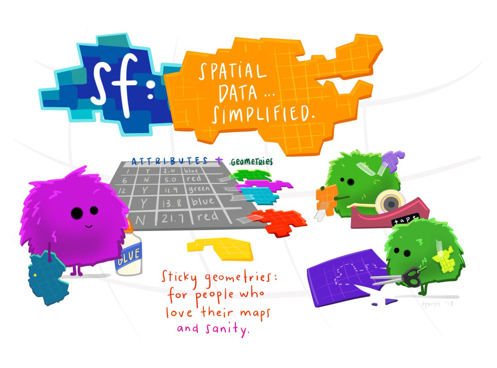

# Reading data with R

R provides powerful tools for working with spatial data, making it a flexible environment for GIS analysis and reproducible workflows. In practice, most geographic datasets come in either vector (points, lines, polygons) or raster (grids) format. The sf package standardizes how vector data are stored and accessed, while terra offers efficient tools for raster operations. Before performing spatial analysis, we need to import these datasets into R. The code below shows how to read some of the most common spatial file formats.

#### Read a Shapefile (.shp):
```{r, eval=FALSE}
library(sf)
shp <- st_read("data/admin_areas.shp")
```

#### Read a GeoPackage (.gpkg):
```{r, eval=FALSE}
library(sf)
```

List layers
```{r, eval=FALSE}
st_layers("data/geodata.gpkg")
```

Read a specific layer
```{r, eval=FALSE}
roads <- st_read("data/geodata.gpkg", layer = "roads")
```

#### Read GeoJSON
```{r, eval=FALSE}
library(sf)

geojson <- st_read("data/borders.geojson")
```

#### Read a Raster (GeoTIFF .tif)
```{r, eval=FALSE}
library(terra)

r <- rast("data/elevation.tif")
```

#### Reproject Vector Data
```{r, eval=FALSE}
admin_utm <- st_transform(shp, 32635)
```

#### Reproject Raster Data
```{r, eval=FALSE}
r_utm <- project(r, "EPSG:32635")
```

The sf package is the core R library for working with vector spatial data. It provides functions to read, write, analyze, and visualize geographic objects using modern standards. More information and documentation can be found on the project website: 

- https://r-spatial.github.io/sf/

```{r, echo=FALSE, out.width="70%"}

```

Let´s have an example next.

# Reading Open Data: Statistics Finland WFS service"

This example demonstrates how to download, explore, and process open spatial data from the Statistics Finland WFS service.  
We will:

1. Inspect the WFS service  
2. Download a 5 km grid dataset  
3. Visualize the grid using **ggplot2**  
4. Clip the grid to the municipality of Kotka  
5. Save the clipped dataset as a shapefile  

This workflow helps you understand how openly available geospatial data can be accessed and integrated into spatial analysis.


## 1. Load Required Libraries

In this step, we load the R packages used throughout the analysis. These include tools for spatial data handling (sf), data manipulation (dplyr, purrr), downloading data from web services (httr, ows4R), and visualization (ggplot2). The geofi package is also loaded to access official Finnish municipal boundary data.

```{r}
library(dplyr)
library(purrr)
library(sf)
library(httr)
library(data.table)
library(ows4R)
library(ggplot2)
library(geofi)   # for Finnish municipal boundaries
```


## 2. Inspect the WFS Service
Statistics Finland provides geospatial datasets through a WFS service.

Before downloading any data, we connect to the Statistics Finland Web Feature Service (WFS). Using the WFSClient from the ows4R package, we query the service to list all available datasets. This ensures we know which layers (e.g., grids, municipality borders, zip codes) can be accessed and what their names are.
```{r}
vayla <- "https://geo.stat.fi/geoserver/tilastointialueet/wfs"

vayla_client <- WFSClient$new(
  url = vayla,
  serviceVersion = "2.0.0"
)

vayla_client$getFeatureTypes(pretty = TRUE)
```

## 3. Download the 5 km Grid Dataset

Once we know which dataset we want, we construct a WFS request URL that retrieves the 5 km statistical grid (called hila5km) in GeoJSON format. The st_read() function from sf is then used to download and immediately load the spatial data into R as an sf object.

So, let´s construct a WFS request and load the data directly into an sf object.
```{r}
url_grid <- list(
  hostname = "geo.stat.fi/geoserver/tilastointialueet/wfs",
  scheme   = "https",
  query = list(
    service = "WFS",
    version = "2.0.0",
    request = "GetFeature",
    typename = "tilastointialueet:hila5km",
    outputFormat = "json"
  )
) %>% setattr("class", "url")

grid_url <- build_url(url_grid)

grid_5km <- st_read(grid_url)
```

## 4. Visualize the Grid

In this step, we create a simple map of the downloaded 5 km grid. The ggplot2 and geom_sf() functions allow us to quickly inspect the geometry and structure of the grid, ensuring the data loaded correctly and looks as expected.

```{r}
ggplot(grid_5km) +
  geom_sf(aes(fill = id), color = NA) +
  labs(title = "Statistics Finland 5 km Grid")
```

## 5. Clip the Grid to Kotka

To focus the analysis on a specific municipality, we first download Finland’s municipal boundaries using geofi::get_municipalities(). We then compute the centroid of each grid cell and perform a spatial join to determine which grid cells fall inside the municipality of Kotka. This isolates only the portion of the grid that overlaps Kotka’s area.

#### 5.1 Retrieve municipality boundaries with geofi-package

The geofi package provides streamlined access to Finnish administrative and statistical geospatial data through the Statistics Finland WFS API, making it easy for researchers and analysts to obtain harmonized spatial datasets for diverse applications ranging from urban planning to environmental research.  In addition to spatial layers such as municipalities, postal code areas, and population grids, geofi includes annually updated municipality key tables that support regional aggregation and multilingual data handling. 

Study the geofi package website, https://ropengov.github.io/geofi/, carefully, as there will be an exercise based on it this week.

Let´s now download data from the municipalities by using geofi-package

```{r}
municipalities <- geofi::get_municipalities(year = 2022) %>%
  select(kunta, kunta_name)
```

#### 5.2 Generate centroids for each grid cell
```{r}
grid_centroids <- st_centroid(grid_5km)
```

#### 5.3 Select grid cells located in Kotka

```{r}
kotka <- subset(municipalities, kunta_name == "Kotka")

grid_in_kotka <- st_join(grid_centroids, kotka)

kotka_grid <- subset(grid_in_kotka, kunta_name == "Kotka")
```

Visualize the results
```{r}
ggplot(kotka_grid) +
  geom_sf(color = "red") +
  labs(title = "Statistics Finland 5 km Grid in Kotka")
```

## 6. Export the Result as a Shapefile

Finally, we save the clipped grid as a shapefile using st_write(). Shapefiles can be opened in GIS software such as QGIS or ArcGIS, making this step useful for further spatial analysis, map production, or sharing results with others.

```{r, eval=FALSE}
st_write(kotka_grid,
         "define your path here/r1km_kotka.shp")
```

# Mapping Municipality Categories

This example demonstrates how to:

1. Download an Excel file directly from an online source
2. Read it into R
3. Clean and prepare the data
4. Join it with official municipal boundaries
5. Visualize the result on a map

## 1. Load Required Libraries
We begin by loading the packages needed for reading Excel files, cleaning column names, and handling Finnish geospatial data.

```{r}
library(readxl)
library(janitor)
library(geofi)
library(dplyr)
library(ggplot2)
library(sf)
```

## 2. Download the Excel File from the Web
We point R to the online file URL, download it into a temporary file, and prepare it for reading.

tempfile() creates a temporary file on your computer
download.file() saves the file there
mode = "wb" ensures correct download of binary files (Excel)

```{r}
url <- "https://media.stat.fi/A7H6ohk0S8qafyCM4bfDaz/DICwBPn5Q8uifsM6dwow"

tmp <- tempfile(fileext = ".xlsx")
download.file(url, tmp, mode = "wb")
```

## 3. Read the Excel File
The file contains a header row that is not actual column names, so we skip it using skip = 1.
We then convert the tibble to a standard data frame.

```{r}
df <- as.data.frame(read_excel(tmp, skip = 1)) # skip first line
```

## 4. Clean Column Names
The dataset contains long Finnish variable names with spaces and special characters.
We use janitor::clean_names() to convert them into clean, machine‑friendly names (snake_case).

```{r}
df <- df |> clean_names()
names(df)
```

## 5. Convert Columns to Appropriate Types
The municipal code (kunnan_numero) should be numeric.
We convert it to ensure it can be joined correctly with geofi data.

```{r}
df$kunnan_numero<-as.numeric(df$kunnan_numero)
```

## 6. Load Official Finnish Municipal Boundaries
Using geofi::get_municipalities(), we retrieve the 2025 municipal borders as an sf object.
We then keep only the municipality ID and name.

```{r}
municipalities <- geofi::get_municipalities(year = 2024)
municipalities <- municipalities %>% 
  select(kunta, kunta_name)
```

## 7. Join the Excel Data with the Geospatial Layer
We use right_join() because:

- df contains new attribute data
- we want to keep all rows in df
- we want the resulting object to remain an sf object (right_join preserves class)

```{r}
municipalities2 <- dplyr::right_join(x = municipalities, y = df, by=c("kunta" = "kunnan_numero"))
```

## 8. Define Custom Colors for the Map and Create the Map

These colors will represent different municipal groups.
```{r}
ccities<-"#FED789" #cities
crural<-"#023743" #rural
cdense<-"#72874E" #densely populated
```

We visualize the municipal groups using ggplot2 and geom_sf().

aes(fill = kuntaryhma) fills polygons by municipal group
scale_fill_manual() applies our custom color palette
theme() adjusts legend position and appearance

```{r}
ggplot(municipalities2) +
  geom_sf(aes(fill=kuntaryhma),
          alpha=0.75,colour="white",lwd=0.1) +
  scale_fill_manual(values = c(ccities, crural, cdense), name = "", guide = guide_legend(direction = "horizontal", label.position = "top", keywidth = 3, keyheight = 0.5)) +
  theme(legend.position = c(0.16,0.7)) +
  theme(legend.title=element_text(size=12),legend.text=element_text(size=12)) +
  guides(fill=guide_legend(title="", nrow=3)) 
```

## 9. Step-by-step explanation

1. Start a ggplot and load the data
```{r, eval=FALSE}
ggplot(municipalities2) +
```

- Starts a new ggplot.
- The data source is municipalities2, an sf (simple features) object containing polygons.
- All following layers inherit this dataset unless overridden.

2. Draw the municipality polygons
```{r, eval=FALSE}
geom_sf(aes(fill = kuntaryhma),
        alpha = 0.75, colour = "white", lwd = 0.1) +
```

What this does:

- geom_sf() draws the geometries inside municipalities2.
- aes(fill = kuntaryhma) maps polygon color to the variable kuntaryhma.
- alpha = 0.75 makes polygons slightly transparent.
- colour = "white" draws thin white borders around municipalities.
- lwd = 0.1 sets a very thin border line width.

3. Set manual colors for the groups
```{r, eval=FALSE}
scale_fill_manual(
  values = c(ccities, crural, cdense),
  name = "",
  guide = guide_legend(
    direction = "horizontal",
    label.position = "top",
    keywidth = 3,
    keyheight = 0.5
  )
) +
```

What this does:
- Assigns custom colors to the fill scale.
- ccities, crural, and cdense are likely predefined color vectors.
- name = "" removes the legend title.

The legend guide is customized:

- direction = "horizontal" → legend items in a horizontal line.
- label.position = "top" → labels appear above the color boxes.
- keywidth = 3 → wide legend keys.
- keyheight = 0.5 → flat, low legend keys.

4. Move the legend inside the plot
```{r, eval=FALSE}
theme(legend.position = c(0.16, 0.7)) +
```

Places the legend at coordinates (0.16, 0.7) within the plot area.

5. Style the legend text
```{r, eval=FALSE}
theme(
  legend.title = element_text(size = 12),
  legend.text  = element_text(size = 12)
) +
```

- Increases legend text size for readability.
- Even though the legend title is empty, the code keeps styling consistent.

6. Control number of legend rows
```{r, eval=FALSE}
guides(fill = guide_legend(title = "", nrow = 3))
```

- Fine‑tunes the legend for the fill aesthetic.
- nrow = 3 arranges legend items in three rows.
- title = "" ensures no legend title appears.

## 10. Add North Arrow and Scale on Map

To improve map readability and orientation, a scale bar and a north arrow are added using the ggspatial package. 

These elements help readers interpret distances and direction directly on the map.

```{r}
library(ggspatial)

ggplot(municipalities2) +
  geom_sf(aes(fill = kuntaryhma)) +
  annotation_scale(location = "bl", width_hint = 0.3) +    # scale bar
  annotation_north_arrow(
    location = "tl",
    style = north_arrow_fancy_orienteering
  )                                                         # north arrow
```

## 11. Useful links for self-studying

There are excellent online resources for learning how to create maps with ggplot2 and sf in R. Here are some of the best:

https://r-spatial.org/r/2018/10/25/ggplot2-sf.html

https://ggplot2-book.org/maps.html

https://bookdown.org/nicohahn/making_maps_with_r5/docs/ggplot2.html


# Create an Interactive Leaflet Map

## 1. What is Leaflet Package 
The leaflet package in R provides an easy and interactive way to create web-based maps directly from R code. Built on top of the popular JavaScript Leaflet library, the R package enables users to visualize spatial data, add interactive elements, and customize map layers—all without needing to write JavaScript.

Key Features

- Interactive maps: Zooming, panning, popups, tooltips.
- Easy layering: Add markers, polygons, rasters, tile providers, and custom shapes.
- Works with spatial data formats: Such as sf, sp, GeoJSON.
- Dynamic styling: Colors, icons, legends, and custom widgets.
- Seamless integration: Works well with Shiny apps and R Markdown.

### Example: Minimal code
```{r}
library(leaflet)

leaflet() %>%
  addTiles() %>%  # Add default OpenStreetMap tiles
  addMarkers(lng = 29.7636, lat = 62.6010, popup = "Hello from Joensuu!")
```

### Example: Add more popups on map
```{r}
library(leaflet)

leaflet() %>%
  addTiles() %>%  # Add default OpenStreetMap tiles
  addMarkers(lng = 29.7636, lat = 62.6010, popup = "Hello from Joensuu!") %>%
  addMarkers(lng = 29.7416, lat = 62.6045, popup = "Hello from University!") %>%
  addMarkers(lng = 29.7762, lat = 62.6003, popup = "Hello from Railway Station!")
```

### Example: Add a data frame of points
Create a data frame:
```{r}
cities <- data.frame(
  name = c("Joensuu", "Helsinki", "Oulu"),
  lat  = c(62.6010, 60.1921, 65.0121),
  lng  = c(29.7636, 24.9458, 25.466))
```

Map it using addMarkers() or addCircleMarkers():
```{r}
leaflet(cities) %>%
  addTiles() %>%
  addCircleMarkers(
    ~lng, ~lat,
    popup = ~name,
    radius = 6,
    color = "red",
    fillOpacity = 0.8)
```  

### Example: Add polygons or shapefiles (e.g., municipal borders)
Using geofi::get_municipalities(), we retrieve the 2025 municipal borders as an sf object.
We then keep only the municipality ID and name.

```{r}
municipalities <- geofi::get_municipalities(year = 2024)
municipalities <- municipalities %>% 
  select(kunta, kunta_name)
```

Municipalities object is in the Finnish national grid ETRS89 / TM35FIN (EPSG:3067). Leaflet, however, needs WGS84 (EPSG:4326) coordinates (lat/lon).

Transform municipalities to WGS84:
```{r}
library(sf)
muni_wgs84 <- st_transform(municipalities, crs = 4326)
```

Then, we can use it
```{r}
library(leaflet)

leaflet() %>%
  addTiles() %>%
  addPolygons(data = muni_wgs84, fillOpacity = 0.2, color = "blue")
```  

### Example: Add Video Content
Leaflet in R allows you to attach any HTML content to a popup, including embedded YouTube videos. 
In this example, we create an <iframe> snippet containing the YouTube embed link, then assign it as the popup of a map marker. 
When the marker is clicked, the video plays directly inside the map interface.

```{r}
library(leaflet)
```

```{r}
youtube_iframe <- '<iframe width="300" height="200"
src="https://www.youtube.com/embed/JCizmc4tRxY"
frameborder="0" allowfullscreen></iframe>'
```

```  {r}
leaflet() %>% 
  addTiles() %>% 
  addMarkers(
    lng = 26.9459, lat = 60.4666,   # Example coords (Helsinki)
    popup = youtube_iframe
  )
```  

Typical Use Cases

- Visualizing geographic data (points, lines, polygons)
- Creating interactive dashboards (e.g., with Shiny)
- Exploring geospatial datasets
- Teaching or demonstrating spatial concepts

## 2. Drawing a Map with Leaflet
Let’s continue with the previous example where we mapped the municipality groups. We will also create an interactive map from this dataset by using the leaflet package.

Before creating an interactive leaflet map, we must ensure that our spatial data uses the correct coordinate reference system (CRS). Leaflet requires data in WGS84 geographic coordinates (EPSG:4326), which use longitude and latitude in degrees. However, our municipalities2 dataset is currently in a projected CRS:

```
Geometry type: MULTIPOLYGON  
Bounding box: xmin: 83747.59 ymin: 6637032 xmax: 732907.7 ymax: 7776431  
Projected CRS: ETRS89 / TM35FIN(E,N)
```

The TM35FIN system represents coordinates in meters (UTM Zone 35), which is excellent for Finnish spatial analysis, but not compatible with leaflet, which can only display long‑lat coordinates.

To fix this, we use the st_transform() function.
st_transform() is an sf function that reprojects spatial data into a new coordinate system. In our case, it converts the municipal polygons from TM35FIN into WGS84 (EPSG:4326), making them usable in leaflet.


```{r}
municipalities3 <- sf::st_transform(municipalities2, 4326)
```

Once transformed, we load the leaflet library and create an interactive map. The color palette for different municipality groups is reused from the ggplot example.

```{r}
library(leaflet)

# Define a color palette function based on kuntaryhma values
pal <- colorFactor(
  palette = c(ccities, crural, cdense),
  domain  = municipalities2$kuntaryhma
)

leaflet_map <- leaflet(municipalities3) %>%
  addProviderTiles("CartoDB.Positron") %>% 
  addPolygons(
    fillColor   = ~pal(kuntaryhma),
    fillOpacity = 0.8,
    color       = "white",
    weight      = 1,
    popup       = ~paste0(
      "<strong>", kunta_name, "</strong><br>",
      "Group: ", kuntaryhma
    ),
    highlight = highlightOptions(
      weight = 2,
      color = "#444444",
      fillOpacity = 0.9,
      bringToFront = TRUE
    )
  ) %>% 
  addLegend(
    pal = pal,
    values = ~kuntaryhma,
    title = "Municipality Group",
    opacity = 1
  )
```

```{r}
leaflet_map
```

## 3. Step-by-step explanation

1. Start the leaflet map with data
```{r, eval=FALSE}
leaflet_map <- leaflet(municipalities3) %>%
```

- leaflet(municipalities3) initializes a leaflet map.
- municipalities3 is an sf object.
- This means leaflet automatically knows that each row is a geometry (polygon), and lets you refer to attribute columns using formulas like ~kuntaryhma.

2. Add a background tile map
```{r, eval=FALSE}
addProviderTiles("CartoDB.Positron") %>%
```

- Loads a tile layer from the CartoDB Positron style (light, clean basemap).
- This becomes the background on which your polygons are drawn.

3. Add the municipal polygons
```{r, eval=FALSE}
addPolygons(
  fillColor   = ~pal(kuntaryhma),
  fillOpacity = 0.8,
  color       = "white",
  weight      = 1,
  popup       = ~paste0(
    "<strong>", kunta_name, "</strong><br>",
    "Group: ", kuntaryhma
  ),
  highlight = highlightOptions(
    weight = 2,
    color = "#444444",
    fillOpacity = 0.9,
    bringToFront = TRUE
  )
) %>%
```

This is the core mapping step. Let’s break it down:

3.1 Color each municipality using a palette
```{r, eval=FALSE}
fillColor = ~pal(kuntaryhma)
```

- pal is a color palette function you created earlier (e.g., colorFactor).
- ~kuntaryhma means: use the kuntaryhma column from municipalities3.
- Each municipality gets a color matching its group.

3.2 Set polygon styling
```{r, eval=FALSE}
fillOpacity = 0.8
color = "white"
weight = 1
```

- fillOpacity: how transparent the fill color is.
- color: border line color (white).
- weight: border thickness (1 pixel).

3.3 Add a popup for each municipality
```{r, eval=FALSE}
popup = ~paste0(
  "<strong>", kunta_name, "</strong><br>",
  "Group: ", kuntaryhma
)
```

- Uses values from the data: kunta_name (municipality name), and kuntaryhma (municipality group)
- paste0() builds HTML-formatted text for the popup.

3.4 Add interactive highlight on mouse hover
```{r, eval=FALSE}
highlight = highlightOptions(
  weight = 2,
  color = "#444444",
  fillOpacity = 0.9,
  bringToFront = TRUE
)
```

When the user hovers over a polygon:
- Border becomes thicker (weight = 2)
- Border turns dark gray (#444444)
- Fill becomes less transparent (fillOpacity = 0.9)
- Polygon is brought to the front so it isn't hidden

4. Add a legend to explain the colors
```{r, eval=FALSE}
addLegend(
  pal = pal,
  values = ~kuntaryhma,
  title = "Municipality Group",
  opacity = 1
)
```

- Uses the same palette function (pal) used for the polygon colors.
- values = ~kuntaryhma tells the legend what categories appear.
- title sets the legend title.
- opacity = 1 makes it fully visible.

After all steps, you get an interactive map where:
- Municipalities are colored by group
- over highlighting improves interactivity
- Clicking shows detailed popups
- Legend explains the meaning of colors
- Clean basemap makes shapes look sharp


```{r, include = FALSE}
knitr::opts_chunk$set(
  collapse = TRUE,
  comment = "#>"
)
```


```{r setup}
library(spatialcourseOL)
```
