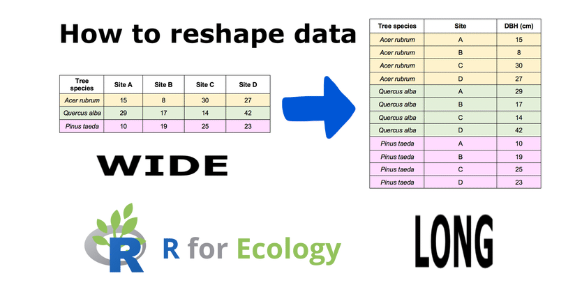

# ggplot2

ggplot2 is a widely used data visualization package in R that lets you create clear, powerful, and customizable plots using a consistent and logical system called the Grammar of Graphics.

More details:
https://ggplot2.tidyverse.org/

```{r, echo=FALSE, out.width="70%"}
knitr::include_graphics("figures/ggplot2.png")
```

Why ggplot2 is so popular:
✅ Declarative and readable
✅ Easy to extend and modify
✅ Produces publication-quality figures
✅ Works perfectly with tidy data
✅ Excellent support for statistical graphics

ggplot2 has also an official extension mechanism which means that others can now easily create their own stats, geoms and positions, and provide them in other packages. You can find more information from here:

https://exts.ggplot2.tidyverse.org/ggiraph.html

Please, take a look also to this webpage:

https://github.com/erikgahner/awesome-ggplot2

### Core idea: “Grammar of Graphics”

Instead of choosing a plot type (like “bar plot” or “scatter plot”) directly, ggplot2 builds plots by combining components (“layers”):

[^1]: Data – what you want to plot
[^2]: Aesthetics (aes) – how variables map to visuals (x, y, color, size, …)
[^3]: Geoms – what geometric objects to draw (points, lines, bars, …)
[^4]: Scales – how values map to colors, sizes, axes
[^5]: Facets – splitting plots into panels
[^6]: Themes – visual appearance (fonts, background, gridlines)

You add these components together using +.

#### A simple example

```{r}
library(ggplot2)

ggplot(mtcars, aes(x = wt, y = mpg)) +
  geom_point()
```

This means:

- Data: mtcars
- x-axis: weight (wt)
- y-axis: miles per gallon (mpg)
- Geom: points (scatter plot)

#### Adding more layers

```{r}
ggplot(mtcars, aes(wt, mpg)) +
  geom_point() +
  geom_smooth(method = "lm") +
  labs(
    title = "Fuel efficiency vs car weight",
    x = "Weight",
    y = "Miles per gallon"
  )
```

Here you extend the same plot by:

- adding a regression line
- adding labels

#### How it differs from base R plots

Base R:
```{r}
plot(mtcars$wt, mtcars$mpg)
```

ggplot2:
```{r}
ggplot(mtcars, aes(wt, mpg)) + geom_point()
```

ggplot2 is:

- more structured
- more consistent
- easier to build complex plots incrementally

### An introduction to data visualization using R programming

<iframe width="560" height="315"
        src="https://www.youtube.com/embed/HPJn1CMvtmI"
        frameborder="0"
        allow="accelerometer; autoplay; encrypted-media; gyroscope; picture-in-picture"
        allowfullscreen>
</iframe>

# Working with ggplot2: Population development of the municipalities

### 1. Installing and loading R packages

What is an R package? An R package is a collection of functions, datasets, and documentation that extends what R can do. Base R is fairly minimal; most real data analysis uses packages.

Loading commonly used packages
```{r}
library(forecast)
library(foreign)
library(reshape)
library(ggplot2)
library(zoo)
library(scales)
library(dplyr)
library(ggthemes)
```

Installing and loading additional packages
```{r}
install.packages("geofacet")
library(geofacet)
```
geofacet is used for geographical faceting (e.g. small multiples laid out like a map).

Explanation:

- install.packages() downloads the package from CRAN
- You only need to install a package once
- library() must be run every session

Installing a package from GitHub
```{r}
remotes::install_github("ropengov/geofi")
library(geofi)
```

Explanation:

- Some packages are not on CRAN
- install_github() installs directly from GitHub
- geofi provides Finnish municipality and regional data

Note! This requires the remotes package to be installed.

### 2. Reading data into R

Reading a CSV file
``` {r}
data(aluejaot2)
head(aluejaot2)
```

Explanation:

- read.csv() loads a CSV file into R as a data frame
- sep = "," specifies comma‑separated values
- encoding = "UTF-8" ensures correct character encoding (important for Finnish characters)
- stringsAsFactors = FALSE keeps text variables as character strings
- names(dat) shows column names of the dat object

Reading a second dataset
```{r}
data(data_vakie3)
head(data_vakie3)
```

### 3. Merging datasets

```{r}
x2<-merge(data,dat, by.x="tunnus", by.y="tunnus",all.x=T)
```

Explanation:

- merge() combines two datasets
- by.x and by.y specify the id variable which is found from both of datasets (here id is tunnus)
- all.x = TRUE keeps all rows from data (left join)

### 4. Reshaping the data (wide → long)

```{r}
data2<-melt(data = x2, id.vars = c("tunnus", "nimi","Maakunta"), measure.vars = c(3:43))
```

Many datasets are initially in wide format:

```{r, echo=FALSE, out.width="70%"}

```

melt():

- Keeps identifier variables (id.vars)
- Converts columns 3–43 into: a variable column and a value column

As a results, data2 is suitable for ggplot2 and time‑series analysis.

### 5. Creating a time variable

```{r}
aika<-seq(2000,2040,1)
aika
```

Explanation:

- seq() creates a sequence of numbers
- Here: years from 2000 to 2040
- Step size = 1 year

This vector can be used as:

- A time axis
- A reference for plotting
- Indexing years

### 6. Creating a repeated time variable
```{r}
b<-rep(aika,310)
```

Explanation:

- aika is a vector of years (2000–2040)
- rep() repeats this vector 310 times
- The result is a long vector where the time sequence is repeated for each spatial unit (e.g. municipality or region)

Why this is needed?

After reshaping the data into long format, we need a time variable that matches the number of rows in the dataset.

Conceptually:

- Each region has values for every year
- b assigns the correct year to each observation

### 7. Sorting the data by region name

```{r}
data3 <- data2[order(data2$nimi),]
```

Explanation:

- order(data2$nimi) sorts rows alphabetically by region name (nimi)
- The brackets [ , ] reorder the rows accordingly

Why this matters?

- Ensures that time series are properly aligned
- Matches the structure of the repeated time vector (b)
- Prevents mismatch between years and regions

This step is crucial for correct time–region alignment.

### 8. Adding the time variable to the data

```{r}
data4<-cbind(data3,b)
names(data4)
```

Explanation:

- cbind() binds a new column to the dataset
- The new column b represents time (years)
- names(data4) checks that the column was added correctly

### 9. Converting values to numeric

```{r}
data4$value<-as.numeric(data4$value)
```

Explanation:

- After melt(), values are often stored as characters
- as.numeric() converts them into numeric values

Why this is important?

- Mathematical operations (sum, mean, plots) require numeric data
- Without this step, aggregation would fail or give errors

### 10. Aggregating data by year, region, and province

```{r}
data5<-aggregate(data4$value, by=list(data4$b,data4$nimi, data4$Maakunta),FUN=sum)
```

Explanation:
This step summarizes the data.

- aggregate() groups observations
- Grouping variables:

+ data4$b → year
+ data4$nimi → region
+ data4$Maakunta → province

- FUN = sum → sums values within each group

Conceptually: This produces one value per year per region, suitable for:

- time‑series analysis
- plotting trends
- regional comparisons

The output columns will be named:

- Group.1 → year
- Group.2 → region name
- Group.3 → province
- x → aggregated value

### 11. Checking dataset dimensions

``` {r}
dim(data5)
```

Explanation:

dim() reports:

- number of rows
- number of columns

Why this matters?

- Confirms that aggregation worked as expected
- Useful for sanity checking before analysis or plotting

### 12. Subsetting one province

```{r}
vs<-subset(data5, Group.3=="Pohjois-Karjala")
```

Explanation:

- subset() filters the data
- Keeps only rows where the province is Pohjois‑Karjala

Result: vs contains only regional time series for North Karelia

Ready for:

- regional plots
- comparisons
- focused analysis

### 13. Visualising regional population development with ggplot2

The complete plotting code
```{r}
ggplot(vs, aes(x=Group.1, y=x, group=Group.2))+
  geom_line(size=1.1) +
  theme(axis.text.x=element_text(angle=90, vjust=0.5,hjust=1)) +
  facet_geo(facets = ~Group.2, grid=geofi::grid_pohjois_karjala, scales = "free_y") +
  labs(title="Population development 2000-2019 and population projection 2020-2040", y="Population", x="Municipality")+
  theme(axis.text = element_text(size=12),
        axis.title = element_text(size=12, face="bold"),
        plot.title = element_text(size=14, face="bold"),
        strip.text = element_text(size=12))+
  scale_x_continuous(breaks=seq(2000, 2040,5)) 
```

Step‑by‑step explanation

#### 1. Defining the plot structure
```
ggplot(vs, aes(x = Group.1, y = x, group = Group.2))
```

Explanation:

- vs is the dataset (Pohjois‑Karjala only)
- Group.1 → year
- x → aggregated population
- group = Group.2 → separate line for each municipality

#### 2. Drawing population trends as lines
```
geom_line(size = 1.1)
```
Explanation:

- Draws a continuous line for each municipality
- size = 1.1 increases line thickness for readability

#### 3. Rotating x‑axis labels
```
theme(axis.text.x = element_text(angle = 90, vjust = 0.5, hjust = 1))
```

Explanation:

- Rotates year labels by 90 degrees
- Prevents overlapping text
- Improves readability when many years are shown

#### 4. Spatial faceting using geofacet
```
facet_geo(
  facets = ~ Group.2,
  grid = geofi::grid_pohjois_karjala,
  scales = "free_y"
)
```

Explanation (this is the key idea):

- Creates one panel per municipality
- Panels are arranged geographically, not alphabetically
- geofi::grid_pohjois_karjala defines the spatial layout
- scales = "free_y" gives each municipality its own y‑axis range

#### 5. Adding labels and title
```
labs(
  title = "Population development 2000–2019 and population projection 2020–2040",
  y = "Population",
  x = "Municipality")
```

Explanation:

- Adds an informative title
- Labels axes clearly
- Essential for standalone interpretation

#### 6. Improving visual appearance
```
theme(
  axis.text = element_text(size = 12),
  axis.title = element_text(size = 12, face = "bold"),
  plot.title = element_text(size = 14, face = "bold"),
  strip.text = element_text(size = 12)
)
```
Explanation:

- Increases font sizes
- Makes titles and axes clearer
- Improves readability for lectures and reports

#### 7. Controlling x‑axis year breaks
```
scale_x_continuous(breaks = seq(2000, 2040, 5))
```

Explanation:

- Shows year labels every 5 years
- Avoids clutter
- Makes long time series easier to read

```{r setup, include=FALSE}
knitr::opts_chunk$set(echo = TRUE)
```

