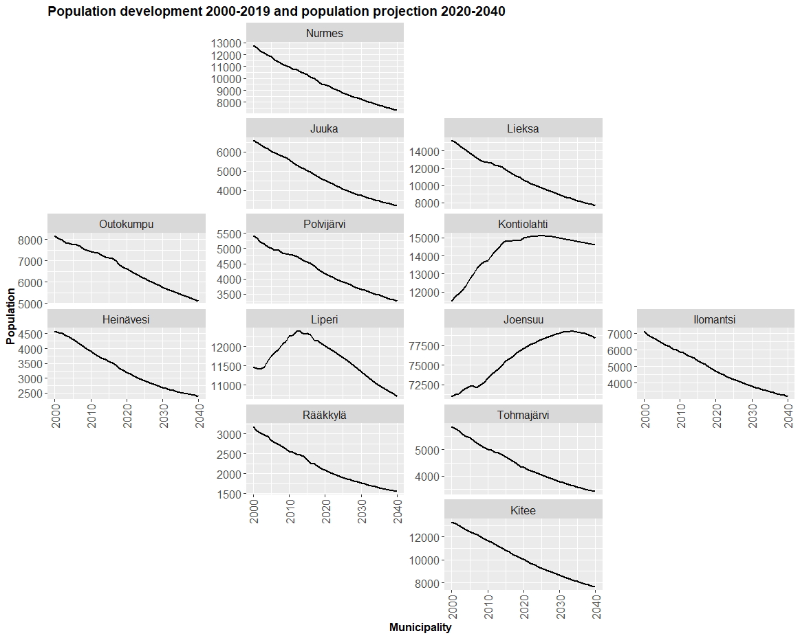

```{r setup, include=FALSE}
library(spatialcourseOL)

knitr::opts_chunk$set(
  collapse = TRUE,
  comment = "#>",
  eval = TRUE
)
```

# ggplot2

ggplot2 is a widely used data visualization package in R that lets you create clear, powerful, and customizable plots using a consistent and logical system called the Grammar of Graphics.

More details:
https://ggplot2.tidyverse.org/

{width=70%}

Why ggplot2 is so popular:

- Declarative and readable
- Easy to extend and modify
- Produces publication-quality figures
- Works perfectly with tidy data
- Excellent support for statistical graphics

ggplot2 has also an official extension mechanism which means that others can now easily create their own stats, geoms and positions, and provide them in other packages. You can find more information from here:

https://exts.ggplot2.tidyverse.org/ggiraph.html

Please, take a look also to this webpage:

https://github.com/erikgahner/awesome-ggplot2

### Core idea: “Grammar of Graphics”

Instead of choosing a plot type (like “bar plot” or “scatter plot”) directly, ggplot2 builds plots by combining components (“layers”):

- Data – what you want to plot
- Aesthetics (aes) – how variables map to visuals (x, y, color, size, …)
- Geoms – what geometric objects to draw (points, lines, bars, …)
- Scales – how values map to colors, sizes, axes
- Facets – splitting plots into panels
- Themes – visual appearance (fonts, background, gridlines)

You add these components together using +.

#### A simple example

```{r}
library(ggplot2)
ggplot(mtcars, aes(x = wt, y = mpg)) +
  geom_point()
```

This means:

- Data: mtcars
- x-axis: weight (wt)
- y-axis: miles per gallon (mpg)
- Geom: points (scatter plot)

#### Adding more layers

```{r}
ggplot(mtcars, aes(wt, mpg)) +
  geom_point() +
  geom_smooth(method = "lm") +
  labs(
    title = "Fuel efficiency vs car weight",
    x = "Weight",
    y = "Miles per gallon"
  )
```

Here you extend the same plot by:

- adding a regression line
- adding labels

#### How it differs from base R plots

Base R:
```{r}
plot(mtcars$wt, mtcars$mpg)
```

ggplot2:
```{r}
ggplot(mtcars, aes(wt, mpg)) + geom_point()
```

ggplot2 is:

- more structured
- more consistent
- easier to build complex plots incrementally

### An introduction to data visualization using R programming

<iframe width="560" height="315"
        src="https://www.youtube.com/embed/HPJn1CMvtmI"
        frameborder="0"
        allow="accelerometer; autoplay; encrypted-media; gyroscope; picture-in-picture"
        allowfullscreen>
</iframe>


# Working with ggplot2: Population development of the municipalities

### 1. Installing and loading R packages

What is an R package? An R package is a collection of functions, datasets, and documentation that extends what R can do. Base R is fairly minimal; most real data analysis uses packages.

Loading commonly used packages
```{r}
library(forecast)
library(foreign)
library(reshape2)
library(ggplot2)
library(zoo)
library(scales)
library(dplyr)
library(ggthemes)
```

Installing and loading additional packages
```{r, eval=FALSE}
install.packages("geofacet")
```

```{r}
library(geofacet)
```
geofacet is used for geographical faceting (e.g. small multiples laid out like a map).

Explanation:

- install.packages() downloads the package from CRAN
- You only need to install a package once
- library() must be run every session

Installing a package from GitHub
```{r, eval=FALSE}
remotes::install_github("ropengov/geofi")
```

```{r}
library(geofi)
```

Explanation:

- Some packages are not on CRAN
- install_github() installs directly from GitHub
- geofi provides Finnish municipality and regional data

Note! This requires the remotes package to be installed.

### 2. Reading data into R

```{r}
library(spatialcourseOL)
```

Reading a CSV file
```{r}
aluejaot2 <- spatialcourseOL::aluejaot2
head(aluejaot2)
```

Explanation:

- read.csv() loads a CSV file into R as a data frame
- sep = "," specifies comma‑separated values
- encoding = "UTF-8" ensures correct character encoding (important for Finnish characters)
- stringsAsFactors = FALSE keeps text variables as character strings
- names(dat) shows column names of the dat object

Reading a second dataset
```{r}
data_vakie3 <- spatialcourseOL::data_vakie3
head(data_vakie3)
```

### 3. Merging datasets

```{r}
x2 <- merge(data_vakie3, aluejaot2, by.x="tunnus", by.y="tunnus",all.x=T)
```

Explanation:

- merge() combines two datasets
- by.x and by.y specify the id variable which is found from both of datasets (here id is tunnus)
- all.x = TRUE keeps all rows from data (left join)

### 4. Reshaping the data (wide → long)

```{r}
data2 <- melt(data = x2, id.vars = c("tunnus", "nimi","Maakunta"), measure.vars = c(3:43))
```

Many datasets are initially in wide format:

```{r, echo=FALSE, out.width="70%"}
knitr::include_graphics("figures/wide_long.png")
```

melt():

- Keeps identifier variables (id.vars)
- Converts columns 3–43 into: a variable column and a value column

As a results, data2 is suitable for ggplot2 and time‑series analysis.

### 5. Creating a time variable

```{r}
aika <- seq(2000,2040,1)
aika
```

Explanation:

- seq() creates a sequence of numbers
- Here: years from 2000 to 2040
- Step size = 1 year

This vector can be used as:

- A time axis
- A reference for plotting
- Indexing years

### 6. Creating a repeated time variable
```{r}
b <- rep(aika,310)
```

Explanation:

- aika is a vector of years (2000–2040)
- rep() repeats this vector 310 times
- The result is a long vector where the time sequence is repeated for each spatial unit (e.g. municipality or region)

Why this is needed?

After reshaping the data into long format, we need a time variable that matches the number of rows in the dataset.

Conceptually:

- Each region has values for every year
- b assigns the correct year to each observation

### 7. Sorting the data by region name

```{r}
data3 <- data2[order(data2$nimi),]
```

Explanation:

- order(data2$nimi) sorts rows alphabetically by region name (nimi)
- The brackets [ , ] reorder the rows accordingly

Why this matters?

- Ensures that time series are properly aligned
- Matches the structure of the repeated time vector (b)
- Prevents mismatch between years and regions

This step is crucial for correct time–region alignment.

### 8. Adding the time variable to the data

```{r}
data4 <- cbind(data3,b)
names(data4)
```

Explanation:

- cbind() binds a new column to the dataset
- The new column b represents time (years)
- names(data4) checks that the column was added correctly

### 9. Converting values to numeric

```{r}
data4$value <- as.numeric(data4$value)
```

Explanation:

- After melt(), values are often stored as characters
- as.numeric() converts them into numeric values

Why this is important?

- Mathematical operations (sum, mean, plots) require numeric data
- Without this step, aggregation would fail or give errors

### 10. Aggregating data by year, region, and province

```{r}
data5 <- aggregate(data4$value, by=list(data4$b,data4$nimi, data4$Maakunta),FUN=sum)
```

Explanation:
This step summarizes the data.

- aggregate() groups observations
- Grouping variables:

+ data4$b → year
+ data4$nimi → region
+ data4$Maakunta → province

- FUN = sum → sums values within each group

Conceptually: This produces one value per year per region, suitable for:

- time‑series analysis
- plotting trends
- regional comparisons

The output columns will be named:

- Group.1 → year
- Group.2 → region name
- Group.3 → province
- x → aggregated value

### 11. Checking dataset dimensions

``` {r}
dim(data5)
```

Explanation:

dim() reports:

- number of rows
- number of columns

Why this matters?

- Confirms that aggregation worked as expected
- Useful for sanity checking before analysis or plotting

### 12. Subsetting one province

```{r}
vs <- subset(data5, Group.3=="Pohjois-Karjala")
```

Explanation:

- subset() filters the data
- Keeps only rows where the province is Pohjois‑Karjala

Result: vs contains only regional time series for North Karelia

Ready for:

- regional plots
- comparisons
- focused analysis

### 13. Visualising regional population development with ggplot2

### Facetting

Faceting means splitting one plot into multiple small plots, each showing a subset of the data, but:

- using the same variables
- the same geoms
- the same aesthetics

Think of it as: “Draw the same plot many times, once for each group.”

This is extremely useful when you want to:

- compare groups
- see patterns that would be hidden if everything were overlaid
- teach students how trends differ across categories

In ggplot2, the two main faceting functions are:

- facet_wrap() - One grouping variable
- facet_grid() - Two grouping variables (rows × columns)

#### What is faceting in ggplot2? 

Faceting means splitting one plot into multiple small plots, each showing a subset of the data, but:

- using the same variables
- the same geoms
- the same aesthetics


```{r}
ggplot(vs, aes(x=Group.1, y=x))+
  geom_line(linewidth=1) +
  theme(axis.text.x=element_text(angle=90, vjust=0.5,hjust=1)) +
  facet_wrap(facets = ~Group.2, scales = "free_y") 
```

Above code, explained line by line:
```
ggplot(vs, aes(x = Group.1, y = x)) +
```
This initializes the plot

- vs is your data frame
- Group.1 - x-axis (likely year)
- x - y-axis (population or similar variable)

```
geom_line(linewidth = 1) +
```
Draws a line in each panel

- geom_line() connects points in order of x
- linewidth = 1 makes the line thicker and more readable

```
theme(axis.text.x = element_text(angle = 90, vjust = 0.5, hjust = 1)) +
```
Rotates x-axis labels

- angle = 90 → vertical labels
- vjust, hjust → alignment adjustments

This is common when x-axis labels are long or many (e.g. years).

```
facet_wrap(facets = ~Group.2, scales = "free_y")
```

This is the key faceting line and it tells ggplot:

“Create one panel for each unique value of Group.2.”

If Group.2 contains municipalities, you get:

- one panel per municipality

If it contains regions or categories:

- one panel per region/category

Internally, ggplot:

- Splits the data by Group.2
- Draws the same plot for each subset
- Arranges the panels automatically in rows and columns

scales = "free_y" — very important:

- Each facet gets its own y-axis scale
- Makes small and large groups equally visible
- Improves readability and comparison of shape (trends)

Basically, the code draws a separate line plot for each value of Group.2, arranged automatically on the page, with each plot showing how x changes over Group.1 and using its own y-axis scale.

### facet_geo()

Standard faceting (facet_wrap(), facet_grid()) arranges panels

- alphabetically
- or in rows/columns you choose

This means that "geography" is lost. For example, municipalities in Finland would appear in an arbitrary order, not reflecting where they are located.

Function facet_geo() keeps geography visible while still showing one plot per region.

#### What is facet_geo()?

In simple terms:

- Each facet = one region, positioned to roughly match its real-world map location

So instead of this:

```
Helsinki | Espoo | Tampere
Turku    | Oulu  | Kuopio
```

you get something like:

```
        Oulu
Kuopio  Jyväskylä
Turku   Helsinki
```

#### How geo_facet works conceptually

You provide two things:

Your data

- Includes a region variable (e.g. municipality)

A geographic grid: A lookup table with:

- region name
- row
- column

Example of a grid (simplified):

```{r, eval=FALSE}
grid_finland <- data.frame(
  municipality = c("Helsinki", "Turku", "Oulu"),
  row = c(3, 4, 1),
  col = c(3, 2, 3)
)
```

This grid tells facet_geo() where each panel should go.

Predefined grids for Finland are available in the geofi package:

https://ropengov.github.io/geofi/articles/geofi_datasets.html

```{r}
d <- data(package = "geofi")
as_tibble(d$results) |> 
  select(Item,Title) |> 
    filter(grepl("grid", Item)) |> 
  print(n = 100)
```

#### Why it’s good for teaching and research

Advantages

- Preserves regional context
- Easier comparison than maps
- Works with any ggplot geometry
- Great for time series per region

Limitations

- Approximate geography
- Many regions - small panels

####  What geo_facet is not

It is not:

- a real map
- spatially precise
- using coordinates or projections

It is:

- a visual metaphor for geography
- designed for comparative time series or distributions

Perfect for:

- population trends
- unemployment rates
- health indicators
- education statistics

Note! Recent updates to ggplot2 (v3.5.0+) have caused layout issues with older versions of geofacet, leading to misaligned grids or empty plots. If you do not see your figure correctly, install older version of the ggplot2 by following code:

```{r, eval=FALSE}
devtools::install_version(package = "ggplot2", version = "3.5.2", repos = "http://cran.us.r-project.org")
```

The complete plotting code
```{r, fig.width=12, fig.height=8, dpi=150}
ggplot(vs, aes(x=Group.1, y=x, group=Group.2))+
  geom_line(size=1) +
  theme(axis.text.x=element_text(angle=90, vjust=0.5,hjust=1)) +
  facet_geo(facets = ~Group.2, grid=geofi::grid_pohjois_karjala, scales = "free_y") +
  labs(title="Population development 2000-2019 and \npopulation projection 2020-2040", y="Population", x="Municipality")+
  theme(axis.text = element_text(size=12),
        axis.title = element_text(size=12, face="bold"),
        plot.title = element_text(size=14, face="bold"),
        strip.text = element_text(size=12))+
  coord_cartesian(xlim = c(2000, 2040)) + 
  scale_x_continuous(breaks = scales::pretty_breaks(4)) 
```

You can see, that facet_geo() is a geographic faceting method that arranges small ggplot panels to resemble a map, making regional comparisons easier while showing detailed plots for each area.

The figure does not render correctly, so below is an image showing the figure as it should look.

{width=1200px height=800px}

Step‑by‑step explanation

#### 1. Defining the plot structure
```
ggplot(vs, aes(x = Group.1, y = x, group = Group.2))
```

Explanation:

- vs is the dataset (Pohjois‑Karjala only)
- Group.1 → year
- x → aggregated population
- group = Group.2 → separate line for each municipality

#### 2. Drawing population trends as lines
```
geom_line(size = 1.1)
```
Explanation:

- Draws a continuous line for each municipality
- size = 1.1 increases line thickness for readability

#### 3. Rotating x‑axis labels
```
theme(axis.text.x = element_text(angle = 90, vjust = 0.5, hjust = 1))
```

Explanation:

- Rotates year labels by 90 degrees
- Prevents overlapping text
- Improves readability when many years are shown

#### 4. Spatial faceting using geofacet
```
facet_geo(
  facets = ~ Group.2,
  grid = geofi::grid_pohjois_karjala,
  scales = "free_y"
)
```

Explanation (this is the key idea):

- Creates one panel per municipality
- Panels are arranged geographically, not alphabetically
- geofi::grid_pohjois_karjala defines the spatial layout
- scales = "free_y" gives each municipality its own y‑axis range

#### 5. Adding labels and title
```
labs(
  title = "Population development 2000–2019 and population projection 2020–2040",
  y = "Population",
  x = "Municipality")
```

Explanation:

- Adds an informative title
- Labels axes clearly
- Essential for standalone interpretation

#### 6. Improving visual appearance
```
theme(
  axis.text = element_text(size = 12),
  axis.title = element_text(size = 12, face = "bold"),
  plot.title = element_text(size = 14, face = "bold"),
  strip.text = element_text(size = 12)
)
```
Explanation:

- Increases font sizes
- Makes titles and axes clearer
- Improves readability for lectures and reports

#### 7. Controlling x‑axis year breaks
```
scale_x_continuous(breaks = seq(2000, 2040, 5))
```

Explanation:

- Shows year labels every 5 years
- Avoids clutter
- Makes long time series easier to read

