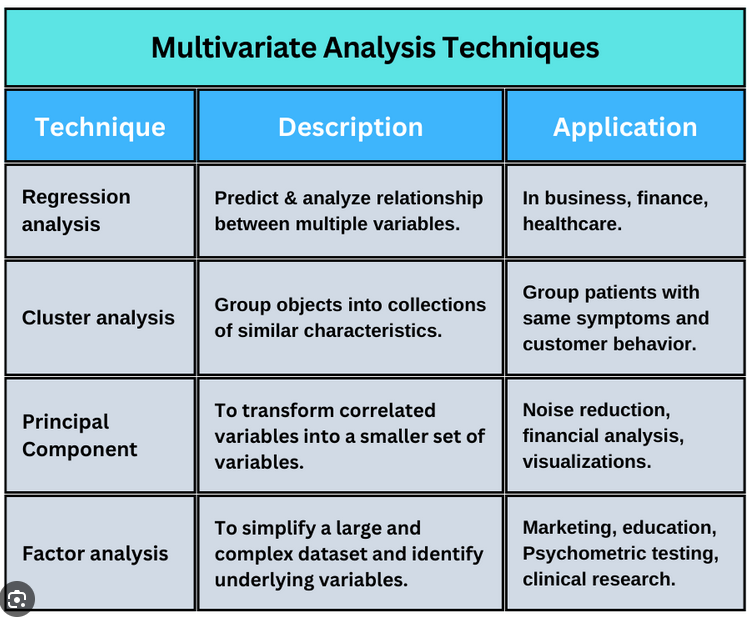

```{r setup, include=FALSE}
library(spatialcourseOL)
library(sotkanet)
library(janitor)
library(reshape2)
library(geofi)
library(ggplot2)
library(dplyr)
library(car)
library(NbClust)

knitr::opts_chunk$set(echo = TRUE)
```

# Multivariate analysis

R provides a versatile and powerful environment for multivariate data analysis. Due to its open-source nature and active user community, R offers a wide selection of packages that implement both classical and modern multivariate methods. These methods enable the simultaneous analysis of multiple variables, making it possible to uncover complex structures, relationships, and patterns in high-dimensional data.

Commonly used multivariate methods in R include principal component analysis (PCA), factor analysis, cluster analysis, discriminant analysis, and multidimensional scaling. These techniques are often applied for data reduction, classification, grouping, and visualization, especially when dealing with large and correlated datasets. Packages such as stats, psych, FactoMineR, and cluster provide well-established tools for these purposes and are widely used in teaching and research.

```{r, echo=FALSE, out.width="90%"}

```

In addition to classical techniques, R also supports more advanced multivariate approaches, such as canonical correlation analysis, correspondence analysis, structural equation modeling, and multivariate regression. Furthermore, modern machine learning–oriented multivariate methods, including random forests, support vector machines, and neural networks, are available through packages such as caret, tidymodels, and mlr3. These methods are particularly useful when the primary aim is prediction rather than explanation.

One of R’s key strengths in multivariate analysis lies in its visualization capabilities. Packages like ggplot2, factoextra, and GGally allow researchers to explore multivariate relationships graphically, which greatly aids interpretation and communication of results. Visual tools such as biplots, scatterplot matrices, and cluster dendrograms are especially valuable in understanding the structure of complex datasets.

For instance, factoextra is an R package making easy to extract and visualize the output of exploratory multivariate data analyses, including:

- Principal Component Analysis (PCA), which is used to summarize the information contained in a continuous (i.e, quantitative) multivariate data by reducing the dimensionality of the data without loosing important information.

- Correspondence Analysis (CA), which is an extension of the principal component analysis suited to analyse a large contingency table formed by two qualitative variables (or categorical data).

- Multiple Correspondence Analysis (MCA), which is an adaptation of CA to a data table containing more than two categorical variables.

- Multiple Factor Analysis (MFA) dedicated to datasets where variables are organized into groups (qualitative and/or quantitative variables).

- Hierarchical Multiple Factor Analysis (HMFA): An extension of MFA in a situation where the data are organized into a hierarchical structure.

- Factor Analysis of Mixed Data (FAMD), a particular case of the MFA, dedicated to analyze a data set containing both quantitative and qualitative variables.

```{r, echo=FALSE, out.width="90%"}
knitr::include_graphics("figures/factoextra.png")
```

You can find more information about factoextra here:

https://rpkgs.datanovia.com/factoextra/index.html

In this lecture, we will go through principal component analysis and cluster analysis.

# Principal component analysis

The idea of principal component analysis (PCA) is to identify linear combinations of the original variables that describe the variability of the variables included in the linear combination. In principal component analysis, new variables are constructed in such a way that each component explains as much of the variation in the variables as possible. The first principal component explains as much of the total variation in the variables as possible, the second principal component explains as much as possible of the remaining variation, and so on. The resulting principal components are uncorrelated with one another.

In principal component analysis, the extracted components generally take the form

$$
PC^{(m)} = w^{(m)}_1 X_1 + w^{(m)}_2 X_2 + \dots + w^{(m)}_p X_p
$$

and they have the largest variance among those linear combinations that are uncorrelated with the previously extracted principal components. In general, the coefficients (w) are chosen so as to maximize the ratio of the variance of the principal component to the total variance.

Idea of PCA:
```{r, echo=FALSE, out.width="90%"}
knitr::include_graphics("figures/pca_idea.png")
```

In principal component analysis, it is possible to extract as many components as there are variables. However, when analyzing empirical data, one is usually not interested in all principal components but rather in a “sufficient number” that adequately describes the original variables used in the analysis. Generally, the number of components is selected using the same criteria as in factor analysis, namely based on eigenvalues and explained variance. In principal component analysis, the eigenvalue criterion has a sensible justification. Since eigenvalues correspond to the variances of the principal components, it is reasonable to interpret only those components whose eigenvalue is greater than one, because the variances of individual standardized variables are equal to one. Thus, it is not sensible to include in the analysis components whose variance is smaller than that of a single variable.

Principal component analysis is conducted in the same way as factor analysis. Rotation can be applied to principal components just as it is to factors. Rotation facilitates the interpretation of components, as in factor analysis. In interpretation, the aim is to name the components in a way that indicates the source of the correlations between variables. In interpreting correlations among variables, the objective is not to infer causal relationships.

## Example: Principal component analysis with R

### 1. Introduction

In this example, we demonstrate how to download municipal-level data from **Sotkanet**,
reshape and clean the data, join it with spatial municipality data, visualize it on a map,
and finally explore relationships between variables using multivariate methods.

### 2. Downloading Data from Sotkanet

We begin by downloading indicator data from the Sotkanet database.  
Sotkanet provides a wide range of socioeconomic and health-related indicators for Finland.

```{r message=FALSE}
# Load the sotkanet package
library(sotkanet)

# Download selected indicators for year 2019 at municipality level
data <- GetDataSotkanet(
  indicators = c(181, 3562, 5, 1275, 3099, 182, 761, 3195,
    3076, 453, 179, 304, 313, 2320, 2343, 3126),
  years = 2019,  region.category = "KUNTA")
```

### 3. Selecting and Reshaping the Data

Next, we select only the relevant columns and reshape the data from long format to
wide format so that each indicator becomes its own variable.

```{r}
data2<-data[,c(5,7,9)] #select only some columns from data
table(data2$indicator.title.fi)
```

We use the reshape2 package to perform the transformation.

```{r}
?reshape2::dcast
dat <- reshape2::dcast(data2,  region.code ~ indicator.title.fi, value.var = "primary.value")
dat$region.code<-as.numeric(dat$region.code) #change code to numeric

class(dat)
names(dat)
```

### 4. Cleaning Variable Names and Data Types

To make variable names easier to work with, we clean them and ensure that all variables
are numeric.

```{r}
dat<-clean_names(dat) # clean column names of our dataframe
names(dat)

dat2<-data.frame(lapply(dat,as.numeric))
```

### 5. Loading Spatial Municipality Data

To visualize the indicators spatially, we download municipality boundaries.

```{r}
municipalities23 <- geofi::get_municipalities(year = 2023)
```

### 6. Joining Attribute Data with Spatial Data

We join the Sotkanet indicators to the municipality geometry using a left join.
This keeps all spatial units even if some attribute values are missing.

```{r}
map <- left_join(municipalities23,dat2, by = c("kunta" = "region_code")) # why we use left_join?
```

### 7. Visualizing the Data

We can now visualize the spatial data using ggplot2 and simple maps.

```{r}
ggplot(map)+geom_sf()
ggplot(map, aes(fill = taloudellinen_huoltosuhde)) + geom_sf()
```

### 8. Preparing Data for Multivariate Analysis

Before performing multivariate analysis, we select a subset of variables and inspect
their distributions.

```{r}
map2<-data.frame(map[,c(2,73:87)])
summary(map2)
```

### 9. Exploring Relationships Between Variables

Scatterplot matrices help us explore correlations and relationships between variables,
which is a key step before applying methods such as principal component analysis or
cluster analysis.

```{r}
map3<-map2[,c(1:10,14,15,16)]
scatterplotMatrix(map3[,2:8])
```


### 10. Principal Component Analysis (PCA)

Next, we apply **principal component analysis (PCA)** to reduce the dimensionality of the data and to identify the main latent dimensions underlying the socioeconomic variables.

PCA transforms a set of correlated variables into a smaller number of uncorrelated components that explain as much of the total variance as possible.

#### 10.1 Preparing Data for PCA

We select the variables to be included in the PCA. The first column is an identifier, so it is excluded from the analysis.

```{r}
# Select variables for PCA
data_pca <- map3[, 2:13]
```

Before performing PCA, missing values must be handled. Here, we replace missing values with the mean of each variable, which is a common and simple imputation approach for exploratory analysis.

```{r}
data_pca2<-data_pca%>%mutate_all(~ifelse(is.na(.x),mean(.x,na.rm=T),.x))
data_pca2 <- data_pca2 %>% select(-geom)
```

#### 10.2 Running the PCA

We use the prcomp() function to perform PCA. The variables are standardized (scale = TRUE) so that they contribute equally to the analysis.

```{r}
sotkanet_pca <- prcomp(data_pca2, scale=T) 
summary(sotkanet_pca)
names(sotkanet_pca)
```

#### 10.3 Choosing the Number of Components

A scree plot helps determine how many components should be retained by visualizing the eigenvalues.

```{r}
screeplot(sotkanet_pca, type="lines")
```

Typically, components with eigenvalues greater than one or those before the “elbow” in the scree plot are selected for interpretation.

#### 10.4 Interpreting Component Loadings

Component loadings show how strongly each variable contributes to a principal component.

```{r}
sotkanet_pca$rotation[,1] # Socioeconomic wellbeing
sotkanet_pca$rotation[,2] # Labour market disadvantage
sotkanet_pca$rotation[,3] # Inequality–language structure
```

Based on the loadings, the components can be interpreted, for example as:

- PC1: "Socioeconomic wellbeing"  component
- PC2: "Labour market disadvantage” component
- PC3: "Inequality–language structure" component

Note that:

- the naming of components is not unambiguous
- the interpretation of components is data-dependent
- different researchers may arrive at slightly different names, as long as the interpretations are well justified

It is important to emphasize that the naming of principal components is not unique or objective. Component interpretation is always dependent on the dataset, the variables included, and the research context. As a result, different researchers may assign slightly different names to the same components. This is not a problem, provided that the naming is clearly justified by the loadings and supported by substantive reasoning rather than imposed arbitrarily.

#### 10.5 Component Scores

Component scores describe how each municipality is positioned along the principal components.

```{r}
sotkanet_pca$x[,1]; hist(sotkanet_pca$x[,1])
```

#### 10.6 Saving PCA Results to Spatial Data

Finally, we attach the first three principal component scores to the spatial dataset.
This allows the components to be visualized on maps or used in further spatial analysis.

```{r}
map3$pca1<-sotkanet_pca$x[,1]
map3$pca2<-sotkanet_pca$x[,2]
map3$pca3<-sotkanet_pca$x[,3]
```

#### 10.7 Summary

In this section, we:

- Prepared multivariate data for PCA
- Handled missing values
- Performed principal component analysis
- Selected and interpreted principal components
- Stored component scores for further analysis and mapping

PCA is a powerful exploratory tool for simplifying complex datasets and revealing hidden structures in multivariate data.

# Cluster analysis


### 11. Cluster Analysis

After reducing the dimensionality of the data using principal component analysis, we proceed with **cluster analysis**.  
Clustering allows us to group municipalities into internally similar but mutually distinct groups based on their socioeconomic profiles.

In this example, we use **k-means clustering** applied to the first three principal components.

#### 11.1 Preparing Data for Clustering

We select the PCA scores that were previously added to the spatial data object.

```{r}
# Select PCA scores for clustering
df <- map3[, 14:16]
```

#### 11.2 Choosing the Number of Clusters

Before running k-means clustering, we explore an appropriate number of clusters using the NbClust package.
This package evaluates multiple statistical criteria to suggest an optimal number of clusters.

```{r, eval=FALSE}
#install.packages("NbClust") #factoextra
library(NbClust)
#set.seed(1234)
```

We examine how often different cluster numbers are recommended.

```{r}
nc <- NbClust(df, min.nc=2, max.nc=15, method="kmeans")
table(nc$Best.n[1,])
```

The following bar plot summarizes the results across all criteria.

```{r}
barplot(table(nc$Best.n[1,]), xlab="Numer of Clusters", 
        ylab="Number of Criteria", main="Number of Clusters Chosen by 26 Criteria")
```

Based on this evaluation, we proceed with four clusters.

#### 11.3 Performing k-Means Clustering

We apply k-means clustering with four clusters. Multiple random starts are used to improve solution stability.

```{r}
fit.km <- kmeans(df, 4, nstart=25)    
names(fit.km)
```

Cluster sizes and cluster centers provide insight into the structure of the solution.

```{r}
fit.km$size
fit.km$centers   
```

We can also compute the mean values of the input variables by cluster.

```{r}
aggregate(df, by=list(cluster=fit.km$cluster), mean)
```

#### 11.4 Interpreting the Clusters

Reminder: What the PCA components represent
Based on your earlier interpretation:

PC1 - Socioeconomic well‑being

- High values: high education, low unemployment, low dependency ratios
- Low values: socioeconomically disadvantaged municipalities

PC2 - Labour‑market disadvantage / welfare dependency

- High values: unemployment, long‑term unemployment, housing benefits
- Low values: stronger labour-market position

PC3 - Income inequality & linguistic structure

- High values: high Gini coefficient, higher share of Swedish speakers
- Low values: more equal income distribution, more family‑oriented structure

Interpreting and naming the clusters

**Cluster 1*
(High PC1, very high PC2, moderately high PC3)

Profile

- Strong overall socioeconomic structure
- At the same time, high unemployment / welfare dependency
- Some inequality / linguistic‑structural features

Interpretation

- These are structurally strong municipalities that nevertheless face labour‑market or social policy challenges — often larger urban municipalities.

Suggested names

- “Structurally strong but socially vulnerable municipalities”
- “Urban welfare‑dependent municipalities”

**Cluster 2**
(Near zero on all components)

Profile

- Close to the national average on all dimensions
- No dominant structural feature

Interpretation

- These municipalities represent a baseline or reference group.

Suggested names

- “Average municipalities”
- “Middle‑of‑the‑spectrum municipalities”

**Cluster 3**
(Very high PC1, low PC2, neutral PC3)

Profile

- Very strong socioeconomic position
- Low unemployment and low welfare dependency
- No strong inequality or linguistic signal

Interpretation
- These are the most advantaged municipalities, with strong labour‑market integration.

Suggested names

- “Socioeconomically advantaged municipalities”
- “High‑performing municipalities”
- “Affluent and well‑integrated municipalities”

**Cluster 4**
(Very low PC1, near‑zero PC2, slightly positive PC3)

Profile

- Clear socioeconomic disadvantage
- Not primarily driven by labour‑market stress
- Some inequality / demographic vulnerability

Interpretation

- These are structurally weak municipalities, often rural or peripheral, with long‑term socioeconomic challenges rather than acute unemployment.

Suggested names

- “Structurally disadvantaged municipalities”
- “Low socioeconomic status municipalities”

These interpretations are illustrative and depend on the specific variables included in the analysis. Remember that cluster names are interpretative summaries, not objective truths. The aim is to describe the dominant position of each group along the principal components, not to label individual municipalities rigidly.

#### 11.5 Saving Cluster Membership

Next, we store the cluster membership for each municipality in the spatial dataset.

```{r}
cluster=as.vector(fit.km$clus)
map$cluster<- cluster
```

This enables further statistical analysis and spatial visualization.

#### 11.6 Mapping the Clusters

Finally, we visualize the spatial distribution of the clusters on a map.

Clusters are categorical, so convert them to a factor.

```{r}
map$cluster <- factor(map$cluster)
```

```{r}
cluster_labels <- c(
  "1" = "Structurally strong,\nbut socially vulnerable",
  "2" = "Average municipalities",
  "3" = "Socioeconomically advantaged",
  "4" = "Structurally disadvantaged"
)
```

(Using line breaks \n makes long names readable in the legend.)

Now use scale_fill_brewer() (or viridis, both are good for maps).

```{r}
ggplot(map) +
  geom_sf(aes(fill = cluster), colour = "white", linewidth = 0.1) +
  scale_fill_brewer(
    palette = "Set2",
    name = "Municipality type",
    labels = cluster_labels
  ) +
  theme_minimal() +
  theme(legend.position = "right",
    legend.title = element_text(size = 11),
    legend.text = element_text(size = 10),
    panel.grid = element_blank())+
  labs(title = "Municipality Clusters Based on Socioeconomic Structure",
  subtitle = "Cluster analysis based on principal components",
  caption = "Source: Sotkanet, Statistics Finland")

```

This map reveals clear spatial patterns in the socioeconomic structure of municipalities.

#### 11.7 Summary

In this section, we:

- Selected PCA scores for clustering
- Determined an appropriate number of clusters
- Performed k-means clustering
- Interpreted and saved cluster memberships
- Tested differences between clusters
- Visualized the results spatially

Cluster analysis, especially when combined with PCA, is a powerful tool for identifying meaningful regional typologies in multivariate data.
