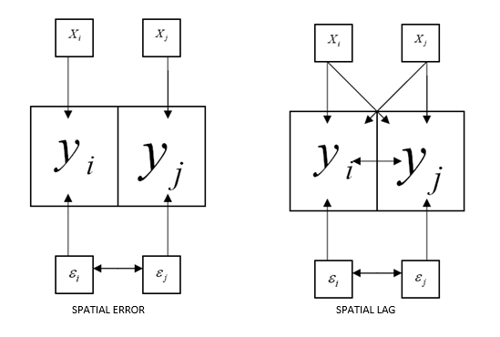
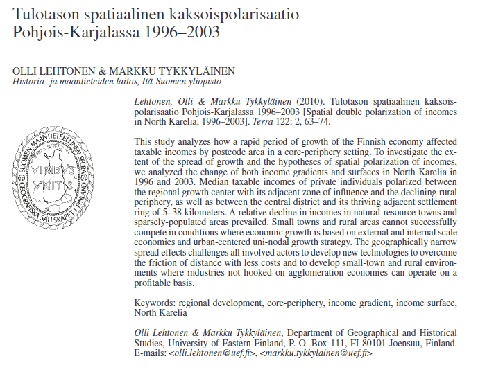

```{r setup, include=FALSE}
library(spatialcourseOL)
library(spatialreg)
library(dplyr)
library(purrr)
library(sf)
library(httr)
library(data.table)
library(ows4R)
library(spdep)

knitr::opts_chunk$set(echo = TRUE)
```

# Spatial regression

Spatial autocorrelation is one specific aspect in statistical modeling. These features of spatial data create needs for special analytical techniques and should be considered every time a project involving geography (i.e., location) is attempted. In geography, the use of geospatial analyze has had a minor role in the research of regional development in Finland. Partly, this is due to the fact that these methods have been available for geographers for a little time. Methods require specific software and programming skills that are designed for specialist statisticians. However, the use of geospatial methods is advantageous, because traditional models, such as ordinary least squares regression, might give biased or in-efficient estimators for regression coefficients if spatial autocorrelation is omitted . 

When to use regression analysis:
-	Prediction of future observations
-	Assessment of the effect of, or relationship between, explanatory variables on the response.
-	General description of data structure

Assumptions to regression analysis:
-	the ramdom error has mean zero
-	the random error terms are uncorrelated and have a constant variance (homoskedastic)
-	the random error term follows a normal distribution

### Ordinary least squares regression (OLS-regression):

**Linear regression analysis** aims to identify and quantify the relationship between a dependent variable and a set of explanatory variables. In its most common form, ordinary least squares (OLS) regression can be written as:

$$
y = \boldsymbol{\beta} X + \varepsilon,
$$

or equivalently,

$$
y = \beta_0 + \beta_1 x_1 + \beta_2 x_2 + \cdots + \beta_n x_n + \varepsilon,
$$

where  
- \( y \) is the response variable,  
- \( X \) represents the predictor variable(s),  
- \( \boldsymbol{\beta} \) are the unknown regression parameters, and  
- \( \varepsilon \) is the error term.

### Spatial dependence

Spatial dependence exists when the value observed in a region \( i \) depends on values observed in neighbouring regions. Previously, spatial dependence was examined using spatial autocorrelation statistics. In regression modelling, spatial dependence may occur either in the variables themselves or in the error terms.

### Spatial lag model

In a **spatial lag model**, the dependent variable at location \( i \) is influenced not only by the explanatory variables at \( i \), but also by values of the dependent variable at neighbouring locations \( j \). The spatial lag model is defined as:

$$
y = \rho W y + X \boldsymbol{\beta} + \varepsilon,
$$

where  
- \( y \) is an \( N \times 1 \) vector of observations of the dependent variable,  
- \( W y \) is the spatially lagged dependent variable based on the spatial weight matrix \( W \),  
- \( X \) is an \( N \times K \) matrix of explanatory variables,  
- \( \varepsilon \) is an \( N \times 1 \) vector of error terms,  
- \( \rho \) is the spatial autoregressive parameter, and  
- \( \boldsymbol{\beta} \) is a \( K \times 1 \) vector of regression coefficients.

A statistically significant autoregressive coefficient \( \rho \) indicates the presence of **spatial spillovers**, such as diffusion or copy‑cat effects.

Predicted values are calculated as

$$
\hat{y} = (I - \hat{\rho} W)^{-1} X \hat{\boldsymbol{\beta}},
$$

and residuals as

$$
(I - \hat{\rho} W)y - X \hat{\boldsymbol{\beta}}.
$$

### Spatial error model

In a **spatial error model**, spatial dependence exists in the error terms rather than directly in the dependent variable. The model is defined as:

$$
y = X \boldsymbol{\beta} + \varepsilon,
$$

with

$$
\varepsilon = \lambda W \varepsilon + \xi,
$$

where  
- \( \lambda \) is the spatial autoregressive coefficient for the error term,  
- \( W \varepsilon \) is the spatially lagged error component, and  
- \( \xi \) is an uncorrelated and homoskedastic error term.

Spatial error dependence is often interpreted as a **nuisance process**, reflecting spatial autocorrelation in omitted variables or measurement errors rather than substantive spatial interaction.

In this model, predicted values are calculated as

$$
\hat{y} = X \hat{\boldsymbol{\beta}},
$$

and residuals as

$$
(I - \hat{\lambda} W)\hat{\varepsilon}.
$$

With spatial error in OLS-regression, the assumption of uncorrelated error terms is violated. As a result, the estimates are inefficient.

```{r, echo=FALSE, out.width="90%"}

```

### Spatial Regession in R 1: The Four Simplest Models

<iframe width="560" height="315"
        src="https://www.youtube.com/embed/b3HtV2Mhmvk"
        frameborder="0"
        allow="accelerometer; autoplay; encrypted-media; gyroscope; picture-in-picture"
        allowfullscreen>
</iframe>


# Exampe: Spatial Regression Analysis of Finnish Postal Code Areas

## 1. Required packages

```{r, eval=FALSE}
library(dplyr)
library(purrr)
library(sf)
library(httr)
library(data.table)
library(ows4R)
```

## 2. Downloading spatial data from Statistics Finland (WFS)

```{r}
url <-list(hostname ="geo.stat.fi/geoserver/postialue/wfs",
           scheme ="https",
           query =list(service ="WFS",
                       version ="2.0.0",
                       request ="GetFeature",
                       typename ="postialue:pno_tilasto_2025",
                       outputFormat ="json"))%>%
  setattr("class","url")
request <-build_url(url)
p25 <-st_read(request)
```

```{r}
url <-list(hostname ="geo.stat.fi/geoserver/postialue/wfs",
           scheme ="https",
           query =list(service ="WFS",
                       version ="2.0.0",
                       request ="GetFeature",
                       typename ="postialue:pno_tilasto_2016",
                       outputFormat ="json"))%>%
  setattr("class","url")
request <-build_url(url)
p16 <-st_read(request)
```

## 3. Data preparation and merging

```{r}
names(p16)
p16data<-p16[,c(3,79)]
p16data<-as.data.frame(p16data[,1:2])
colnames(p16data)<-c("posti_alue","tyopy16")
p16data<-as.data.frame(p16data[,1:2])

# merge 2016 and 2025 data
p25_data <- dplyr::right_join(x = p16data, y = p25, by=c("posti_alue" = "postinumeroalue"))
p25_data$tyopy16[is.na(p25_data$tyopy16)] <- 0
```

## 4. Creating change variables and indicators

```{r}
# calculate changes
p25_data$tp_m22_16<-(p25_data$tp_tyopy-p25_data$tyopy16)
p25_data$tp_m22_16p<-((p25_data$tp_tyopy-p25_data$tyopy16)/p25_data$tyopy16)*100


p25_data$tyottom<-(p25_data$pt_tyott/p25_data$pt_tyoll)*100
p25_data$korkk<-(p25_data$ko_yl_kork/p25_data$ko_koul)*100
p25_data$alkut<-(p25_data$tp_alku_a/p25_data$tp_tyopy)*100
p25_data$elak<-(p25_data$te_elak/p25_data$te_taly)*100
p25_data$as_tih<-(p25_data$he_vakiy/(p25_data$pinta_ala/1000))
```

## 5. Data cleaning

```{r}
# create a new dataframe from part of the data
p25_data2<-p25_data[,c(1,14,67,78,118:122)]

# remove na and inf
p25_data3<-p25_data2 %>%
  filter_all(all_vars(!is.infinite(.)))
p25_data4<-p25_data3 %>%
  filter_all(all_vars(!is.na(.)))
```

## 6. Join attribute data back to spatial data

```{r}
data<-dplyr::left_join(x = p25, y = p25_data4, by=c("postinumeroalue" = "posti_alue"))
data2 <- data[!is.na(data$he_kika.y),] # if we don't remove NAs, we cannot join results
```

## 7. Spatial weights matrix (k‑nearest neighbours)

```{r}
library(spdep)
data.coords<-st_centroid(st_geometry(data2), of_largest_polygon=TRUE) # Extracts the coordinates of each postcode area
p25_kn6<-knn2nb(knearneigh(data.coords,k=6,longlat = F)) # Returns a matrix with the indices of points belonging to the set of the k nearest neighbours of each other
p25_kn6_w<-nb2listw(p25_kn6)
```

Step 1: centroids
```{r, eval=FALSE}
st_centroid(st_geometry(data2))
```

Each postal code area:

- Has an irregular polygon
- Is reduced to one coordinate

Step 2: k‑nearest neighbors
```{r, eval=FALSE}
knn2nb(knearneigh(..., k=6))
```

Each area:

- Is connected to its 6 nearest neighbors

Step 3: weights list
```{r, eval=FALSE}
nb2listw(...)
```
Converts neighbors into a form usable by models.

Why k‑NN?

- Ensures every area has neighbors
- Avoids isolated rural polygons
- Common in regional and urban studies

## 8. Ordinary Least Squares (baseline model)

```{r}
m_ols<-lm(tyottom~ korkk+alkut+elak+as_tih+he_kika.x+ra_as_kpa.y,
          data=data2)
summary(m_ols)
```
Purpose

This is your baseline, non‑spatial model.

You use it to:

- Understand relationships
- Generate residuals
- Test whether spatial models are needed

Key idea:

+ OLS assumes independent observations — spatial data usually violates this.

## 9. Testing for spatial autocorrelation (Moran’s I)

```{r}
moran1<-lm.morantest(model=m_ols, p25_kn6_w)
print(moran1)
```

What does this test?

+ “Are the residuals spatially clustered?”

Result:

- Strong, significant spatial autocorrelation

Interpretation

- OLS is misspecified because:

+ Nearby areas behave similarly
+ Independence assumption is violated

## 10. Lagrange Multiplier (LM) tests

```{r}
#Next, we employ the LM tests for spatial lag (LMlag) and errors (LMerr)
LMtest1<-lm.RStests(m_ols, p25_kn6_w, zero.policy = T, test=c("RSlag", "RSerr"))
print(LMtest1)

#The LMlag statistic is 264.07, whilst the LMerr statistic is 555,77. Both have p-values under .001, indicating that
#both the spatial lag and error models would be preferred over the OLS model.

LMtest2<-lm.RStests(m_ols, p25_kn6_w, zero.policy = T, test=c("adjRSlag", "adjRSerr"))
print(LMtest2)

# both test statistics are significant which indicates that both models could be used.
```
These answer:

Should spatial dependence be modeled as:

- Lag (spillovers)?
- Error (unobserved spatial factors)?

Key insight

- Both lag and error are significant
- Robust tests also significant

**Interpretation**

The standard LM tests (RSlag and RSerr) strongly reject the null hypothesis of no spatial dependence, indicating that the OLS model is misspecified. The robust LM tests (adjRSlag and adjRSerr) are also both significant, meaning that both spatial lag and spatial error specifications are plausible. Consequently, both SAR and SEM models are estimated. 

The substantially larger robust error statistic suggests that spatial dependence is more likely to operate through the disturbance term rather than through direct spatial spillovers. This strongly hints that the spatial error model may fit better to our data.

## 11. Spatial Error Model (SEM)

```{r}
library(spatialreg)
m2e <-errorsarlm(tyottom~ korkk+alkut+elak+as_tih+he_kika.x+ra_as_kpa.y, data=data2, p25_kn6_w, tol.solve=1.0e-30)

# call a summary to see the results
summary(m2e)

hausman<-Hausman.test(m2e)
print(hausman)
```

What does SEM assume?

Spatial dependence comes from:

- Omitted variables
- Measurement error
- Region‑wide shocks

Why SEM often fits well

- Captures unobserved spatial processes
- Often removes residual autocorrelation

Moran I test confirms this.

```{r}
data2$residuals <- residuals(m2e)
moran.mc(data2$residuals, p25_kn6_w,999)
```

## 12. Spatial Lag Model (SLM)

```{r}
m2lag <- lagsarlm(tyottom~ korkk+alkut+elak+as_tih+he_kika.x+ra_as_kpa.y, data=data2, p25_kn6_w, tol.solve=1.0e-30)

# call a summary to see the results
summary(m2lag)
```

```{r}
data2$residuals_lag <- residuals(m2lag)
moran.mc(data2$residuals_lag, p25_kn6_w,999)
```

What does SLM assume?

Unemployment in one area:

- directly affects nearby areas
- Spillover effects exist

Useful when:

- Policy diffusion exists
- Labor markets overlap strongly

## 13. Model comparison via residuals

Decision logic:

- Good model → no spatial autocorrelation left in residuals

Results show:

- Error model removes autocorrelation better
- Lag model leaves some dependence

# Research example: Spatial double polarization of incomes in North Karelia 1996-2003

Lehtonen, Olli & Markku Tykkyläinen (2010). Tulotason spatiaalinen kaksoispolarisaatio Pohjois-Karjalassa 1996–2003 [Spatial double polarization of incomes in North Karelia, 1996–2003]. Terra 122: 2, 63–74. 

Abstract: This study analyzes how a rapid period of growth of the Finnish economy affected taxable incomes by postcode area in a core-periphery setting. To investigate the extent of the spread of growth and the hypotheses of spatial polarization of incomes, we analyzed the change of both income gradients and surfaces in North Karelia in 1996 and 2003. Median taxable incomes of private individuals polarized between the regional growth center with its adjacent zone of influence and the declining rural periphery, as well as between the central district and its thriving adjacent settlement ring of 5–38 kilometers. A relative decline in incomes in natural-resource towns and sparsely-populated areas prevailed. Small towns and rural areas cannot successfully compete in conditions where economic growth is based on external and internal scale economies and urban-centered uni-nodal growth strategy. The geographically narrow spread effects challenges all involved actors to develop new technologies to overcome the friction of distance with less costs and to develop small-town and rural environments where industries not hooked on agglomeration economies can operate on a profitable basis.

```{r, echo=FALSE, out.width="90%"}

```

In this example we make analysis in 6 steps:

-	Step1: Importing shapefiles into R and constructing neighborhood sets
-	Step2: Creating spatial weights matrices using neighborhood lists
-	Step3: Using spatial weights matrices, run statistical tests of spatial autocorrelation
-	Step4: Moving on to spatial regression
-	Step5: Plotting the results
-	Step6: Interpretation of the results

to be continue...
