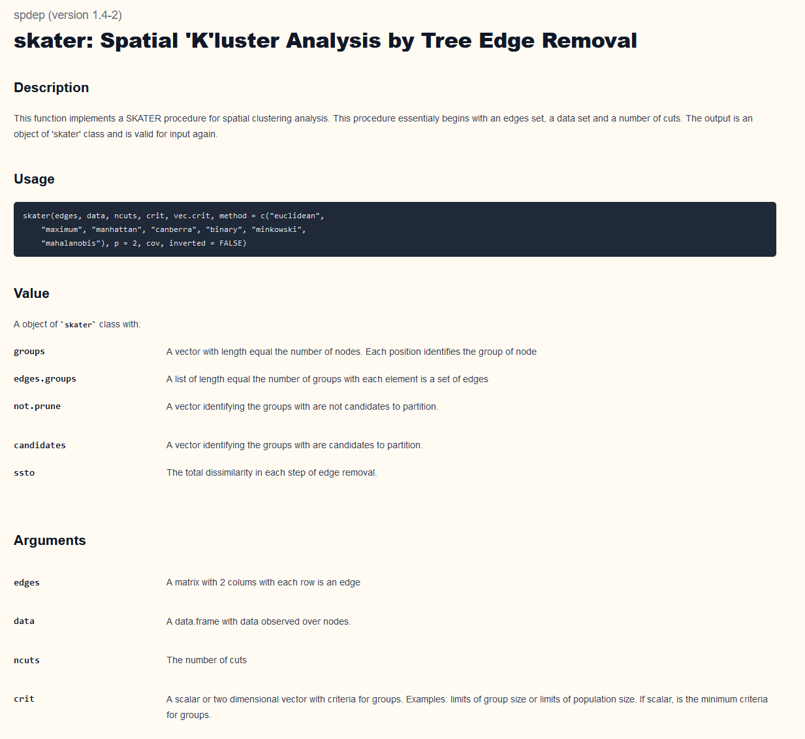
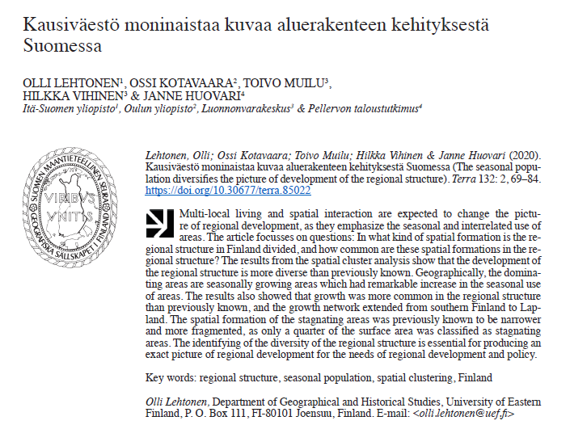

```{r setup, include=FALSE}
library(spatialcourseOL)
library(dplyr)
library(purrr)
library(sf)
library(httr)
library(data.table)
library(ows4R)
library(spdep)

library(tidyverse)
library(janitor)
library(ggrepel)
library(ggplot2)
library(viridis)

library(sotkanet)
library(spdep)

knitr::opts_chunk$set(echo = TRUE)
```

# Spatial clustering

K‑means clustering is a widely used multivariate analysis method for grouping observations based on their attributes (see Lecture 6: Multivariate Analysis). The objective of the k‑means algorithm is to partition observations into a predefined number of groups such that within‑group variance, typically measured by the sum of squared distances to group centroids, is minimized. Although k‑means does not explicitly account for spatial relationships, it can be applied to spatial data by including location coordinates or spatially derived variables as part of the feature set.
Clustering methods are frequently used in spatial analysis. 

For example:

- In epidemiology, spatial and temporal clustering of pathogen samples (e.g., salmonella outbreaks) can help identify distinct transmission events, especially when proximity in space and time is meaningful.
- In ecology, clustering animal sightings or life‑stage occurrences may help delineate functional habitats or territories useful for conservation planning.
- In soil science or agronomy, spatial clustering of sampled soil properties can identify spatially contiguous zones with similar characteristics.
- In socio‑economic studies, grouping customers or urban areas based on demographic and behavioral attributes may support targeted policy or marketing decisions.

A limitation of many standard clustering approaches, including k‑means, is that they do not enforce spatial contiguity. As a result, clusters may be spatially fragmented, which is often undesirable in geographic analysis.

To address this issue, spatially constrained clustering methods have been developed. One such method is SKATER (Spatial ‘K’luster Analysis by Tree Edge Removal). When spatial constraints are imposed, a connectivity graph is first constructed to represent neighborhood relationships among spatial units. Based on this graph, a minimum spanning tree (MST) is built that summarizes both spatial adjacency and attribute dissimilarity. Each node represents a spatial unit, and edge weights represent dissimilarity between neighboring units based on their attributes.

The MST is then iteratively pruned by removing edges in a way that minimizes within‑group dissimilarity while maintaining spatial contiguity and avoiding singleton regions when possible. This process continues until the desired number of spatially contiguous groups is obtained. Although SKATER optimizes group homogeneity at each pruning step, the final clustering solution is not guaranteed to be globally optimal.

## Spatial cluster analysis by tree edge removal

SKATER (Spatial “K”luster Analysis by Tree Edge Removal) is a spatially constrained clustering method implemented in R mainly through the spdep package. Unlike classical clustering algorithms such as k‑means, SKATER explicitly enforces spatial contiguity, ensuring that resulting groups form connected geographic regions.

In SKATER, spatial units (e.g. areas or polygons) are first linked through a neighbourhood graph based on spatial adjacency or proximity. Using this graph and a multivariate attribute dissimilarity measure, a minimum spanning tree (MST) is constructed. The MST represents the most efficient way to connect all spatial units while preserving both spatial relationships and attribute similarity.

Clustering is achieved by iteratively removing edges from the MST. At each step, the edge whose removal best improves within‑group homogeneity is cut, while attempting to avoid singleton regions. This pruning process continues until the desired number of spatially contiguous clusters is obtained.

SKATER is especially useful in regionalisation problems, such as defining homogeneous socio‑economic regions, ecological zones, or administratively meaningful spatial clusters. While the algorithm optimizes homogeneity locally at each step, it does not guarantee a globally optimal solution, which is a known and accepted limitation.

In R, you can make SKATER with spdep-package:

```{r, echo=FALSE, out.width="90%"}

```

In this paper, I have used skater method to identify the diversity of the regional structure in Finland: https://terra.journal.fi/article/view/85022

```{r, echo=FALSE, out.width="90%"}

```

# Example: Running SKATER analysis with R

Next, we will carry out an exercise using SKATER analysis on the same Sotkanet dataset as in the previous grouping analysis example. The data processing steps are therefore the same as in the grouping analysis exercise. 

The objective of this exercise is to demonstrate how SKATER analysis can be applied in the analysis of municipal-level data. Using the same dataset also facilitates comparison and understanding of the differences between the methods.

## Prepare data for SKATER

First, let´s load needed packages:

```{r, eval=FALSE}
library(dplyr)
library(sf)
library(janitor)
library(ggplot2)
library(viridis)
library(reshape2)
library(geofi)
library(sotkanet)
library(spdep)
```

### 1. Downloading Data from Sotkanet

We begin by downloading indicator data from the Sotkanet database. 

Sotkanet provides a wide range of socioeconomic and health-related indicators for Finland.

For reproducibility reasons, this code is **shown for demonstration purposes only** and is not executed when building the package documentation.

```{r, eval=FALSE}
# Load the sotkanet package
library(sotkanet)

# Download selected indicators for year 2019 at municipality level
data <- GetDataSotkanet(
  indicators = c(181, 3562, 5, 1275, 3099, 182, 761, 3195,
    3076, 453, 179, 304, 313, 2320, 2343, 3126),
  years = 2019,  region.category = "KUNTA")
```

In practice, the data used in this lecture are stored locally in the package to ensure
reproducibility, avoid external API dependencies, and guarantee successful package building.
The data are read from the package’s extdata directory as follows:

```{r}
data <- readRDS(
  system.file("extdata", "sotkanet_2019.rds",
              package = "spatialcourseOL"))
```

### 2. Selecting and Reshaping the Data

Next, we select only the relevant columns and reshape the data from long format to
wide format so that each indicator becomes its own variable.

```{r}
data2<-data[,c(5,7,9)] #select only some columns from data
table(data2$indicator.title.fi)
```

We use the reshape2 package to perform the transformation.

```{r}
?reshape2::dcast
dat <- reshape2::dcast(data2,  region.code ~ indicator.title.fi, value.var = "primary.value")
dat$region.code<-as.numeric(dat$region.code) #change code to numeric

class(dat)
names(dat)
```

### 3. Cleaning Variable Names and Data Types

To make variable names easier to work with, we clean them and ensure that all variables
are numeric.

```{r}
dat<-clean_names(dat) # clean column names of our dataframe
names(dat)

dat2<-data.frame(lapply(dat,as.numeric))

dat2 <- dat2 %>%
  mutate(across(where(is.numeric),
                ~ ifelse(is.na(.x), mean(.x, na.rm = TRUE), .x)))
```

### 4. Loading Spatial Municipality Data

To visualize the indicators spatially, we download municipality boundaries.

```{r}
municipalities23 <- geofi::get_municipalities(year = 2019)
```

### 5. Joining Attribute Data with Spatial Data

We join the Sotkanet indicators to the municipality geometry using a left join.
This keeps all spatial units even if some attribute values are missing.

```{r}
map <- left_join(municipalities23,dat2, by = c("kunta" = "region_code")) # why we use left_join?
```

And then we select 

```{r}
map_complete <- map[complete.cases(sf::st_drop_geometry(map)), ]
```

## Preparing data for SKATER analysis

### 6. Data preparation and standardisation

SKATER requires numeric, comparable variables.

We therefore:

- Remove geometry from the sf object
- Select the attribute columns (71–84)
- Keep only numeric, non‑constant variables
- Standardise the data (mean = 0, sd = 1)

```{r}
X <- st_drop_geometry(map_complete)[, 71:84]
X <- X[, sapply(X, function(x) is.numeric(x) && sd(x, na.rm = TRUE) != 0),
       drop = FALSE]
dpad <- scale(X)
```

Explanation

- st_drop_geometry() removes spatial geometry so that only attributes remain.
- Non‑numeric or constant variables are excluded because they would distort distance calculations.
- scale() makes variables comparable by removing unit differences.

### 7. Defining spatial neighbourhoods (k‑nearest neighbours)

To enforce spatial contiguity, SKATER operates on a spatial neighbourhood graph.
We construct a k‑nearest neighbour (k‑NN) structure using polygon centroids.

```{r}
coords <- sf::st_coordinates(sf::st_centroid(map_complete))

k <- 6
knn <- knearneigh(coords, k = k)
bh.nb <- knn2nb(knn)
```

Explanation

- Centroids provide one coordinate per spatial unit.
- Each unit is connected to its k = 6 closest neighbours.
- k‑NN ensures that no unit is isolated, which is essential for SKATER.

### 8. Computing dissimilarity (costs)

SKATER uses attribute dissimilarity between neighbours as edge weights.

```{r}
lcosts=nbcosts(bh.nb, dpad)
```

Explanation

- nbcosts() computes multivariate distances between neighbouring areas.
- These distances represent how dissimilar adjacent regions are.

### 9. Creating a spatial weights object

The neighbourhood structure and costs are combined into a spatial weights list.

```{r}
nb.w=nb2listw(bh.nb,lcosts,style="B")
```

Explanation

- listw objects are required by many spatial algorithms.
- Style "B" keeps raw weights rather than standardising them.

### 10. Minimum Spanning Tree (MST)

SKATER works by pruning a minimum spanning tree (MST) constructed from the spatial graph.

```{r}
mst.bh=mstree(nb.w,5)
```

Explanation

- The MST connects all regions with minimal total dissimilarity.
- It summarises both spatial adjacency and attribute similarity.

### 11. Visualising the MST

```{r}
coords <- sf::st_coordinates(sf::st_centroid(map_complete))

par(mar = c(0,0,0,0))

plot(mst.bh,
  coords,
  col = 2,
  fg = "blue",
  cex.lab = 0.7,
  cex.circles = 0.035)
  
plot(sf::st_geometry(map_complete),
     border = gray(0.5),
     add = TRUE)
```

Explanation

- The MST is plotted as a graph using centroid locations.
- The polygon boundaries are added for geographic context.
- This map reveals the underlying connectivity before clustering.

## Running the SKATER algorithm

We now partition the MST into 10 spatially contiguous clusters.

```{r}
res1 <- skater(mst.bh[,1:2], dpad, 9)
```

Explanation

- SKATER iteratively removes MST edges.
- Each cut increases the number of regions by one.
- The process continues until the desired number of groups is reached.

### 12. Cluster sizes

```{r}
table(res1$groups)
```

Explanation

- Displays the number of spatial units in each SKATER region.
- Helpful for identifying very small or imbalanced clusters.

### 13. Attaching SKATER results to the spatial data

```{r}
map_complete$group <- factor(res1$groups)
```

Explanation

- Cluster labels are stored directly in the sf object.
- This makes subsequent plotting and analysis straightforward.

### 14. Visualising SKATER regions with ggplot2

```{r}
ggplot(map_complete) +
  geom_sf(aes(fill = group), color = "grey60", linewidth = 0.2) +
  scale_fill_viridis_d(name = "SKATER group") +
  theme_void()
```

Explanation

- Each polygon is coloured according to its SKATER group.
- viridis colours are perceptually uniform and map‑safe.
- The result shows spatially contiguous, homogeneous regions.

**Summary**

This analysis demonstrates how to:

- Standardise multivariate spatial data
- Define spatial neighbourhoods
- Build and visualise a minimum spanning tree
- Apply the SKATER algorithm in R
- Produce spatially contiguous regionalisations
- Visualise results using modern sf + ggplot2 tools
